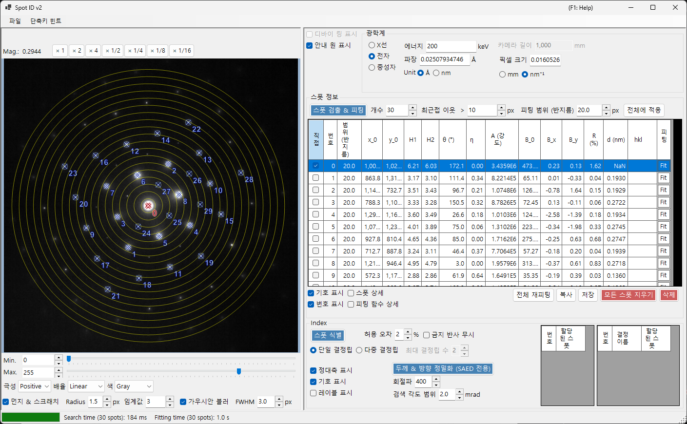
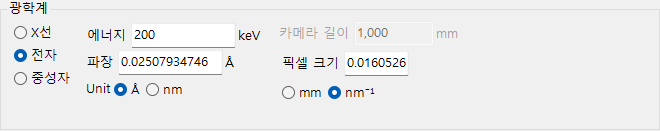
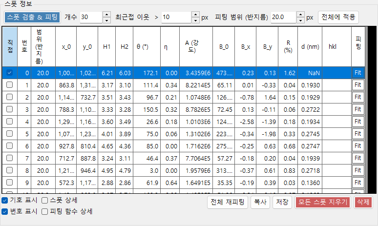
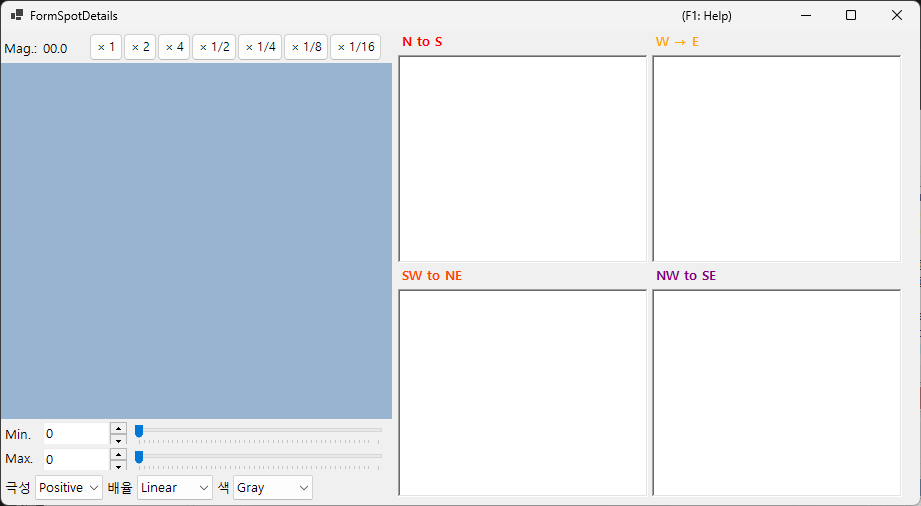
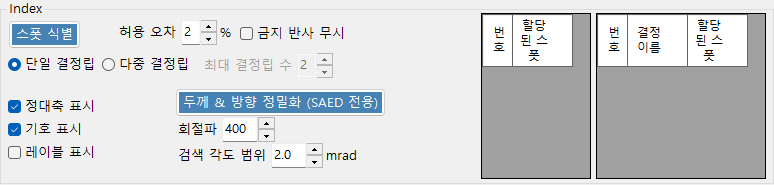

# Spot ID v2

**Spot ID v2** 는 향상된 스폿 검출, 피팅 알고리즘, 그리고 더 강력한 인덱싱 엔진을 갖춘 [Spot ID](10-spot-id.md) 의 개선판입니다.

---

## 키보드 & 마우스 단축키

스폿 목록은 불러온 이미지 위에서 직접 작성합니다. 이미지 창은 이동/확대·축소에 ReciPro의 표준 [이미지 보기 탐색](21-shortcuts.md)을 사용하며, 스폿 편집에는 아래의 조합이 추가됩니다.

| 단축키 | 동작 |
|----------|--------|
| <kbd>F1</kbd> | 온라인 매뉴얼의 이 페이지를 엽니다 |
| 이미지를 왼쪽 더블 클릭 | 해당 지점에 스폿을 추가합니다 (피크 피팅) |
| <kbd>CTRL</kbd> + 왼쪽 더블 클릭 | 스폿을 추가하고 직접빔(000)으로 표시합니다 |
| 스폿을 왼쪽 클릭 | 가장 가까운 스폿을 선택합니다 |
| <kbd>CTRL</kbd> + 스폿을 오른쪽 클릭 | 가장 가까운 스폿을 삭제합니다 |
| <kbd>CTRL</kbd> + 화살표 키 | 선택한 스폿을 1픽셀씩 미세 이동합니다 |
| 왼쪽 드래그 / 가운데 드래그 (빈 영역) | 이미지를 이동합니다 |
| 마우스 휠 | 커서 위치에서 확대/축소합니다 |
| 오른쪽 드래그로 상자 그리기 | 선택한 영역으로 확대합니다 |
| 오른쪽 더블 클릭 | 축소합니다 |
| 스폿의 행 머리글을 더블 클릭 (표) | 해당 스폿으로 확대합니다 (×2) |

메인 창에서 <kbd>CTRL</kbd>+<kbd>SHIFT</kbd>+<kbd>T</kbd> 를 누르면 이 창이 열리거나 닫힙니다.

→ 모든 창을 한눈에 보려면 **[21. 키보드 & 마우스 단축키](21-shortcuts.md)** 를 참조하세요.

---

## 파일 메뉴

회절 이미지를 열거나 저장합니다. [Spot ID v1](10-spot-id.md) 과 동일한 끌어서 놓기 방식의 불러오기를 지원하며, Gatan DM3/DM4 메타데이터(카메라 길이, 파장, 픽셀 크기)는 자동으로 반영됩니다.

---

## Optics

### Incident source

방사선 종류(X선 / 전자 / 중성자)를 선택하고 에너지 또는 파장을 설정합니다.

### Camera length / Pixel size

카메라 길이(mm)와 검출기 픽셀 크기(mm 또는 nm⁻¹). Gatan DM 파일을 불러오면 이 값들은 파일 헤더에서 채워집니다.

---

## 스폿 정보

- **Detect & Fit Spots**: 국소 극대값과 배경 차감을 이용한 자동 스폿 검출.
- **Number**: 검출할 스폿의 최대 개수.
- **Nearest neighbour**: 검출된 스폿 사이에 허용되는 최소 간격(px). 이보다 가까운 피크들은 병합되어 동일 스폿의 이중 검출을 방지합니다.
- **Fitting range (radius)**: 각 스폿의 피크를 피팅하는 데 사용되는 원형 영역의 반지름(px). 이 원 안의 픽셀들은 의사 포크트(pseudo-Voigt) 함수로 피팅됩니다.
- **Apply to All**: 모든 스폿의 피팅 반지름을 현재 **Fitting range (radius)** 값으로 설정합니다.
- **Delete spot / Clear spots**: 개별 또는 모든 검출된 스폿을 제거합니다.
- **Copy to clipboard**: 스폿 위치와 강도를 클립보드에 복사합니다.
- **Details of the spot**: 선택하면 현재 선택된 스폿에 대한 상세 정보를 보여주는 창이 열립니다.

---

## Index

- **Identify Spots**: 인덱싱 알고리즘을 실행하여 가장 잘 일치하는 결정과 정대축을 찾습니다.
- **Acceptable error**: 일치 판정을 위한 면간거리와 각도의 허용 편차를 설정합니다.
- **Ignore prohibited reflections**: 선택하면 나선축과 미끄럼면에 의해 금지된 반사가 정대축 탐색 중에 반드시 만족될 필요는 없는 것으로 취급됩니다.
- **Single Grain / Multiple Grains**: 단일 방위(단결정)를 탐색하거나, 여러 방위(다결정 / 다결정립 영역)를 탐색합니다. 여러 결정립의 경우 **Max. num. of grains** 가 탐색할 결정립 개수의 상한을 설정합니다.
- **Results**: 가장 잘 일치하는 결과가 결정 이름, 정대축 [uvw], 그리고 개별 스폿 지수(hkl)와 함께 표시됩니다.

---

## v1 대비 개선 사항

- 스폿 검출에서 더 나은 잡음 처리.
- 여러 프로파일 형상을 지원하는 더 견고한 피팅 알고리즘.
- 최적화된 탐색 알고리즘으로 더 빠른 인덱싱.
- 겹친 스폿과 위성 반사 지원.

---

## 관련 항목

- [Spot ID v1](10-spot-id.md)
- [회절 시뮬레이터](7-diffraction-simulator/index.md)
- [메인 창](0-main-window.md)
- [키보드 & 마우스 단축키](21-shortcuts.md)
