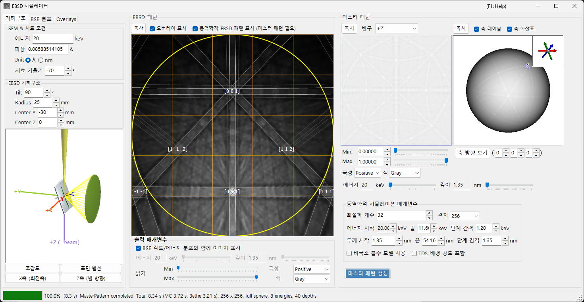
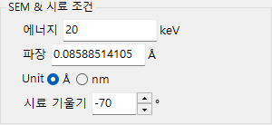
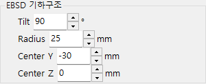
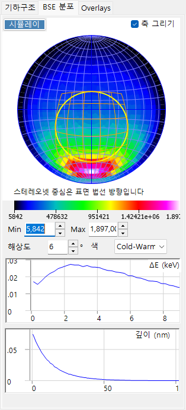
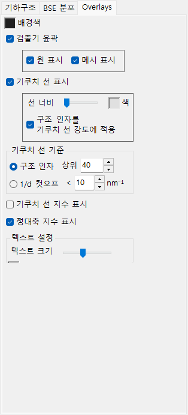
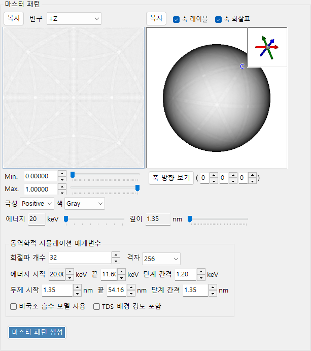
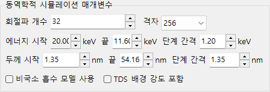
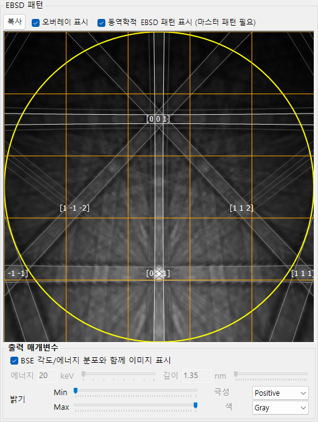

# EBSD 시뮬레이션

**EBSD 시뮬레이터**는 주사전자현미경(SEM)에서 얻어지는 전자후방산란회절(EBSD) 패턴 — 키쿠치 패턴 — 을 동역학 이론 계산으로 시뮬레이션합니다. 몬테카를로 시뮬레이션으로 후방산란 전자(BSE)의 각도/에너지/깊이 분포를 계산하고, 결정의 동역학적(블로흐파) **master pattern**을 구성한 뒤, 현재 결정 방위에 대해 이를 검출기에 투영합니다.

창은 세 개의 열로 구성되어 있습니다.

- **왼쪽** : 시뮬레이션 조건. 탭으로 **기하구조**(시료/검출기 기하학 및 3D 보기), **BSE 분포**(후방산란 전자 분포), **Overlays**(키쿠치 선 및 기타 주석)를 선택합니다.
- **가운데** : 현재 결정 방위에 대한 EBSD(키쿠치) 패턴.
- **오른쪽** : 방위에 무관한 master pattern(2D 투영 및 3D 구).

---

## 키보드 및 마우스 단축키

가운데의 EBSD(키쿠치) 패턴과 오른쪽의 master pattern 보기는 서로 다른 마우스 동작에 반응합니다.

| 단축키 | 동작 |
|----------|--------|
| <kbd>F1</kbd> | 온라인 매뉴얼의 이 페이지를 엽니다 |
| 패턴의 중심 부근을 왼쪽 드래그 | 결정을 기울입니다 |
| 패턴의 바깥쪽 영역을 왼쪽 드래그 | 결정을 회전시킵니다 |
| 패턴을 더블 클릭 | 커서 아래의 검출기 하위 셀을 선택하고 통계를 표시합니다 |
| 3D 보기(기하학 / master 구)를 왼쪽 드래그 | 회전 |
| 3D 보기에서 오른쪽 드래그 또는 마우스 휠 | 확대/축소 |
| <kbd>CTRL</kbd> + 3D 보기에서 오른쪽 더블 클릭 | 정사영 / 원근 전환 |
| 2D master pattern에서 드래그 / 휠 | 이미지 이동 / 확대·축소 |

3D 보기는 ReciPro의 표준 [보기 탐색](21-shortcuts.md)을 사용합니다(이동은 비활성화).

→ 모든 창을 한눈에 보려면 **[21. 키보드 및 마우스 단축키](21-shortcuts.md)**를 참조하세요.

---

## 작업 흐름

**마스터 패턴 생성**을 누르면 다음 단계가 순서대로 실행됩니다.

1. **몬테카를로 BSE 시뮬레이션** : 현재 결정 조성, 밀도, 가속 전압 및 시료 기울기를 사용하여 약 250만 개의 전자를 시료 내부에서 추적합니다(탄성 산란: Mott/NIST 단면적; 비탄성 산란: 유전 응답 모델). 이로부터 후방산란 전자의 *침투 깊이 × 출사 방향 × 출사 에너지* 의 결합 분포가 얻어집니다.
2. **자동 범위 선택** : 그 분포로부터 동역학 계산에 사용되는 에너지 범위(입사 에너지에서 에너지 손실의 약 80 백분위까지)와 깊이 범위(침투 깊이의 약 99 백분위까지)가 자동으로 설정됩니다.
3. **master pattern 구성** : 각 에너지와 깊이에 대해 동역학적 회절(블로흐파) 문제를 풀고 방향의 구 위에서 적분하며, 몬테카를로 분포로 가중하여 모든 방향에 대한 후방산란 회절 강도를 구합니다. 결과는 등면적(Rosca–Lambert) 격자에 저장됩니다.
4. **가중을 적용한 검출기 투영** : 현재 결정 방위에 대해, 각 검출기 픽셀이 대하는 방향의 강도를 master pattern에서 조회하여 키쿠치 패턴으로 그리며, 선택적으로 BSE 각도/에너지 분포로 가중합니다.

에너지와 깊이 범위는 1–2단계에서 자동으로 설정되지만, 구성 전에 수동으로 조정할 수 있습니다.

---

## SEM-EBSD 설정

### SEM 및 시료 조건

- **Energy** : 입사빔의 가속 전압(keV).
- **Wavelength** : 전자 파장(Å), Energy와 연동됩니다.
- **시료 기울기** : 시료 기울기 각도(일반적으로 70°). EBSD에서의 큰 기울기는 후방산란 전자 수율을 증가시킵니다.

### EBSD 기하구조

- **검출기 기울기** : 검출기(형광 스크린)의 기울기.
- **검출기 반지름** : 검출기의 반지름(mm); 그려지는 패턴의 각도 시야를 설정합니다.
- **검출기 중심** : 빔 충돌 지점을 기준으로 한 검출기 중심의 위치(Y, Z)(mm).

기하학은 **기하구조** 탭의 3D 보기에서 확인할 수 있습니다.

회색 판은 시료, 녹색 원통/원뿔은 검출기, 보라색 **+Z (=beam)**은 입사빔입니다. (시료에 고정된) 결정 **a / b / c** 축도 함께 표시됩니다. **조감도**, **표면 법선**, **X축 (회전축)** 및 **Z축 (빔 방향)** 버튼은 보기를 표준 방향으로 맞춥니다. 좌표계 정의는 [부록 A1. 좌표계](appendix/a1-coordinate-system/2-diffraction.md)를 참조하세요.

---

## BSE 분포

**BSE Distribution** 탭은 몬테카를로 후방산란 전자 분포를 표시합니다. **시뮬레이션**을 사용하여 다시 계산합니다.

- **Stereonet** : 후방산란 전자의 각도 분포(출사 방향의 히스토그램). 중심은 표면 법선 방향이며, 노란색/주황색 윤곽선은 검출기가 대하는 영역을 표시합니다. **축 그리기**는 결정 축을 겹쳐 표시하며, 색상 스케일(Min/Max, 해상도, 색상)을 조정할 수 있습니다.
- **ΔE (keV)** : 후방산란 전자의 에너지 손실 분포.
- **깊이 (nm)** : 후방산란 전자의 최종 출사 깊이 분포.

이 분포들은 [전자 궤적](8-electron-trajectory.md)과 동일한 몬테카를로 엔진으로 계산되며, master pattern을 가중하는 데 사용됩니다.

---

## Overlays

**Overlays** 탭은 EBSD 패턴 위에 그려지는 주석을 설정합니다.

- **Background color** : 배경 색상.
- **검출기 윤곽** : 검출기 윤곽선. **원 표시**(둘레) / **메시 표시**(격자).
- **기쿠치 선 표시** : 키쿠치 선을 그립니다. **선 너비** / **Color**, 그리고 **구조 인자를 기쿠치 선 강도에 적용**.
- **기쿠치 선 지수 표시** : 키쿠치 선(밴드)의 지수를 표시합니다.
- **정대축 지수 표시** : 정대축 지수를 표시합니다.
- **기쿠치 선 기준** : 어떤 키쿠치 선을 그릴지: **구조 인자**(구조 인자 기준 상위 *N*개) 또는 **1/d 컷오프**(1/d가 임계값 미만인 것).
- **텍스트 설정** : 지수 레이블의 **텍스트 크기** / **Color**.

---

## Master pattern

master pattern은 모든 방향에 걸친 후방산란 회절 강도로, **마스터 패턴 생성**을 통해 동역학 이론으로 미리 계산됩니다.

- **2D 보기**(왼쪽) : 반구의 등면적 투영. **반구**는 투영할 반구(+Z / −Z)를 선택합니다.
- **3D 보기**(오른쪽) : 강도가 매핑된 구. 마우스로 회전할 수 있으며, 오른쪽 위의 삽입 화면에 동기화된 결정 축(a/b/c)이 표시됩니다. **축 레이블** / **축 화살표**는 레이블/화살표를 토글하며, **축 방향 보기**는 선택한 정대축 [u v w]을 따라 내려다봅니다.
- **Min / Max, Polarity, Color** : 표시 강도 범위, 극성, 색상 스케일.
- **Energy / Depth** 슬라이더 : 표시할 에너지/깊이 슬라이스를 선택합니다.
- 어느 보기든 **복사**로 클립보드에 보낼 수 있습니다.

### 동역학적 시뮬레이션 매개변수

- **회절파 개수** : 블로흐파 계산에 포함되는 회절 빔(파동)의 수. 파동이 많을수록 정확하지만 느립니다.
- **격자** : master pattern 격자의 해상도(기본값 256).
- **Energy from … to … with step of …** : 적분되는 에너지 범위 및 스텝(keV); 몬테카를로 결과로부터 자동으로 설정됩니다.
- **Thickness from … to … with step of …** : 적분되는 깊이 범위 및 스텝(nm); 마찬가지로 자동으로 설정됩니다.
- **비국소 흡수 모델 사용** : 비국소 흡수 모델을 사용합니다.
- **TDS 배경 강도 포함** : 열 확산 산란(TDS) 배경을 포함합니다.

---

## EBSD 패턴

가운데 패널은 현재 결정 방위에 대한 EBSD(키쿠치 밴드) 패턴을 표시합니다.

- **동역학적 EBSD 패턴 표시 (마스터 패턴 필요)** : 구성된 master pattern을 검출기에 투영합니다.
- **오버레이 표시** : 키쿠치 선과 지수 등 (아래의) 오버레이를 그립니다.
- **출력 매개변수**
  - **BSE 각도/에너지 분포와 함께 이미지 표시** : 체크하면 단일 슬라이스 대신 BSE 분포(에너지, 깊이, 방향)로 가중하여 패턴을 합성합니다.
  - **Energy / Depth** : 위 항목이 꺼져 있을 때 표시할 에너지/깊이 슬라이스를 선택합니다.
  - **Brightness (Min/Max), Polarity, Color** : 밝기 범위, 극성, 색상 스케일.
- **복사** : 패턴을 클립보드에 복사합니다.

---

## 함께 보기

- [전자 궤적](8-electron-trajectory.md) — 각도/에너지/깊이 가중에 사용되는 몬테카를로 전자 궤적 / BSE 시뮬레이션.
- [회절 시뮬레이터](7-diffraction-simulator/index.md) — 동역학적(블로흐파) 전자 회절.
- [부록 A1. 좌표계](appendix/a1-coordinate-system/2-diffraction.md) — 시료/검출기 좌표계의 정의.
