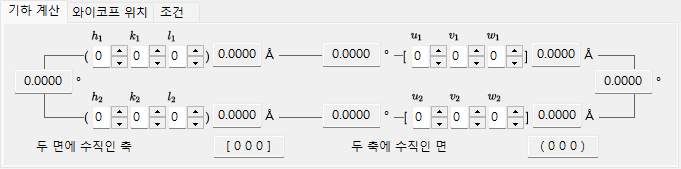
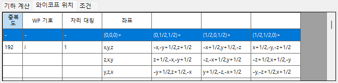
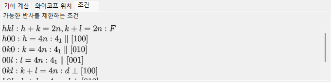
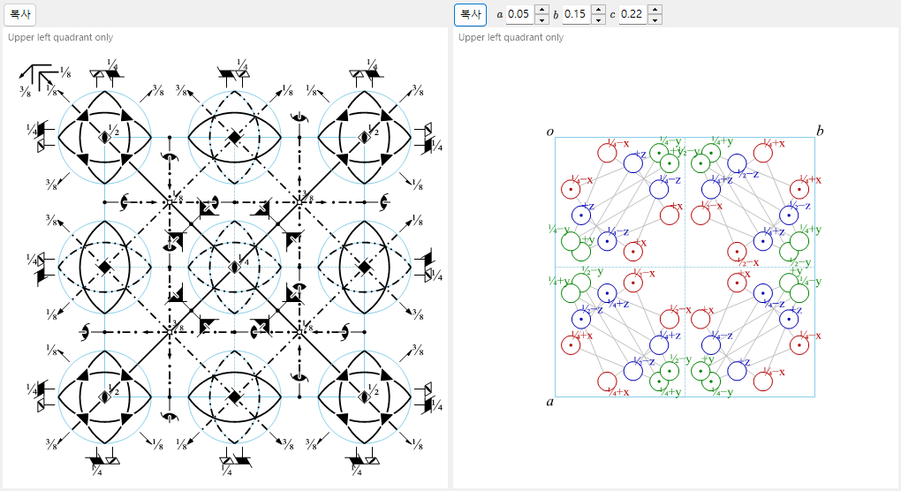

# 대칭 정보

**대칭 정보**는 선택된 결정의 공간군 대칭에 대한 상세 정보를 표시하며, 추가로 *International Tables for Crystallography* Vol. A 스타일로 대칭 요소와 일반 위치의 모식도를 그립니다.

이 창은 공간군 식별 영역(왼쪽 위), 탭이 있는 계산/표 영역(오른쪽 위), 그리고 두 개의 모식도(아래)로 나뉩니다.

---

## 키보드 & 마우스 단축키

이 창에는 특별한 키 또는 마우스 조합이 없습니다. <kbd>F1</kbd>은 이 매뉴얼 페이지를 열고, 두 개의 **Copy** 버튼은 대칭 요소 다이어그램과 일반 위치 다이어그램을 클립보드에 (비트맵으로, 또는 **EMF**가 체크되어 있으면 벡터 EMF로) 넣습니다.

→ 모든 창을 한눈에 보려면 **[21. 키보드 & 마우스 단축키](21-shortcuts.md)**를 참조하십시오.

---

## 공간군 식별

왼쪽 위 패널은 현재 공간군에 대해 다음을 나열합니다.

- **Number** (1–230)와 설정 인덱스
- **Crystal System**
- **Point Group** : Hermann–Mauguin(HM) 및 Schoenflies(SF) 기호
- **Space Group** : HM 짧은 기호, HM 전체 기호, SF 기호, 그리고 **Hall symbol**

---

## 기하 계산

두 결정면 \((h_1, k_1, l_1)\), \((h_2, k_2, l_2)\) 또는 두 방향 지수 \([u_1, v_1, w_1]\), \([u_2, v_2, w_2]\)를 입력하여 다음을 얻습니다.

- 각 면의 면간 거리 / 각 축의 길이,
- 두 면(또는 두 축) 사이의 각도,
- **두 면에 모두 수직인 방향 지수** 및 **두 축에 모두 수직인 면 지수**.

이 계산은 현재 단위 격자의 메트릭을 반영합니다.

---

## 와이코프 위치

모든 와이코프 위치를 그 중복도, 와이코프 문자, 자리 대칭, 그리고 일반 위치인지 특수 위치인지 여부와 함께 나열합니다. 중심 격자의 경우, 격자 병진 벡터가 머리글 행에 표시됩니다.

---

## 소광 조건

격자 중심화 및 글라이드/나선 대칭 연산자로부터 발생하는 반사 조건입니다.

---

## 대칭 요소 & 일반 위치 다이어그램

아래쪽의 두 패널은 *International Tables for Crystallography* Vol. A의 표기법으로 공간군의 모식적 대칭 다이어그램을 재현합니다.

- **대칭 요소 (왼쪽)**: 회전/나선축, 거울/글라이드 면, 그리고 반전 중심/회전반전점이 관용적인 그래픽 기호로 그려집니다.
  - 입방정계의 \(F\) 격자의 경우, 단위 격자의 8분의 1(왼쪽 위 사분면만)만 표시됩니다.
  - 이러한 대칭 요소는 [구조 뷰어](5-structure-viewer.md)에서 3D 모델 위에 직접 그릴 수도 있습니다.
- **일반 위치 (오른쪽)**: 일반 등가 위치가 원으로 표시되며(쉼표는 거울상을 나타냄), 분율 좌표가 주석으로 붙습니다.
  - 입방정계에 한해, 보조선이 3회 회전축에 의해 관련된 세 개의 원을 연결합니다.

다이어그램 아래의 컨트롤:

- **Direction** (`a` / `b` / `c`) : 투영할 결정 축을 선택합니다.
- **Copy** 각 다이어그램을 벡터 이미지(**EMF**) 또는 래스터 이미지(**BMP**)로 클립보드에 복사합니다. EMF는 PowerPoint에서 그룹 해제하여 편집할 수 있습니다.

---

## 함께 보기

- [결정 데이터베이스](1-crystal-database.md)
- [구조 뷰어](5-structure-viewer.md)
- [스테레오넷](6-stereonet.md)
- [회전 기하학](4-rotation-geometry.md)
- [메인 창](0-main-window.md)
