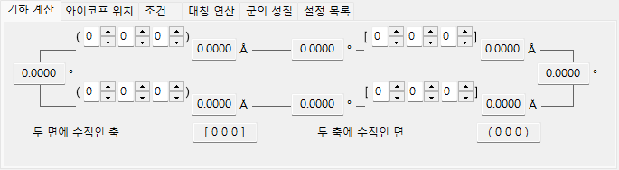
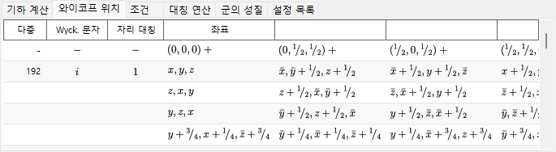
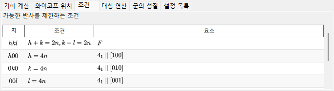
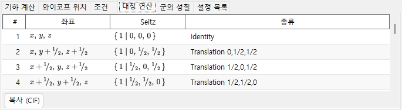
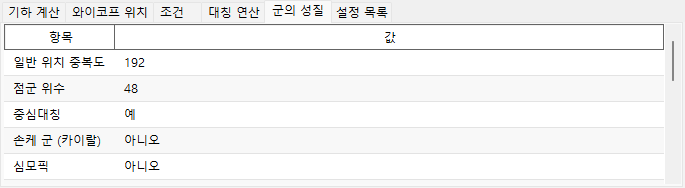
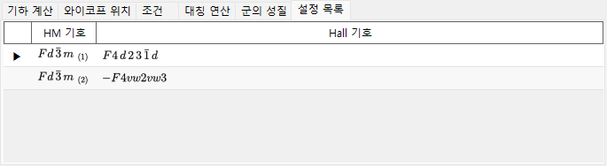

# 대칭 정보

**대칭 정보**(Symmetry Information)는 선택한 결정의 공간군 대칭에 관한 상세 정보를 표시하고, 나아가 *International Tables for Crystallography* Vol. A 양식으로 대칭 요소와 일반 위치의 모식도를 그립니다.

이 창은 공간군 정보 영역(왼쪽 위), 탭으로 구성된 계산/표 영역(오른쪽 위), 그리고 두 개의 모식도(아래)로 나뉩니다.

!!! tip "대칭 이론 (부록 A4)"
    Hermann–Mauguin/Hall/Schoenflies 기호가 실제로 무엇을 담고 있는지, **군의 성질** 탭의 군론적 분류(중심대칭, Sohncke, symmorphic, 극성, …), 아래쪽 대칭 요소/일반 위치 다이어그램의 의미, 그리고 **군 관계...**가 보여 주는 군-부분군 관계는 모두 **[부록 A4. 대칭과 공간군](appendix/a4-symmetry-space-groups/index.md)**에서 설명합니다.

---

## 키보드 & 마우스 단축키

이 창에는 특별한 키/마우스 조합이 없습니다. <kbd>F1</kbd>은 이 매뉴얼 페이지를 열고, 두 개의 **복사** 버튼은 대칭 요소 다이어그램과 일반 위치 다이어그램을 클립보드에 넣습니다(**복사 형식**에서 선택한 벡터 **emf** 또는 래스터 **bmp**로).

→ 모든 창을 한눈에 보려면 **[21. 키보드 & 마우스 단축키](21-shortcuts.md)**를 참조하십시오.

---

## 공간군 정보

왼쪽 위 패널에는 현재 공간군에 대해 다음이 나열됩니다.

- **번호**(Number, 1–230)와 설정 인덱스
- **결정계**(Crystal System)
- **점군**(Point Group) : Hermann–Mauguin(HM) 기호와 Schoenflies(SF) 기호
- **공간군**(Space Group) : HM 단축형 기호, HM 완전형 기호, SF 기호, 그리고 **Hall 기호**

---

## 기하 계산

두 결정면 \((h_1, k_1, l_1)\), \((h_2, k_2, l_2)\) 또는 두 방향 지수 \([u_1, v_1, w_1]\), \([u_2, v_2, w_2]\)를 입력하면 다음을 얻습니다.

- 각 면의 면간 거리 / 각 축의 길이,
- 두 면(또는 두 축) 사이의 각도,
- **두 면 모두에 수직인 방향 지수**와 **두 축 모두에 수직인 면 지수**.

이 계산은 현재 단위 격자의 메트릭을 따릅니다.

---

## 와이코프 위치

모든 와이코프 위치를 다중도, 와이코프 문자, 자리 대칭, 그리고 일반 위치인지 특수 위치인지 여부와 함께 나열합니다. 중심 격자에서는 격자 병진 벡터가 머리글 행에 표시됩니다.

---

## 조건

격자 중심화와 글라이드/나선 대칭 연산자에서 비롯되는 반사 조건입니다.

---

## 대칭 연산

일반 위치의 모든 대칭 연산(격자 중심화 병진은 이미 전개된 상태)을 좌표 트리플렛, Seitz 기호, 알기 쉬운 기하학적 종류(예: *"3-fold rotation"*, *"c-glide plane"*, *"screw axis"*)로 나열합니다. **복사 (CIF)**는 전체 목록을 CIF `_space_group_symop_operation_xyz` 루프로 클립보드에 복사합니다.

→ 이 세 가지 표기를 읽는 법은 **[부록 A4.1](appendix/a4-symmetry-space-groups/symbols-and-diagrams.md#대칭-연산-대칭-연산-탭)**을 참조하십시오.

---

## 군의 성질

현재 공간군의 군론적 분류(일반 위치 다중도, 점군의 위수, 중심대칭, Sohncke, symmorphic, 극성 방향, 거울상 짝, 결정족/격자계/브라베 유형, 산술 결정류, Patterson 대칭)와, 그 대칭성이 허용하는 거시적 물성(초전성/강유전성, 압전성, 제2고조파 발생, 광학 활성)을 보고합니다.

→ 각 용어의 의미는 **[부록 A4.1](appendix/a4-symmetry-space-groups/symbols-and-diagrams.md#군론적-분류-군의-성질-탭)**을 참조하십시오.

---

## 설정 목록

현재 공간군의 IT 번호를 공유하는 수록된 모든 원점/축 설정 선택지를 각각의 HM 기호·Hall 기호와 함께 참고용으로 나열하며, 현재 표시 중인 설정에는 표시가 붙습니다. 행을 선택해도 결정은 변경되지 않습니다.

---

## 대칭 요소 & 일반 위치 다이어그램

아래쪽 두 패널은 *International Tables for Crystallography* Vol. A의 표기법에 따라 공간군의 대칭 모식도를 재현합니다.

- **대칭 요소(왼쪽)**: 회전축/나선축, 거울면/글라이드 면, 반전 중심/회전반전점이 관례적인 그림 기호로 그려집니다.
  - 입방정계의 \(F\) 격자에서는 단위 격자의 8분의 1(왼쪽 위 사분면만)만 표시됩니다.
  - 이러한 대칭 요소는 [구조 뷰어](5-structure-viewer.md)의 3D 모델 위에 직접 그릴 수도 있습니다.
- **일반 위치(오른쪽)**: 일반 등가 위치가 원으로 표시되고(쉼표는 거울상을 뜻함), 분율 좌표가 함께 적힙니다.
  - 입방정계에 한해, 3회 회전축으로 연결되는 세 원을 잇는 보조선이 표시됩니다.

다이어그램 아래의 컨트롤:

- **방향**(`a` / `b` / `c`) : 투영할 결정축을 선택합니다.
- **복사** : 각 다이어그램을 **복사 형식**에서 선택한 형식(벡터 **emf** / 래스터 **bmp**)으로 클립보드에 복사합니다. emf는 PowerPoint에서 그룹 해제하여 편집할 수 있습니다.
- **군 관계...** : 현재 공간군의 극대 부분군/극소 초군 관계를 열람하는 브라우저를 엽니다. 읽는 법은 [부록 A4.2](appendix/a4-symmetry-space-groups/group-subgroup-relations.md)를 참조하십시오.

---

## 함께 보기

- [결정 데이터베이스](1-crystal-database.md)
- [구조 뷰어](5-structure-viewer.md)
- [스테레오넷](6-stereonet.md)
- [회전 기하학](4-rotation-geometry.md)
- [메인 창](0-main-window.md)
- [부록 A4. 대칭과 공간군](appendix/a4-symmetry-space-groups/index.md) — 이 페이지의 모든 탭과 다이어그램 뒤에 있는 결정학·군론적 배경.
