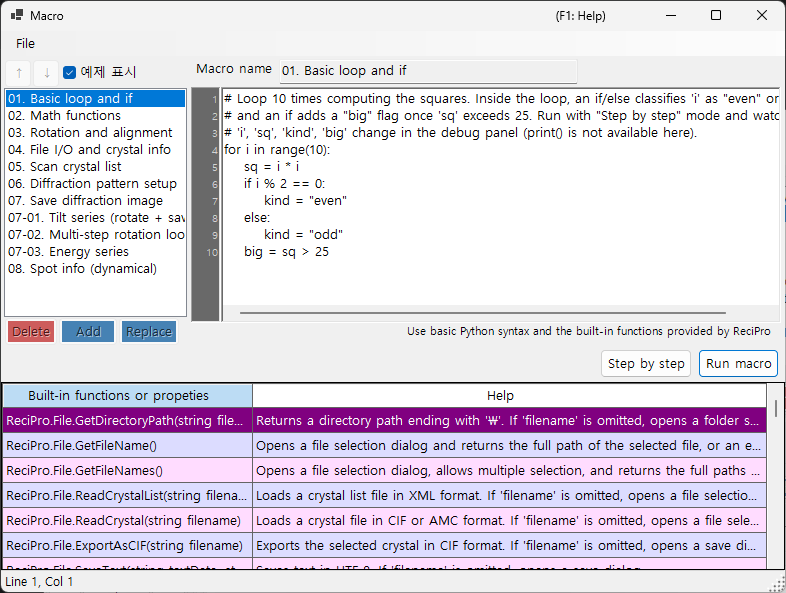

# 매크로

ReciPro에는 스크립트를 통해 결정 연산, 회절 시뮬레이션, 이미지 시뮬레이션을 자동화할 수 있는 **IronPython** 기반 매크로 시스템이 포함되어 있습니다.



위 스크린샷에서는 **예제 표시**가 켜져 있어 내장 샘플 매크로가 표시됩니다. 매크로 목록은 왼쪽에, 코드 편집기는 오른쪽에, 내장 함수 도움말 표는 아래쪽에 있습니다.

---

## 키보드 및 마우스 단축키

| 단축키 | 동작 |
|----------|--------|
| <kbd>F1</kbd> | 온라인 매뉴얼의 이 페이지를 엽니다 |
| <kbd>CTRL</kbd>+<kbd>S</kbd> | 편집기 텍스트를 선택된 매크로 목록 항목에 다시 저장합니다 |
| <kbd>F10</kbd> | 한 단계 진행합니다 (단계별 실행 중) |
| 함수 도움말 목록의 한 행을 더블 클릭 | 해당 함수의 시그니처를 캐럿 위치에 삽입합니다 |
| `.mcr` 파일을 창에 끌어다 놓기 | 편집기로 불러옵니다 |

**Run**, **Step**, **Stop**은 버튼입니다 (단축키 없음).

→ 모든 창을 한눈에 보려면 **[21. 키보드 및 마우스 단축키](../21-shortcuts.md)**를 참조하세요.

---

## 개요

매크로는 Python 구문으로 작성됩니다. ReciPro의 내장 클래스와 함수를 사용하면 GUI에서 제공되는 것과 동일한 연산을 프로그래밍 방식으로 수행할 수 있습니다.

- **언어**: Python 3 (IronPython 3.4)
- **저장**: Windows 레지스트리에 압축된 바이너리 (세션 간에 유지됨)
- **접근**: 메인 창에서 매크로 버튼을 클릭하여 매크로 편집기를 엽니다

---

## 편집기 창

매크로 편집기에는 네 개의 주요 영역이 있습니다:

| 영역 | 용도 |
|------|---------|
| **매크로 목록** (왼쪽) | 저장된 매크로. `Add`는 새 매크로를 추가하고, `Replace`는 선택된 매크로를 덮어쓰며, `Delete`는 제거합니다. Up/Down으로 순서를 변경합니다. |
| **이름 필드** (위쪽) | 편집 중인 매크로의 식별자. |
| **코드 영역** (오른쪽) | 줄 번호 여백, 자동 들여쓰기, 구문 도움말 팝업을 갖춘 Python 코드 편집기. |
| **내장 함수 표** (아래쪽) | ReciPro가 제공하는 내장 함수/속성 목록으로, 각각에 대한 Help 설명이 있습니다. 코드를 작성할 때 참조용입니다. |
| **상태 표시줄** (맨 아래) | 현재 캐럿 위치를 `Line N, Col M`으로 표시합니다. |
| **디버그 패널** (Step 실행 중에 표시됨) | 현재 줄의 지역 변수를 나열합니다. |

저장되지 않은 편집이 있는 동안 제목 표시줄에는 **`Macro*`**(별표 포함)가 표시되며, Add / Replace / <kbd>CTRL</kbd>+<kbd>S</kbd> 이후에는 **`Macro`**로 되돌아갑니다.

### 샘플 매크로

**예제 표시**(왼쪽 위)를 켜면 매크로 목록이 일시적으로 내장 샘플 매크로(기본 루프와 조건문, 수학 함수, 회전/정렬, 결정 목록 순회, 회절/이미지 시뮬레이션, 기울기/에너지 시리즈, 반사 정보 등)로 대체됩니다. 샘플은 읽기 전용이며 현재 UI 언어로 표시됩니다. 학습용으로 또는 복사하여 출발점으로 사용하세요. 끄면 자신의 매크로가 복원됩니다.

---

## 편집 기능

- **자동 들여쓰기**: <kbd>ENTER</kbd>를 누르면 다음 줄이 현재 줄의 선행 공백을 이어받습니다. 줄이 `:`로 끝나면(`def`/`if`/`for`/등 다음), 추가 들여쓰기 수준(공백 4칸)이 자동으로 추가됩니다.
- **스마트 백스페이스**: 선행 공백 내부에서 <kbd>BACKSPACE</kbd>는 한 문자가 아니라 전체 들여쓰기 수준(공백 4칸)을 제거합니다.
- **<kbd>TAB</kbd> / <kbd>SHIFT</kbd>+<kbd>TAB</kbd>**:
  - 선택 없음: 캐럿 위치에서 한 들여쓰기 수준을 삽입 / 제거합니다.
  - 여러 줄 선택: 선택된 모든 줄을 한 번에 들여쓰기 / 내어쓰기합니다.
- **자동 완성**: 입력하는 동안 일치하는 함수 이름과 언어 키워드를 팝업이 나열합니다. 화살표 키로 탐색하고, <kbd>ENTER</kbd> 또는 <kbd>TAB</kbd>으로 확정하며, <kbd>ESC</kbd>로 취소합니다.
- **툴팁 도움말**: 선택된 자동 완성 항목 위에 마우스를 올리면 해당 문서가 표시됩니다.

### 키보드 단축키

| 단축키 | 동작 |
|----------|--------|
| <kbd>CTRL</kbd>+<kbd>S</kbd> | 현재 코드를 선택된 매크로 항목에 저장합니다 (제자리) |
| <kbd>F10</kbd> | 다음 줄로 단계 진행합니다 (Step 실행 중) |
| <kbd>ENTER</kbd> | 자동 들여쓰기와 함께 새 줄을 삽입합니다 |
| <kbd>TAB</kbd> / <kbd>SHIFT</kbd>+<kbd>TAB</kbd> | 들여쓰기 / 내어쓰기 |
| <kbd>BACKSPACE</kbd> | 선행 공백 내부에 있으면 한 들여쓰기 수준을 삭제합니다 |
| <kbd>CTRL</kbd>+<kbd>↑</kbd> / <kbd>CTRL</kbd>+<kbd>↓</kbd> | 해당 없음 — 매크로 순서를 변경하려면 Up/Down 버튼을 사용하세요 |

---

## 매크로 실행

두 가지 실행 모드:

- **Run macro**: 코드를 끝까지 실행합니다. 오류가 발생하면 Python 트레이스백을 표시하는 대화 상자가 나타나고 편집기에서 문제가 된 줄을 강조 표시합니다.
- **Step by step**: 각 줄 앞에서 일시 정지합니다. 디버그 패널이 지역 변수를 표시합니다. 진행하려면 <kbd>F10</kbd>(또는 **Next step (F10)** 버튼)을, 중단하려면 **Stop**을 사용하세요.

**Stop**은 Step 모드에서만 동작합니다 (IronPython이 `CancellationToken`을 따르지 않고 모든 것이 UI 스레드에서 실행되기 때문에 표준 Run macro 실행은 중단할 수 없습니다).

---

## Python 언어 지원

이 매크로 환경은 **IronPython 3.4**입니다. 모든 Python 기능이 여기서 의미가 있는 것은 아닙니다.

### 사전 임포트됨

- **`math`**는 시작 시 임포트됩니다. `math.sqrt(x)`, `math.sin(x)`, `math.pi`, `math.radians(deg)` 등을 직접 사용하세요.

### 사용 가능

- 제어 흐름: `if`/`elif`/`else`, `for`, `while`, `def`, `class`, `return`, `try`/`except`/`finally`, `pass`, `break`, `continue`, `lambda`
- 리터럴: `True`, `False`, `None`
- 내장 함수: `len`, `range`, `abs`, `min`, `max`, `sum`, `sorted`, `enumerate`, `zip`, `int`, `float`, `str`, `list`, `dict`, `tuple`, `type`, `isinstance`
- 순수 Python인 표준 라이브러리 모듈: `random`, `datetime`, `time`, `re`, `json`, `itertools`, `functools`, `collections`

이러한 기본 요소들은 자동 완성 팝업에 미리 등록되어 있으므로 처음 몇 글자를 입력하여 찾을 수 있습니다.

### 사용 불가

- **`print()`** : 콘솔 창이 없어 출력이 아무 데도 가지 않습니다. 값을 확인하려면 **Step by step**을 사용하고 디버그 패널을 보세요.
- **`input()`** : stdin이 없습니다.
- **파일 I/O** (`open`, `with open`) : 매크로용으로 의도되지 않았습니다. 대신 `ReciPro.File.*` 헬퍼를 사용하세요.
- **C 확장 패키지**: `numpy`, `scipy`, `pandas`, `matplotlib` — IronPython과 호환되지 않습니다.

---

## API 접근

ReciPro 매크로 API는 최상위 이름 **`ReciPro`** 아래에 노출됩니다. 모든 내장 클래스는 `ReciPro`의 필드입니다:

```python
ReciPro.File.*         # File I/O helpers
ReciPro.Crystal.*      # Currently selected crystal
ReciPro.CrystalList.*  # Manage the crystal list
ReciPro.Dir.*          # Crystal orientation (Euler, zone-axis, rotation)
ReciPro.DifSim.*       # Diffraction simulator
ReciPro.HRTEM.*        # HRTEM simulation
ReciPro.STEM.*         # STEM simulation
ReciPro.Potential.*    # Potential simulation
ReciPro.Sleep(ms)      # Pause execution (milliseconds)
```

자동 완성 팝업은 항상 전체 `ReciPro.Class.Member` 형태를 표시하고 그대로 삽입하므로, 접두사를 손으로 입력할 일은 거의 없습니다.

전체 API 참조는 [20.1. 내장 함수](1-built-in-functions.md)를 참조하세요.

---

## 오류 메시지

매크로가 실패하면 대화 상자가 Python 트레이스백을 표준 형식으로 표시합니다:

```
Traceback (most recent call last):
  File "<string>", line 5, in <module>
NameError: name 'abc' is not defined
```

편집기는 트레이스백에 보고된 줄(가장 안쪽 프레임)을 자동으로 선택하므로 문제를 즉시 수정할 수 있습니다. 구문 오류 역시 실행이 시작되기 전에 줄 번호와 함께 보고됩니다.

---

## 함께 보기

- [20.1. 내장 함수](1-built-in-functions.md)
- [20.2. 예제](2-examples.md)
