# 빔 상호작용

**빔 상호작용**은 선택한 결정이 입사하는 **X선, 전자 또는 중성자** 빔과 어떻게 상호작용하는지를 설명합니다. 선택한 한 가지 방사선에 대해 허용된 반사와 그 구조 인자, 물질을 통과하는 빔의 감쇠와 수송, 각 원소의 원자 산란 인자, 그리고 (X선의 경우) 특성 형광선을 계산합니다. 상단에서 방사선 종류를 전환하면 모든 것이 다시 계산되므로, 동일한 결정을 회절 및 분광 기법에 걸쳐 비교할 수 있습니다.

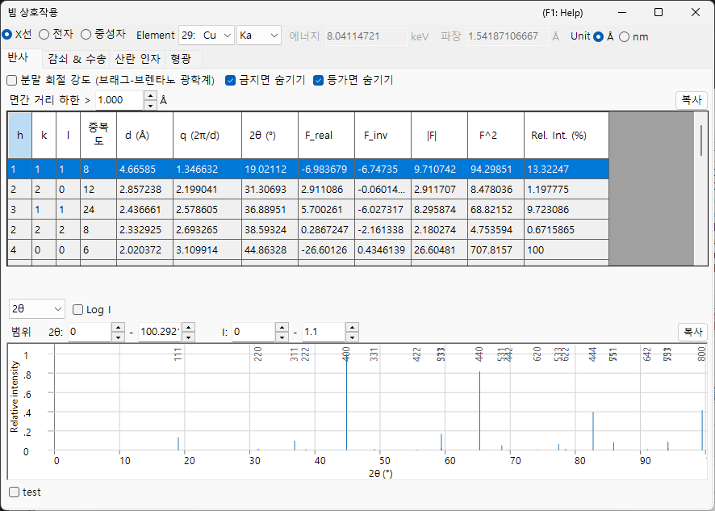

입사빔은 창 상단의 띠에서 선택합니다. 그 아래의 네 개 탭 — **Reflections**, **Attenuations & Transport**, **Scattering factors**, **Fluorescence** — 는 상호작용의 서로 다른 측면을 보여줍니다. 아래의 각 탭 절은 **X-ray / Electron / Neutron** 빔에 따른 탭을 보여줍니다 (각 그림의 탭을 사용하세요). 내용은 빔에 따라 현저하게 달라집니다.

!!! tip "고체물리학 배경 (부록 A2)"
    이 네 개 탭의 배경이 되는 산란 및 고체물리학 — 원자 산란 인자, 구조 인자, 빔 감쇠와 수송, 형광 — 은 **[부록 A2. 빔 상호작용 (고체물리학 배경)](appendix/a2-beam-interaction/index.md)** 에서 설명합니다.

!!! note "X선 데이터와 동봉된 xraylib 라이브러리"
    많은 X선 물리량 (이상 분산 $f'/f''$, $F(q)+S(q)$ 산란 분할, 질량 감쇠의 photo / Rayleigh / Compton 분해, 흡수단 점프, 형광 수율) 은 동봉된 **[xraylib](https://github.com/tschoonj/xraylib)** 라이브러리로 평가됩니다. xraylib을 사용할 수 없으면 ReciPro는 내부 테이블 (광흡수만의 감쇠, 특성선 에너지만) 로 대체하며, 영향을 받는 셀에는 **N/A** 가 표시됩니다. 각 테이블의 **source** 행은 어떤 데이터 집합이 사용되었는지를 나타냅니다.

---

## 키보드 & 마우스 단축키

이 창에는 특별한 키 조합이 없습니다. <kbd>F1</kbd> 은 이 매뉴얼 페이지를 엽니다. **Scattering factors** 탭에서는 세로 커서선을 **끌어서** 그 위치에서 각 원소의 산란 인자를 읽을 수 있으며, 모든 탭에는 테이블을 스프레드시트에 붙여넣을 수 있는 텍스트로 내보내는 **Copy** 버튼이 있습니다.

→ 모든 창을 한눈에 보려면 **[21. 키보드 & 마우스 단축키](21-shortcuts.md)** 를 참조하세요.

---

## 빔과 파장 {#reflections-tab}

상단 띠는 다른 시뮬레이터들과 공유되는 **Wave Length Control** 입니다.

- **X-ray / Electron / Neutron** : 원자 산란 인자와 상호작용 물리는 입사빔의 종류에 따라 다르므로 여기서 전환합니다.
- **X-ray** 의 경우 **Element** (양극 재료) 와 특성선 (Kα 등) 을 선택하면 해당 특성 X선의 파장이 자동으로 설정됩니다.
- **Energy (keV)** 와 **Wavelength (Å)** 는 연동되어 있습니다. 어느 한쪽을 설정하면 다른 쪽이 갱신되며, 둘 다 **Reflections** 테이블에서 사용되는 2θ를 결정합니다.
- **Unit (Å / nm)** 은 d-간격 및 유사한 물리량에 사용되는 길이 단위를 전환합니다.

선택한 빔은 또한 어떤 탭과 곡선이 의미가 있는지를 결정합니다:

| 빔 | Reflections | Attenuations & Transport | Scattering factors | Fluorescence |
|------|------|------|------|------|
| **X-ray** | 이상 분산을 포함한 구조 인자 | µ/ρ, µ, 투과율 + 흡수단 (에너지에 대해) | $f(s)$ 또는 $F(q)+S(q)$ | 특성선 + EDX 스틱 |
| **Electron** | 전자 구조 인자 | σ, MFP, \|dE/ds\|, IMFP, 비정 (에너지에 대해) | Peng / Kirkland / 8-Gaussians | — (숨김) |
| **Neutron** | 핵 구조 인자 | 산란 길이 & 단면적 (에너지 곡선 없음) | 산란 길이 (*s* 의존성 없음) | — (숨김) |

**Fluorescence** 탭은 X선 전용이며 전자 및 중성자 빔에서는 사라집니다. 중성자의 경우 **Attenuations & Transport** 와 **Scattering factors** 의 에너지 의존 그래프는 원소 테이블로 대체되는데, 이는 핵 산란 길이가 산란각이나 에너지에 의존하지 않기 때문입니다.

---

## Reflections 탭

결정의 허용된 결정면 (반사) 과 각각의 **구조 인자** 및 회절 강도를 나열합니다. X선의 경우 구조 인자에 이제 현재 에너지에서의 **이상 분산** 항 $f'/f''$ 가 포함되므로, 흡수단 근처에서 `F_inv` (허수부) 는 일반적으로 0이 아닙니다. 레이아웃은 모든 빔에 대해 동일하며, 구조 인자 값과 각 반사의 2θ만 달라집니다.

=== "X-ray"
    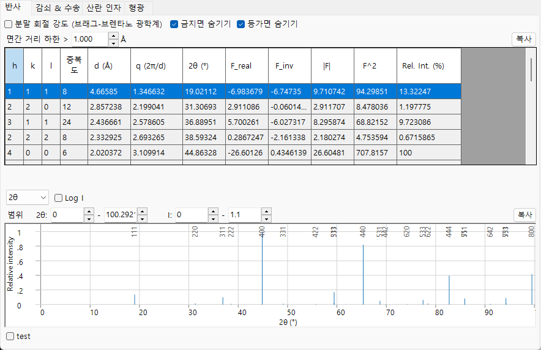

=== "Electron"
    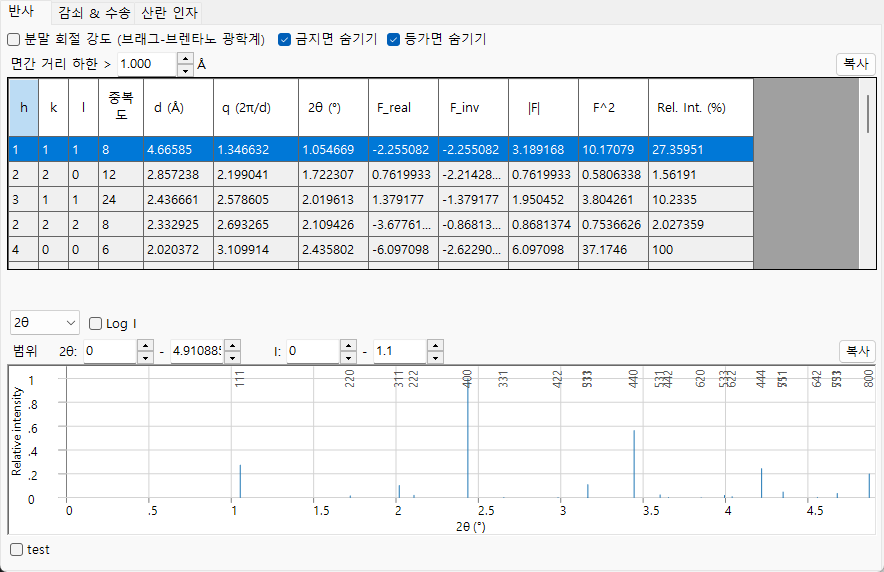

=== "Neutron"
    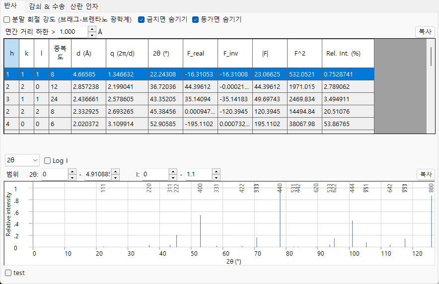

**Options**

- **Powder Diffraction Intensities (Bragg-Brentano Optics)** : 상대 강도를 분말 회절 (Bragg–Brentano) 강도로 계산하며, 다중도와 Lorentz–편광 인자를 포함합니다. 끄면 구조 인자 강도를 표시합니다. 켜면 *Hide equivalent planes* 와 *Hide prohibited planes* 도 강제로 켜집니다.
- **Hide equivalent planes** : 결정학적으로 등가인 면들을 하나의 항목으로 합칩니다.
- **Hide prohibited planes** : 소광 규칙에 의해 강도가 0인 면들을 제외합니다.
- **d-Spacing Cutoff >** : d-간격이 이 값보다 작은 반사를 제외합니다 (길이 단위는 **Unit** 선택을 따릅니다).

각 행은 하나의 반사 (또는 대칭 등가 면들의 그룹) 입니다:

| 열 | 의미 |
|------|------|
| **h, k, l** | 밀러 지수 |
| **Multi.** | 다중도 (대칭 등가 면의 수) |
| **d (Å)** | 격자면 간격 |
| **q (2π/d)** | 산란 벡터의 크기 |
| **2θ (°)** | 선택한 파장에 대한 회절각 |
| **F_real** | 구조 인자의 실수부 |
| **F_inv** | 구조 인자의 허수부 (X선 이상 분산에서 0이 아님) |
| **\|F\|** | 구조 인자 진폭 ($= \sqrt{F_\text{real}^2 + F_\text{inv}^2}$) |
| **F^2** | 구조 인자 강도 ($\lvert F\rvert^2$) |
| **Rel. Int. (%)** | 상대 강도, 가장 강한 반사를 100으로 설정 |

**회절 피크 플롯.** 테이블 아래에는 동일한 반사들이 스틱 패턴으로 그려지며, 가장 강한 피크에는 그 *hkl* 이 레이블로 표시됩니다.

- 가로축 선택기는 **2θ** (도 단위의 산란각), **d** (격자면 간격), **Q** ($= 4\pi\sin\theta/\lambda$, 산란 벡터 / 운동량 전달) 중에서 선택합니다. 세 옵션은 동일한 반사들을 나타내며, 가로 축척만 달라집니다.
- **Log I** 는 강도 축을 선형과 로그 사이에서 전환합니다. 회절 강도는 여러 자릿수에 걸쳐 분포하므로, 로그 축척은 하단을 늘려서 선형 축척이 기준선에 눌러 평탄화시키는 약한 피크들을 드러냅니다.
- **Range** 박스는 플롯되는 가로 범위와 강도 범위를 설정합니다.

---

## Attenuations & Transport 탭

빔이 물질을 얼마나 깊이 침투하는지와 에너지를 어떻게 잃는지를 나타냅니다. 내용은 빔에 따라 달라집니다.

=== "X-ray"
    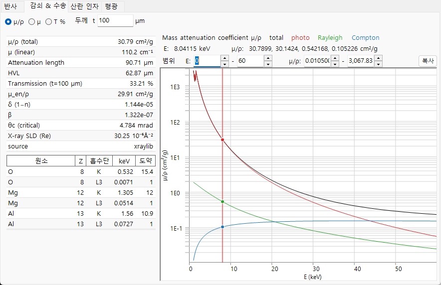

=== "Electron"
    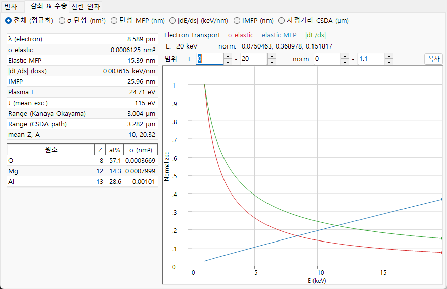

=== "Neutron"
    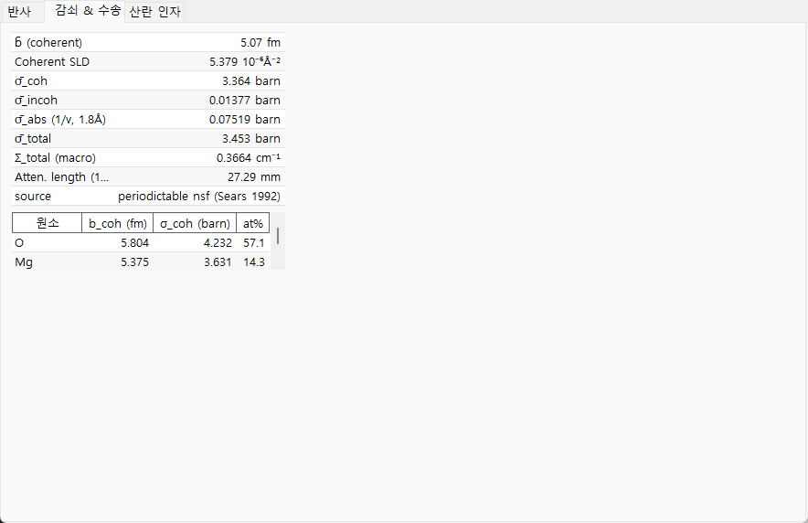

### X-ray

라디오 버튼은 광자 에너지 (1–60 keV, 로그 축) 에 대해 플롯되는 계수를 선택합니다:

- **µ/ρ** — **질량** 감쇠 계수 (cm²/g): 물질이 X선을 그램당 얼마나 강하게 제거하는지를 나타내며, 얼마나 조밀하게 채워져 있는지와 무관합니다 (이것이 참조 테이블에서 찾을 수 있는 값입니다). 그래프는 **total** 과 함께 그 **photo**, **Rayleigh**, **Compton** 성분을 보여줍니다.
- **µ** — **선** 감쇠 계수 $\mu = (\mu/\rho)\cdot\rho$ (cm⁻¹): 실제 밀도의 실제 물질 1센티미터당 감쇠. 투과 강도는 $I = I_0\,e^{-\mu t}$ 를 따르며, $1/\mu$ 는 강도가 약 37 % (1/e) 로 떨어지는 거리입니다.
- **T %** — **Thickness t** 박스 (µm) 에 설정한 시료 두께 **t** 에 대한 백분율 **투과율** $T = e^{-\mu t}$. 100 % = 투명, 0 % = 완전 차단. 이를 사용하여 현재 에너지에서 적절한 시료 두께를 판단하세요.

세로선은 현재 에너지와 각 원소의 **흡수단** 을 표시합니다. 왼쪽의 스칼라 테이블은 현재 에너지에서 다음을 나열합니다: **µ/ρ (total)**, **µ (linear)**, **Attenuation length** ($1/\mu$), **HVL** (반가층, $\ln 2/\mu$), 두께 *t* 에서의 **Transmission**, **µ_en/ρ** (질량 에너지 흡수 계수), X선 굴절률 감소량 **δ** 와 **β** ($n = 1-\delta+i\beta$), 전반사를 위한 **θc (critical)** 각, 그리고 실수 **X-ray SLD** (산란 길이 밀도). 아래 테이블은 각 원소의 **K** 및 **L3** 흡수 **edge** 에너지와 그 **Jump** 비를 나열합니다.

### Electron

물리량 선택기는 빔 에너지 (1–30 keV) 에 대해 무엇을 플롯할지 선택합니다:

- **All (normalized)** — 아래의 세 곡선을 겹쳐서, 각각을 자체 최댓값으로 재척도화하여 형태를 하나의 플롯에서 비교할 수 있게 합니다 (절대값은 테이블에서 읽으세요).
- **σ elastic (nm²)** — 탄성 산란 단면적: 단일 원자가 전자를 편향시킬 가능성이 얼마나 되는지.
- **Elastic MFP (nm)** — 평균 자유 행로: 전자가 탄성 산란 사건 사이에 이동하는 평균 거리.
- **|dE/ds| (keV/nm)** — 저지능의 크기: 전자가 이동 거리 1나노미터당 잃는 에너지.
- **IMFP (nm)** — 비탄성 평균 자유 행로: 에너지를 잃는 충돌 사이의 평균 거리.
- **Range CSDA (µm)** — 전자가 멈출 때까지 이동하는 전체 경로 길이.

스칼라 테이블은 전자 **wavelength**, **σ elastic**, **Elastic MFP**, **|dE/ds|**, **IMFP**, **Plasma E** 와 평균 여기 에너지 **J**, 두 가지 전자 **range** (Kanaya–Okayama 침투 추정값과 CSDA 적분 경로 길이), 그리고 평균 **Z, A** 를 나열합니다. 원소별 테이블은 각 원소의 원자 분율과 탄성 단면적 σ를 제공합니다. 탄성 단면적은 **NIST Mott** 데이터 (50 eV–36 keV) 를 사용하며 36 keV 위에서는 **screened Rutherford** 로 대체됩니다.

### Neutron {#scattering-factors-tab}

중성자 상호작용은 에너지 의존 곡선이 아니라 핵 단면적으로 정해지므로, 이 탭은 테이블만 표시합니다. 스칼라 테이블은 평균 가간섭 산란 길이 **b̄**, **Coherent SLD**, 평균화된 가간섭 / 비가간섭 / 흡수 / 전체 단면적 (**σ̄_coh**, **σ̄_incoh**, **σ̄_abs**, **σ̄_total**), 거시 전체 단면적 **Σ_total** 과 그에 대응하는 **attenuation length** 를 나열합니다. 흡수 단면적은 현재 파장에서 1/v 법칙으로 평가되며, 이것이 유효하지 않은 핵종 (Cd, Sm, Eu, Gd 공명 흡수체) 은 표시됩니다. 원소별 테이블은 **b_coh**, **σ_coh**, 그리고 원자 분율을 나열합니다.

---

## Scattering factors 탭 {#fluorescence-tab}

각 구성 원소의 원자 산란 인자를 $s = \sin\theta/\lambda$ (Å⁻¹) 에 대해 플롯합니다. 각 원소는 자체 색으로 그려지며, **세로 커서선** 을 끌어서 그 위치에서 모든 원소의 산란 인자를 왼쪽 테이블로 읽을 수 있습니다.

=== "X-ray"
    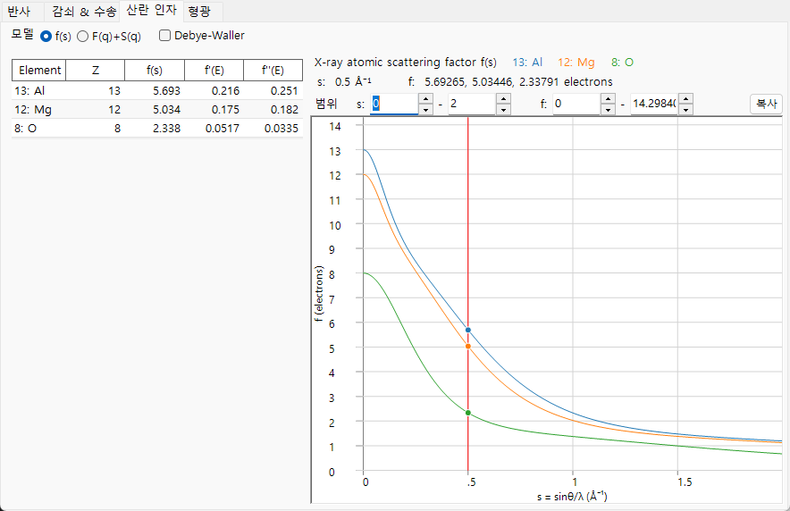

=== "Electron"
    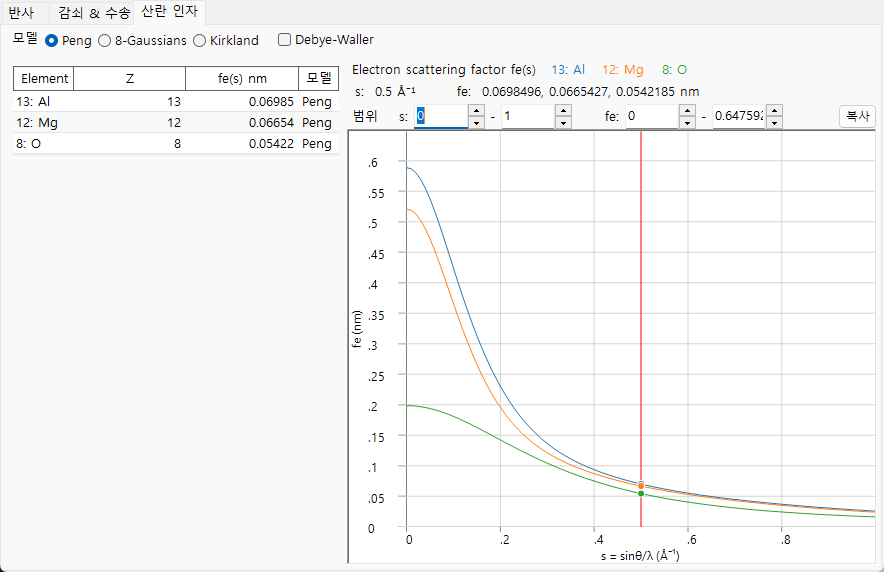

=== "Neutron"
    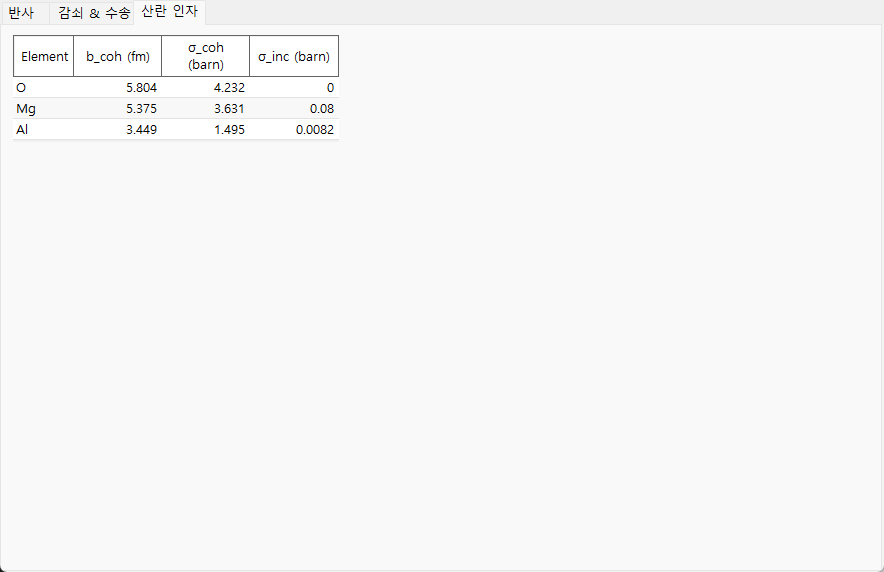

- **X-ray** 는 두 가지 **Model** 모드를 제공합니다: **f(s)** 는 통상적인 X선 원자 산란 인자 (전자 단위) 를 플롯합니다. **F(q)+S(q)** 는 Rayleigh **가간섭** 형상 인자 $F(q)$ 와 함께 Compton **비가간섭** 산란 함수 $S(q)$ 를 (xraylib에서) 플롯합니다. 테이블은 또한 현재 에너지에서의 이상 분산 항 **f'(E)** 와 **f''(E)** 를 나열합니다.
- **Electron** 은 전자 산란 인자의 세 가지 매개변수화를 제공합니다: **Peng**, **Kirkland**, **8-Gaussians**. 테이블은 $f_e(s)$ (nm) 와 그것을 생성한 **model** 을 보여줍니다.
- **Neutron** 산란 길이는 $s$ 에 의존하지 않으므로 곡선이 그려지지 않습니다. 테이블은 각 원소의 가간섭 산란 길이 **b_coh** 와 그 가간섭 / 비가간섭 단면적을 나열합니다.
- **Debye-Waller** 는 각 원자의 등방성 변위 매개변수를 사용하여 각 인자에 열적 감쇠 $e^{-B s^2}$ 를 곱합니다.

---

## Fluorescence 탭

X선 빔에 대해 시료의 특성 **형광** 방출을 나타냅니다. (이 탭은 전자 및 중성자 빔에서는 숨겨집니다.)

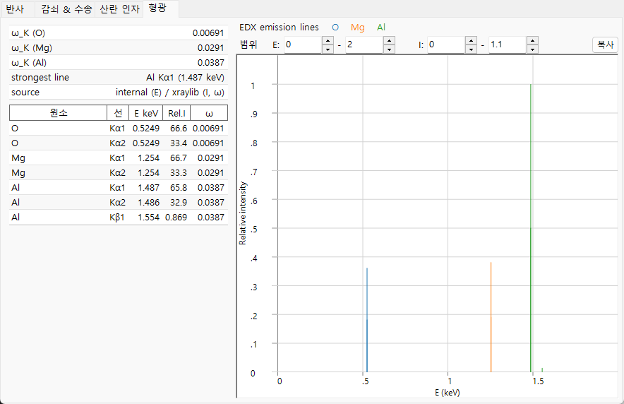

**EDX emission lines** 플롯은 모든 원소의 특성선 (Kα1, Kα2, Kβ1, Lα1, Lα2, Lβ1) 을 그 광자 에너지에서 스틱으로 그리며, 높이는 원자 분율 × 방사율 × 형광 수율에 비례합니다 (정성적인 EDX 스타일 미리보기로, 여기 단면적과 검출기 효율은 모델링되지 않습니다). 아래 테이블은 선별로 원소, 선 이름, 에너지 **E keV**, 상대 강도 **Rel.I**, 형광 수율 **ω** 를 나열합니다. 스칼라 테이블은 각 원소의 K-껍질 수율 **ω_K** 와 스펙트럼에서 **strongest line** 을 보고합니다.

---

## 클립보드로 복사

각 탭에는 테이블을 Excel과 같은 스프레드시트에 붙여넣을 수 있는 텍스트로 클립보드에 복사하는 **Copy** 버튼이 있습니다.

---

## 함께 보기

- [결정 데이터베이스](1-crystal-database.md) — 상호작용을 계산할 결정을 정의합니다.
- [회절 시뮬레이터](7-diffraction-simulator/index.md) — 구조 인자를 사용하여 회절 패턴을 시뮬레이션합니다.
- [부록 A2. 빔 상호작용 (고체물리학 배경)](appendix/a2-beam-interaction/index.md) — 모든 탭의 배경이 되는 산란 및 고체물리학.
