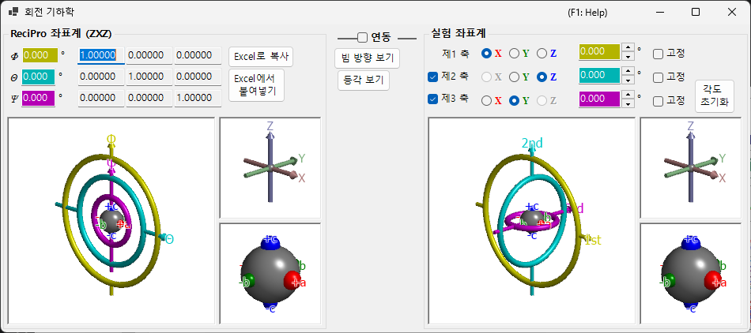

# 회전 기하학

이 창은 결정의 회전 상태를 3×3 행렬로 나타내고 서로 다른 오일러 좌표계 사이를 변환합니다.

ReciPro는 세 개의 오일러 각 — **Ψ**, **θ**, **Φ** — 을 **Z–X–Z** 순서로 적용합니다. 그러나 이 규약이 반드시 실제 장비의 고니오미터 축과 일치하지는 않습니다. **회전 기하학** 창에서는 ReciPro의 오일러 각을 임의로 정의한 좌표계로 변환할 수 있어, 실험실에서의 고니오미터 조정을 지원합니다.

---

## 키보드 및 마우스 단축키

여섯 개의 3D 뷰(ReciPro 및 실험용 고니오미터 / 축 / 객체 패널) 모두는 **연동**되어 있어, 어느 하나를 회전하면 여섯 개가 함께 회전합니다. 이들은 ReciPro의 표준 [OpenGL 뷰 내비게이션](21-shortcuts.md)을 공유합니다.

| 단축키 | 동작 |
|----------|--------|
| <kbd>F1</kbd> | 온라인 매뉴얼의 이 페이지 열기 |
| 뷰에서 왼쪽 드래그 | 모델 회전(여섯 개 뷰가 함께 회전) |
| 마우스 휠 또는 오른쪽 드래그 위/아래 | 확대/축소(큰 고니오미터 뷰) |
| <kbd>CTRL</kbd> + 오른쪽 드래그 위/아래 | 카메라 거리 변경(투시 모드 전용) |
| <kbd>CTRL</kbd> + 오른쪽 더블 클릭 | 정사영 / 투시 투영 전환 |

작은 *Axes* 및 *Objects* 뷰에서는 확대/축소와 이동이 비활성화되어 있습니다. <kbd>F1</kbd> 외에는 키보드 단축키가 없습니다.

---

## ReciPro 좌표계 (ZXZ)

창의 위쪽 절반은 "ReciPro 좌표계"에서의 회전 상태를 보여줍니다.

- **Φ, θ, Ψ** 값은 메인 창에서 설정한 오일러 각과 동기화됩니다.
- **회전 행렬**은 현재 회전 상태에 대응하는 3×3 행렬을 표시합니다.

### Φ, θ, Ψ (Z–X–Z 오일러 각)

결정 방위는 다음 순서로 적용되는 세 번의 회전으로 매개변수화됩니다:

1. **Φ** — **Z** 축에 대한 첫 번째 회전.
2. **θ** — 한 번 회전된 기준틀의 **X** 축에 대한 회전.
3. **Ψ** — 두 번 회전된 기준틀의 **Z** 축에 대한 두 번째 회전.

모든 숫자 상자는 편집 가능하며, 여기서 값을 변경하면 메인 창과 연동된 모든 시뮬레이터가 갱신됩니다.

### 회전 행렬

현재 (Φ, θ, Ψ)로부터 생성된 3 × 3 행렬입니다. **Excel로 복사** / **Excel에서 붙여넣기**를 사용하면 스프레드시트를 통해 행렬을 주고받을 수 있습니다.

이 행렬은 ReciPro 안 어디에 나타나든 다음 한 가지 규약을 따릅니다:

$$
\mathbf{v}_{\mathrm{rot}} = R\,\mathbf{v}_{0}
$$

- \(R\) 은 결정의 **능동 회전**(active rotation)을, 모니터에 고정된 실험실 좌표계(\(X\)=오른쪽, \(Y\)=위, \(Z\)=관찰자 쪽 — [부록 A1.1](appendix/a1-coordinate-system/1-orientation.md) 참조)로 나타낸 것입니다.
- \(\mathbf{v}_{0}\) : 결정에 고정된 방향의 **초기 방위**(\(c \parallel Z\), \(b\) 는 \(YZ\) 면 내)에서의 데카르트 좌표(열벡터).
- \(\mathbf{v}_{\mathrm{rot}}\) : 회전 후 같은 방향의 좌표(역시 실험실 좌표계).
- \(\Phi=\theta=\Psi=0\) 에서 \(R\) 은 단위 행렬입니다. \(R\) 은 정규 직교이고 행렬식이 +1 이므로 역변환은 전치 \(R^{-1}=R^{\mathsf T}\) 입니다.

오일러 각으로는 \(R = R_Z(\Phi)\,R_X(\theta)\,R_Z(\Psi)\) 입니다(고정축 둘레의 오른손 회전. 벡터에는 \(\Psi\) 가 먼저 작용):

$$
R=\begin{pmatrix}
\cos\Phi\cos\Psi-\cos\theta\,\sin\Phi\sin\Psi & -\cos\Phi\sin\Psi-\cos\theta\,\sin\Phi\cos\Psi & \sin\theta\,\sin\Phi\\
\sin\Phi\cos\Psi+\cos\theta\,\cos\Phi\sin\Psi & -\sin\Phi\sin\Psi+\cos\theta\,\cos\Phi\cos\Psi & -\sin\theta\,\cos\Phi\\
\sin\theta\,\sin\Psi & \sin\theta\,\cos\Psi & \cos\theta
\end{pmatrix}
$$

결정학적 지수에 적용할 때는 먼저 초기 방위의 데카르트 좌표로 바꿉니다: 방향 \([uvw]\) 는 \(\mathbf{v}_0 = u\mathbf{a}+v\mathbf{b}+w\mathbf{c}\), 면 법선 \((hkl)\) 은 \(\mathbf{v}_0 = h\mathbf{a}^{*}+k\mathbf{b}^{*}+l\mathbf{c}^{*}\) (역격자 기본 벡터)입니다.

같은 행렬(\(R_{ij}\) = \(i\) 행 \(j\) 열)은 다음에 나타납니다:

- 이 창의 **Excel로 복사** / **Excel에서 붙여넣기** (3 × 3 탭 구분, 위 행부터 차례로);
- [매크로 API](20-macro/1-built-in-functions.md)의 `Dir.GetRotationMatrix()` / `Dir.SetRotationMatrix()` 와 `Dir.GetEuler()` (9 요소를 행 순서 \(R_{11}, R_{12}, R_{13}, R_{21}, \ldots, R_{33}\) 로 나열);
- [Spot ID v2](11-spot-id-v2.md) 가 저장하는 후보 목록의 **R11**–**R33** 열.

### OpenGL 창

3D 뷰는 세 개의 색칠된 토러스(도넛)를 사용하여 현재 회전을 보여줍니다:

| 색상 | 오일러 각 | 고니오미터 단 |
|--------|------------|-----------------|
| **노란색** | Φ | 1번째(위쪽) 축 |
| **연한 파란색** | θ | 2번째(가운데) 축 |
| **분홍색** | Ψ | 3번째(아래쪽) 축 |

**빨간색**, **초록색**, **파란색** 화살표는 실공간 직교 좌표계의 X, Y, Z 축을 나타냅니다. 이들은 메인 창에 표시되는 결정축과는 *다릅니다*.

중심의 회색 구는 시료를 나타내며, 빨간색/초록색/파란색 구는 객체가 초기 방위에서 어떻게 회전했는지를 보여줍니다(Φ = θ = Ψ = 0 일 때 각각 +X, +Y, +Z 와 정렬됩니다).

> **참고**: OpenGL 창에서 드래그하면 이 뷰의 *투영 방향* 만 바뀌며, 결정 방위 자체는 바뀌지 않습니다. 결정을 회전하려면 메인 창을 사용하십시오.

### 버튼

| 버튼 | 동작 |
|--------|--------|
| Excel로 복사 | 3×3 회전 행렬을 탭 구분 형식으로 복사 |
| Excel에서 붙여넣기 | 클립보드에서 회전 행렬 설정(탭 구분 3×3) |
| 빔 방향 보기 | 메인 창 투영에 맞춤(Z 축이 화면에 수직) |
| 등각 보기 | 등각 투영으로 전환 |

---

## 실험 좌표계

아래쪽 절반은 임의의 회전축 집합에 대한 오일러 각을 정의하고 고니오미터 상태를 읽거나 설정합니다. 이를 **실험 좌표계** 라고 합니다.

### 제1, 제2, 제3 축

각 단(위쪽, 가운데, 아래쪽)에 대해 **±X**, **±Y**, **±Z** 중에서 고니오미터의 회전축을 선택합니다. 그래픽이 그에 맞게 갱신됩니다.

각 축의 오일러 각은 해당하는 색칠된 텍스트 상자(노란색, 연한 파란색, 분홍색)에 표시됩니다. 값을 직접 입력할 수도 있습니다.

---

## 연동

**연동**이 선택되면 ReciPro 좌표계와 실험 좌표계가 결합됩니다: 두 좌표계 사이에서 객체 방위가 일관되도록 오일러 각이 조정됩니다.

### 작업 흐름 예시

1. 실험실에서 결정의 *a* 축이 X선 입사 방향과 정렬되고 *b* 축이 수평이 되도록 고니오미터를 설정합니다.
2. 실험실 고니오미터의 오일러 각을 실험 좌표계에 입력합니다.
3. 메인 창에서 *a* 축이 화면 법선을 향하고 *b* 축이 수평을 향하도록 결정을 회전합니다.
4. **연동**을 선택합니다 — 이제 메인 창에서 결정을 다른 방위로 향하게 할 때마다 필요한 고니오미터 각이 자동으로 표시됩니다.

---

## 함께 보기

- [메인 창](0-main-window.md)
- [스테레오넷](6-stereonet.md)
- [기본 좌표계 및 결정 방위](appendix/a1-coordinate-system/1-orientation.md)
- [키보드 및 마우스 단축키](21-shortcuts.md)
