# 구조 뷰어

**구조 뷰어**는 선택한 결정의 구조를 OpenGL을 사용하여 3차원 이미지로 그립니다.

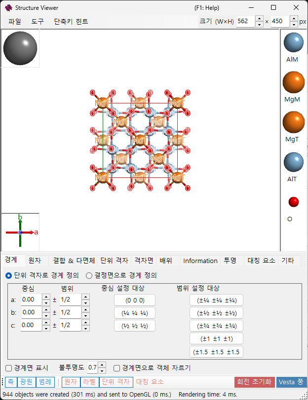

---

## 키보드 및 마우스 단축키

이 창에는 메인 3D 뷰와 두 개의 작은 기즈모 — **결정축** 박스(왼쪽 아래)와 **광원 방향** 박스(왼쪽 위) — 가 있으며, 각각 왼쪽 드래그에 다르게 반응합니다. 메인 뷰는 ReciPro의 표준 [OpenGL 뷰 내비게이션](21-shortcuts.md)을 사용합니다.

| 단축키 | 동작 |
|----------|--------|
| <kbd>F1</kbd> | 온라인 매뉴얼의 이 페이지 열기 |
| <kbd>CTRL</kbd>+<kbd>SHIFT</kbd>+<kbd>C</kbd> | 렌더링된 이미지를 클립보드에 복사 |
| 메인 뷰 왼쪽 드래그 | 모델 회전 |
| 원자 왼쪽 더블 클릭 | 해당 원자의 좌표, 최근접 이웃 거리, 결합각 표시 |
| 오른쪽 드래그 위/아래, 또는 마우스 휠 | 확대/축소 |
| 가운데 드래그 | 이동 |
| <kbd>CTRL</kbd> + 오른쪽 드래그 위/아래 | 카메라 거리 변경(원근 모드에서만) |
| <kbd>CTRL</kbd> + 오른쪽 더블 클릭 | 정사영 / 원근 투영 전환 |
| **결정축** 기즈모 왼쪽 드래그 | 모델 회전(평면 내 회전 없음) |
| **광원** 기즈모 왼쪽 드래그 | 조명 방향 변경 |

[메인 창](0-main-window.md#keyboard-mouse-shortcuts)의 응용 프로그램 전역 <kbd>CTRL</kbd>+<kbd>SHIFT</kbd> 단축키도 이 창이 포커스를 가진 동안 작동합니다.

→ 모든 창을 한눈에 보려면 **[21. 키보드 및 마우스 단축키](21-shortcuts.md)**를 참조하세요.

---

## 메인 영역

광원, 결정축, 원자 범례가 있는 3D 결정 구조.
> 창의 오른쪽 위에 있는 **크기 (W×H)** 박스는 렌더링된 이미지를 저장하거나 복사할 때 사용되는 픽셀 크기를 설정합니다.
> 그 옆의 **ProjWidth** 박스는 투영된 뷰의 너비를 nm 단위로 표시합니다. 값을 편집하여 수치로 확대/축소할 수 있으며, 뷰에서의 오른쪽 드래그 / 휠 확대/축소와 동기화된 상태로 유지됩니다.

---

## 메뉴 모음

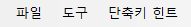

### 파일 메뉴

이미지 저장, 클립보드에 복사(Ctrl+Shift+C), 동영상 저장(MP4).

**동영상 저장**은 아래의 동영상 설정 대화 상자를 엽니다. 동영상은 뷰를 회전하거나, 투영 중심을 평행 이동하거나, 둘을 동시에 수행할 수 있습니다 — **Rotation** 및/또는 **Translation**을 선택하세요:

- **Rotation**: 아래에서 선택한 축 — **현재 투영**(화살표 버튼으로 지정한 기울임 방향), **방향 지수** [uvw], 또는 **격자면** (hkl)의 법선 — 을 중심으로 **Speed**(°/s, 음수 값은 방향을 반전)로 뷰를 회전합니다.
- **Translation**: 투영 중심을 방향 지수 [uvw]를 따라 **Speed**(격자 주기/초)로 이동합니다. 이 옵션은 구조 뷰어에서 대화 상자를 열었을 때만 나타나며, 활성화된 동안에는 **방향 지수**가 유일한 방향 모드가 됩니다.

동영상 길이(**Duration**), 프레임 레이트(**FPS**, 1–120), 인코더 품질(**Quality**, 1–100. 값이 클수록 높은 비트레이트를 사용하여 파일이 커집니다)을 설정하고, 코덱(**H264** / **H265**)을 선택한 다음 **OK**를 눌러 MP4 파일을 생성합니다. **Include final frame**은 t = Duration 시점의 프레임을 한 장 더 추가하여 동영상이 정확히 최종 방향/위치에서 끝나도록 합니다. (인코딩 속도 목록은 진행 표시의 레이블에만 사용되며, 더 이상 실제 인코딩에는 영향을 주지 않습니다.)

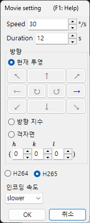

### 도구 메뉴

---

## 탭 메뉴

### 격자로 정의된 경계

결정의 그리기 범위를 지정합니다. 위쪽의 라디오 버튼으로 전환되는 두 가지 모드가 있습니다.

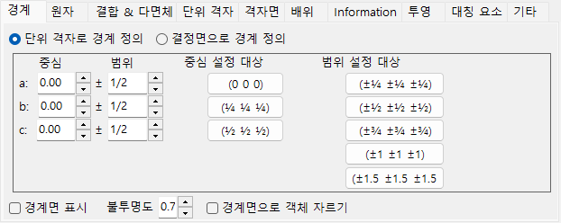

이 모드에서는 단위 격자의 *a*, *b*, *c* 축이 그리기 범위의 단위가 됩니다.

- **중심**: 그리기 부피의 중심 분수 좌표.
- **범위**: *a*, *b*, *c* 각 축에 대한 상한/하한.
- 오른쪽의 **프리셋 버튼**은 자주 사용하는 값(예: 1×1×1 단위 격자, 2×2×2 단위 격자)을 제공합니다.

### 결정면으로 정의된 경계

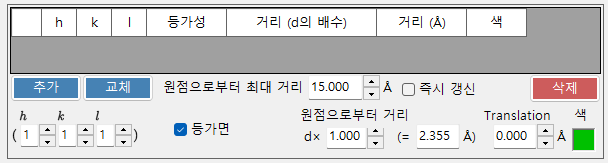

이 모드에서는 그리기 영역이 결정면들의 집합으로 경계가 지정됩니다. 평면들이 공간적으로 닫힌 영역을 정의하지 않으면, ReciPro는 자동으로 단위 격자 한 개 경계로 되돌아갑니다.

#### 경계 목록

현재 결정에 등록된 모든 경계 평면. **추가 / 교체 / 삭제**를 사용하여 목록을 조작합니다. 맨 왼쪽 확인란은 평면을 삭제하지 않고 일시적으로 비활성화합니다.

> 변경 사항을 영구적으로 저장하려면 **메인 창**에서도 **추가** 또는 **교체**를 눌러야 합니다. 그렇지 않으면 다음에 메인 결정 목록에서 선택을 변경할 때 변경 사항이 손실됩니다.

#### H k l 지수

경계 평면을 밀러 지수로 설정합니다. 확인란은 선택한 (*hkl*)에서 생성된 결정학적으로 등가인 평면들을 포함합니다.

#### 원점으로부터의 거리

결정 중심에서 경계 평면까지의 거리. 단위는 **d**와 **Å** 중에서 선택할 수 있습니다. **d**의 경우 거리는 입력 값에 선택한 (*hkl*)의 *d*-간격을 곱한 값입니다. **Å**의 경우 값은 절대 거리입니다. 하나를 변경하면 다른 하나가 자동으로 갱신됩니다.

#### 경계 평면 표시 / 불투명도

경계 평면 자체를 표시하거나 숨깁니다. 표시될 때 **불투명도**는 투명도를 설정합니다(0 = 투명, 1 = 불투명).

#### 경계 평면으로 객체 잘라내기

선택하면 경계로 정의된 내부 영역만 렌더링됩니다. 경계와 교차하는 원자, 결합, 다면체는 잘립니다.

#### 원자 숨기기

선택하면 모든 원자, 결합, 다면체가 숨겨집니다 — 격자나 격자면만 시각화해야 할 때 유용합니다.

### 원자

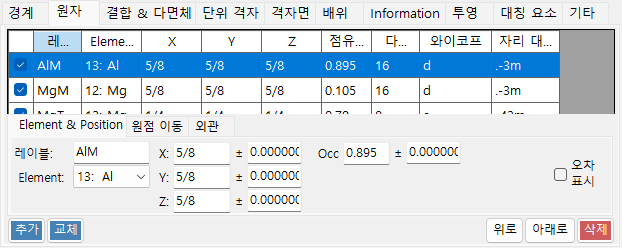

좌표, 원소, 점유율, 반지름, 색상, 재질. **같은 원소에 적용**.

#### 원자 목록

결정 내 원자들의 목록. **추가 / 교체 / 삭제**를 사용하여 목록을 조작합니다. 맨 왼쪽 확인란은 원자를 일시적으로 숨깁니다.

> 변경 사항을 영구적으로 저장하려면 **메인 창**에서도 **추가** 또는 **교체**를 클릭하세요.

#### 원소 및 위치

- **Label**: 원자에 대한 자유 텍스트 레이블(범례와 툴팁에 사용됨).
- **Element**: 화학 원소 / 이온화 상태.
- **X, Y, Z**: 분수 좌표. 0–1 범위의 실수, 또는 `1/2`나 `2/3`와 같은 분수.
- **Occ**: 점유율, 0–1 범위의 실수.

#### 원점 이동

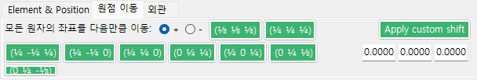

모든 원자를 동일한 분수 오프셋만큼 이동시킵니다. 프리셋 버튼을 누르거나(예를 들어 동일한 공간군에 대해 원점 선택 1 / 2를 전환), 사용자 지정 (Δx, Δy, Δz)를 입력하고 **Apply custom shift**를 누르세요.

#### 외관

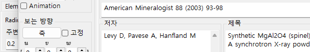

원자별 반지름, 색상, 재질.

- **Radius**: 그려지는 원자 반지름.
- **색**: 표면 색상.
- **Material**: OpenGL 셰이더가 사용하는 텍스처 / 재질 속성.
- **같은 원소에 적용**: 현재 반지름과 색상을 동일한 원소 종의 모든 원자에 적용합니다.

### 결합 및 다면체

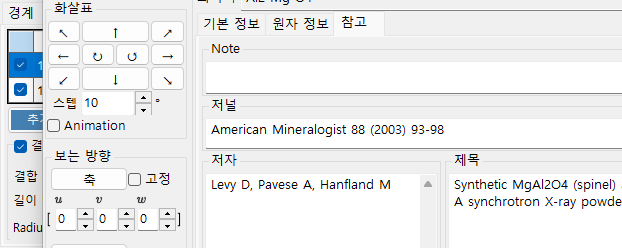

결합 길이 임계값, 다면체 표시, 모서리.

#### 결합 목록

결정에 등록된 모든 결합/다면체 규칙. **추가 / 교체 / 삭제**를 사용합니다. 맨 왼쪽 확인란은 항목을 일시적으로 비활성화합니다. 원자 및 경계와 마찬가지로, 변경을 영구적으로 적용하려면 **메인 창**에서 **추가** / **교체**가 필요합니다.

#### 결합 속성

- **결합 원자 (중심)**: 결합 / 다면체의 중심 원자로 사용되는 원소 종.
- **결합 원자 (꼭짓점)**: 꼭짓점(반대쪽 끝)으로 사용되는 원소 종.
- **Length between … and …**: 거리의 하한 및 상한 임계값. 이 범위를 벗어난 원자 쌍은 그려지지 않습니다.
- **Bond Radius**: 그려지는 결합 두께(원기둥 반지름).
- **Alpha**: 결합 투명도(0 = 투명, 1 = 불투명).

#### 다면체 속성

- **다면체 표시**: 선택하면 현재 결합으로 정의된 다면체가 그려집니다(중심/꼭짓점 집합이 기하학적으로 유효한 경우에만).
- **내부 결합 표시**: 다면체 내부의 결합을 표시/숨김.
- **중심 원자 표시**: 중심 원자를 표시/숨김.
- **꼭짓점 원자 표시**: 꼭짓점 원자를 표시/숨김.
- **Color** / **Alpha**: 면 색상과 투명도.
- **모서리 표시**: 꼭짓점들을 연결하는 모서리를 그립니다.
- **Edge Color** / **너비**: 모서리의 색상과 선 너비.

### 단위 격자

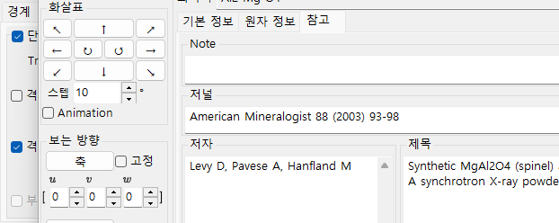

평행 이동, 격자 평면, 모서리.

#### 평행 이동

모든 공간군에는 기본 원점이 있습니다. 그려지는 단위 격자의 중심을 그 원점에서 이동시키려면 *a*, *b*, *c*를 따라 평행 이동을 설정하세요.

#### 격자 평면 표시

단위 격자를 경계 짓는 여섯 면을 그릴지 여부. 활성화하면 면 색상과 투명도를 설정할 수 있습니다.

#### 모서리 표시

단위 격자의 모서리를 그릴지 여부. 모서리 색상은 구성할 수 있습니다.

### 격자면

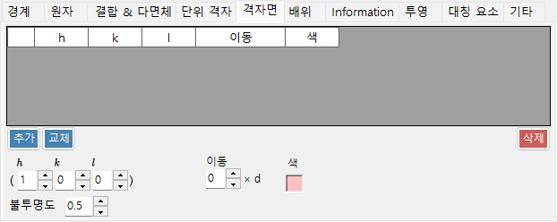

결정학적 등가물을 포함한 밀러 지수 지정.

#### H k l 지수

격자면을 밀러 지수로 지정합니다. 확인란은 선택적으로 (*hkl*)에서 생성된 결정학적으로 등가인 평면들을 포함합니다.

#### 평행 이동

그려지는 격자면을 그 *d*-간격의 정수배만큼 평행 이동합니다 — 동일한 족의 연속된 평면들을 시각화하는 데 유용합니다.

### 배위

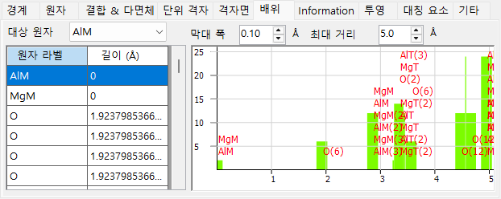

대상 원자 주위의 배위 표와 그래프.

#### 표(왼쪽)

선택한 대상 원자를 어떤 원자들이 어느 거리에서 둘러싸고 있는지 나열합니다. 대상 원자는 표 위의 드롭다운에서 선택합니다.

#### 그래프(오른쪽)

표와 동일한 데이터에서 유도된, 거리에 대한 이웃 개수의 히스토그램. 막대가 배위 껍질을 깔끔하게 분리할 때까지 **Bar Width**를 조정하세요 — 이는 배위수의 시각적 추정치를 제공합니다.

### 정보

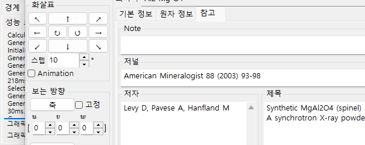

렌더링 로그(프레임 시간, GPU 정보)와 선택한 원자에 대한 기본 정보. 작업 중 — 필드는 시간이 지나면서 늘어날 수 있습니다.

### 투영

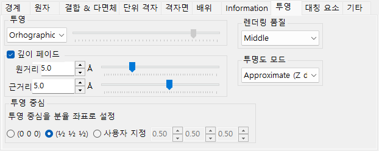

투영 모드(정사영/원근), 깊이 페이딩, 렌더링 품질, 투명도 모드.

#### 투영

- **Orthographic**: 완전한 평행 투영(시점이 무한대에 있음).
- **Perspective**: 슬라이더로 설정한 시점 거리에서의 원근 투영.

#### 깊이 페이드아웃

깊이 방향으로 멀리 있는 객체를 페이드아웃합니다. **원거리**보다 먼 객체는 완전히 투명하고, **근거리**보다 가까운 객체는 완전히 불투명하며, 중간 객체는 선형으로 보간됩니다.

#### 투영 중심

투영의 중심을 지정한 좌표로 설정합니다. 임의의 좌표를 입력하려면 **사용자 지정**을 켜세요. 각 좌표는 −0.5에서 +0.5까지(격자 주기 1개)의 범위로 접혀 들어갑니다. **Translation** 동영상([파일 메뉴](#파일-메뉴) 참조)은 이 값들을 자동으로 구동합니다.

#### 렌더링 품질

그리기 품질(메시 분할, 안티앨리어싱). 품질이 높을수록 느립니다 — GPU에 맞는 설정을 선택하세요.

#### 투명도 모드

반투명 원자와 다면체에 사용되는 알고리즘.

- **Approximate**: 빠르지만 많은 반투명 객체가 겹칠 때 부정확할 수 있습니다.
- **Perfect**: 순서 독립적 투명도 — 정확하지만 매우 느리며, 사실상 별도의 GPU가 필요합니다.

### 대칭 요소

**대칭 요소** 탭은 공간군의 대칭 연산자를 3D 모델 위에 직접 그립니다(도구 모음의 **대칭 요소** 버튼으로 전환). 각 요소 부류는 독립적으로 표시/숨김할 수 있습니다:

- **회전축**과 **나사축**
- **거울면**과 **미끄럼면**
- **반전 중심**과 **회전반전축**

각 부류에 대해 기호 크기, 선 너비, 색상을 조정할 수 있습니다.

### 기타

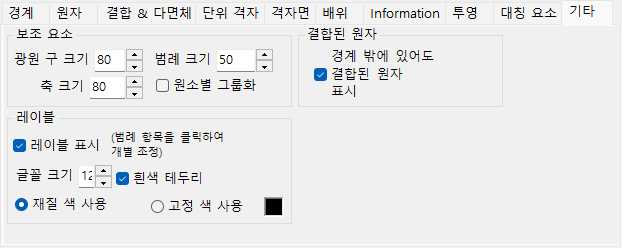

- **보조 요소**: 표시 크기(광원 구, 축, 범례)를 설정합니다. **원소별 그룹화**는 범례 표시를 전환합니다.
- **결합된 원자**: **경계 밖에 있어도 결합된 원자 표시**는 그리기 범위 안의 원자에 결합된 원자가 범위 밖에 있더라도 계속 그립니다.
- **레이블**: 원자 레이블의 글꼴 크기, 색상, 기타 속성을 설정합니다.

---

## 도구 모음

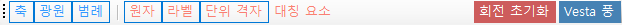

| 버튼 | 설명 |
|--------|-------------|
| 축 | 축 방향 표시(크기 = 격자 상수) |
| 광원 | 광원 방향 설정 |
| 범례 | 원자 범례 |
| 원자 | 원자 객체 전환 |
| 라벨 | 원자 레이블 전환 |
| 단위 격자 | 단위 격자 모서리 전환 |
| 대칭 요소 | 대칭 요소 오버레이 전환(위 참조) |
| 회전 초기화 | 초기 방향으로 복귀 |
| Vesta 풍 | Vesta 스타일 외관 |

---

## 함께 보기

- [메인 창](0-main-window.md)
- [결정 데이터베이스](1-crystal-database.md)
- [대칭 정보](2-symmetry-information.md)
- [회절 시뮬레이터](7-diffraction-simulator/index.md)
- [키보드 및 마우스 단축키](21-shortcuts.md)
