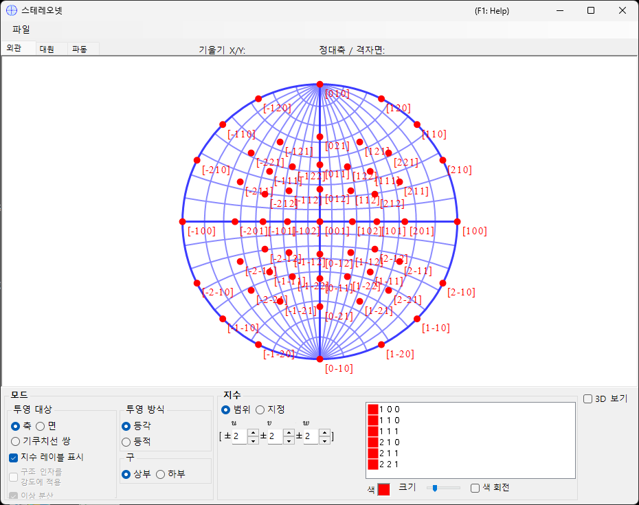
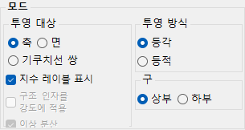
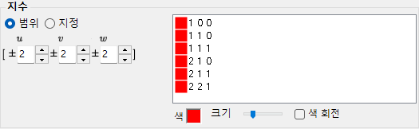
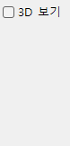
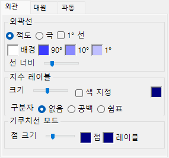
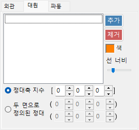
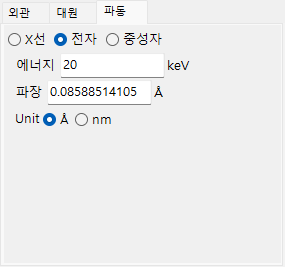

# 스테레오넷

**스테레오넷**은 스테레오 투영을 사용하여 결정면과 축 방향을 표시합니다.

---

## 키보드 & 마우스 단축키

스테레오넷 자체는 2-D 투영입니다. 선택적으로 3-D 구를 **3D 보기**로 표시할 수 있습니다.

| 단축키 | 동작 |
|----------|--------|
| <kbd>F1</kbd> | 온라인 매뉴얼의 이 페이지를 엽니다 |
| 중심 부근에서 왼쪽 드래그 | 결정을 기울입니다 |
| 바깥 영역에서 왼쪽 드래그 | 결정을 시선 축을 중심으로 회전합니다 |
| 왼쪽 더블 클릭 | **면**과 **축** 투영을 전환합니다 |
| 마우스 오른쪽 클릭 | 축소 |
| 박스를 오른쪽 드래그 | 선택한 영역으로 확대 |
| 가운데 드래그 | 이동 |
| 마우스 이동 (버튼 없음) | 커서 아래의 (hkl)/[uvw]를 읽습니다 — 측정한 반점을 지수화하는 데 유용합니다 |

네트 위에서 드래그하면 **결정**이 회전합니다. 회전 상태는 모든 창에서 공유됩니다.

3-D 렌더링은 ReciPro의 표준 [OpenGL 뷰 내비게이션](21-shortcuts.md)을 사용하며 (왼쪽 드래그로 회전, 오른쪽 드래그 / 휠로 확대/축소, <kbd>CTRL</kbd> + 오른쪽 더블 클릭으로 투영 전환), 결정 자체가 아니라 3-D 뷰만 회전시킵니다.

[메인 창](0-main-window.md#keyboard-mouse-shortcuts)의 애플리케이션 전역 <kbd>CTRL</kbd>+<kbd>SHIFT</kbd> 단축키도 이 창에 포커스가 있을 때 작동합니다.

→ 모든 창을 한눈에 보려면 **[21. 키보드 & 마우스 단축키](21-shortcuts.md)**를 참조하세요.

---

## 주 영역

선택한 결정의 결정면, 방향 지수, 기쿠치선의 스테레오넷 투영이 표시됩니다.

---

## 파일 메뉴

래스터 또는 벡터 형식으로 저장하거나 복사합니다. 벡터 형식을 사용하면 PowerPoint 또는 기타 벡터 편집기에서 글꼴/선 두께를 편집할 수 있습니다.

---

## Mode

### 투영 대상

네트에 무엇을 투영할지 선택합니다.

- **축** — 방향 지수 \([uvw]\)를 투영합니다.
- **면** — 결정면 법선 \((hkl)\)을 투영합니다.
- **기쿠치선 쌍** — 기쿠치선 쌍을 투영합니다.

### 투영 방법

| 방법 | 설명 |
|--------|-------------|
| **Wulff** (등각 / 스테레오) | 투영된 특징 사이의 각도 관계는 보존하지만 입체각은 보존하지 않습니다. 축 간 또는 면 간 각도를 읽을 때 고전 결정학자들이 사용합니다. |
| **Schmidt** (등면적 / 람베르트) | 각 영역의 입체각(면적)을 보존하지만 각도를 왜곡합니다. 상대 밀도가 중요한 통계적 극점도에 선호됩니다. |

### 반구

투영 소스로 **상부** 또는 **하부** 반구를 선택합니다 — 구의 보이는 면이 관찰자에게 가장 가까운 쪽인지 가장 먼 쪽인지를 전환합니다.

### 표시 옵션

- 지수 레이블을 표시합니다.
- **면** 또는 **기쿠치선 쌍**이 선택된 경우, 각 점 또는 선을 구조 인자 \(|F_{hkl}|\)로 가중합니다 (파동원과 파장은 [Wave 탭](#wave)에서 설정합니다).

> 삼방정/육방정 결정의 경우, 메인 창의 **Option ▸ Use Miller-Bravais (hkil) index**에서 밀러-브라베(4-지수) 표기를 활성화할 수 있습니다.

---

## Indices

어떤 결정면 / 축을 그릴지 설정합니다.

### 범위 모드

\([uvw]\) 또는 \((hkl)\) 지수의 범위를 지정합니다. ReciPro는 한계 내의 모든 지수를 열거하고 각각을 투영합니다.

### 지정 모드

특정 축 또는 면을 개별적으로 지정합니다. 지수를 입력하고 **추가**를 눌러 등록하거나 **제거**를 눌러 삭제합니다. **등가 지수 포함**이 선택되면 결정학적으로 동등한 모든 지수도 함께 그려집니다.

### Colour / Size

표시되는 점의 **색**과 **크기**를 설정합니다. **색 회전**을 선택하면 동등한 축/면의 각 집합을 서로 다르게 색상으로 구분합니다 — 다중 지수 도면에서 패밀리를 구별하는 데 유용합니다.

---

## 3D Options

3D 네트(구) 오버레이를 제어합니다 — 구의 불투명도, 축 표시 등.

---

## 탭 메뉴

### Appearance

#### Outline

스테레오넷 윤곽을 그리는 방식 — 경계 원과 선택적인 대원 위도/경도 격자. **적도** 또는 **극**을 선택하고, **1° 선**과 **배경** 채우기를 전환하며, **90° / 10° / 1°** 격자 색상을 설정하고, 트랙 바로 **선 너비**를 조정합니다.

#### Index labels

- **크기** — 지수 레이블의 크기.
- **색 지정** — 점별 색상 대신 모든 지수 레이블에 단일 고정 색상을 사용합니다. 점이 색상으로 구분되어 있지만 가독성을 위해 모든 레이블을 하나의 색상으로 표시하고자 할 때 유용합니다.
- **구분자** — 각 레이블에서 지수 사이에 놓이는 문자: **없음** (예: 100), **공백** (1 0 0), 또는 **쉼표** (1,0,0).

#### Kikuchi line mode

- **점 크기** — 표시되는 점의 크기.
- **점** / **레이블** — 점과 그 레이블의 색상.

### Great and Small Circle

대원과 소원을 그립니다. **zone-axis index** \([uvw]\) (해당 축의 정대가 형성하는 대원)로 지정하거나, 정대축을 공유하는 **two crystal-plane indices**로 지정합니다. 원의 선 두께도 트랙 바로 구성할 수 있습니다.

### Wave {#wave}

투영 대상으로 **면** 또는 **기쿠치선 쌍**이 선택된 경우에만 사용할 수 있습니다. [Mode](#mode)의 **구조 인자 가중** 옵션에 사용되는 결정 구조 인자를 계산하는 데 필요한 파동원(X-ray / electron / neutron)과 파장 또는 에너지를 설정합니다.

---

## 참고

- [메인 창](0-main-window.md)
- [회전 기하학](4-rotation-geometry.md)
- [구조 뷰어](5-structure-viewer.md)
- [회절 시뮬레이터](7-diffraction-simulator/index.md)
- [기본 좌표계 & 결정 방위](appendix/a1-coordinate-system/1-orientation.md)
