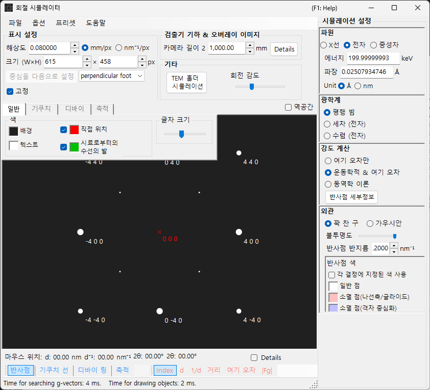
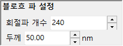

# SAED (Selected Area Electron Diffraction) 시뮬레이션

**SAED (Selected Area Electron Diffraction)** 시뮬레이션은 평행 전자빔에 의해 생성되는 단결정 전자 회절 도형을 계산합니다. 이것은 [회절 시뮬레이터](index.md)의 기본 모드입니다.

> 이 페이지는 **Wave Length = Electron** 및 **Incident beam mode = Parallel**을 선택했을 때 오른쪽 **Spot property** 패널에 나타나는 모든 설정을 나열합니다. 그리기 및 저장과 같은 창 전체 작업에 대해서는 [개요 페이지](index.md)를 참조하십시오.

GUI 조건: Wave Length = Electron, Incident beam mode = Parallel, Intensity calculation = Only excitation error / Kinematical / Dynamical.

---

## 개요

평행 전자빔이 얇은 시료를 통과할 때 생성되는 회절 도형을 시뮬레이션합니다. 스폿 위치는 에발트 구와 역격자점 사이의 기하학적 관계에 의해 고정되며, 각 스폿의 밝기는 선택한 강도 계산 모드에 따라 계산됩니다.

---

## Wave Length

방사선원을 **Electron**으로 설정합니다. 에너지(keV) 또는 파장(nm)을 입력하면 상대론적으로 보정된 파장이 계산됩니다. X선 및 중성자 선원에 대해서는 [X선 회절 시뮬레이션](4-x-ray-neutron-diffraction.md)을 참조하십시오.

---

## Incident beam mode

입사빔 기하학을 **Parallel**로 설정합니다. 이것은 SAED 및 X선 회절에 사용되는 표준 평면파 기하학입니다.

> **Note**: 전자의 경우 **Parallel / Precession (electron = PED) / Convergence (CBED)**를 선택할 수 있습니다. **Precession**을 선택하면 [PED 시뮬레이션](2-ped-simulation.md)이 되고 **Convergence**를 선택하면 [CBED 시뮬레이션](3-cbed-simulation.md)이 되며, 두 경우 모두 강도 계산이 자동으로 Dynamical로 전환됩니다.

---

## Intensity calculation

스폿 강도를 어떻게 계산할지 선택합니다.

### Only excitation error

강도는 에발트 구와 역격자점 사이의 기하학적 거리(여기 오차 $s_g$)만으로 결정됩니다. $\lvert s_g \rvert$가 작을수록 강도가 높아지며, **Radius**로 설정한 값에서 최댓값에 도달하고 $\lvert s_g \rvert$가 Radius를 초과하면 0으로 떨어집니다. 결정 구조 인자를 무시하므로 가장 빠른 모드이며 회절 스폿 위치 확인에 적합합니다.

### Kinematical

여기 오차에 더해 운동학적 구조 인자 $\lvert F_{hkl} \rvert^2$가 강도에 반영됩니다. 소광 규칙이 올바르게 반영되어 이 모드는 얇은 시료나 약한 회절에 적합합니다.

### Dynamical (Bloch-wave method, electron only)

블로흐파 방법(Bethe 방법)에 의한 엄밀한 동역학적 계산입니다. 다중 산란과 두께에 따른 강도 변화를 재현하며, 두꺼운 시료나 강한 회절에 필요합니다. Electron을 선택한 경우에만 사용할 수 있습니다. 이론에 대해서는 [부록 A3. 블로흐파 방법](../appendix/a3-bloch-wave/calculation.md)을 참조하십시오.

> **Note**: **Dynamical**을 선택하면 아래에 **Bloch wave settings** 패널이 나타납니다.

---

## Bloch wave settings (동역학 이론)

**Intensity calculation = Dynamical**일 때만 활성화됩니다.

| 매개변수 | 설명 |
|-----------|-------------|
| **Number of diffracted waves** | 고유값 문제에 포함되는 블로흐파의 수. 값이 클수록 강도가 더 정확해지지만 계산 시간이 $O(N^3)$로 증가합니다 |
| **Thickness** | 동역학적 계산에 사용되는 시료 두께(nm) |

---

## Spot appearance

각 회절 스폿이 어떻게 렌더링되는지를 제어합니다.

- **Solid sphere / Gaussian** : 역격자점의 기하학적 모델. **Solid sphere**는 반지름 $R$의 구와 에발트 구 사이의 단면(원)을 그리며, 원의 면적이 회절 강도에 대응합니다. **Gaussian**은 $\sigma = R$인 3차원 가우스 함수의 단면(2차원 가우스 함수)을 그리며, 그 적분이 회절 강도에 대응합니다.
- **Opacity** : 스폿의 투명도(0 = 투명, 1 = 불투명).
- **Radius (R)** : 역격자점의 가상 반지름. 스폿 크기는 **Appearance** 모드와 **Intensity calculation**의 조합에 의해 고정됩니다(예: Solid sphere + Dynamical은 $I_\text{dyn}^{1/2}$에 비례하는 반지름을 제공).
- **Brightness** : **Gaussian** 모드에서만 활성화됩니다. 렌더링된 가우스 함수의 적분 강도.
- **Color scale** : **Gray scale** 또는 **Cold-warm**.
- **Log scale** : 강도를 로그 스케일로 표시합니다. 강도 대비가 큰 도형에 유용합니다.
- **Spot color** : 컬러 스케일을 사용하지 않을 때 쓰이는 스폿 색상.
- **Use crystal color** : 체크하면 각 결정에 할당된 색상으로 스폿이 그려집니다.

---

## Spot labels

스폿 위에 겹쳐 표시되는 레이블은 [도구 모음](index.md#toolbar)에서 선택합니다.

| 레이블 | 내용 |
|-------|---------|
| **Index** | 밀러 지수 $(hkl)$ |
| **d** | 면간 거리 $d$ |
| **1/d** | 면간 거리의 역수 $1/d$ |
| **Distance** | 검출기 상의 스폿 간 거리 |
| **2θ** | 산란각 $2\theta$ (2θ 눈금의 동심원과 같은 정의) |
| **χ** | 방위각 $\chi$. 화면 위쪽(12시 방향)을 0°로 하여 시계 방향이 양수 (방위각 눈금의 방사선과 같은 정의) |
| **Excit. Err.** | 여기 오차 $s_g$ |
| **\|Fg\|** | 구조 인자의 절댓값 $\lvert F_{hkl} \rvert$ |

---

## 공통 작업

검출기 정보, 뒤집기, 역공간 표시, 키쿠치선, 디바이 링, 축척선, 색상 설정, 저장 등은 모든 모드에 공통입니다. [개요 페이지](index.md)를 참조하십시오. 동역학적 계산에서 얻은 반사별 세부 정보는 [회절 스폿 정보](index.md#diffraction-spot-information)에서 살펴볼 수 있습니다.

---

## 관련 항목

- [회절 시뮬레이터 (개요)](index.md)
- [평행빔 SAED 계산](../appendix/a3-bloch-wave/calculation.md#parallel-beam-saed)
- [X선 회절 시뮬레이션](4-x-ray-neutron-diffraction.md)
- [세차 전자 회절 (PED) 시뮬레이션](2-ped-simulation.md)
- [좌표계의 정의](../appendix/a1-coordinate-system/1-orientation.md)
