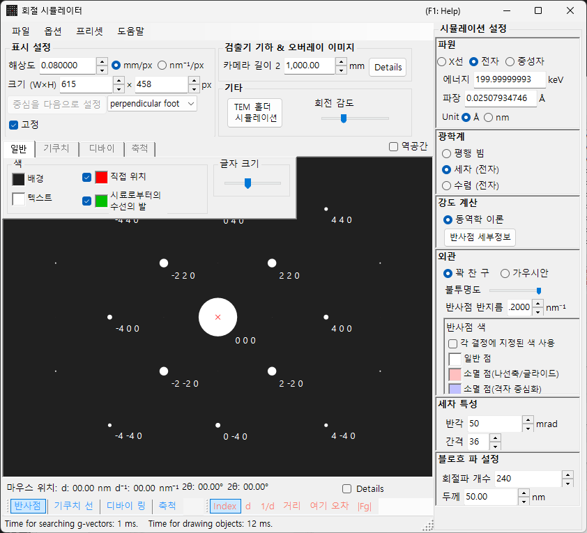
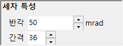

# 세차 전자 회절(PED) 시뮬레이션

**PED (Precession Electron Diffraction)** 시뮬레이션은 입사빔을 광축 둘레로 원뿔 형태로 세차시켜 얻어지는 전자 회절 패턴을 계산합니다.

> 이 페이지에서는 **Wave = Electron beam, Incident beam = Precession (electron), Intensity = Dynamical (automatic)** 을 선택했을 때 오른쪽에 나타나는 모든 설정을 정리합니다. **입사빔으로 Precession (electron) 을 선택하면 강도 계산이 자동으로 Dynamical 로 전환된다**는 점에 유의하세요. 그리기·저장과 같은 창 전체에 적용되는 조작은 [개요 페이지](index.md)를 참조하세요.

GUI 조건: **Wave = Electron beam, Incident beam = Precession (electron), Intensity = Dynamical (automatic)**

---

## 개요

PED 에서는 전자빔을 광축 둘레로 원뿔 형태로 세차시키고, 세차 원뿔 위의 각 빔 방향에 대해 얻어진 회절 패턴을 적분합니다. 기존의 SAED 와 비교하면 다음과 같은 장점이 있습니다.

- 동역학적 효과가 평균화되어 운동학적 강도 비에 가까운 강도 데이터가 얻어집니다
- 고차 라우에 영역(HOLZ) 반사가 더 뚜렷하게 관찰됩니다
- 구조 분석에 적합한 강도 데이터를 얻을 수 있습니다

---

## 파장 설정

PED 는 전자 회절이므로 선원으로 **Electron beam** 을 선택합니다. 전자 에너지(keV) 또는 파장(nm)을 입력하면 상대론적으로 보정된 파장이 계산됩니다.

---

## 입사빔

입사빔의 기하 구조로 **Precession (electron)** 을 선택합니다(전자빔이 선택된 경우에만 사용할 수 있습니다).

> **참고** : **Precession (electron)** 을 선택하면 **강도 계산이 자동으로 Dynamical 로 전환되고**, 블로흐파 방법 설정 패널과 세차 설정 패널이 나타납니다. **Only excitation error** / **Kinematical** 은 더 이상 선택할 수 없습니다.

---

## 세차 설정

세차 원뿔의 형태와 샘플링을 설정합니다.

| 매개변수 | 설명 | 권장값 |
|-----------|-------------|-------------|
| **Semi-angle** | 세차 원뿔의 반각(mrad) | 10–40 mrad |
| **Step** | 세차 원뿔 위에서 샘플링하는 평행빔 방향의 수. 값이 클수록 적분이 매끄러워지지만 계산 시간이 선형으로 늘어납니다 | 36–72 |

---

## 강도 계산과 블로흐파 방법 설정

**Precession (electron)** 을 선택하는 순간 **Intensity = Dynamical (automatic)** 으로 고정됩니다. 각 세차 방향의 평행빔에 대해 회절 강도를 블로흐파 방법(동역학적 계산)으로 계산하고, 모든 방향에 대해 적분하면 PED 패턴이 얻어집니다.

| 매개변수 | 설명 | 권장값 |
|-----------|-------------|-------------|
| **No. of diffracted waves** | 고유값 문제에 포함되는 블로흐파의 수. 값이 클수록 강도가 더 정확해지지만 계산 시간은 $O(N^3)$ 으로 증가합니다 | 50–200 |
| **Thickness** | 동역학적 계산에 사용되는 시료 두께(nm) | — |

계산 비용은 대략 "스텝 수 × 방향별 블로흐파 계산"입니다. 동역학적 계산의 자세한 내용은 [동역학적 계산(블로흐파 방법)](../appendix/a3-bloch-wave/calculation.md)을 참조하세요.

---

## 스폿 표시

각 회절 스폿을 그리는 방식을 제어합니다.

- **Solid sphere / Gaussian** : 역격자점의 기하 모델입니다. **Solid sphere** 는 반지름 $R$ 인 구와 에발트 구의 단면을 그리고, **Gaussian** 은 $\sigma = R$ 인 3차원 가우스 함수와 에발트 구의 단면(2차원 가우스 함수)을 그립니다.
- **Opacity** : 스폿의 투명도(0 = 투명, 1 = 불투명).
- **Radius (R)** : 역격자점의 반지름. 동역학적 강도의 경우 가우스 적분 $=$ Brightness $\times I_\text{dyn}$ 이고, Solid sphere 는 반지름 $R \times I_\text{dyn}^{1/2}$ 을 사용합니다(따라서 면적이 동역학적 강도에 비례합니다).
- **Brightness** : **Gaussian** 모드에서만 사용할 수 있습니다. 그려지는 가우스 함수의 적분 강도입니다.
- **Colour scale** : **Gray scale** 또는 **Cold-warm** 컬러맵.
- **Log scale** : 강도를 로그 스케일로 표시합니다.
- **Spot colour** : 컬러 스케일을 적용하지 않을 때 사용하는 스폿 색상.
- **Use crystal colour** : 각 결정에 할당된 색상으로 스폿을 그립니다.

---

## SAED 와의 비교

| 특징 | SAED | PED |
|---------|------|-----|
| 빔 | 평행, 고정 | 세차(원뿔 스캔) |
| 동역학적 효과 | 큼 | 평균화되어 작음 |
| HOLZ 반사 | 약함 | 강하게 나타남 |
| 강도 신뢰성 | 구조 분석에는 부족할 수 있음 | 구조 분석에 적합 |
| 계산 시간 | 짧음 | 긺 |

---

## 관련 항목

- [회절 시뮬레이터(개요)](index.md)
- [X선 회절 시뮬레이션](4-x-ray-neutron-diffraction.md)
- [SAED 시뮬레이션](1-saed-simulation.md)
- [동역학적 계산(블로흐파 방법)](../appendix/a3-bloch-wave/calculation.md)
