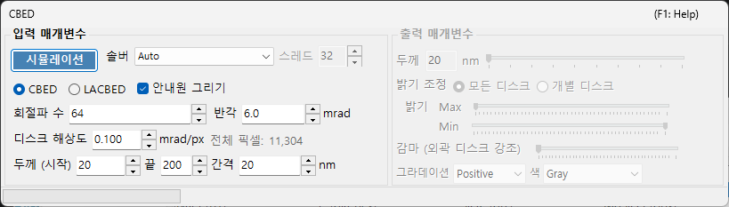
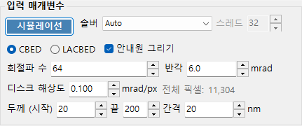
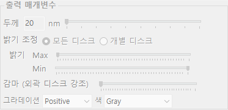

# CBED 시뮬레이션

**CBED (Convergent-Beam Electron Diffraction, 수렴빔 전자 회절) 시뮬레이션**은 블로흐파(Bethe) 방법을 사용하여 수렴빔 회절 패턴을 계산하고 표시합니다. CBED 패턴은 스폿 대신 회절 디스크를 보여주며, 결정 대칭, 두께, 구조에 관한 풍부한 정보를 담고 있습니다.

> 이 페이지는 [회절 시뮬레이터](index.md)에서 **Wavelength = Electron** 및 **Incident beam = Convergence (CBED, electron only)** 를 선택할 때 열리는 전용 창의 모든 설정을 정리합니다. 입사빔을 수렴으로 전환하면 **Intensity calculation** 이 자동으로 **Dynamical** 로 설정되고, 이 CBED 설정 창이 열립니다. 회절 패턴의 그리기와 저장, 그 밖에 회절 시뮬레이터 공통 동작에 대해서는 [개요 페이지](index.md)를 참조하십시오.

GUI 조건: Wave Length = Electron · Incident beam = Convergence (CBED, electron only) · Intensity calculation = Dynamical (자동)

---

## 입력 매개변수

| 매개변수 | 설명 | 기본값 / 일반값 |
|-----------|-------------|-------------------|
| **Mode** | **CBED**: 각 디스크가 하나의 반사에 대응하고 투과 디스크(000)가 중앙에 오는 표준 수렴빔 패턴. **LACBED** (Large-Angle CBED): 서로 다른 반사의 디스크가 겹치는 대각도 수렴빔 패턴. 고차 라우에 영역(HOLZ) 선과 대칭을 관찰하는 데 유용 | CBED |
| **Convergence semi-angle (mrad)** | 수렴빔 원뿔의 반각. 각 회절 디스크의 크기를 결정함(역공간에서의 디스크 지름은 $2\alpha$ 에 대응) | 5–30 mrad |
| **Disk resolution (mrad/px)** | 각 디스크 내부의 각 분해능. 값이 작을수록 분해능이 높아지지만, 계산되는 빔 방향(픽셀) 수가 제곱으로 증가하므로 계산 시간도 제곱으로 증가함. 그 결과로 얻어지는 총 픽셀 수(= 총 빔 방향 수)는 오른쪽에 표시됨 | — |
| **No. of Bloch waves** | 각 입사빔 방향에서 블로흐파 계산에 포함되는 최대 빔 수. 빔 수가 많을수록 정확도가 높아지지만, 고유값 문제의 비용은 $O(N^3)$ 로 증가함 | 100–500 |
| **Thickness range** | 시료 두께(nm)의 시작, 끝, 단계 값. 여러 두께가 함께 계산되며 출력 측의 두께 슬라이더로 전환됨 | — |
| **Solver** | 고유값 문제의 계산 엔진. **Auto**: 최적의 솔버를 자동으로 선택. **Eigenproblem (MKL)**: Intel MKL 기반(가장 빠름). **Eigenproblem (Eigen)**: Eigen C++ 라이브러리. **Managed**: 순수 .NET 관리 코드(가장 느리지만 항상 사용 가능) | Auto |
| **Thread count** | 계산에 사용할 병렬 스레드 수 | — |
| **Draw disk outlines** | 체크하면 각 회절 디스크의 경계를 나타내는 원을 그림 | — |

---

## Run / Stop

- **Start** : 현재 입력 매개변수로 CBED 시뮬레이션을 시작합니다.
- **Stop** : 실행 중인 계산을 취소합니다.

---

## 출력 매개변수

계산이 완료되면 출력 매개변수를 사용할 수 있게 됩니다. 이들은 모두 재계산 없이 표시만 변경합니다.

| 매개변수 | 설명 |
|-----------|-------------|
| **Sample thickness** | 입력 매개변수의 두께 범위 내에서 표시할 시료 두께를 슬라이더로 선택 |
| **Brightness adjustment** | **Common to all disks**: 모든 디스크에 공통 밝기 스케일을 사용하여 전체 CBED 패턴을 표시. **Per disk**: 선택한 단일 디스크를 전체 분해능으로, 그 디스크 내부에서 정규화하여 표시 |
| **Brightness (Max / Min)** | 표시되는 강도의 상한과 하한. 약한 특징을 강조하고 싶을 때 조정 |
| **γ (emphasis of outer disks)** | 감마 보정. 중앙 투과 디스크에 비해 어두운 외곽 대각도 디스크를 더 잘 보이게 하는 데 사용 |
| **Scale** | 강도 계조를 **Positive** / **Negative** (흑백 반전) 중에서 선택 |
| **Color** | 표시에 사용하는 컬러 맵. **Gray** 등에서 선택 |

---

## 물리적 배경

CBED에서는 입사빔을 서로 다른 방향을 가진 평면파의 원뿔로 간주합니다. 각 방향(수렴 조리개 내부의 각 점 = 하나의 부분 입사 평면파)에 대해 블로흐파 방법이 결정 내부의 전자 슈뢰딩거 방정식을 풀고, 그 결과가 회절 디스크로 재배열됩니다. HOLZ(고차 라우에 영역) 선은 디스크 내부에 가는 어두운/밝은 선으로 나타나며, 상위 라우에 영역의 반사에서 생겨납니다. 이들은 $c$ 축을 따르는 격자 상수에 민감하며 3차원 구조 분석에 유용합니다.

이론적인 세부 사항은 [CBED 계산](../appendix/a3-bloch-wave/cbed.md)을 참조하십시오.

---

## 관련 항목

- [회절 시뮬레이터 (개요)](index.md)
- [SAED 시뮬레이션](1-saed-simulation.md)
- [PED 시뮬레이션](2-ped-simulation.md)
- [CBED 계산](../appendix/a3-bloch-wave/cbed.md)
