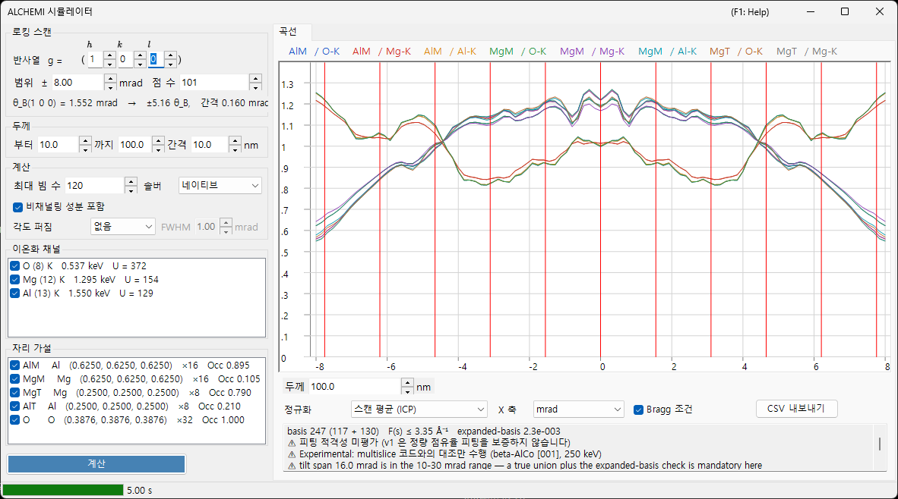

# ALCHEMI 시뮬레이션

**ALCHEMI (Atom Location by CHannelling-Enhanced MIcroanalysis)** 는 계통 반사열을 따라 결정을 기울이면서 특성 X선 수율을 측정하고, 그 방위 의존성으로부터 **도판트가 어느 자리를 차지하는지**를 판정하는 방법입니다. ReciPro 의 ALCHEMI 시뮬레이터는 결정 구조와 자리 가설로부터 **로킹 곡선 (방위에 대한 이온화 수율) 을 순방향으로 계산**합니다.

> **Preview 기능입니다.** v1 은 **1 차원 순방향 계산만** 수행하며, 실험 데이터에 대한 피팅과 2D 맵 (2D-HARECXS) 은 구현되어 있지 않습니다 (해당 탭은 숨겨져 있습니다). **저자들이 아는 한, 공개되어 있는 다른 ALCHEMI 순방향 시뮬레이터는 없습니다.** 대조할 구현이 없으므로 [적용 범위와 알려진 한계](#적용-범위와-알려진-한계)를 읽은 뒤에 결과를 정량적으로 사용하십시오.

열기: [회절 시뮬레이터](index.md) 의 **옵션** 메뉴 → **ALCHEMI 시뮬레이터...**

GUI 조건: Wave Length = Electron (결정·가속 전압·방위는 상위 회절 시뮬레이터에서 받아옵니다)



창은 **왼쪽이 설정** (스캔·두께·계산·이온화 채널·자리 가설), **오른쪽이 결과** (곡선 탭) 입니다.

---

## 무엇을 계산하는가

각 입사 방위에 대해 블로흐파법으로 결정 내부의 파동장을 풀고, 자리 $s$ 와 이온화 채널 $c$ 의 조합마다 두께 $t$ 까지의 이온화 수율을 해석적으로 적분합니다.

$$
Y_\text{dyn} = \mathrm{Re} \sum_{jj'} \alpha_j^{*}\,\bigl(C^{\dagger} \mu_{s,c} C\bigr)_{jj'}\, \alpha_{j'}\, F_{jj'}(t),
\qquad F_{jj'}(t) = \frac{e^{\lambda t} - 1}{\lambda}
$$

이온화 행렬 $\mu$ 는 두 반사의 차 $G = \mathbf{g}_h - \mathbf{g}_g$ 에만 의존합니다.

$$
\mu_{hg} = \sum_a \mathrm{Occ}_a\, e^{-M_a(G)}\, \sigma_c\, F_c(|G|/2)\, e^{-2\pi i\,G \cdot \mathbf{r}_a}
$$

- $\sigma_c$ : 이온화 전체 단면적. **Bote–Salvat** 모델
- $F_c(s)$ : 정규화 이온화 형상 인자. 자체 생성 **DHFS** 표 ([빔 상호작용](../3-beam-interaction.md) 및 [STEM-EDX](../9-hrtem-stem-simulator/2-stem-simulation.md) 와 동일한 데이터 기반)
- $e^{-M_a(G)}$ : 디바이–월러 인자 (비등방 ADP 지원)

이는 ICSC (Oxley & Allen 2003) 의 **국소 형상 인자 근사**에 해당합니다. 두 운동량 MDFF 는 사용하지 않습니다.

### 비채널링 성분

열확산 산란 흡수로 결맞은 블로흐장에서 벗어난 전자는 방향이 무작위화된 전자로서 남은 두께를 지나가며, 그곳에서도 이온화를 일으킵니다.

$$
Y_\text{dech} = \frac{\mu_{00}}{V_c}\,\bigl(t - L_\text{coh}(t)\bigr),
\qquad L_\text{coh}(t) = \int_0^t \sum_g |\psi_g(z)|^2\,dz
$$

**계산** 상자의 **비채널링 성분 포함**을 해제하면 이 항이 빠집니다. 전형적인 두께에서 전체 수율의 수십 퍼센트를 차지하므로, 빼면 자리 대비가 실제보다 강해 보입니다.

### 출력량

일차량은 **입사 전자 1 개당 생성되는 내각 공공의 수**입니다. **X선 광자로의 변환 (형광 수율과 선 분기), 시료 내 X선 자체 흡수, 검출기 효율과 입체각은 적용하지 않았습니다.**

⚠ **공공 수는 계수값이 아닙니다.** 실측 EDX 강도와의 사이에는 ReciPro 가 수행하지 않는 3 단계 — 원자 과정·시료·장치 — 가 더 있습니다.

1. **공공 → 광자** : 껍질의 형광 수율과 선 분기
2. **광자 → 시료를 빠져나온 광자** : X선 자체 흡수. **광자가 생성된 깊이**와 취출각에 의존합니다
3. **광자 → 계수값** : 검출기 효율·입체각과 스펙트럼 처리

특히 2 는 완성된 곡선에 흡수 계수를 하나 곱해서 나중에 되돌릴 수 있는 양이 아닙니다 (먼저 수율을 깊이별로 분해해야 합니다). 따라서 이 곡선을 실측 강도·k 팩터·조성과 비교하려면 위 단계들을 ReciPro 밖에서 수행해야 합니다.

이 가운데 어느 것이 정규화에서 살아남는지에 주의하십시오. 1 과 3, 그리고 상수로 취급할 수 있는 흡수는 **방위에 의존하지 않는 곱셈 인자**이므로, 두 선의 에너지가 크게 달라도 ICP (스캔 평균) 정규화에서 떨어져 나갑니다. **자체 흡수는 일반적으로 그렇지 않습니다.** 채널링은 공공이 생성되는 깊이 분포를 바꾸므로, 흡수되는 비율 자체가 스캔에 따라 변하여 정규화 뒤에도 남습니다. 에너지가 가까운 선을 고르는 것이 도움이 되는 것은 이 남는 부분에 대해서입니다.

---

## 왼쪽 창: 설정

### 로킹 스캔

| 항목 | 설명 | 기본값 |
|------|------|--------|
| **반사열 ( h k l )** | 훑을 계통 반사열을 반사 지수로 지정합니다. 기울기 축은 빔과 이 $\mathbf{g}$ 양쪽에 수직으로 잡히므로, 스캔은 이 열을 Bragg 조건을 통과하며 훑습니다 | (1 0 0) |
| **범위 ±** | 기울기 스캔의 반폭 (mrad). 약 10 mrad 를 넘으면 고정 합집합 기저가 보장되지 않고, 30 mrad 를 넘으면 v1 의 보장 범위 밖입니다 | 8 mrad |
| **점 수** | 스캔 점의 개수 (3–1001) | 101 |

그 아래 줄에 선택한 반사열의 Bragg 각 $\theta_B$, 스캔 폭이 몇 $\theta_B$ 에 해당하는지, 기울기 간격이 표시됩니다. 실행 전에 스캔이 실제로 어디까지 미치는지 확인할 수 있습니다.

⚠ **기본값 ±8 mrad 는 쓰기 편한 출발값이지 문헌상의 최적값이 아닙니다.** Jones (2002) 의 총설은 로킹 스캔 폭을 mrad 의 수치로 제시하지 않습니다. 위 표에 적은 상한도 v1 의 수치 계산상 한계이지 권장값이 아닙니다. 폭은 $\theta_B$ 단위로 판단하고 (표 아래 줄이 그것을 표시합니다), 비교하려는 동역학적 특징이 스캔 안에 들어오도록 고르십시오.

⚠ 「조명은 **Bragg 각 정도까지** 열어도 된다」는 Jones 의 서술 (최적화된 계통 반사열 조건에 대한 것) 은 **입사 원뿔의 수렴 반각**, 즉 아래 **계산** 상자의 **각도 퍼짐**에 관한 것입니다. 로킹 스캔 반폭의 권장값이 **아닙니다**. 서로 다른 양이므로 혼동하지 마십시오.

### 두께

시작·끝·간격 (nm) 을 지정합니다. **모든 두께가 한 번의 계산으로 함께 구해지며**, 결과는 곡선 아래의 슬라이더로 전환합니다.

자리 대비는 얇은 시료와 두꺼운 시료 사이에서 크게 달라지고 **부호까지 뒤집힐 수 있으므로**, 결론을 내리기 전에 여러 두께를 확인하십시오. 두께 선택기를 곡선 바로 아래에 둔 이유가 그것입니다.

### 계산

| 항목 | 설명 | 기본값 |
|------|------|--------|
| **최대 빔 수** | 방위 1 개당 블로흐파 수의 상한 (1–1600). 스캔 전체의 합집합은 이보다 큽니다 | 120 |
| **솔버** | 고유치 문제의 계산 엔진: **네이티브** (Eigen C++) 또는 **관리형** (.NET). 네이티브 솔버를 쓸 수 없는 환경에서는 관리형으로 고정됩니다 | 네이티브 |
| **비채널링 성분 포함** | 위의 $Y_\text{dech}$ 를 더할지 여부 | 켬 |
| **각도 퍼짐** | 곡선을 입사 빔의 각도 퍼짐과 컨볼루션합니다. **없음** 또는 **Gaussian** (반치전폭, mrad). 방위 축 위의 후처리이며 표시 정규화보다 **먼저** 적용됩니다 | 없음 |

**빔 수 상한 1600 은 이온화 형상 인자의 수록 범위 $s \le 16\ \text{Å}^{-1}$ 와 짝을 이룹니다.** 실측으로 1600 빔에서도 기저가 요구하는 $s$ 는 약 10.5 Å⁻¹ 에 그치므로, 이 상한을 지키는 한 수록 범위를 다 쓰는 일은 없습니다. 실제 도달값은 그래프 아래의 [기저 진단](#기저-진단) 줄에 나옵니다.

### 이온화 채널

이온화할 원소와 껍질의 목록입니다. 각 줄은 `원소 (Z) 껍질   흡수단 에너지   U = 과전압` 형태이며, 주의가 필요한 상태는 끝에 괄호로 표시됩니다.

- **여기할 수 없는 채널** (입사 에너지가 흡수단보다 낮음) 이나 **수록 범위 밖의 채널**은 이유와 함께 표시되며 선택할 수 없습니다
- 과전압 $U = E_0/E_\text{단}$ 이 1.2 미만인 채널에는 주의 표시가 붙습니다. 그 영역에서는 단면적의 신뢰도가 낮기 때문입니다

### 자리 가설

수율을 따로 계산할 원자 자리의 목록으로, `라벨 원소 (x, y, z) ×다중도 Occ 점유율` 로 표시됩니다.

⚠ **트레이서 근사에서는 채널과 자리의 조합이 자유롭습니다.** 도판트의 이온화 채널을 호스트 자리의 기하 (위치·ADP·점유율) 와 짝짓는 것이 의도된 사용법이며, 원소가 일치하는 조합으로만 제한하면 오히려 잘못입니다. 선택한 채널과 자리의 **모든 조합**이 계산됩니다.

### 계산 / 중지

**계산**으로 스캔을 시작합니다. 진행 상황은 상태 표시줄에 5 단계 (이온화 데이터 해결 → 합집합 기저 구성 → 이온화 행렬 구성 → 방위 계산 → 확장 기저 검증) 로 표시되며, **중지**로 언제든 중단할 수 있습니다.

---

## 오른쪽 창: 곡선 탭

계산이 끝나면 자리 × 채널 조합마다 곡선이 하나씩 그려집니다. 범례는 `자리 라벨 / 채널` 입니다.

| 항목 | 설명 |
|------|------|
| **두께** | 표시할 두께를 슬라이더로 선택합니다 (재계산은 일어나지 않습니다) |
| **정규화** | **스캔 평균 (ICP)** = 스캔 전체의 평균으로 나눔 (ALCHEMI 에서 통상 쓰는 양) / **최댓값 = 1** / **원시값 (전자당)** |
| **X 축** | **mrad** 와 **θ_B** (훑은 반사열의 Bragg 각 단위) 를 전환합니다 |
| **Bragg 조건** | $\theta = n\,\theta_B$ 위치에 세로선을 긋습니다 |
| **CSV 내보내기** | 모든 방위·두께·자리·채널의 원시 곡선을 CSV 파일로 씁니다 ([아래](#csv-내보내기)) |

⚠ **정규화는 표시상의 변환일 뿐입니다.** 저장되는 양은 항상 입사 전자 1 개당 생성 공공 수이며, **최댓값 = 1 은 표시 전용**이므로 ICP 의 기준으로 쓸 수 없습니다.

### 대비와 상관

곡선 아래 첫 줄에는 계열별 **대비** $(\max-\min)/\text{평균}$ 과, 첫 계열에 대한 **상관계수** $r$ 이 표시됩니다. 어느 자리가 효과를 내는지 한눈에 판단하기 위한 요약입니다. $r$ 이 $+1$ 에 가까운 두 계열은 방위 의존성이 같다는 뜻이며, 그 데이터로는 두 자리를 분리할 수 없습니다.

### 기저 진단

두 번째 줄은 기저의 상태를 알려줍니다.

```text
basis 347 (184 + 163)   F(s) ≤ 6.20 Å⁻¹   expanded-basis 6.7e-3   ⚠ 피팅 적격성 미평가   ⚠ Experimental: 정량 검증은 beta-AlCo [001] 250 keV 뿐
```

- **basis N (중심만 + 합집합으로 추가)** : 스캔의 모든 방위에 걸친 반사의 진짜 합집합 개수
- **F(s) ≤ … Å⁻¹** : 기저가 실제로 요구한 형상 인자 인수의 최댓값
- **expanded-basis** : 스캔의 중심과 양 끝을 1.25 배 기저로 다시 풀었을 때의 최대 상대차. **수렴 오차의 대리량**입니다
- **피팅 적격성** : v1 은 항상 **미평가**로 보고합니다. 이 진단에는 알려진 결함이 셋 있습니다 — 분모가 텐서 전체의 최댓값이고,
  분자가 절대 수율이며, 1.25 배 기저가 실제로 커지지 않을 때 그대로 통과합니다. 그래서 「적격」이라고 보증하면
  위험한 방향으로 틀리게 됩니다
- **Experimental** : 정량적으로 확인된 것은 β-AlCo 뿐이므로, 모든 실행에 검증 범위와 함께 이 표시가 붙습니다

⚠ **v1 은 정량적인 점유율 피팅을 보증하지 않습니다.** 원시 진단값은 계속 표시되고 작을수록 좋지만, 합격 표시가 아니라 참고치로 다루십시오. 또한 이 진단은 **절대 수율**에 대해 정의되어 있으므로, 스캔 평균으로 나누는 ICP 만 볼 때에는 보수적으로 나옵니다.

다음 상황에서는 경고가 추가로 표시됩니다.

- **가속 전압이 80 kV 미만** : 이 전압에서는 형상 인자 표가 $s = 16\ \text{Å}^{-1}$ 까지를 보장하지 못합니다. 기저가 요구하는 $s$ 가 보증 범위 안에 있으면 계산 자체는 옳으므로 이는 **거부가 아니라 고지**입니다
- **형상 인자 절단** : 보증 범위 밖의 $F(s)$ 를 0 으로 절단한 경우, **그 오차의 상계 $|F| \le \varepsilon$ 가 수치로 표시됩니다.** 조용히 외삽하지 않습니다

---

## CSV 내보내기 {#csv-내보내기}

**CSV 내보내기**는 `# key: value` 형식의 머리글 (아래는 발췌) 에 이어 long-format 표를 씁니다. 머리글은 **그 파일만으로 재현 조건을 알 수 있도록** 작성되어 있습니다.

```text
# generator: ReciPro ALCHEMI, ver 4.947 (2026-08-09)
# model: LocalFormFactor (local form-factor approximation; NOT the two-momentum MDFF)
# quantity: IonizationVacanciesGenerated (PerIncidentElectron)
# crystal: MgAl2O4 (spinel) / F d -3 m
# cell_nm: a 0.808000 b 0.808000 c 0.808000 alpha 90.0000 beta 90.0000 gamma 90.0000 deg
# accelerating_voltage_kV: 200.000
# scan_row_hkl: 1 0 0
# theta_B_mrad: 1.552030
# thicknesses_nm: 10.0000 20.0000 ... 100.0000
# angular_spread: Gaussian1D FWHM 1.0000 mrad (kernel renormalized at the scan ends)
# processing_order: forward yield -> angular spread convolution -> (display normalization, NOT applied to these columns)
# basis: 202 beams (120 centre-only + 82 added by the union), hash 1F3A...
# expanded_basis_max_rel_diff: 9.500e-004
# fit_eligibility: NotEvaluated (v1 does not certify quantitative occupancy fits; raw diagnostic AcceptedForFit=True at tolerance 3e-3)
# occupancy_coupling: Tracer (dilute limit; site responses may be combined linearly). VCA is not implemented
# verification: Experimental. Quantitatively verified only for beta-AlCo [001] at 250 keV (Al-K / Co-K / Co-L). ...
# not_modelled: X-ray self-absorption, detector efficiency and solid angle, fluorescence yield and line branching, background, specimen thickness distribution, specimen bending
# channel[Al-K]: edge 1.5596 keV, sigma 1.95e-007 nm2, sigma_source ... , F(s)_source ... (tabulated to s = 16.0 A^-1), not truncated
# site[AlM]: atom indices 0, occupancy from the crystal
# conventions: tilt is the signed rotation about the axis perpendicular to both the beam and g(scan_row_hkl), positive toward +g; angles in mrad; lengths in nm; ...
tilt_mrad,thickness_nm,site,channel,dynamic,dechannelled,total,dynamic_conv,dechannelled_conv,total_conv
```

`dynamic` / `dechannelled` / `total` 은 따로 저장되므로 **비채널링 성분의 기여를 나중에 평가할 수 있습니다**. `*_conv` 열은 각도 퍼짐을 켰을 때만 나타나며 컨볼루션된 곡선이 들어갑니다. 즉 재현용 원시값과 실험 비교용 값이 한 파일에 함께 담깁니다. 값은 표시상의 정규화를 거치지 않은 원시값 (입사 전자당) 이고, 소수점은 항상 마침표입니다.

---

## 적용 범위와 알려진 한계

「계산할 수 있다」와 「정량적으로 검증되었다」는 다릅니다. 이 절은 후자의 범위를 밝힙니다.

### 일반적인 ±% 정확도는 제시하지 않습니다 — 구분해야 할 3 가지

ReciPro 는 「자리 점유율을 ±N % 로 정할 수 있다」와 같은 일반적인 정확도를 **의도적으로 제시하지 않습니다**. Jones (2002) 의 총설도 보편적인 점유율 오차를 보고하지 않으며, 그런 형태로 공표된 수치는 어떤 계를 어떤 절차로 측정한 결과일 뿐, 수법의 성질도 아니고 하물며 이 시뮬레이터의 성능도 아닙니다.

결과를 판단할 때는 다음 3 가지를 구분하십시오.

**정밀도 (precision)** : 수치가 얼마나 재현되는가 — 계수 통계, 회귀가 돌려주는 오차, 반복 간의 산포. 피팅 잔차가 작다거나 상관계수가 1 에 가깝다는 것만으로는 모델이 옳다는 증거가 되지 않습니다. Jones 가 논한 예에서는 피팅에 자유 상수를 더하자 precision 은 좋아졌지만 accuracy 가 좋아졌다는 것은 밝혀지지 않았습니다.

**모델의 치우침 (model bias)** : 순방향 계산 자체가 갖는 계통 오차 — 비채널링 항에 자리 상관이 없는 것, 국소 형상 인자 근사, 두께 분포와 휨이 들어 있지 않은 것 (모두 아래). 이런 「빠진 물리」는 계수를 늘리거나 스캔 점수를 늘려도 줄지 않습니다 (기저를 키우는 것은 별개로, 그쪽이 줄이는 것은 **수치적인** 절단 오차이며 [기저 진단](#기저-진단)이 따로 표시합니다).

**독립적인 대조 (independent checks)** : 같은 전제를 공유하지 않는 것과의 일치이며, 수준이 2 가지입니다. 정식화가 독립적인 **구현**과의 비교 (코드 간 비교) 는 정식화와 구현을 검증하며, 여기서 수행한 것이 이쪽입니다 (하나의 계에 대해). **실험**과의 비교 — 물리 자체를 현실에 비추는 것 — 는 아직 하지 않았습니다.

### 정량적으로 검증된 범위

**β-AlCo [001] 250 keV 의 Al-K / Co-K / Co-L** 뿐입니다. 동역학 정식화가 완전히 독립적인 멀티슬라이스 + 동결 포논 계산 (py_multislice) 과 비교한 결과:

- **Al 자리 (가벼운 기둥)** : ICP 변조 대비 RMS 잔차가 모든 두께에서 ≤3.2 %, $t \ge 10$ nm 에서는 ≤0.6 %
- **Co 자리 (무거운 기둥)** : $t \le 4$ nm 에서는 ≤3 %, 그러나 **$t \gtrsim 10$ nm 에서 6–17 %**

그 밖의 계·원소·껍질·전압은 「계산 가능」일 뿐 「정량 검증됨」이 아닙니다.

**실험 데이터와의 대조는 수행하지 않았습니다.** 위 비교는 코드 간 비교이며 두께 범위는 $t$ = 2–30 nm 입니다. 다음 절에 나오는 10–19 포인트라는 값은 차이의 원인을 분리하기 위한 **진단값**이며, 시뮬레이터가 적용하는 보정이 아니고 이를 적용한 뒤의 일치를 검증 결과로 주장하지도 않습니다.

### 알려진 계통 오차 — 비채널링 항에 자리 상관이 없음

v1 의 비채널링 항은 방위에 의존하지 않는 상수이므로, ICP 에 대해서는 「1 로 끌어당기는」 효과밖에 없습니다. 실제로는 열산란된 전자의 일부가 기둥으로 재채널링되며, 강한 산란체인 **무거운 기둥으로 우선적으로 되돌아간다**고 볼 수 있습니다. 위 비교에서는 이 기여의 실효량을 **무거운 기둥에서 10–19 포인트 과소평가**하고 있었습니다.

→ **가볍거나 약한 산란 자리, 또는 $t \lesssim 5$ nm 에서는 독립 구현과 1–3 % 로 일치합니다. 무거운 기둥이면서 $t \gtrsim 10$ nm 인 경우 ICP 변조의 6–17 % 에 해당하는 계통 오차가 있습니다.** 자리 상관을 갖는 재주입 모델은 v1.1 이후의 과제입니다.

### 순방향 모델에 들어 있지 않은 것

**각도 퍼짐 컨볼루션만으로 실험을 재현할 수 있는 것은 아닙니다.** 다음은 전혀 포함되어 있지 않습니다.

- 시료의 **두께 분포**와 **휨**
- X선 **자체 흡수**
- **검출기 효율과 입체각**
- **배경** (제동복사, 겹치는 선)

**입사 빔의 각도 퍼짐** (수렴 반각·드리프트) 은 *모델링되어 있습니다* — 계산 상자의 **각도 퍼짐** 참조. 다만 그것과 컨볼루션한다고 해서 위의 항목들을 대신할 수는 없습니다.

### 저에너지 선 — 국소 근사가 가장 약해지는 곳 {#local-approximation}

v1 의 이온화 행렬은 벡터 $G = \mathbf{g}_h - \mathbf{g}_g$ 하나만의 함수입니다 (국소 형상 인자 근사). ICSC 는 이 근사가 타당한 것은 특성 X선 에너지가 **대략 3〜4 keV 보다 위**에 있는, 강하게 속박된 내각의 경우라고 서술합니다 (Oxley & Allen 2003, p. 941).

⚠ **이 수치는 경험적이고 모델 의존적인 기준이지 엄밀한 cutoff 가 아니며, ReciPro 는 이를 이유로 계산을 거부하지 않습니다.** 이보다 낮은 선도 평소대로 계산하며, 실제로 관심 대상이 되는 것은 오히려 그쪽입니다. Al-K 는 1.49 keV, Co-L 은 0.79 keV 로, 둘 다 위의 코드 간 비교에 사용한 β-AlCo 조에 들어 있습니다.

이 수치가 가리키는 것은 **하나**의 벡터 $G$ 로의 축약이 충분하지 않게 되기 시작하는 지점입니다. 이온화는 원자핵 위에서 일어나지 않습니다. 그 확률은 핵에서 유한한 거리에서 최대가 되고, 그 거리는 필요한 에너지가 낮아질수록 커집니다. 여기서 이 근사가 무엇을 남기고 무엇을 버리는지에 주의하십시오. $F_c(|G|/2)$ 는 운동량에 의존하므로 **유한한 상호작용 범위는 남아 있습니다**. 버려지는 것은 두 운동량 전달에 대한 각각의 의존성, 즉 완전한 MDFF 가 갖는 비국소 구조입니다. 비국소성이 커지면 이 버린 구조가 효과를 내기 시작합니다.

선의 에너지만으로 결과를 보증할 수는 없습니다. 껍질의 공간적 넓이, 방위, 두께, 기저가 실제로 요구하는 역격자 벡터가 모두 관여합니다. 3〜4 keV 는 합격 표시가 아니라 「더 주의해서 볼 것」이라는 표지로 다루십시오. 고를 수 있다면 **에너지가 가까운** 선끼리 비교하면 둘의 비국소성 치우침이 서로 비슷해지기 쉽습니다. Jones (2002) 는 이를 실무상의 첫 수단으로, 두 번째로 정대축 (zone axis) 보다 계통 반사열을 권합니다. v1 이 계산하는 것은 후자입니다 (정대축은 채널링이 강한 대신 비국소성 보정이 커집니다).

⚠ 낮은 방출 에너지는 **X선 자체 흡수**의 영향도 가장 크게 받습니다. 다만 그 크기는 시료의 조성과 흡수단·경로 길이·취출각에 의존하며, 방출 에너지만으로 정해지지 않습니다. 이는 국소 근사와는 **별개**의 오차원으로 아예 모델에 들어 있지 않으며 (위의 [출력량](#출력량)), 국소 근사의 타당성과 무관하게 실험과의 비교를 흐트러뜨립니다.

### 모델 전제

- **트레이서 근사 한정** : 자리 응답의 선형 중첩이 성립하는 것은 도판트가 탄성 파동장을 바꾸지 않는 희박 극한뿐입니다. 유한 농도의 VCA 는 v1 의 범위 밖입니다
- **국소 형상 인자 근사** : $\mu$ 는 $G = \mathbf{g}_h - \mathbf{g}_g$ 만의 함수이며, 두 운동량 MDFF (OAR 1999 의 Model A) 가 아닙니다. 가벼운 원소의 K 껍질이나 저에너지 흡수단에서 가장 약해집니다 ([위](#local-approximation))
- **X선 광자가 아니라 공공** : 형광 수율과 선 분기를 곱하지 않았습니다
- **가속 전압의 하한은 80 kV** : $s = 16\ \text{Å}^{-1}$ 을 보장할 수 있는 최저 전압이며, 거부 임계값이 아닙니다

---

## 관련 항목

- [회절 시뮬레이터 (개요)](index.md)
- [CBED 시뮬레이션](3-cbed-simulation.md)
- [동역학 계산 (공통 코어)](../appendix/a3-bloch-wave/calculation.md)
- [STEM 시뮬레이션](../9-hrtem-stem-simulator/2-stem-simulation.md) — 같은 이온화 데이터 기반을 쓰는 STEM-EDX
- [빔 상호작용](../3-beam-interaction.md) — 단면적·흡수단 데이터
