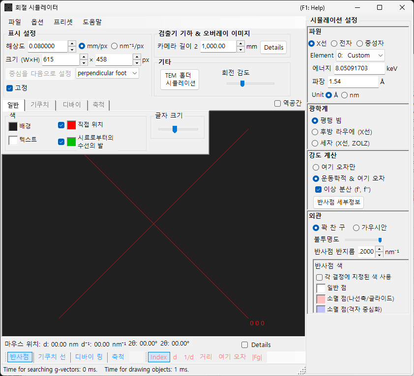
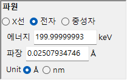
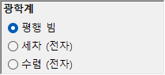
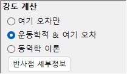
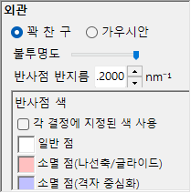

# X선 / 중성자 회절 시뮬레이션

**X선 / 중성자 회절 시뮬레이션**은 단결정 X선 및 중성자 회절 패턴을 계산합니다. [회절 시뮬레이터](index.md)의 주요 모드 중 하나입니다.

> 이 페이지는 **Wave Length = X-ray**(또는 neutron)를 선택했을 때 오른쪽에 나타나는 모든 설정을 나열합니다. 그리기 및 저장과 같은 창 전체 작업은 [개요 페이지](index.md)를 참조하십시오.

GUI 조건: Wave Length = X-ray / Neutron · Incident beam = Parallel / Precession (X-ray) / Back-Laue · Intensity calculation = Only excitation error / Kinematical

---

## 개요

X선은 전자보다 파장이 길기 때문에(Cu Kα: 0.15406 nm = 1.5406 Å) 에발트 구의 곡률이 더 큽니다. 그 결과, 전자의 경우보다 회절 조건을 동시에 만족하는 역격자점이 더 적습니다. 원자의 산란력이 작고 다중 산란이 약하기 때문에, 운동학적 회절 이론으로도 강도에 대해 충분한 정확도를 얻을 수 있습니다(동역학적 계산은 전자에 대해서만 지원됩니다).

---

## Wave Length

방사선원으로 **X-ray**를 선택합니다. X선은 두 가지 방식으로 지정할 수 있습니다: 특성 X선과 싱크로트론 방사광.

### 특성 X선

**원소**와 **전이**를 선택하면 특성 X선 파장이 결정됩니다. 전이는 Siegbahn 표기법(Kα₁ / Kα₂ / Kβ 등)으로 지정합니다. 대표적인 원소의 Kα₁ 파장:

| 원소 | 선 | 파장 (Å) | 에너지 (keV) |
|---------|------|-----------------|--------------|
| Cu | Kα₁ | 1.5406 | 8.048 |
| Mo | Kα₁ | 0.7107 | 17.479 |
| Co | Kα₁ | 1.7890 | 6.930 |
| Cr | Kα₁ | 2.2910 | 5.415 |

### 싱크로트론 방사광

**Element**를 **0: Custom**으로 설정하고 에너지(keV) 또는 파장(Å)을 직접 입력합니다. 임의의 파장을 사용할 수 있습니다.

---

## 입사빔 모드

입사빔의 기하학을 선택합니다. X선에는 세 가지 모드를 사용할 수 있습니다.

### Parallel

표준 평면파입니다. SAED 및 단결정 X선 회절에 사용되는 평행 입사빔입니다.

### Precession (X-ray) — 세차 카메라

X선 세차 카메라를 시뮬레이션합니다. 역격자의 단일 층을 포착하는 세차 사진입니다.

### Back-Laue (후방반사 라우에)

백색(다색) X선으로 후방반사 라우에 패턴을 시뮬레이션합니다. 이 후방반사 기하학에서는 검출기가 선원 쪽에 배치되며 **Monochrome**가 꺼집니다. 반사 기하학은 **Detector geometry**의 **Tau / Phi**로 지정됩니다([Detector geometry](index.md#detector-geometry) 참조).

> **Note**: 입사빔 옵션은 파장에 따라 달라집니다. **Precession (electron)**와 **Convergence (CBED)**는 전자 방사선이 선택된 경우에만 나타나는 반면, 위의 **Precession (X-ray)**와 **Back-Laue** 옵션은 X선 방사선이 선택된 경우에만 나타납니다. 중성자의 경우 **Parallel**만 사용할 수 있습니다. 캡처 시점의 상태에 따라 스크린샷에 X선 전용 옵션이 표시되지 않을 수 있습니다.

---

## 강도 계산

스팟 강도를 계산하는 데 사용되는 방법을 선택합니다. X선에는 두 가지 모드를 사용할 수 있습니다.

### Only excitation error

강도는 에발트 구와 역격자점 사이의 기하학적 거리(여기 오차 $s_g$)에 의해서만 결정됩니다. $\lvert s_g \rvert$가 작을수록 강도가 높아지며, **Radius**로 설정된 값에서 최대가 되고, $\lvert s_g \rvert$가 Radius를 초과하면 0으로 떨어집니다. 구조 인자는 무시됩니다.

### Kinematical & excitation error

여기 오차에 더해, 운동학적 구조 인자 $\lvert F_{hkl} \rvert^2$가 강도에 반영됩니다. 소광 규칙이 엄격하게 준수됩니다. 로런츠 인자와 편광 인자는 포함되지 않습니다(이것은 기하학적 패턴의 시뮬레이션입니다).

> **Note**: **동역학적 이론**은 X선에 대해 비활성화됩니다(전자 방사선이 선택된 경우에만 사용 가능).

---

## 스팟 표시

각 회절 스팟이 렌더링되는 방식을 제어합니다.

- **Solid sphere / Gaussian** : 역격자점의 기하학적 모델입니다. **Solid sphere**는 반지름 *R*인 구와 에발트 구 사이의 단면을 사용합니다(원의 면적이 회절 강도에 대응합니다); **Gaussian**은 σ = *R*인 3차원 가우스 함수와 에발트 구 사이의 단면을 사용합니다(2차원 가우스 함수의 적분이 회절 강도에 대응합니다).
- **Opacity** : 스팟의 투명도(0 = 투명, 1 = 불투명).
- **Radius (R)** : 역격자점의 반지름입니다. 렌더링되는 스팟 크기는 **Appearance**와 **Intensity calculation**의 조합에 의해 결정됩니다.
- **Brightness** : **Gaussian** 모드에서만 활성화됩니다. 렌더링되는 가우스 함수의 적분 강도를 설정합니다.
- **Color scale** : **Gray scale**과 **Cold-warm** 컬러맵 중에서 선택합니다.
- **Log scale** : 강도를 로그 스케일로 표시합니다.
- **Spot color** : 컬러 스케일이 적용되지 않을 때의 기본 스팟 색상입니다.
- **Use crystal color** : 선택하면 각 결정에 할당된 색상으로 스팟을 그립니다.

---

## Debye 링 (다결정)

다결정 시료의 Debye 링을 표시할 수 있습니다. 도구 모음에서 **Debye rings**를 활성화합니다([Toolbar](index.md#toolbar) 참조).

- **Ignore diffraction intensity** : 모든 링을 동일한 색상과 강도로 그립니다(구조 인자를 무시하는 순수한 기하학적 비교에 사용).
- **Show index label** : 각 링 근처에 (*hkl*) 지수를 표시합니다.

세부 설정은 [탭 메뉴](index.md#drawing-overlay-tabs)의 Debye rings 탭에 있습니다.

---

## 중성자 회절

Wave Length 컨트롤에서 **Neutron**을 선택하면 중성자 회절 패턴을 계산합니다. 에너지(meV) 또는 파장(nm)을 입력합니다. 입사빔은 **Parallel**만 가능합니다. 강도 계산은 **Only excitation error** 또는 **Kinematical**일 수 있습니다(Dynamical은 사용할 수 없습니다). 운동학적 강도는 원자 산란 인자 대신 중성자 산란 길이를 사용합니다.

---

## X선 회절과 전자 회절의 차이

| 특징 | X선 회절 | 전자 회절 |
|---------|-------------------|----------------------|
| 파장 | 길다 (0.5–2.5 Å) | 짧다 (0.02–0.04 Å) |
| 에발트 구 곡률 | 크다 | 작다 (거의 평평함) |
| 동시 반사 | 적다 | 많다 |
| 산란 인자 | 원자 산란 인자 $f(s)$ | 전자 산란 인자 $f_e(s)$ |
| 동역학적 효과 | 일반적으로 작다 | 크다 |
| 소광 규칙 | 엄격하게 준수됨 | 다중 산란에 의해 위반될 수 있음 |

---

## 공통 작업

카메라 길이, 검출기 기하학, 패턴 저장, 색상 설정과 같은 창 전체 작업은 [개요 페이지](index.md)를 참조하십시오. 자세한 검출기 기하학은 아래의 기하학 창에서 구성합니다.

---

## 같이 보기

- [회절 시뮬레이터 (개요)](index.md)
- [SAED 시뮬레이션](1-saed-simulation.md)
- [세차 전자 회절 (PED) 시뮬레이션](2-ped-simulation.md)
- [수렴빔 전자 회절 (CBED) 시뮬레이션](3-cbed-simulation.md)
- [좌표계 — 결정 배향](../appendix/a1-coordinate-system/1-orientation.md)
