# Crystal Diffraction (회절 시뮬레이터)

**Crystal Diffraction (회절 시뮬레이터)**는 단결정 X선, 중성자, 전자 회절 패턴을 시뮬레이션합니다.

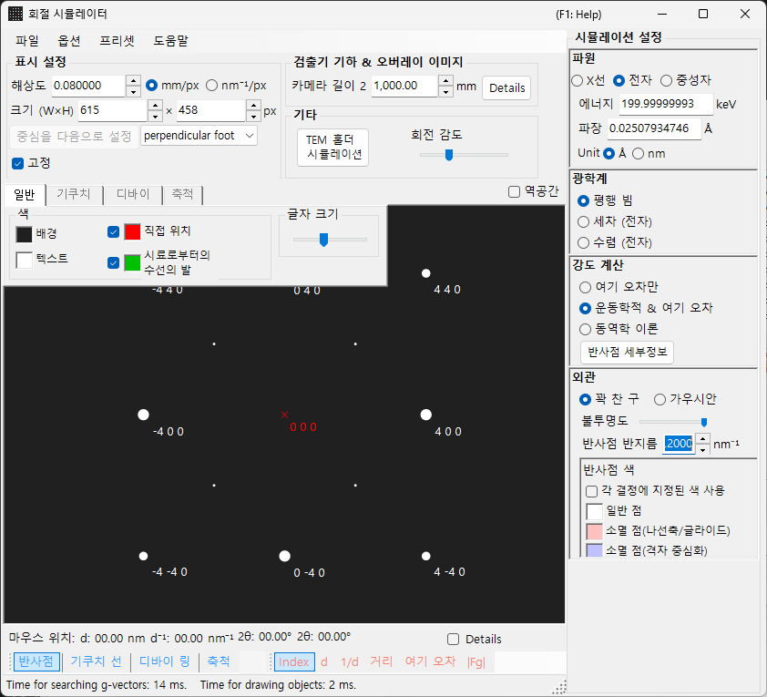

이 창은 **왼쪽**에 회절 패턴 그리기 영역이 있고, **오른쪽**에 스폿 속성(파장, 입사빔, 강도 계산, 표시 등)의 설정 패널이 있습니다. 파장과 입사빔의 조합이 취득 모드(X선 회절, SAED, PED, CBED)를 결정하며, 오른쪽 패널은 그에 따라 재구성됩니다.

---

## 이 페이지와 모드 페이지의 역할 분담

- **이 페이지(허브)**: 모든 모드에 공통인 조작(단축키, 메뉴, 도구 모음, 화면/검출기 정보, 오버레이 탭, 반사 정보, 검출기 기하학, 동적 압축)을 모읍니다.
- **각 모드 페이지**: 해당 모드가 선택되었을 때 **오른쪽에 나타나는 모든 설정**(파장, 입사빔, 강도 계산, 표시, 블로흐파 설정, 세차 설정 등)을 다루므로, 각 페이지가 독립적으로 완결됩니다(모드 간에 일부 중복이 존재합니다).

| 모드 | 내용 | 페이지 |
|------|----------|------|
| **X선 회절(및 중성자 회절)** | 단결정 X선 / 중성자 회절 패턴(평행, 세차 X선, Back Laue) | [X선 회절 시뮬레이션](4-x-ray-neutron-diffraction.md) |
| **SAED** | 평행빔 전자 회절(selected-area electron diffraction) | [SAED 시뮬레이션](1-saed-simulation.md) |
| **PED** | 세차 전자 회절 | [PED 시뮬레이션](2-ped-simulation.md) |
| **CBED** | 수렴빔 전자 회절 | [CBED 시뮬레이션](3-cbed-simulation.md) |

---

## 모드 빠른 참조

**파장(선원)**과 **입사빔**의 조합으로 필요한 페이지를 찾으십시오.

| 파장 | 입사빔 | 모드 | 페이지 |
|------------|--------------------|------|------|
| 전자 | 평행 | SAED | [SAED 시뮬레이션](1-saed-simulation.md) |
| 전자 | 세차(전자 = PED) | PED | [PED 시뮬레이션](2-ped-simulation.md) |
| 전자 | 수렴(CBED) | CBED | [CBED 시뮬레이션](3-cbed-simulation.md) |
| X선 | 평행 | X선 회절 | [X선 회절 시뮬레이션](4-x-ray-neutron-diffraction.md) |
| X선 | 세차(X선) | 세차 X선(세차 카메라) | [X선 회절 시뮬레이션](4-x-ray-neutron-diffraction.md) |
| X선 | Back Laue | 후방반사 라우에 | [X선 회절 시뮬레이션](4-x-ray-neutron-diffraction.md) |
| 중성자 | 평행 | 중성자 회절 | [X선 회절 시뮬레이션의 중성자 절](4-x-ray-neutron-diffraction.md) |

> **Note**: 입사빔 선택지는 파장에 따라 달라집니다. 전자의 경우: **평행, 세차(전자 = PED), 수렴(CBED)**, X선의 경우: **평행, 세차(X선), Back Laue**, 중성자의 경우: **평행**만. **세차(전자 = PED)** 또는 **수렴(CBED)**을 선택하면 강도 계산이 자동으로 **Dynamical**로 전환됩니다.

---

## 키보드 & 마우스 단축키

이것들은 X선, SAED, PED 시뮬레이션이 공유하는 회절 패턴 창에 적용됩니다. 패턴 위에서 드래그하면 **결정**이 회전합니다. 여기에는 **마우스 휠 확대/축소가 없습니다** — 오른쪽 클릭 / 오른쪽 드래그로 확대/축소하십시오.

| 단축키 | 동작 |
|----------|--------|
| <kbd>F1</kbd> | 온라인 매뉴얼의 이 페이지를 엽니다 |
| 중심 부근에서 왼쪽 드래그 | 결정을 기울입니다 |
| 외곽 영역에서 왼쪽 드래그 | 빔 축을 중심으로 결정을 돌립니다 |
| 스폿을 왼쪽 더블 클릭 | 반사 상세 정보 표시(지수, *d*, 구조 인자, 여기 오차) |
| 가운데 드래그 | 패턴을 이동합니다 |
| <kbd>CTRL</kbd> + 가운데 드래그 | 검출기 중심을 이동합니다(검출기 영역이 표시되어 있을 때) |
| 오른쪽 클릭 | 축소 |
| 오른쪽 드래그로 박스 지정 | 선택한 영역으로 확대 |
| 상태 표시줄을 오른쪽 더블 클릭 | 현재 설정의 텍스트 요약을 복사 |
| 켜진 레이어 버튼(Spots / Kikuchi / Debye / Scale)을 오른쪽 더블 클릭 | 해당 레이어를 깜빡이며 켜고 끔 |

여기서 여는 보조 창은 몇 가지를 더 추가합니다:

| 단축키 | 동작 |
|----------|--------|
| 스테레오넷을 왼쪽 더블 클릭 — **TEM 홀더** | 홀더 기울기를 그 지점으로 설정 |
| 화살표 키 — **TEM 홀더** | 홀더 기울기를 단계적으로 변경(먼저 **Arrow keys** 체크) |
| `.prm` 파일이나 이미지를 끌어 놓기 — **검출기 기하학** | 검출기 기하학 / 오버레이 이미지 로드 |
| `.txt` 프로파일을 끌어 놓기 — **동적 압축** | 압력/시간 프로파일 로드(그래프의 빨간 선을 드래그하여 스크럽) |

메인 창의 애플리케이션 전역 <kbd>CTRL</kbd>+<kbd>SHIFT</kbd> 단축키도 이 창이 포커스되어 있는 동안 작동합니다(자세히는 [메인 창](../0-main-window.md) 참조).

→ 모든 창을 한눈에 보려면 **[21. 키보드 & 마우스 단축키](../21-shortcuts.md)**를 참조하십시오.

---

## 목적별 빠른 경로

| 목적 | 시작점 | 참조 |
|------|------------|-----------|
| 평행빔 전자 회절(SAED) 생성 | **Incident beam**을 **Parallel**로, **Wavelength**를 전자로 설정 | [SAED 시뮬레이션](1-saed-simulation.md), [평행빔 SAED 계산](../appendix/a3-bloch-wave/calculation.md) |
| 단결정 X선 회절 생성 | **Wavelength**를 X선 / Synchrotron으로 전환 | [X선 회절 시뮬레이션](4-x-ray-neutron-diffraction.md) |
| 세차 전자 회절(PED) 생성 | **Incident beam**을 **Precession (electron)**으로 설정한 다음, 반각과 스텝을 설정 | [PED 시뮬레이션](2-ped-simulation.md) |
| 수렴빔 전자 회절(CBED) 생성 | **Incident beam**을 **Convergence (CBED, electron only)**로 설정하고 CBED 창에서 조건을 설정 | [CBED 시뮬레이션](3-cbed-simulation.md), [CBED 계산](../appendix/a3-bloch-wave/cbed.md) |
| 동역학적 계산의 반사 목록 검사 | **Dynamical**을 선택하고 **Spot Details** 또는 **Details**를 열기 | [동역학적 계산(공유 코어)](../appendix/a3-bloch-wave/calculation.md) |
| 검출기 기하학을 실험 이미지와 대조 | **Details**에서 검출기 기하학 설정을 열고 오버레이 이미지를 사용 | [검출기 좌표계](../appendix/a1-coordinate-system/2-diffraction.md) |

---

## 메인 영역

회절 패턴은 화면 중앙에서 시뮬레이션됩니다.

### 마우스 조작

이 페이지 상단의 "키보드 & 마우스 단축키"를 참조하십시오.

### 마우스 위치

커서 위치에 해당하는 정보(커서 *q*, *d*, 2θ, 방위각 등)가 패턴 위쪽 상태 표시줄에 표시됩니다. **Details**를 체크하면 더 상세한 정보(가장 가까운 반사의 (*hkl*), 여기 오차, 구조 인자 등)가 추가됩니다.

---

## File 메뉴

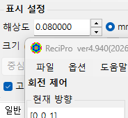

| 메뉴 항목 | 설명 |
|-----------|-------------|
| **Save** | 표시된 회절 패턴을 파일로 저장합니다. |
| **Save detector area** | 검출기 영역 부분만 저장합니다. |
| **Copy** | 표시된 이미지를 클립보드에 복사합니다. |
| **Copy detector area** | 검출기 영역 부분만 복사합니다. |

### Preset {#toolbar}

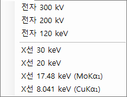

파장, 검출기 기하학, 탭 설정, 스폿 속성 등 시뮬레이터 구성 전체를 프리셋으로 저장하고 불러옵니다. 장비 / 취득 모드 간을 빠르게 전환할 때 유용합니다.

---

## 도구 모음

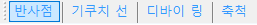

| 버튼 | 설명 |
|--------|-------------|
| Spots | 회절 스폿 레이어 표시 / 숨김 |
| Kikuchi | 키쿠치 선 레이어 표시 / 숨김 |
| Debye | 디바이 링 레이어 표시 / 숨김 |
| Scale | 축척 선 레이어 표시 / 숨김 |
| Index / d / Distance / Excitation error / Structure factor | 각 스폿에 붙는 레이블 선택 |

---

## 화면 및 검출기 정보

### 화면

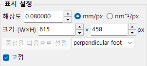

| 항목 | 설명 |
|------|-------------|
| **Resolution** | 픽셀 하나의 크기(mm)입니다. 실제 검출기 픽셀 크기와 같을 필요는 없으며, 표시 배율로 취급되고 마우스로 확대/축소할 때 자동으로 갱신됩니다. |
| **Size (W×H)** | 그리기 영역의 픽셀 너비와 높이입니다. 디스플레이 해상도에 따라 매우 큰 값은 설정할 수 없을 수 있습니다. |
| **Set centre / Fix centre** | 패턴 중심을 그리기 영역의 임의 픽셀로 설정하고, 필요하면 고정합니다. 고정하면 마우스 이동으로 중심을 옮길 수 없습니다. |
| **Horizontal flip / Vertical flip / Negative image** | 표시된 패턴의 기하학적 뒤집기(수평 / 수직)와 명암 반전입니다. 실험 이미지의 방향이나 명암에 맞출 때 사용하십시오. |
| **Reciprocal space** | 에발트 구와 역격자 벡터를 패턴 위에 겹쳐, 어떤 반사가 여기되는지 시각화합니다. |

### 검출기(카메라 길이)

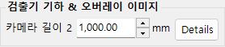

- **Camera length** : 시료에서 검출기까지의 거리(mm).
- **Details** : 검출기 기하학 설정 창을 엽니다(아래 [검출기 기하학](#detector-geometry) 참조).

### Misc

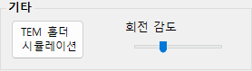

- **Rotation sensitivity** : 마우스 드래그 픽셀당 결정 회전량.
- **TEM holder simulation** : 홀더 연동 시뮬레이션 창을 엽니다(아래 참조).

---

## TEM 홀더 시뮬레이션 {#drawing-overlay-tabs}

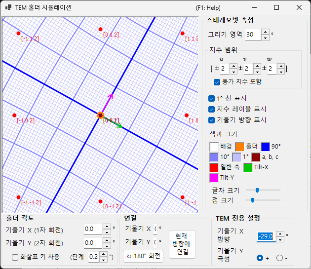

회절 패턴을 더블 틸트(또는 회전) **TEM 홀더**와 연동하는 창을 엽니다. 홀더 기울기 각도를 설정하면 패턴과 결정 방위가 갱신되고, 도달 가능한 방위를 스테레오넷에 표시할 수 있습니다(v4.914에서 추가됨). 스테레오넷을 왼쪽 더블 클릭하면 홀더 기울기가 그 지점으로 설정되며, **Arrow keys**를 체크하면 화살표 키로 기울기를 단계적으로 변경할 수 있습니다.

---

## 그리기 오버레이 탭

### General

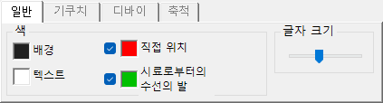

스폿, 레이블, 키쿠치 선, 디바이 링 및 기타 오버레이의 색상을 설정합니다. 여기서 한 설정은 모든 렌더링 모드에 적용됩니다.

### 키쿠치 선

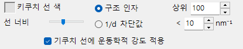

도구 모음에서 키쿠치 선이 활성화되어 있을 때 활성화됩니다.

- **Reflection selection** : 어떤 반사가 키쿠치 선을 생성하는지 선택합니다. **structure factor**($\lvert F_{hkl}\rvert$ 기준 상위 *N*개 반사) 또는 **1/d cutoff**(1/d가 임계값(nm⁻¹) 미만인 모든 반사) 중 하나입니다.
- **Line appearance** : 선 너비, 키쿠치 선 색상, 그리고 **Draw with kinematical intensity**(반사의 운동학적 강도에 따라 선 진하기를 조정)를 설정합니다.
- **Threshold** : 레거시 파라미터입니다. 지정한 값보다 *d*가 큰 반사에 대해서만 키쿠치 선 계산을 실행합니다(호환성을 위해 유지됨).

### 디바이 링

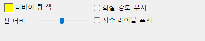

도구 모음에서 디바이 링이 활성화되어 있을 때 활성화됩니다.

- **Ignore diffraction intensity** : 체크하면 모든 디바이 링이 동일한 색상과 강도로 그려집니다(결정 구조 인자 무시). 순전히 기하학적인 비교에 사용하십시오.
- **Show index label** : 체크하면 각 링 근처에 (*hkl*)이 나타납니다.

### Scale

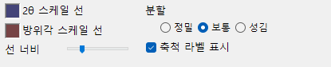

도구 모음에서 축척 선이 활성화되어 있을 때 활성화됩니다.

- **2θ / Azimuth scale lines** : **2θ**는 일정한 산란각(동심원)을, **Azimuth**는 일정한 방위각(중심에서 방사형 선)을 나타냅니다. 색상은 독립적으로 구성할 수 있습니다.
- **Line width** : 축척 선의 두께.
- **Division** : 인접한 축척 선 사이의 각도 간격.
- **Show scale labels** : 축척 선에 숫자 레이블을 그릴지 여부.

### Misc {#diffraction-spot-information}

마우스 회전 감도 같은 기타 설정.

- **Mouse sensitivity** : 마우스 드래그 픽셀당 결정 회전량.

---

## 회절 스폿 정보

블로흐파 방법(Dynamical 계산)으로 계산된 반사별 상세 정보를 나열합니다. **Spot Details** 버튼(강도 계산 패널) 또는 **Details** 확인란으로 엽니다.

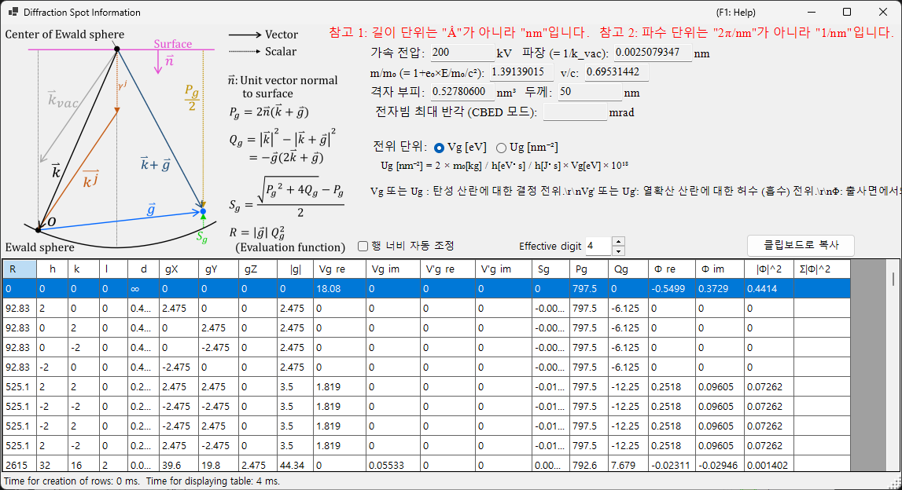

### 모식도 및 정의

모식도(왼쪽 위)는 에발트 구 위의 벡터를 보여주고 표에 사용된 양을 정의합니다($\hat{\mathbf{n}}$은 시료 표면에 수직인 단위 벡터, $\mathbf{k}$는 입사 파동벡터, $\mathbf{g}$는 역격자 벡터입니다).

- $P_g = 2\,\hat{\mathbf{n}} \cdot (\mathbf{k} + \mathbf{g})$
- $Q_g = |\mathbf{k}|^2 - |\mathbf{k} + \mathbf{g}|^2 = -\mathbf{g} \cdot (2\mathbf{k} + \mathbf{g})$
- **여기 오차:** $S_g = \dfrac{\sqrt{P_g^2 + 4 Q_g} - P_g}{2}$
- **평가 함수:** $R = |\mathbf{g}|\, Q_g^2$ — 반사가 얼마나 강하게 여기되는지에 따라 순위를 매깁니다(작을수록 = 에발트 구에 가까움 = 더 강하게 여기됨, 투과빔 $g=0$은 $R=0$이고 맨 앞에 옵니다). 표는 $R$의 오름차순으로 정렬됩니다.

### 표 열

| 열 | 의미 |
|--------|---------|
| **R** | 평가 함수 $R = \lvert\mathbf{g}\rvert\, Q_g^2$ (위 참조, 반사 선택 / 정렬에 사용) |
| **h, k, (i,) l** | 밀러 지수(*i*는 잉여 육방 지수로, 육방정계 결정에서만 표시됨) |
| **d** | 면간격(nm) |
| **gX, gY, gZ** | 역격자 벡터 *g*의 성분(1/nm) |
| **\|g\|** | *g*의 크기(1/nm) |
| **Vg re / Vg im** | 탄성 산란에 대한 결정 퍼텐셜의 푸리에 계수, $V_g$ (실수 / 허수) |
| **V'g re / V'g im** | 열 확산 산란(TDS)에 대한 허수(흡수) 퍼텐셜, $V'_g$ (실수 / 허수) |
| **Sg** | 여기 오차 $S_g$ (위 참조, 1/nm) |
| **Pg** | 보조량 $P_g = 2\,\hat{\mathbf{n}}\cdot(\mathbf{k}+\mathbf{g})$ (위 참조) |
| **Qg** | 보조량 $Q_g = -\mathbf{g}\cdot(2\mathbf{k}+\mathbf{g})$ (위 참조) |
| **Φ re / Φ im** | 출사면에서 동역학적 회절파의 복소 진폭 $\Phi$ (실수 / 허수) |
| **\|Φ\|^2** | 해당 반사의 회절 강도 $\lvert\Phi\rvert^2$ |
| **Σ\|Φ\|^2** | $\lvert\Phi\rvert^2$의 누적 합(반사 전체에 대한 총합, 강도 보존 검증에 유용) |

### 퍼텐셜 단위 및 기타 컨트롤

- **Unit of potential** : 표시되는 퍼텐셜을 **Vg [eV]**(정전 퍼텐셜, eV)와 **Ug [nm⁻²]**(블로흐파 방정식에 들어가는 스케일링된 양 $U_g = (2 m_0/h^2)\, V_g$) 사이에서 전환합니다. 열 머리글도 그에 따라 *Vg / V'g*와 *Ug / U'g* 사이에서 바뀝니다.
- 표 위에는 가속 전압, 파장($\lambda = 1/k_\text{vac}$), 상대론적 질량비 $m/m_0$, 속도비 $v/c$, 격자 부피, 시료 두께, 그리고 (CBED 모드에서) 전자빔의 최대 반각이 표시됩니다.
- **Note 1:** 길이 단위는 Å가 아니라 **nm**입니다. **Note 2:** 파수 단위는 2π/nm가 아니라 **1/nm**입니다.
- **Effective digit** : 표에 표시되는 유효 숫자 자릿수. **Auto resize row width** : 열 너비를 자동으로 맞춤. **Copy to clipboard** : 표를 스프레드시트에 붙여 넣을 수 있는 텍스트로 내보냅니다. (이 폼은 일본어 UI에서도 영어로 표시됩니다.)

---

## 검출기 기하학 {#detector-geometry}

검출기 기하학(카메라 길이, 기울기, 회전)의 상세 설정과 실험 이미지 오버레이를 위한 창입니다. **Detector geometry** 패널의 **Details**에서 엽니다.

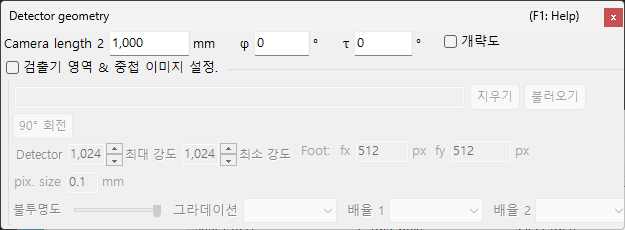

### 검출기 기하학 설정

카메라 길이와 검출기 기울기(**Tau / Phi**) 같은 반사 기하학을 지정합니다. Back Laue(후방반사 라우에)의 경우, 검출기를 선원 쪽에 배치하는 기하학을 여기서 설정합니다.

### 검출기 영역 및 겹친 이미지

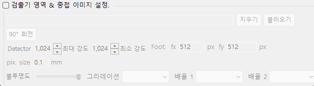

검출기의 활성 영역을 지정하고 실험 이미지를 끌어 놓아 겹칩니다. 시뮬레이션 패턴과 실험 이미지를 겹쳐 검출기 기하학을 미세 조정하는 데 사용하십시오.

좌표계 정의에 대해서는 [검출기 좌표계](../appendix/a1-coordinate-system/2-diffraction.md)도 참조하십시오.

---

## 동적 압축

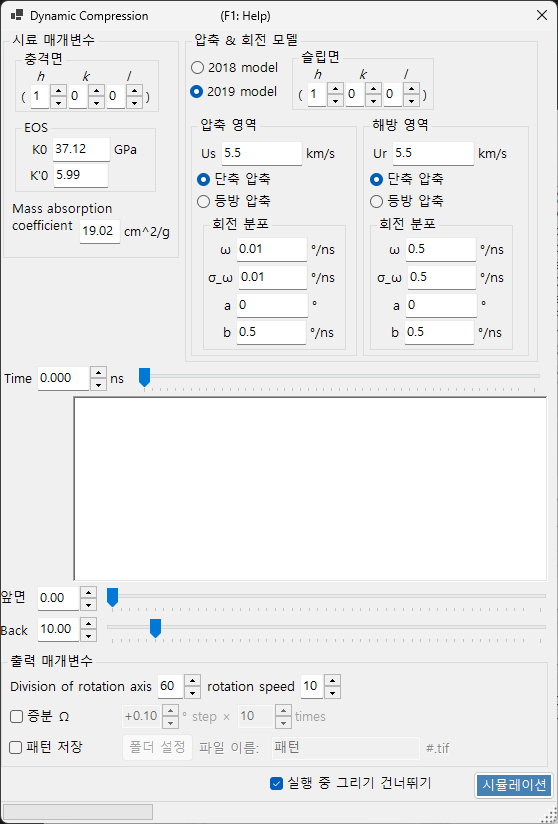

고압(동적 압축) 실험의 압력/시간 프로파일을 스크럽하기 위한 창입니다. 이 창에 `.txt` 압력/시간 프로파일을 끌어 놓아 로드한 다음, 그래프의 빨간 선을 드래그하여 시간(압력)을 연속적으로 훑으면서 해당 상태를 회절 패턴에 반영합니다.

---

## 관련 항목

- [X선 회절 시뮬레이션](4-x-ray-neutron-diffraction.md)
- [SAED 시뮬레이션](1-saed-simulation.md)
- [PED 시뮬레이션](2-ped-simulation.md)
- [CBED 시뮬레이션](3-cbed-simulation.md)
- [동역학적 계산(공유 코어)](../appendix/a3-bloch-wave/calculation.md)
- [검출기 좌표계](../appendix/a1-coordinate-system/2-diffraction.md)
