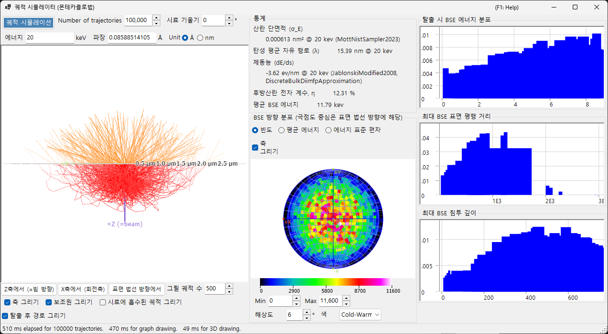
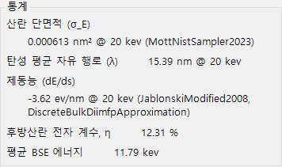
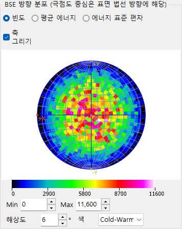
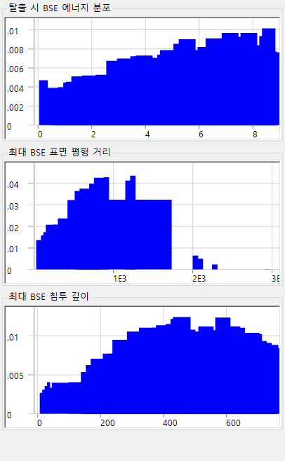

# 전자 궤적

**궤적 시뮬레이터(Trajectory Simulator)**는 **몬테카를로 방법(Monte-Carlo method)**으로 시료 내부의 전자 궤적을 계산합니다. 입사 전자는 탄성 산란과 비탄성 산란을 겪으며, 그 결과로 얻어지는 후방산란 전자의 분포(방향, 에너지, 침투 깊이)가 누적됩니다. 이 분포들은 [12. EBSD 시뮬레이션](12-ebsd-simulation.md)에서 사용되는 각도/에너지/깊이 가중치도 제공합니다.

---

## 키보드 및 마우스 단축키

궤적은 3-D OpenGL 뷰에 표시됩니다. ReciPro의 표준 [뷰 내비게이션](21-shortcuts.md)을 사용하지만, **이동(panning)은 비활성화되어 있습니다** — 표준 방위로 이동하려면 뷰 프리셋 버튼을 사용하세요.

| 단축키 | 동작 |
|----------|--------|
| <kbd>F1</kbd> | 온라인 매뉴얼의 이 페이지 열기 |
| 왼쪽 드래그 | 모델 회전 |
| 오른쪽 드래그 위/아래, 또는 마우스 휠 | 확대/축소 |
| <kbd>CTRL</kbd> + 오른쪽 더블 클릭 | 정사영 / 원근 투영 전환 |

→ 모든 창을 한눈에 보려면 **[21. 키보드 및 마우스 단축키](21-shortcuts.md)**를 참조하세요.

---

## 계산 조건

빔 에너지, 입사 전자 수, 시료/물질, 그 밖의 몬테카를로 파라미터 (위의 개요 스크린샷 참조).

### 빔 에너지

입사 전자빔의 가속 전압(keV). 탄성(Mott) 및 비탄성(유전 응답) 산란 모델 모두에 사용되는 운동 에너지를 설정합니다.

### 입사 전자 수

시뮬레이션할 전자의 개수. 전자가 많을수록 통계적 잡음은 줄어들지만 실행 시간은 선형으로 증가합니다.

### 시료 / 물질

시료의 조성과 밀도. 기본값은 메인 창에서 현재 선택된 결정이지만, 궤적 전용 연구를 위해 재정의할 수 있습니다.

### 시료 기울기

시료 기울기 각도. 궤적 데이터가 [EBSD 시뮬레이터](12-ebsd-simulation.md)로 전달될 때 사용됩니다 (EBSD의 경우 일반적으로 70°).

### 단면적 모델

탄성 산란 단면적 모델 (Mott / Bethe / NIST). 모델마다 큰 기울기 각도나 흡수단 부근에서 속도와 정확도 사이의 절충이 다릅니다.

---

## 스테레오넷 옵션

입체 투영 위에 그려지는 각도 분포의 표시 옵션 (위의 개요 스크린샷 참조).

### 투영 방법

**Wulff**(등각) 또는 **Schmidt**(등면적) 투영. 통계적 밀도를 읽을 때는 보통 Schmidt가 선호됩니다.

### 반구

상부(후방산란) 또는 하부(투과) 반구를 표시합니다.

### 해상도 / 색상 척도

각도 히스토그램의 구간 크기와 밀도 표시에 사용되는 색상 맵.

---

## 통계

실행 결과 요약.

- **후방산란 수율(Backscatter yield)** — 입사면을 통해 빠져나가는 입사 전자의 비율.
- **평균 자유 행로(Mean free path)** — 산란 사건 사이의 평균 거리.
- **평균 침투 깊이(Mean penetration depth)** — 전자가 빠져나가거나 흡수되기 전에 도달하는 최대 깊이의 평균.
- **경과 시간 / 처리량(Elapsed time / Throughput)** — 실행에 소요된 실제 시간 비용.

---

## BSE 방향 분포

후방산란 전자의 각도 분포 (스테레오넷 중심이 표면 법선 방향에 해당). 노란색/주황색 윤곽선은(있는 경우) EBSD 검출기가 차지하는 영역을 표시합니다.

---

## 프로파일

시뮬레이션된 전자의 깊이 및 에너지 프로파일.

### 깊이 프로파일

후방산란 전자의 최종 탈출 깊이(nm) 히스토그램. EBSD 시뮬레이터가 master pattern의 깊이 적분을 가중하는 데 사용됩니다.

### 에너지 프로파일

후방산란 전자의 에너지 손실 ΔE(keV) 히스토그램. EBSD 시뮬레이터가 에너지 적분을 가중하는 데 사용됩니다.

---

## 함께 보기

- [EBSD 시뮬레이션](12-ebsd-simulation.md)
- [EBSD 계산](appendix/a3-bloch-wave/ebsd.md)
- [동역학적 회절 (블로흐파)](appendix/a3-bloch-wave/index.md)
- [HRTEM/STEM 시뮬레이터](9-hrtem-stem-simulator/index.md)
- [회절 시뮬레이터](7-diffraction-simulator/index.md)
