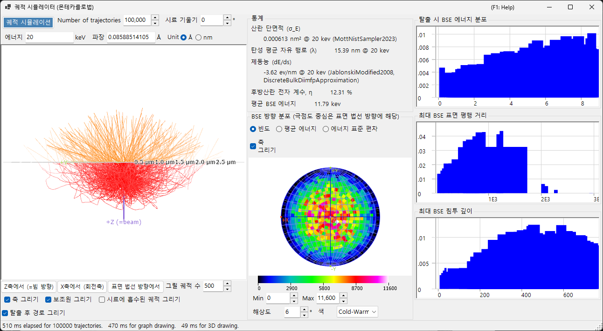
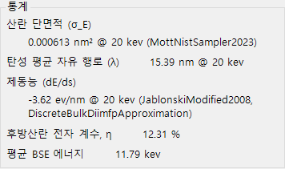
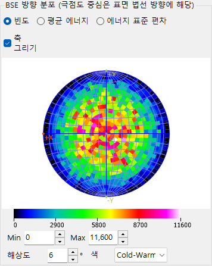
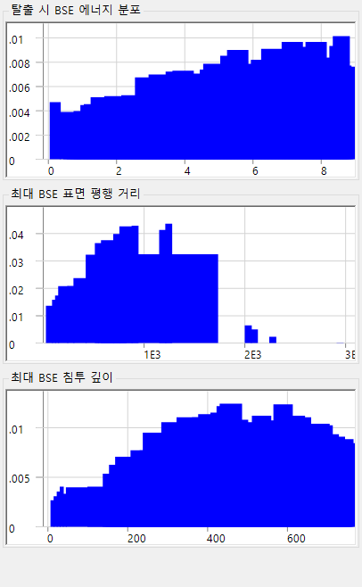

# 전자 궤적

**궤적 시뮬레이터 (몬테카를로법)**는 **몬테카를로 방법(Monte-Carlo method)**으로 시료 내부의 전자 궤적을 계산합니다. 입사 전자는 탄성 산란과 비탄성 산란을 겪으며, 그 결과로 얻어지는 후방산란 전자(BSE)의 분포 — 방향, 탈출 시 에너지, 침투 깊이, 측방 퍼짐 — 가 누적됩니다. 이 분포들은 [12. EBSD 시뮬레이션](12-ebsd-simulation.md)에서 사용되는 각도/에너지/깊이 가중치도 제공합니다.

창은 세 열로 구성됩니다. 왼쪽에 **3-D 궤적 뷰**, 가운데에 **통계**와 **BSE 방향 분포** 스테레오넷, 오른쪽에 세 개의 **히스토그램**이 있습니다. 시료의 조성과 밀도는 메인 창에서 선택된 결정에서 가져오며, 이 창에서 설정하는 것은 빔 에너지, 시료 기울기, 궤적 수뿐입니다.

---

## 키보드 및 마우스 단축키

궤적은 3-D OpenGL 뷰에 표시됩니다. ReciPro의 표준 [뷰 내비게이션](21-shortcuts.md)을 사용하지만, **이동(panning)은 비활성화되어 있습니다** — 표준 방위로 이동하려면 뷰 프리셋 버튼을 사용하세요.

| 단축키 | 동작 |
|----------|--------|
| <kbd>F1</kbd> | 온라인 매뉴얼의 이 페이지 열기 |
| 왼쪽 드래그 | 모델 회전 |
| 오른쪽 드래그 위/아래, 또는 마우스 휠 | 확대/축소 |
| <kbd>CTRL</kbd> + 오른쪽 더블 클릭 | 정사영 / 원근 투영 전환 |

→ 모든 창을 한눈에 보려면 **[21. 키보드 및 마우스 단축키](21-shortcuts.md)**를 참조하세요.

---

## 계산 조건

창 상단의 컨트롤로 실행 조건을 설정합니다.

- **궤적 시뮬레이션** : 몬테카를로 계산을 시작합니다. 창 하단의 상태 표시줄에 궤적 계산, 그래프 그리기, 3-D 렌더링 각각의 소요 시간이 따로 표시됩니다.
- **Number of trajectories** : 추적할 입사 전자의 개수. 전자가 많을수록 아래의 모든 분포에서 통계적 잡음이 줄어들지만, 실행 시간은 선형으로 증가합니다.
- **시료 기울기** (°) : *X* 축을 중심으로 한 시료 표면의 기울기. 수직 입사라면 0으로 두고, [EBSD 시뮬레이터](12-ebsd-simulation.md)의 기하 배치를 재현하려면 **−70°**를 사용하세요. 큰 기울기는 후방산란 수율을 높입니다.
- **Energy** (keV) / **Wavelength** / **Unit** : 입사빔의 가속 전압과, 이에 연동된 상대론 보정 전자 파장. 에너지는 탄성(NIST Mott) 모델과 비탄성(저지능 / IMFP) 모델 모두에 사용되는 운동 에너지를 결정합니다.

산란 모델 자체는 사용자가 선택할 수 없습니다. 탄성 산란 단면적은 내장된 NIST Mott 테이블에서 가져오며(범위를 벗어나면 차폐 러더퍼드 식으로 대체), 저지능은 수정 Jablonski (2008) 식을 사용합니다. 실제로 사용된 모델은 **통계**의 각 값 옆에 표시됩니다. 이 모델들이 무엇인지는 [감쇠 및 수송](appendix/a2-beam-interaction/attenuation-transport.md)을 참조하세요.

### 3-D 궤적 뷰

빨간색 궤적은 시료에 흡수된 전자, 주황색 궤적은 후방산란 전자로 탈출한 전자입니다. 동심 보조원에는 nm(또는 µm) 단위의 눈금이 붙어 있으며, **+X**, **+Y**, **+Z (=beam)**가 축을 나타냅니다.

- **Z축에서 (=빔 방향)** / **X축에서 (회전축)** / **표면 법선 방향에서** : 뷰를 표준 방향으로 전환합니다.
- **그릴 궤적 수** : 계산된 궤적 중 몇 개를 렌더링할지 지정합니다(100,000개를 모두 그리면 알아보기 어렵고 느려집니다).
- **축 그리기** / **보조원 그리기** : 축 화살표와 거리 눈금.
- **시료에 흡수된 궤적 그리기** : 탈출하지 못한 전자도 함께 그립니다.
- **탈출 후 경로 그리기** : 후방산란 전자가 표면을 벗어난 뒤에도 경로를 계속 그립니다.

---

## 통계

현재 빔 에너지에서의 값이며, 각 값을 계산한 모델이 괄호 안에 표시됩니다.

- **산란 단면적 (σ_E)** (nm²) — 원자당 전체 탄성 산란 단면적.
- **탄성 평균 자유 행로 (λ)** (nm) — 탄성 산란 사건 사이의 평균 거리.
- **저지능 (dE/ds)** (eV/nm, 음수) — 단위 경로 길이당 잃는 에너지.
- **후방산란 전자 계수, η** (%) — 입사 전자 중 입사면을 통해 다시 빠져나가는 비율. BSE 이미지 콘트라스트의 바탕이 되는 양입니다.
- **평균 BSE 에너지** (keV) — 후방산란 전자가 탈출하는 순간의 평균 에너지.

---

## BSE 방향 분포

후방산란 전자의 각도 분포로, 중심이 표면 법선 방향에 해당하는 스테레오넷 위에 그려집니다.

- **빈도** / **평균 에너지** / **에너지 표준 편차** : 색으로 나타낼 양 — 각 방향으로 나가는 전자의 수, 그 평균 에너지, 또는 에너지의 퍼짐.
- **축 그리기** : +X / ±Y / ±Z 방향을 겹쳐 표시합니다.
- **Min** / **Max**, **Resolution**, **Color** : 색 척도의 범위, 히스토그램의 각도 구간 크기, 색상 맵.

---

## 히스토그램

후방산란 전자에 대한 세 가지 분포이며, 모두 면적이 1이 되도록 정규화되어 있습니다.

### 탈출 시 BSE 에너지 분포

**후방산란 전자가 시료를 떠날 때 아직 지니고 있는 에너지**(keV)의 히스토그램입니다 — 에너지 손실이 아닙니다. EBSD 시뮬레이터는 이를 master pattern의 에너지 적분 가중치로 사용합니다.

### 최대 BSE 표면 평행 거리

각 후방산란 전자가 탈출하기 전까지 **측방으로**(표면에 평행하게, nm) 이동한 거리의 히스토그램입니다. 이는 상호작용 체적의 측방 크기이며, 따라서 BSE 또는 EBSD 측정의 본질적인 공간 분해능 한계가 됩니다.

### 최대 BSE 침투 깊이

각 후방산란 전자가 탈출하기 전에 도달한 **표면에 수직한** 최대 깊이(nm)의 히스토그램입니다. EBSD 시뮬레이터는 이를 master pattern의 깊이 적분 가중치로 사용합니다.

---

## 함께 보기

- [EBSD 시뮬레이션](12-ebsd-simulation.md)
- [EBSD 계산](appendix/a3-bloch-wave/ebsd.md)
- [감쇠 및 수송](appendix/a2-beam-interaction/attenuation-transport.md) — 여기서 사용되는 탄성 산란 단면적, 저지능, 비정.
- [동역학적 회절 (블로흐파)](appendix/a3-bloch-wave/index.md)
- [HRTEM/STEM 시뮬레이터](9-hrtem-stem-simulator/index.md)
- [회절 시뮬레이터](7-diffraction-simulator/index.md)
