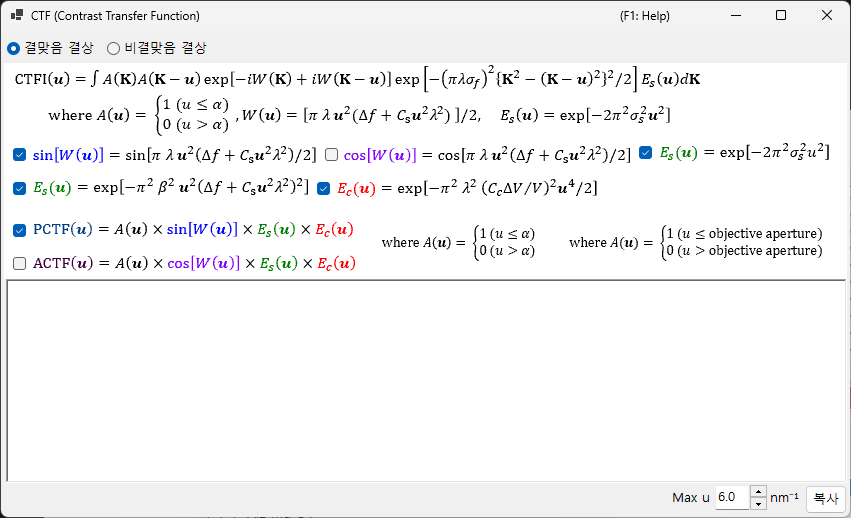
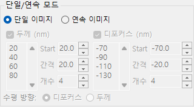

# HRTEM 시뮬레이션

고분해능 TEM 격자 줄무늬 영상을 시뮬레이션합니다. [HRTEM/STEM 시뮬레이터](index.md)의 주요 모드입니다.

---

## 계산 흐름

1. **블로흐파 방법**: 결정 퍼텐셜을 통과하는 전자파의 전파를 계산하여, 출사파의 진폭과 위상을 구합니다
2. **렌즈 함수**: 대물렌즈의 수차(구면 수차 $C_s$, 디포커스 $\Delta f$)를 적용합니다
3. **부분 가간섭성**: 유한한 광원 크기(공간 가간섭성)와 에너지 폭(시간 가간섭성)을 고려합니다
4. **결상**: 강도 $|\psi(\mathbf{r})|^2$ 를 계산합니다

---

## 시료 파라미터

| Parameter | 설명 |
|-----------|-------------|
| **Thickness** | 시료 두께 (nm). HRTEM 영상은 두께에 크게 의존합니다 |

---

## 광학 파라미터

### TEM 조건

| Parameter | 설명 |
|-----------|-------------|
| **Acc. Vol.** | 가속 전압 (kV). 상대론적으로 보정된 파장이 옆에 표시됩니다 |
| **Defocus** | 디포커스 값 (nm). Scherzer 디포커스가 참고로 표시됩니다 |

### 고유 파라미터

| Parameter | 설명 | 일반값 |
|-----------|-------------|---------|
| **Cs** | 구면 수차 (mm) | 0.5–1.0 (일반); < 0.01 (Cs 보정) |
| **Cc** | 색 수차 (mm) | 1.0–2.0 |
| **β** | 조명 반각 (mrad) | 0.1–1.0 |
| **ΔE** | 에너지 폭 1/*e* 폭 (eV) | 0.5–2.0 |

---

## 위상 대비 전달 함수 (PCTF)

렌즈 함수 탭에 표시됩니다:

- $\sin\chi(u)$: 위상 대비 전달 함수 ($\chi(u)$ 는 렌즈 수차 함수)
- $E_\text{s}(u)$: 공간 가간섭성 포락선
- $E_\text{c}(u)$: 시간 가간섭성 포락선

Scherzer 디포커스: $\Delta f = -\sqrt{\tfrac{4}{3}\,C_s \lambda}\ (\approx -1.155\,\sqrt{C_s \lambda})$, 넓은 음의 PCTF 대역을 주는 조건(어두운 대비 = 원자 위치). ReciPro는 이 원래의 Scherzer 값을 사용하며 — 수차 위상 $\chi$ 의 최솟값을 $-2\pi/3$ 로 설정하여 유도됩니다 — GUI에 표시되는 값은 이 공식을 따릅니다; 일부 참고문헌은 그 대신 *확장 Scherzer* 값 $-1.2\sqrt{C_s\lambda}$ 를 사용합니다.

---

## 대물 조리개

조리개 크기(mrad)와 위치를 설정합니다. **Open aperture** 는 조리개를 제거합니다. 고려되는 블로흐파의 수는 조리개 조건에 따라 달라집니다.

---

## 부분 가간섭성 모델

| Model | 설명 |
|-------|-------------|
| **Quasi-coherent (linear image)** | 빠름. 약위상 근사 하에서 유효 |
| **TCC (Transmission Cross Coefficient)** | 더 정확함; 계산 시간이 더 김 |

---

## 시뮬레이션 모드

| Mode | 설명 |
|------|-------------|
| **Single image** | 현재 두께와 디포커스에서의 영상 하나 |
| **Serial image** | 두께 × 디포커스 범위에 걸친 영상 행렬 (Start / Step / Num) |

---

## 영상 조정

| Setting | 설명 |
|---------|-------------|
| **Min / Max** | 표시 범위 (영상 조정 트랙바) |
| **Colour** | 그레이스케일 또는 Cold-Warm |
| **Gaussian blur (FWHM)** | 가우시안 필터 적용 |
| **Unit cell** | 단위 격자 격자를 오버레이 |
| **Scale** | 축척 막대 표시 |

---

## 함께 보기

- [HRTEM/STEM 시뮬레이터 (개요)](index.md)
- [STEM 시뮬레이션](2-stem-simulation.md)
- [퍼텐셜 시뮬레이션](3-potential-simulation.md)
- [부록 A3.2 — HRTEM 결상](../appendix/a3-bloch-wave/hrtem.md)
