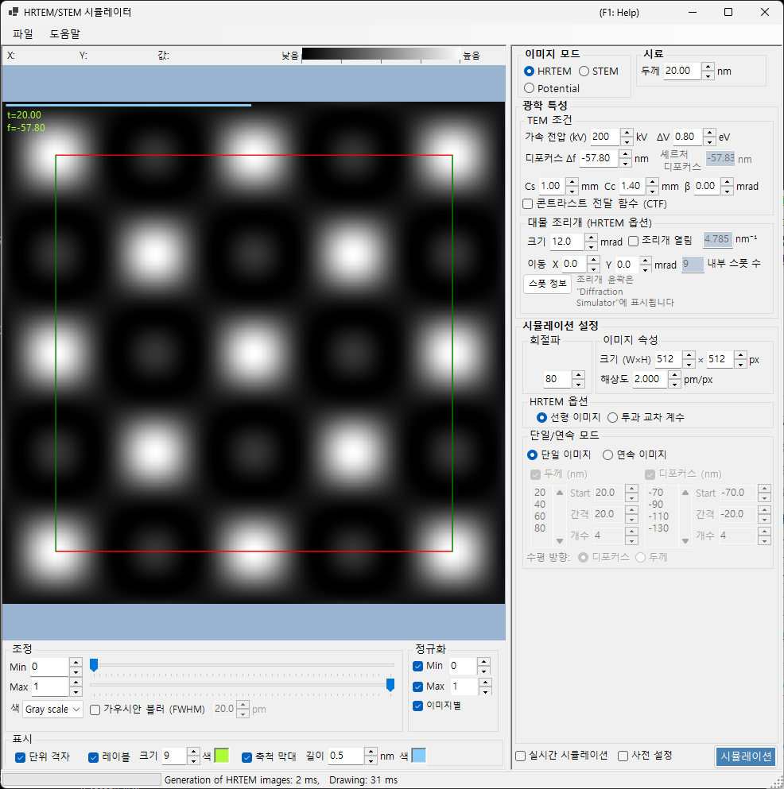
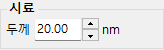
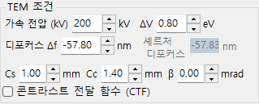
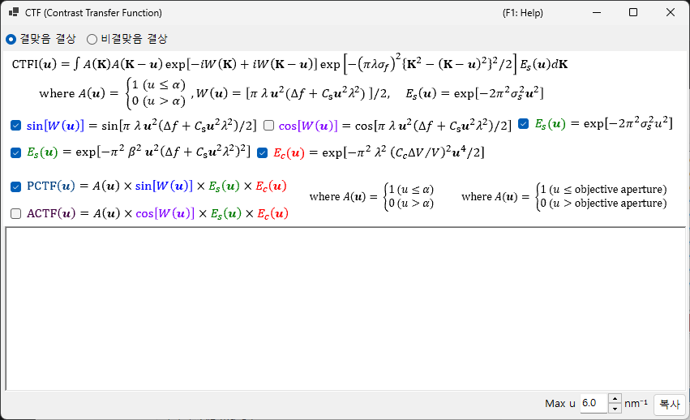
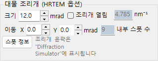
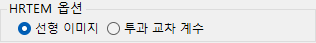
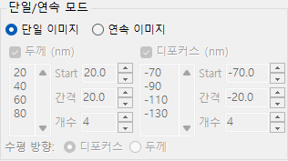
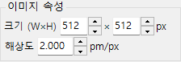
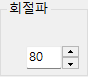

# HRTEM 시뮬레이션

**HRTEM (High-Resolution Transmission Electron Microscopy)** 시뮬레이션은 고분해능 TEM 격자무늬 이미지를 계산합니다. [HRTEM/STEM 시뮬레이터](index.md)의 주요 모드입니다.

> 이 페이지는 **이미지 모드 = HRTEM**일 때 오른쪽에 나타나는 모든 설정을 다룹니다. 왼쪽에 있는 결과 표시와 밝기 조정 컨트롤에 대해서는 [개요 페이지](index.md#display-settings)를 참조하십시오.

---

## 개요

HRTEM 이미지는 시료를 투과한 전자파가 대물렌즈 수차의 영향을 받으며 결상될 때 형성됩니다. ReciPro는 시료 내부의 전자파 전파를 블로흐파 방법(동역학적 계산)으로 계산하고, 위상 대비 전달 함수(PCTF)를 통해 HRTEM 이미지를 생성합니다.

### 계산 흐름

1. **블로흐파 방법**: 결정 퍼텐셜 속에서의 전자파 전파를 계산하여, 출사파의 진폭과 위상을 구합니다
2. **렌즈 함수**: 대물렌즈의 수차(구면 수차 $C_s$, 디포커스 $\Delta f$)를 적용합니다
3. **부분 가간섭성**: 유한한 광원 크기(공간 가간섭성)와 에너지 변동(시간 가간섭성)을 고려합니다
4. **결상**: 강도 분포 $|\psi(\mathbf{r})|^2$ 를 계산합니다

이론에 대해서는 [부록 A3.2 — HRTEM 이미지 형성](../appendix/a3-bloch-wave/hrtem.md)을 참조하십시오.

---

## 시료

- **두께** : 시료 두께 (nm). HRTEM 이미지는 두께에 크게 의존합니다. **연속 이미지** 모드에서는 이 값이 무시되고, 아래에서 설명하는 두께 목록이 대신 사용됩니다.

---

## TEM 조건

대물렌즈의 결상 조건을 설정합니다.

| 파라미터 | 설명 | 기본값 / 일반값 |
|-----------|-------------|-------------------|
| **가속 전압 (kV)** | 가속 전압. 상대론적으로 보정된 전자 파장이 오른쪽에 표시됩니다 | 200 kV |
| **디포커스 Δf** | 대물렌즈의 디포커스 (nm). 참고용 **셰르처 디포커스** 값이 그 아래에 표시됩니다 | −57.8 nm |
| **Cs** | 구면 수차 계수 (mm). CTF와 셰르처 디포커스에 영향을 줍니다 | 0.5–1.0 (일반), < 0.01 (Cs 보정) |
| **Cc** | 색 수차 계수 (mm). 에너지 퍼짐에 의한 이미지 흐림을 결정합니다 | 1.0–2.0 mm |
| **β** | 조명 반각 (mrad). 유한한 광원 크기의 효과(공간 가간섭성)를 나타냅니다 | 0.1–1.0 mrad |
| **ΔV** | 전자 에너지 퍼짐의 반치전폭 (eV). Cc와 함께 색 수차에 의한 초점 퍼짐을 결정합니다 | 0.5–2.0 eV |

> **오른쪽 클릭 메뉴**: TEM 조건 패널에서 **모든 수차를 0으로 설정** / **디포커스를 셰르처 값으로 설정** / **디포커스를 0 nm로 설정**을 클릭 한 번으로 적용할 수 있습니다. 조건 프리셋(300kV ARM300F, 200kV 2100F 등)은 왼쪽 아래의 **사전 설정**에서 사용할 수 있습니다.

### 셰르처 디포커스

현재의 파장과 구면 수차 $C_s$ 로부터 계산되는, 위상 대비가 최적이 되는 부근의 디포커스 값입니다(참고용으로 표시).

$$\Delta f_{\text{Scherzer}} = -\sqrt{\tfrac{4}{3}\,C_s \lambda}\quad\left(\approx -1.155\,\sqrt{C_s \lambda}\right)$$

이 조건에서는 PCTF가 넓은 공간 주파수 범위에서 음이 되므로, 원자 위치가 어두운 콘트라스트로 나타납니다. ReciPro는 이 원래의 셰르처 값(수차 위상 $\chi$ 의 최솟값을 $-2\pi/3$ 로 두어 유도)을 채택하며, GUI에 표시되는 값도 이 식을 따릅니다. 일부 문헌에서는 그 대신 투과 대역을 더 넓히는 *확장 셰르처* 값 $-1.2\sqrt{C_s\lambda}$ 를 사용한다는 점에 유의하십시오.

---

## 렌즈 함수 / 콘트라스트 전달 함수 (CTF)

**콘트라스트 전달 함수 (CTF)**를 체크하면, 렌즈 수차와 디포커스가 각 공간 주파수에서 이미지 콘트라스트를 어떻게 전달하는지 그래프로 보여 주는 창이 열립니다.

- $\sin\chi(u)$ : 위상 대비 전달 함수 ($\chi(u)$ 는 렌즈의 수차 함수)
- $E_\text{s}(u)$ : 공간 가간섭성 포락선 함수. 유한한 광원 크기($\beta$)에 의한 감쇠
- $E_\text{c}(u)$ : 시간 가간섭성 포락선 함수. 에너지 변동($C_c$, $\Delta V$)에 의한 감쇠

가로축 $u$ (공간 주파수)의 상한을 바꾸면 그래프의 표시 범위가 바뀝니다.

---

## 대물 조리개 (HRTEM 옵션)

대물 조리개를 통과하는 회절파를 제한합니다. 조리개로 잘리는 회절파의 수에 따라 블로흐파 계산에 포함되는 스폿의 수도 바뀝니다(상한은 **회절파**에서 설정한 블로흐파의 최대 개수).

- **크기** : 대물 조리개의 반각 (mrad). 작을수록 고각 회절파가 더 많이 잘려서, 고분해능 세부 구조가 매끄러워집니다. 이에 해당하는 역공간 반지름 $\sin\theta/\lambda$ (nm⁻¹)가 표시됩니다.
- **이동 X** / **Y** : 대물 조리개 중심의 이동량 (mrad). 암시야 결상이나 경사 결상에 사용합니다.
- **조리개 열림** : 대물 조리개를 무한대로 열어, 모든 회절파를 결상에 사용합니다.
- **내부 스폿 수** : 조리개 안에 들어오는 회절빔(스폿)의 개수 (읽기 전용).
- **스폿 정보** : 조리개 안의 회절빔(강도, 복소 진폭 등)을 나열한 표를 엽니다.

> 대물 조리개의 크기는 **회절 시뮬레이터**에도 표시됩니다.

---

## HRTEM 옵션 (부분 가간섭성 모델)

모든 입사빔 방향의 기여를 적분할 때 사용하는 간섭 모델을 선택합니다.

- **선형 이미지** : 계산 비용이 작습니다. 약위상물체 근사가 성립하는 얇은 시료에 적합하며, PCTF에 공간 및 시간 가간섭성 포락선을 곱합니다.
- **투과 교차 계수** : 계산 비용이 크지만 더 정확합니다. 전체 투과 교차 계수를 적분하며, 강한 회절파가 많이 여기되는 강산란체에 사용해야 하는 모델입니다.

자세한 내용은 [부록 A3.2 — HRTEM 이미지 형성](../appendix/a3-bloch-wave/hrtem.md)을 참조하십시오.

---

## 단일/연속 모드

- **단일 이미지** : 현재의 두께와 디포커스에서 HRTEM 이미지 한 장을 계산합니다.
- **연속 이미지** : 두께와 디포커스를 단계적으로 바꾼 이미지 세트(두께 시리즈 / 포커스 시리즈)를 생성합니다. 실험 이미지와 가장 잘 일치하는 조건을 찾는 데 유용합니다.

연속 이미지에서는 다음을 설정합니다.

| 항목 | 설명 |
|------|-------------|
| **두께 (nm)** / **디포커스 (nm)** | 어느 양을 변화시킬지 (둘 다 가능) |
| **Start / 간격 / 개수** | 시작값, 간격, 이미지 수. 아래의 목록 상자에 전개되며, 목록 상자를 직접 편집할 수도 있습니다 |
| **수평 방향:** | 두께와 디포커스를 모두 변화시킬 때, 격자의 가로 방향으로 배치할 양 (**디포커스** 또는 **두께**) |

두께와 디포커스를 모두 변화시키면 행 × 열의 이미지 행렬이 생성됩니다.

---

## 이미지 속성

- **크기 (W×H)** : 시뮬레이션 이미지의 픽셀 수 (기본값 512×512).
- **해상도** : 샘플링 해상도 (pm/px). 값이 작을수록 더 미세한 격자무늬를 분해할 수 있지만, FFT 시간이 그에 비례하여 늘어납니다.

---

## 회절파

- Bethe 방법(동역학적 계산)에 사용되는 블로흐파의 최대 개수로, 기본값은 80입니다. 개수가 많을수록 정확도가 높아지지만, 고유값 문제를 푸는 데 $O(N^3)$ 의 시간이 걸립니다.

---

## 함께 보기

- [HRTEM/STEM 시뮬레이터 (개요)](index.md)
- [STEM 시뮬레이션](2-stem-simulation.md)
- [퍼텐셜 시뮬레이션](3-potential-simulation.md)
- [부록 A3.2 — HRTEM 이미지 형성](../appendix/a3-bloch-wave/hrtem.md)
