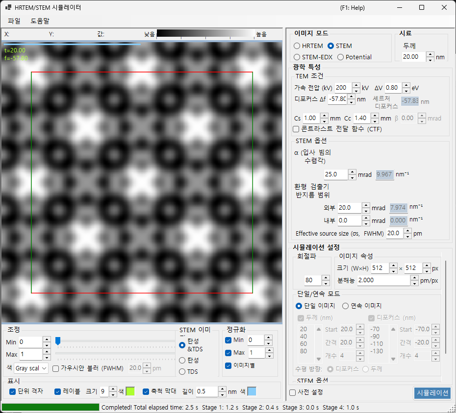

# STEM 시뮬레이션

**STEM (Scanning Transmission Electron Microscopy)** 시뮬레이션은 블로흐파 방법을 사용하여 주사 투과 전자 현미경 영상을 계산합니다.

> 이 페이지는 **Image mode = STEM**일 때 오른쪽에 나타나는 모든 설정을 나열합니다. 왼쪽에 있는 결과 표시, 밝기, 정규화 컨트롤에 대해서는 [개요 페이지](index.md)를 참조하세요. STEM 전용 **표시 대상**만 아래에 다시 설명합니다.

---

## 개요

수렴 전자빔이 시료를 주사하고, 각 주사 위치에서 투과 및 산란된 전자가 환형 검출기로 수집됩니다. ReciPro는 블로흐파 방법(동역학적 계산)으로 STEM 영상을 계산합니다.

### 계산 흐름

1. 각 주사 위치에서, 수렴 프로브의 모든 입사 방향에 대해 블로흐파 방법으로 회절 강도를 계산합니다.
2. 산란 강도를 검출기의 각도 범위에 걸쳐 적분합니다.
3. 탄성 산란과 열 확산 산란(TDS) 기여를 모두 계산할 수 있습니다.

이론에 대해서는 [부록 A3.4 — STEM 계산](../appendix/a3-bloch-wave/stem.md)을 참조하세요.

---

## 검출기 유형

| 검출기 | 각도 범위 | 주요 기여 | 콘트라스트 |
|----------|-------------|-------------------|----------|
| **BF** (명시야) | 0 – 수렴각 | 탄성 | 위상 콘트라스트 |
| **ABF** (환형 명시야) | 수렴각의 안쪽 부분 | 탄성 | 경원소 감응성 |
| **LAADF** (저각 환형 암시야) | 수렴각 바로 바깥쪽 | 탄성 + TDS | 변형 감응성 |
| **HAADF** (고각 환형 암시야) | 수렴각 바깥쪽 멀리 | TDS (비탄성) | Z-콘트라스트 ($\propto Z^2$) |

> **전형적인 검출기 설정** (각각 STEM 옵션의 마우스 오른쪽 클릭 메뉴에서 한 번의 클릭으로 사용 가능, 모두 수렴각 α = 25 mrad):
> BF (0–5 mrad) / ABF (12–24 mrad) / LAADF (26–60 mrad) / HAADF (80–250 mrad)

---

## 시료 파라미터

- **Thickness** : 시료 두께 (nm). 이 값은 **Serial image** 모드에서는 무시됩니다.

---

## TEM 조건

| 파라미터 | 설명 | 기본값 / 전형값 |
|-----------|-------------|-------------------|
| **Acc. Vol. (kV)** | 가속 전압. 상대론적으로 보정된 전자 파장이 옆에 표시됩니다 | 200 kV |
| **Defocus Δf** | 대물(프로브 형성) 렌즈의 디포커스 (nm) | −57.8 nm |
| **Cs** | 구면 수차 계수 (mm). 프로브 크기에 영향을 줍니다 | 0.5–1.0 mm |
| **Cc** | 색 수차 계수 (mm) | 1.0–2.0 mm |
| **ΔV (FWHM)** | 전자 에너지 분포의 반치폭 (eV) | 0.5–2.0 eV |

> **β (조명 반각)는 STEM 모드에서 비활성화됩니다**. 수렴각 α가 그 역할을 대신하기 때문입니다.

---

## STEM 옵션 (광학)

수렴 프로브와 환형 검출기의 기하학을 설정합니다. 각 각도는 오른쪽에 역공간 반경 $\sin\theta/\lambda$ (nm⁻¹)로 환산되어 표시되기도 합니다.

| 파라미터 | 설명 | 기본값 / 전형값 |
|-----------|-------------|-------------------|
| **α (convergence angle)** | 수렴 프로브의 반각 (mrad). 값이 클수록 프로브가 미세해지고 회절 콘트라스트가 변합니다 | 15–25 mrad |
| **(Annular) detector inner angle** | 환형 검출기의 내측 수집 반각 (mrad). 이 각도 안쪽의 신호는 제외됩니다 | BF: 0, HAADF: 80 |
| **(Annular) detector outer angle** | 환형 검출기의 외측 수집 반각 (mrad). 이 각도 바깥쪽의 신호는 제외됩니다 | BF: 5, HAADF: 250 |
| **Effective source size σs (FWHM)** | 유효 전자원 크기. 값이 클수록 프로브가 흐려지고 미세 세부 콘트라스트가 감소합니다 | — |

---

## STEM 옵션 (시뮬레이션)

- **Slice thickness for inelastic** : TDS(열 확산, 비탄성) 강도를 계산할 때 사용하는 시료 슬라이스 두께 (nm). 값이 작을수록 정확하지만 느립니다.
- **Angular resolution** : 입사 프로브 방향의 각도 샘플링 분해능 (mrad). 값이 작을수록 프로브를 더 미세하게 샘플링하지만 느립니다.

---

## 영상 모드 (single / serial)

- **Single image** : 현재 두께에서 STEM 영상 하나를 계산합니다.
- **Serial image** : 두께 / 디포커스를 단계적으로 변화시킨 영상 시리즈를 생성합니다(**Start / Step / Num**으로 설정하며, 아래의 목록을 직접 편집할 수도 있습니다).

---

## 영상 속성

- **Size (W×H)** : 주사된 영상의 픽셀 수 (기본값 512×512). STEM에서는 이것이 주사점의 수와 같으며 계산 시간을 선형으로 비례시킵니다.
- **Resolution** : 샘플링 분해능 (pm/px).

---

## 회절파

- **Max Bloch waves** : 베테 방법에서 사용하는 블로흐파의 최대 개수 (기본값 80). 고유값 문제의 비용은 파의 개수의 세제곱에 비례합니다.

---

## STEM 표시 대상 (결과 측)

창의 왼쪽 아래에 있는 표시 스위치는 이미 계산된 STEM 영상의 어떤 산란 성분을 보여줄지 선택합니다(재계산 없이 전환 가능).

| 표시 대상 | 설명 |
|----------------|-------------|
| **Elastic** | 탄성 산란만으로 이루어진 영상 |
| **TDS** | 열 확산 산란만으로 이루어진 영상 |
| **Elastic & TDS** | 탄성 + TDS의 합 |

---

## 계산 비용

STEM 시뮬레이션은 계산 비용이 많이 들므로, 다음 파라미터를 적절히 설정하세요.

| 요인 | 영향 |
|--------|--------|
| **수렴각** | 클수록 → CBED 디스크 겹침 증가 → 비용 증가 |
| **블로흐파** | 고유값 문제의 비용은 N³로 비례 |
| **각도 분해능** | 미세할수록 → 정확하지만 비용은 N²로 비례 |
| **영상 픽셀 (Size)** | 주사점의 수에 선형으로 비례 |

---

## 온도 인자의 중요성

HAADF-STEM 시뮬레이션에서는 원자가 0이 아닌 등방성 온도 인자(디바이-월러 인자)를 가져야 합니다. 값이 알려져 있지 않으면 $B \approx 0.5\ \text{Å}^2$로 설정하세요. 온도 인자가 0이면 TDS 강도가 0이 되어 HAADF 영상이 올바르게 계산되지 않습니다.

| 검출기 | 범위 | 주요 기여 |
|----------|-------|-------------------|
| BF, ABF | 수렴각 안쪽 | 탄성 |
| LAADF, HAADF | 수렴각 바깥쪽 | 비탄성 (TDS) |

---

## Dr. Probe와의 비교

ReciPro의 STEM 시뮬레이션은 널리 사용되는 Dr. Probe GUI (v1.10)와 밀접하게 일치하는 것으로 확인되었습니다. 아래 그림은 두께 시리즈(2.96–60.05 nm)에 걸쳐 BF, ABF, LAADF, HAADF 검출기에 대해 양쪽을 비교한 것으로, 수차가 없는 경우(왼쪽)와 Cs = 0.2 mm, 디포커스 = −25.9 nm인 경우(오른쪽)를 모두 보여줍니다. 두 코드는 모든 검출기 유형과 두께에 걸쳐 일치합니다.

더 자세한 보고서는 PDF로 제공됩니다: [Dr. Probe GUI (v1.10)와 ReciPro (v4.854)의 STEM 시뮬레이션 비교](https://github.com/seto77/ReciPro/files/10976084/ComparisonSTEMsimulations.pdf).

---

## 함께 보기

- [HRTEM/STEM 시뮬레이터 (개요)](index.md)
- [HRTEM 시뮬레이션](1-hrtem-simulation.md)
- [퍼텐셜 시뮬레이션](3-potential-simulation.md)
- [부록 A3.4 — STEM 계산](../appendix/a3-bloch-wave/stem.md)
- [부록 A3.4 — STEM 계산](../appendix/a3-bloch-wave/stem.md)
