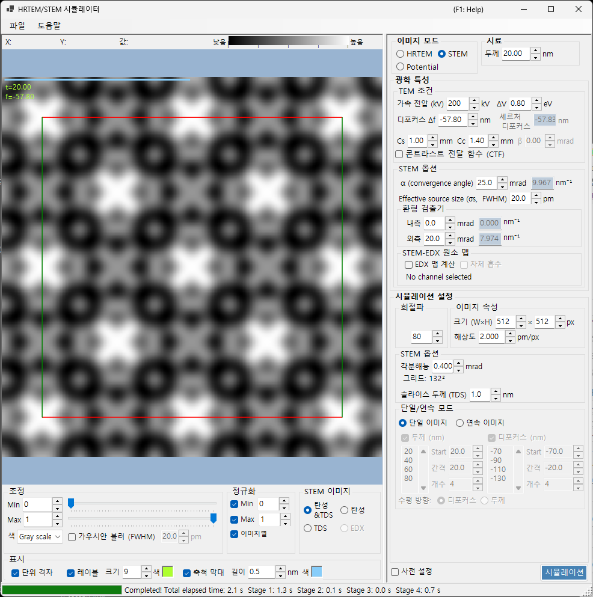
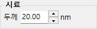
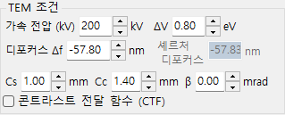
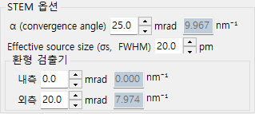
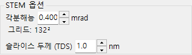
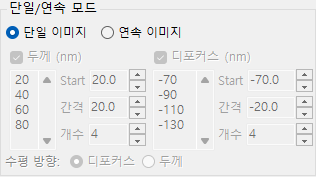
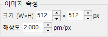
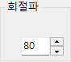
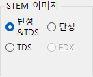
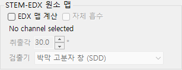

# STEM 시뮬레이션

**STEM (Scanning Transmission Electron Microscopy)** 시뮬레이션은 블로흐파 방법을 사용하여 주사 투과 전자 현미경 영상을 계산합니다.

> 이 페이지는 **Image mode = STEM**일 때 오른쪽에 나타나는 모든 설정을 나열합니다. 왼쪽에 있는 결과 표시, 밝기, 정규화 컨트롤에 대해서는 [개요 페이지](index.md)를 참조하세요. STEM 전용 **표시 대상**만 아래에 다시 설명합니다.

---

## 개요

수렴 전자빔이 시료를 주사하고, 각 주사 위치에서 투과 및 산란된 전자가 환형 검출기로 수집됩니다. ReciPro는 블로흐파 방법(동역학적 계산)으로 STEM 영상을 계산합니다.

### 계산 흐름

1. 각 주사 위치에서, 수렴 프로브의 모든 입사 방향에 대해 블로흐파 방법으로 회절 강도를 계산합니다.
2. 산란 강도를 검출기의 각도 범위에 걸쳐 적분합니다.
3. 탄성 산란과 열 확산 산란(TDS) 기여를 모두 계산할 수 있습니다.

이론에 대해서는 [부록 A3.4 — STEM 계산](../appendix/a3-bloch-wave/stem.md)을 참조하세요.

---

## 검출기 유형

| 검출기 | 각도 범위 | 주요 기여 | 콘트라스트 |
|----------|-------------|-------------------|----------|
| **BF** (명시야) | 0 – 수렴각 | 탄성 | 위상 콘트라스트 |
| **ABF** (환형 명시야) | 수렴각의 안쪽 부분 | 탄성 | 경원소 감응성 |
| **LAADF** (저각 환형 암시야) | 수렴각 바로 바깥쪽 | 탄성 + TDS | 변형 감응성 |
| **HAADF** (고각 환형 암시야) | 수렴각 바깥쪽 멀리 | TDS (비탄성) | Z-콘트라스트 ($\propto Z^2$) |

> **전형적인 검출기 설정** (각각 STEM 옵션의 마우스 오른쪽 클릭 메뉴에서 한 번의 클릭으로 사용 가능, 모두 수렴각 α = 25 mrad):
> BF (0–5 mrad) / ABF (12–24 mrad) / LAADF (26–60 mrad) / HAADF (80–250 mrad)

---

## 시료 파라미터

- **Thickness** : 시료 두께 (nm). 이 값은 **Serial image** 모드에서는 무시됩니다.

---

## TEM 조건

| 파라미터 | 설명 | 기본값 / 전형값 |
|-----------|-------------|-------------------|
| **Acc. Vol. (kV)** | 가속 전압. 상대론적으로 보정된 전자 파장이 옆에 표시됩니다 | 200 kV |
| **Defocus Δf** | 대물(프로브 형성) 렌즈의 디포커스 (nm) | −57.8 nm |
| **Cs** | 구면 수차 계수 (mm). 프로브 크기에 영향을 줍니다 | 0.5–1.0 mm |
| **Cc** | 색 수차 계수 (mm) | 1.0–2.0 mm |
| **ΔV (FWHM)** | 전자 에너지 분포의 반치폭 (eV) | 0.5–2.0 eV |

> **β (조명 반각)는 STEM 모드에서 비활성화됩니다**. 수렴각 α가 그 역할을 대신하기 때문입니다.

---

## STEM 옵션 (광학)

수렴 프로브와 환형 검출기의 기하학을 설정합니다. 각 각도는 오른쪽에 역공간 반경 $\sin\theta/\lambda$ (nm⁻¹)로 환산되어 표시되기도 합니다.

| 파라미터 | 설명 | 기본값 / 전형값 |
|-----------|-------------|-------------------|
| **α (convergence angle)** | 수렴 프로브의 반각 (mrad). 값이 클수록 프로브가 미세해지고 회절 콘트라스트가 변합니다 | 15–25 mrad |
| **(Annular) detector inner angle** | 환형 검출기의 내측 수집 반각 (mrad). 이 각도 안쪽의 신호는 제외됩니다 | BF: 0, HAADF: 80 |
| **(Annular) detector outer angle** | 환형 검출기의 외측 수집 반각 (mrad). 이 각도 바깥쪽의 신호는 제외됩니다 | BF: 5, HAADF: 250 |
| **Effective source size σs (FWHM)** | 유효 전자원 크기. 값이 클수록 프로브가 흐려지고 미세 세부 콘트라스트가 감소합니다 | — |

---

## STEM 옵션 (시뮬레이션)

- **Slice thickness for inelastic** : TDS(열 확산, 비탄성) 강도를 계산할 때 사용하는 시료 슬라이스 두께 (nm). 값이 작을수록 정확하지만 느립니다.
- **Angular resolution** : 입사 프로브 방향의 각도 샘플링 분해능 (mrad). 값이 작을수록 프로브를 더 미세하게 샘플링하지만 느립니다. 방향의 수는 이 비의 제곱으로 늘어나므로 계산 시간을 좌우하는 가장 큰 요소입니다. 수렴 실측값은 [프로브의 각도 샘플링](../appendix/a3-bloch-wave/stem.md#angular-sampling)을 참조하십시오.

---

## 영상 모드 (single / serial)

- **Single image** : 현재 두께에서 STEM 영상 하나를 계산합니다.
- **Serial image** : 두께 / 디포커스를 단계적으로 변화시킨 영상 시리즈를 생성합니다(**Start / Step / Num**으로 설정하며, 아래의 목록을 직접 편집할 수도 있습니다).

---

## 영상 속성

- **Size (W×H)** : 주사된 영상의 픽셀 수 (기본값 512×512). STEM에서는 이것이 주사점의 수와 같으며 계산 시간을 선형으로 비례시킵니다.
- **Resolution** : 샘플링 분해능 (pm/px).

---

## 회절파

- **Max Bloch waves** : 베테 방법에서 사용하는 블로흐파의 최대 개수 (기본값 80). 고유값 문제의 비용은 파의 개수의 세제곱에 비례합니다.

---

## STEM 표시 대상 (결과 측) {#stem-display-target}

창의 왼쪽 아래에 있는 표시 스위치는 이미 계산된 STEM 영상의 어떤 산란 성분을 보여줄지 선택합니다(재계산 없이 전환 가능).

| 표시 대상 | 설명 |
|----------------|-------------|
| **Elastic** | 탄성 산란만으로 이루어진 영상 |
| **TDS** | 열 확산 산란만으로 이루어진 영상 |
| **Elastic & TDS** | 탄성 + TDS의 합 |
| **EDX** | 특성 X선 맵. 표시할 선(예: `O-K`)은 아래의 콤보 박스에서 선택하며, *정규화*의 **EDX 공통**을 켜면 모든 채널이 하나의 공통 표시 범위를 공유하므로 채널을 전환해도 영상의 스케일이 다시 조정되지 않습니다 |

!!! note
    세 영상 모두 푸리에 합의 실수부로부터 재구성되므로 **Elastic & TDS**는 나머지 두 영상의 엄밀한 합이 됩니다. 4.944 버전까지는 절댓값을 취했기 때문에 이 일치가 깨지고 어두운 화소가 약간 밝아졌습니다. 자세한 내용은 [실수 영상으로의 재구성](../appendix/a3-bloch-wave/stem.md#real-image-reconstruction)을 참조하십시오.

---

## STEM-EDX 원소 맵 {#stem-edx}

**EDX 맵 계산**에 체크하면 ADF형 영상과 함께 특성 X선 맵이 계산됩니다. 이것은 별도의 모드가 아닙니다. 탄성, TDS, EDX 신호는 모두 하나의 동일한 STEM 계산에서 함께 얻어지며, 계산 후에 [STEM 표시 대상](#stem-display-target)에서 재계산 없이 서로 전환할 수 있습니다.

원소 선택 기능은 따로 없습니다. 체크 박스를 켜면 **현재 결정과 현재 가속 전압에서 계산 가능한 모든 원소/껍질 채널**이 계산되며, 체크 박스 아래 행에 그 목록이 표시됩니다(예: `3 개 맵: O-K, Mg-K, Al-K`). 채널은 이온화 에지가 가속 전압보다 낮고 해당 껍질이 내장 데이터에 포함되어 있을 때 사용할 수 있습니다. 내장 데이터의 범위는 K 껍질이 C–Sn (Z = 6–50), L-total이 Ca–Rn (Z = 20–86)입니다. 내장 테이블은 모든 채널에 대해 산란 벡터 8 Å⁻¹까지의 완전 상대론적 이온화 형상 인자를 담고 있으므로, 라돈까지의 무거운 원소 L선도 외삽 없이 시뮬레이션됩니다. 사용 가능한 채널이 하나도 없으면 빈 맵을 만드는 대신 이유를 설명하는 메시지와 함께 계산이 거부됩니다.

그다음 행에는 프로브 방향 그리드가 표시됩니다(예: `그리드: 132² (권장: 48² 이상)`). 이 그리드는 **각분해능**과 수렴각에 의해 결정됩니다. 자세한 내용은 [프로브의 각도 샘플링](../appendix/a3-bloch-wave/stem.md#angular-sampling)을 참조하십시오. 권장 분할보다 작으면 ±q 에르미트 잔차가 허용치를 초과하여 계산이 중단될 수 있으므로, 값이 주황색으로 바뀌고 계산 시작 전에 확인 대화 상자가 표시됩니다.

!!! warning "값이 의미하는 것"
    이 맵의 값은 **입사 전자 1개당 생성되는 내각 공공의 수**입니다. 즉 모델상의 양이며, 예측된 X선 계수가 아닙니다. 형광 수율, 시료 내 자체 흡수, 검출기 입체각, 검출기 효율은 **적용되지 않습니다**. 맵은 공간 분포를 보거나 두께·방위를 비교하는 데 사용하고, 절대 정량에는 사용하지 마십시오.

### 검출기 파라미터 (예약됨)

**자체 흡수**, **취출각**, **검출기**는 배치되어 있지만 비활성화되어 있습니다. 이는 아직 구현되지 않은 검출기 모델에 속하는 항목으로, 모델이 구현될 때 패널 배치가 움직이지 않도록 미리 표시해 둔 것입니다. 이 항목들이 장차 미치게 될 영향은 성격이 서로 다릅니다.

| 요인 | 한 맵 안의 화소 간 콘트라스트 | 원소 맵 사이의 비 |
|---|---|---|
| 자체 흡수 (취출각) | **변화시킴** | **변화시킴** |
| 검출기 윈도우 / 데드 레이어 / 효율 | 영향 없음 | **크게 변화시킴** |
| 검출기 입체각, 빔 전류, 체류 시간 | 영향 없음 | 영향 없음 |

마지막 행이 ReciPro가 빔 전류와 체류 시간을 아예 노출하지 않는 이유입니다. 이 값들은 모든 맵의 모든 화소에 동일한 수를 곱하므로 어떤 비에서도 상쇄되며, 표시 정규화 후에는 그 영향이 보이지 않습니다.

### 정확도와 비용

STEM-EDX는 파의 개수나 슬라이스 두께에 추가 제한을 두지 않습니다. ADF형 영상과 동일한 계산 경로를 통해 실행되므로, STEM에서 통하는 설정은 EDX에서도 그대로 통합니다.

정확도는 파의 개수나 각분해능과 마찬가지로 사용자의 선택에 맡겨져 있습니다. 참고로, 깊이 적분 오차는 대략 **슬라이스 두께 (TDS)**에 비례하여 커집니다. 1 nm에서 약 2–3 %, 2 nm에서 4–8 %, 4 nm에서 12–23 %입니다(피크 기준 상대값, 두께 39 nm의 SrTiO₃). 슬라이스 두께를 절반으로 줄이면 오차는 대략 절반이 되고 깊이 적분의 계산량은 대략 두 배가 됩니다.

수차를 설정한 경우 (예: Cs = 1 mm + Scherzer 디포커스, α = 25 mrad) 수차 위상이 프로브 방향 그리드 위에서 빠르게 진동하므로, 그리드가 충분히 세밀해도 STEM-EDX 가 *non-Hermitian residual* 오류로 실행을 거부할 수 있습니다 — 이 거부는 몇 % 수준의 그리드 아티팩트로부터 맵을 보호하기 위한 것입니다. Cs 와 디포커스를 줄이거나 (EDX 맵의 주사 평균은 수차에 전혀 의존하지 않습니다), **각분해능**을 훨씬 세밀하게 설정하고 더 긴 계산 시간을 감수하세요.

---

## 계산 비용

STEM 시뮬레이션은 계산 비용이 많이 들므로, 다음 파라미터를 적절히 설정하세요.

| 요인 | 영향 |
|--------|--------|
| **수렴각** | 클수록 → CBED 디스크 겹침 증가 → 비용 증가 |
| **블로흐파** | 고유값 문제의 비용은 N³로 비례 |
| **각도 분해능** | 미세할수록 → 정확하지만 비용은 N²로 비례 |
| **영상 픽셀 (Size)** | 주사점의 수에 선형으로 비례 |

---

## 온도 인자의 중요성

HAADF-STEM 시뮬레이션에서는 원자가 0이 아닌 등방성 온도 인자(디바이-월러 인자)를 가져야 합니다. 값이 알려져 있지 않으면 $B \approx 0.5\ \text{Å}^2$로 설정하세요. 온도 인자가 0이면 TDS 강도가 0이 되어 HAADF 영상이 올바르게 계산되지 않습니다.

| 검출기 | 범위 | 주요 기여 |
|----------|-------|-------------------|
| BF, ABF | 수렴각 안쪽 | 탄성 |
| LAADF, HAADF | 수렴각 바깥쪽 | 비탄성 (TDS) |

---

## Dr. Probe와의 비교

ReciPro의 STEM 시뮬레이션은 널리 사용되는 Dr. Probe GUI (v1.10)와 밀접하게 일치하는 것으로 확인되었습니다. 아래 그림은 두께 시리즈(2.96–60.05 nm)에 걸쳐 BF, ABF, LAADF, HAADF 검출기에 대해 양쪽을 비교한 것으로, 수차가 없는 경우(왼쪽)와 Cs = 0.2 mm, 디포커스 = −25.9 nm인 경우(오른쪽)를 모두 보여줍니다. 두 코드는 모든 검출기 유형과 두께에 걸쳐 일치합니다.

더 자세한 보고서는 PDF로 제공됩니다: [Dr. Probe GUI (v1.10)와 ReciPro (v4.854)의 STEM 시뮬레이션 비교](https://github.com/seto77/ReciPro/files/10976084/ComparisonSTEMsimulations.pdf).

---

## py_multislice와의 비교

ReciPro의 STEM-EDX 원소 분포도는 독립적인 멀티슬라이스 / 동결 포논 코드인 [py_multislice](https://github.com/HamishGBrown/py_multislice)와도 대조 검증했습니다. 아래 그림은 SrTiO₃ [001], 200 kV에서의 O-K, Ti-K, Sr-L 분포도를 두께 계열(3.91〜62.48 nm)에 걸쳐 비교한 것으로, 왼쪽은 수차 없음, 오른쪽은 Cs = 0.2 mm·디포거스 −25.9 nm입니다.

정규화한 분포 형상은 얇은 극한에서 Ti-K와 Sr-L 모두 1〜2 %로 일치합니다. 반면 **총량**은 ±10〜17 % 차이가 나는데, 두 코드가 이온화 단면적을 서로 다른 출처에서 가져오기 때문입니다(ReciPro는 Bote–Salvat, py_multislice는 Allen 그룹의 표). 또한 ReciPro / py_multislice 비가 두께에 따라 낮아지는 것은, ReciPro의 흡수 퍼텐셜 모형이 열산란된 전자를 제거하는 반면 동결 포논에서는 그 전자들이 계속 이온화에 기여하기 때문이며, EDX에서 흡수 근사가 갖는 실질적 오차를 정량화한 결과입니다.

정량 비교 곡선과 공간 주파수 분석을 포함한 상세 보고서는 PDF로 볼 수 있습니다: [py_multislice와 ReciPro (v4.945, 이온화 데이터셋 v3.0.0)의 STEM-EDX 시뮬레이션 비교](../../assets/references/STEM_EDX_pyms_comparison.pdf).

---

## 함께 보기

- [HRTEM/STEM 시뮬레이터 (개요)](index.md)
- [HRTEM 시뮬레이션](1-hrtem-simulation.md)
- [퍼텐셜 시뮬레이션](3-potential-simulation.md)
- [부록 A3.4 — STEM 계산](../appendix/a3-bloch-wave/stem.md)
