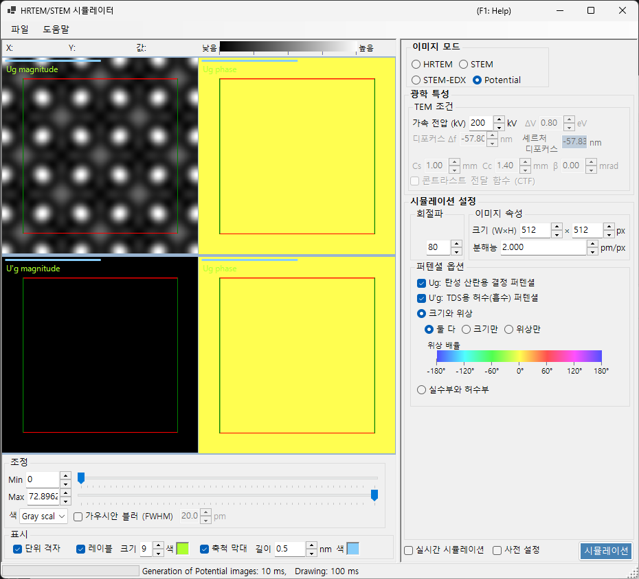

# 퍼텐셜 시뮬레이션

**퍼텐셜 시뮬레이션**은 결정 퍼텐셜의 2D 분포를 계산하여 표시합니다. 상 전달 효과(렌즈 수차, 검출기)는 적용되지 않습니다. 투영된 결정 퍼텐셜 자체를 시각화합니다.

> 이 페이지는 **Image mode = Potential**일 때 오른쪽에 나타나는 모든 설정을 다룹니다. 결과 표시, 밝기 조정 및 왼쪽의 그 밖의 컨트롤에 대해서는 [개요 페이지](index.md#display-settings)를 참조하십시오.

---

## 개요

결정 내부의 전자는 결정 퍼텐셜에 의해 산란됩니다. 그 분포는 모든 회절 및 결상 현상의 바탕이 되며, 결정 구조를 이해하기 위한 핵심 정보입니다. 이 모드는 렌즈 수차도, 두께 의존적인 동역학적 효과도 포함하지 않으므로, 구조 자체를 살펴보기에 적합합니다.

> **퍼텐셜 모드에서는 시료 두께, 강도 정규화, 이미지 모드(single / serial) 패널이 표시되지 않습니다.** TEM 조건 중에서는 가속 전압만 활성화됩니다.

---

## TEM 조건

- **Acc. voltage (kV)** — 가속 전압. 전자 파장을 결정하며, 퍼텐셜의 푸리에 계수 $U_g$를 계산하는 데 사용됩니다.

> **Defocus, Cs, Cc, β, ΔE 및 PCTF는 퍼텐셜 모드에서 비활성화되며**(결상 광학이 적용되지 않음) 흐리게 표시됩니다.

---

## 퍼텐셜 옵션

어떤 퍼텐셜을 어떻게 표시할지 선택합니다.

### 대상 퍼텐셜

| 종류 | 설명 |
|------|-------------|
| **$U_g$ — elastic scattering potential** | 탄성 산란을 일으키는 (정전기적) 결정 퍼텐셜입니다. 산란 강도를 나타냅니다 |
| **$U'_g$ — absorption potential** | 열 확산 산란(TDS)에서 발생하는 허수(흡수) 퍼텐셜입니다. 탄성 채널로부터의 손실을 나타냅니다 |

$U_g$와 $U'_g$는 동시에 표시할 수 있습니다(체크된 각 항목마다 창이 하나씩 추가됩니다).

### 표시 방법

| 모드 | 옵션 |
|------|---------|
| **Magnitude and phase** | **Both** / **Magnitude only** / **Phase only** (위상은 컬러 휠로 렌더링되며, 아래에 위상 척도가 표시됩니다) |
| **Real and imaginary part** | **Both** / **Real only** / **Imaginary only** |

---

## 이미지 속성

- **Size (W×H)** — 생성되는 이미지의 픽셀 크기(기본값 512×512).
- **Resolution** — 샘플링 해상도(pm/px).

---

## 회절파

- **Max Bloch waves** — 퍼텐셜의 푸리에 합성에 포함되는 블로흐파(푸리에 계수)의 최대 개수(기본값 80). 값이 클수록 더 높은 공간 주파수가 포함되어 퍼텐셜의 미세한 세부를 재현합니다.

---

## 이미지 조정(왼쪽)

밝기(Min / Max), 컬러 척도 및 단위 격자 그리드 오버레이는 왼쪽의 **Adjust**와 **Display**에서 설정합니다(자세한 내용은 [개요 페이지](index.md#display-settings) 참조).

---

## 함께 보기

- [HRTEM/STEM 시뮬레이터(개요)](index.md)
- [HRTEM 시뮬레이션](1-hrtem-simulation.md)
- [STEM 시뮬레이션](2-stem-simulation.md)
