# HRTEM / STEM Simulator

**HRTEM/STEM 시뮬레이터**는 TEM 격자무늬(HRTEM) 이미지, STEM 이미지, 투영 퍼텐셜을 시뮬레이션합니다. 계산을 실행하려면 **Simulate**를 클릭하십시오.

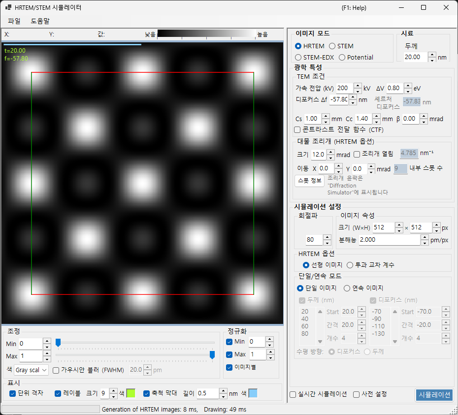

---

## 키보드 및 마우스 단축키

결과는 하나 이상의 이미지 창으로 표시됩니다. 이들은 ReciPro의 표준 [이미지 보기 탐색](../21-shortcuts.md)을 사용하며, 모든 창이 함께 이동하고 확대/축소됩니다.

| 단축키 | 동작 |
|----------|--------|
| <kbd>F1</kbd> | 온라인 매뉴얼의 이 페이지 열기 |
| <kbd>CTRL</kbd>+<kbd>C</kbd> (이미지 그리드에 포커스) | 이미지를 메타파일로 클립보드에 복사 |
| 왼쪽 드래그 / 가운데 드래그 | 이미지 이동 (모든 창이 함께 이동) |
| 마우스 휠 위 / 아래 | 커서 위치에서 확대 (×2) / 축소 (×0.5) |
| 마우스 오른쪽 버튼으로 사각형 드래그 | 선택한 영역으로 확대 |
| 마우스 오른쪽 클릭 / 오른쪽 더블 클릭 | 축소 (×0.5) |
| <kbd>CTRL</kbd> + 마우스 오른쪽 버튼으로 사각형 드래그 | 직사각형 영역 선택 |
| 창을 왼쪽 더블 클릭 | 해당 창 최대화 / 그리드 복원 (다중 창 레이아웃) |
| 마우스 이동 (버튼 없음) | 커서 위치의 좌표(pm)와 픽셀 값 읽기 |

→ 모든 창을 한눈에 보려면 **[21. 키보드 및 마우스 단축키](../21-shortcuts.md)**를 참조하십시오.

---

## 목표별 빠른 경로

| 목표 | 시작 지점 | 참조 |
|------|------------|-----------|
| HRTEM 이미지 하나 계산 | **Image mode**를 **HRTEM**으로 설정한 다음, **TEM conditions**에서 가속 전압과 디포커스를 설정 | [HRTEM 시뮬레이션](1-hrtem-simulation.md), [HRTEM 결상](../appendix/a3-bloch-wave/hrtem.md) |
| STEM 이미지 계산 | **Image mode**를 **STEM**으로 설정한 다음, **STEM options**에서 수렴각과 검출기를 설정 | [STEM 시뮬레이션](2-stem-simulation.md), [STEM 계산](../appendix/a3-bloch-wave/stem.md) |
| 투영 퍼텐셜 보기 | **Image mode**를 **Potential**로 설정 | [퍼텐셜 시뮬레이션](3-potential-simulation.md) |
| 두께/디포커스 시리즈 생성 | **Single / Serial**과 **HRTEM options**의 이미지 조건을 구성 | [HRTEM 시뮬레이션](1-hrtem-simulation.md) |
| TDS와 함께 HAADF-STEM 사용 | 원자 온도 인자를 0이 아닌 값으로 설정하고 LAADF/HAADF 검출기를 사용 | [STEM 계산](../appendix/a3-bloch-wave/stem.md) |

---

## 기본 작업 흐름

1. 메인 창에서 결정과 방위를 선택한 다음, 이 시뮬레이터를 엽니다.
2. **Image mode**에서 HRTEM, STEM 또는 Potential을 선택합니다.
3. **Optical property**에서 가속 전압, 디포커스, 수차, 조리개, STEM 수렴 설정을 지정합니다.
4. **Simulation property**에서 두께, 이미지 크기, 해상도, 블로흐파 개수, 부분 가간섭성 모델을 설정합니다.
5. **Simulate**를 클릭한 다음, **Display settings**에서 밝기, 정규화, 축척 막대, 레이블을 조정합니다.

---

## 이미지 영역

창의 왼쪽 절반에 시뮬레이션된 이미지가 표시됩니다. 위쪽의 상태 표시줄은 커서 위치(**X:**, **Y:**)와 커서 아래의 이미지 **Value:**(강도)를 보고하며, 그 옆에는 현재 색상 맵과 밝기 범위를 반영하는 **Low → High** 강도 척도가 표시됩니다.

---

## 파일 메뉴

### 도움말 메뉴

---

## Image mode / Sample

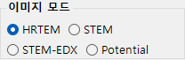{align=left}

HRTEM, Potential 또는 STEM.

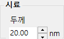{ align=left style="clear: both" }
시료 두께를 설정합니다.

## Optical property { style="clear: both" }

### TEM conditions

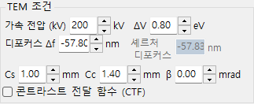

가속 전압, 디포커스(Scherzer 표시).

#### Acc. voltage

전자 현미경의 가속 전압. 이 값을 변경하면 상대론적으로 보정된 파장(필드 옆에 표시)이 갱신되며, **Cs**와 함께 아래에 표시되는 권장 **Scherzer 디포커스** 값도 갱신됩니다.

#### Defocus

대물렌즈의 디포커스 값. Scherzer 디포커스(약위상물체 근사에서 위상 대비 전달을 최대화하는 값)가 참조용으로 아래에 표시됩니다.

### Inherent property (HRTEM optical aberrations)

렌즈 함수 계산에 사용되는 현미경 고유의 수차 파라미터.

- **Cs** — 구면 수차 계수.
- **Cc** — 색 수차 계수.
- **β** — 조명 반각(유한 광원 효과).
- **ΔE** — 전자 에너지 변동의 1/e 폭.

### Lens function

렌즈 함수의 그래프. *u*의 상한을 조정하면 그리기 범위가 변경됩니다.

- **sin[χ(u)]** — 위상 대비 전달 함수(PCTF).
- **E_s(u)** — 공간 가간섭성 포락선 함수.
- **E_c(u)** — 시간 가간섭성 포락선 함수.

### Objective aperture (HRTEM option)

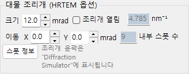

Cs, Cc, beta, delta-E, PCTF, 공간/시간 가간섭성 포락선, 대물 조리개.

#### Size

대물 조리개 크기(mrad). 조리개를 제거하려면 **Open aperture**를 선택하십시오. 블로흐파 계산에 포함되는 회절 점의 개수는 조리개에 따라 달라지며, 최댓값은 **Simulation property**의 **Max Bloch waves** 값으로 제한됩니다.

#### Shift

조리개의 수평 변위(mrad) — HRTEM에서 오프셋된 대물 조리개를 모방하는 데 사용됩니다.

#### Spot info

조리개를 통과하는 반사에 대한 상세 점 목록(강도, 복소 진폭 등)을 엽니다. 비교를 위해 회절 시뮬레이터도 함께 열려 있을 때 편리합니다.

### STEM options (optical)

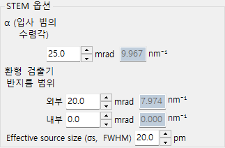

#### Convergence semi-angle

수렴 프로브의 반각(mrad). STEM 프로브의 크기와 시뮬레이션된 이미지의 공간 해상도를 제어합니다.

#### Detector geometry

환형 검출기의 내부/외부 수집각(mrad). BF(작은 내각), ABF, LAADF, HAADF(큰 내각) 중에서 선택하십시오.

#### Scan area / step

STEM 이미지의 스캔 시야와 픽셀 크기.

---

## Simulation property

### HRTEM options

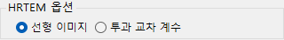

Max Bloch waves, 이미지 픽셀/해상도, 부분 가간섭성(quasi-coherent / TCC), Single/Serial 모드.

#### Max Bloch waves

동역학적 계산에 사용되는 블로흐파의 최대 개수. 이 값을 늘리면 정확도가 향상되지만 *O*(*N*³)의 고유값 풀이 시간이 늘어납니다.

#### Image property (pixels & resolution)

시뮬레이션된 이미지의 픽셀 치수와 샘플링 해상도. 해상도가 높을수록 더 세밀한 무늬 패턴을 얻지만 슬라이스당 FFT 시간은 비례하여 길어집니다.

#### Partial-coherent model

모든 입사빔 방향의 기여를 결합할 때 파동 간섭을 어떻게 처리할지를 정합니다.

- **Quasi-coherent** — 위상 대비 전달 함수에 공간 및 시간 가간섭성 포락선을 곱하는 빠르고 근사적인 모델.
- **Transmission cross coefficient (TCC)** — 전체 투과 교차 계수에 걸쳐 적분하는 더 정확한 모델. 더 느리지만 선형 결상 영역에서 정확합니다.

[부록 A3.2 — HRTEM 결상](../appendix/a3-bloch-wave/hrtem.md)을 참조하십시오.

#### Single / Serial mode

- **Single image** — **Sample property**에서 설정한 두께와 **Optical property**에서 설정한 디포커스로 단일 이미지를 시뮬레이션합니다.
- **Serial image** — 각각에 대한 **Start / Step / Num**에 따라 두께 × 디포커스 행렬을 생성합니다. 실험 이미지와 가장 잘 일치하는 조건을 찾는 데 유용합니다.

### STEM options (simulation)

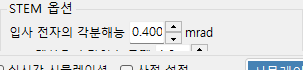

- **Bloch wave count** — HRTEM에서와 동일한 역할이며, 프로브 위치마다 적용됩니다.
- **Angular resolution** — 프로브 방향 적분에서의 표본점 개수.
- **TDS treatment** — 온도 인자 *B*를 통해 열 확산 산란을 포함할지 여부. LAADF/HAADF에 필요합니다.

### Potential options

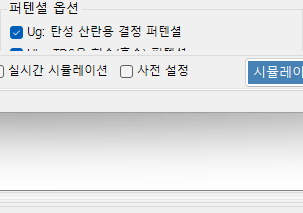

**Image mode = Potential**일 때 표시됩니다.

- **Target potential** — **U_g**(탄성) 또는 **U′_g**(흡수 / TDS)를 선택합니다.
- **Display method** — **Magnitude and phase** 또는 **Real and imaginary part**.

### Image properties

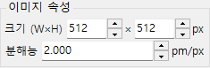

### Diffracted waves

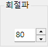

---

## Simulate

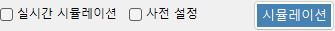

---

## Display settings

### Adjust

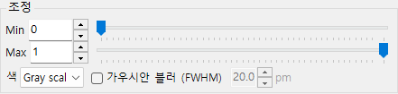

최소/최대 밝기, 색상 척도, 가우시안 흐림.

### Normalization

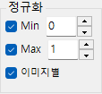

### Display

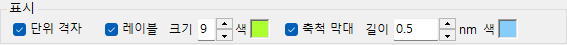

레이블(두께/디포커스), 축척 막대, 단위 격자 오버레이.

### STEM image

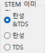

---

## STEM 시뮬레이션

계산은 수렴각, 블로흐파 개수, 각 해상도에 따라 달라집니다.

| 검출기 | 기여 |
|----------|-------------|
| BF, ABF | 탄성 |
| LAADF, HAADF | 비탄성 (TDS) |

> TDS를 위해 온도 인자를 0이 아닌 값으로 설정하십시오(확실하지 않으면 B = 0.5 Ų). HAADF 강도는 $\propto Z^2$.

더 자세한 보고서는 PDF로 제공됩니다: [Dr. Probe GUI (v1.10)와 ReciPro (v4.854)의 STEM 시뮬레이션 비교](https://github.com/seto77/ReciPro/files/10976084/ComparisonSTEMsimulations.pdf). 자세한 내용은 [STEM 시뮬레이션](2-stem-simulation.md)을 참조하십시오.

---

## 관련 항목

- [HRTEM 시뮬레이션](1-hrtem-simulation.md)
- [STEM 시뮬레이션](2-stem-simulation.md)
- [퍼텐셜 시뮬레이션](3-potential-simulation.md)
- [동역학적 회절 (블로흐파)](../appendix/a3-bloch-wave/index.md)
- [회절 시뮬레이터](../7-diffraction-simulator/index.md)
- [전자 궤적](../8-electron-trajectory.md)
