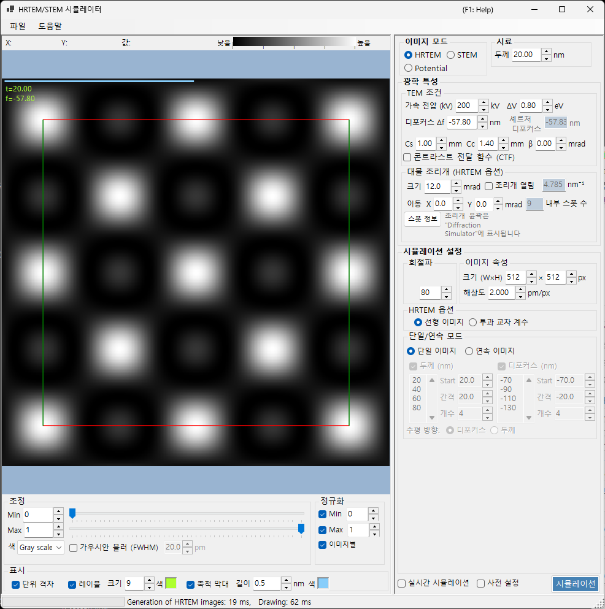
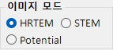
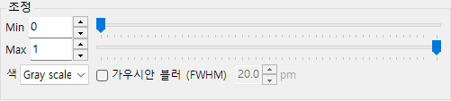
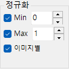
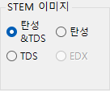
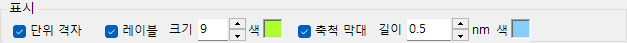
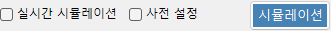
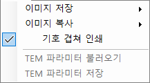
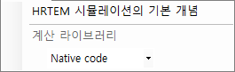

# HRTEM / STEM Simulator

**HRTEM/STEM 시뮬레이터**는 선택한 결정과 방위에 대해 TEM 격자무늬(HRTEM) 이미지, STEM 이미지, 투영 결정 퍼텐셜을 시뮬레이션합니다. 계산을 실행하려면 **시뮬레이션**을 클릭하십시오.

창은 좌우 두 부분으로 나뉩니다. **왼쪽**은 시뮬레이션 결과를 표시하고 그 표시 방식(이미지 창, 밝기, 색, 축척 막대 등)을 조정하며, **오른쪽**에는 계산 조건(**광학 특성**과 **시뮬레이션 설정**)이 있습니다.

---

## 이 페이지와 모드별 페이지

- **이 페이지(개요)**: 모든 모드에 공통인 조작과 **왼쪽의 결과 표시 및 조정 컨트롤**을 설명합니다.
- **모드별 페이지**: 해당 모드에서 **오른쪽**에 나타나는 모든 설정을 다루며, 각 페이지만 읽어도 완결되도록 구성되어 있습니다(따라서 일부 설정은 여러 페이지에 중복해서 나옵니다).

| 모드 | 내용 | 페이지 |
|------|----------|------|
| **HRTEM** | 고분해능 TEM 격자무늬 이미지 | [HRTEM 시뮬레이션](1-hrtem-simulation.md) |
| **STEM** | 주사 투과 전자 현미경 이미지 (BF / ABF / LAADF / HAADF) | [STEM 시뮬레이션](2-stem-simulation.md) |
| **Potential** | 투영 결정 퍼텐셜 ($U_g$ / $U'_g$) | [퍼텐셜 시뮬레이션](3-potential-simulation.md) |

---

## 키보드 및 마우스 단축키

결과는 하나 이상의 이미지 창으로 표시됩니다. 이들은 ReciPro의 표준 [이미지 보기 탐색](../21-shortcuts.md)을 사용하며, 모든 창이 함께 이동하고 확대/축소됩니다.

| 단축키 | 동작 |
|----------|--------|
| <kbd>F1</kbd> | 온라인 매뉴얼의 이 페이지 열기 |
| <kbd>CTRL</kbd>+<kbd>C</kbd> (이미지 그리드에 포커스) | 이미지를 메타파일로 클립보드에 복사 |
| 왼쪽 드래그 / 가운데 드래그 | 이미지 이동 (모든 창이 함께 이동) |
| 마우스 휠 위 / 아래 | 커서 위치에서 확대 (×2) / 축소 (×0.5) |
| 마우스 오른쪽 버튼으로 사각형 드래그 | 선택한 영역으로 확대 |
| 마우스 오른쪽 클릭 / 오른쪽 더블 클릭 | 축소 (×0.5) |
| <kbd>CTRL</kbd> + 마우스 오른쪽 버튼으로 사각형 드래그 | 직사각형 영역 선택 |
| 창을 왼쪽 더블 클릭 | 해당 창 최대화 / 그리드 복원 (다중 창 레이아웃) |
| 마우스 이동 (버튼 없음) | 커서 위치의 좌표(pm)와 픽셀 값 읽기 |

→ 모든 창을 한눈에 보려면 **[21. 키보드 및 마우스 단축키](../21-shortcuts.md)**를 참조하십시오.

---

## 목표별 빠른 경로

| 목표 | 시작 지점 | 참조 |
|------|------------|-----------|
| HRTEM 이미지 하나 계산 | **이미지 모드**를 **HRTEM**으로 설정한 다음, **TEM 조건**에서 가속 전압과 디포커스를 설정 | [HRTEM 시뮬레이션](1-hrtem-simulation.md), [HRTEM 이미지 형성](../appendix/a3-bloch-wave/hrtem.md) |
| STEM 이미지 계산 | **이미지 모드**를 **STEM**으로 설정한 다음, **STEM 옵션**에서 수렴각과 검출기를 설정 | [STEM 시뮬레이션](2-stem-simulation.md), [STEM 계산](../appendix/a3-bloch-wave/stem.md) |
| 투영 퍼텐셜 보기 | **이미지 모드**를 **Potential**로 설정 | [퍼텐셜 시뮬레이션](3-potential-simulation.md) |
| 두께/디포커스 시리즈 생성 | HRTEM에서 **단일/연속 모드**와 이미지 조건을 구성 | [HRTEM 시뮬레이션](1-hrtem-simulation.md) |
| TDS와 함께 HAADF-STEM 사용 | 원자 온도 인자를 0이 아닌 값으로 설정하고 STEM 검출기를 LAADF / HAADF로 이동 | [STEM 계산](../appendix/a3-bloch-wave/stem.md) |

---

## 기본 작업 흐름

1. 메인 창에서 결정과 방위를 선택한 다음, 이 창을 엽니다.
2. **이미지 모드**에서 HRTEM, STEM 또는 Potential을 선택합니다.
3. **광학 특성**에서 가속 전압, 디포커스, 수차, 조리개, STEM 수렴각 등을 설정합니다(모드별 페이지 참조).
4. **시뮬레이션 설정**에서 두께, 이미지 크기, 해상도, 블로흐파 개수, 부분 가간섭성 모델 등을 설정합니다(모드별 페이지 참조).
5. **시뮬레이션**을 클릭한 다음, 필요에 따라 왼쪽의 **조정**, **정규화**, **표시**로 표시 방식을 조정합니다.

---

## 이미지 모드 선택

{ align=left }

오른쪽 위의 **이미지 모드**에서 계산 종류를 선택합니다. 오른쪽 패널(**광학 특성**과 **시뮬레이션 설정**)은 선택한 모드에 맞게 바뀝니다.

- **HRTEM** — 고분해능 TEM 격자무늬 이미지 → [HRTEM 시뮬레이션](1-hrtem-simulation.md)
- **STEM** — 주사 투과 전자 현미경 이미지 → [STEM 시뮬레이션](2-stem-simulation.md)
- **Potential** — 투영 결정 퍼텐셜 → [퍼텐셜 시뮬레이션](3-potential-simulation.md)

---

## 이미지 영역 (왼쪽)

창의 왼쪽 절반에 시뮬레이션된 이미지가 표시됩니다. 위쪽의 상태 표시줄은 커서 위치(**X:**, **Y:**)와 커서 아래의 이미지 **값:**(강도)을 보고하며, 그 옆에는 현재 색상 맵과 밝기 범위를 반영하는 **낮음 → 높음** 강도 척도가 표시됩니다.

여러 장의 이미지가 생성되는 경우(연속 이미지, 또는 퍼텐셜의 크기/위상) 이미지는 격자 모양으로 배열되며, 모든 창이 함께 확대/축소되고 이동합니다.

---

## 결과 표시와 조정 (왼쪽 패널) {#display-settings}

왼쪽 아래의 패널에서 결과의 표시 방식 — 밝기, 색, 정규화, 오버레이 — 을 조정합니다. 이 설정은 모든 모드에 적용되며, 재계산 없이 바로 반영됩니다.

### 조정

- **Min** / **Max** : 표시 강도 범위의 하한(검정)과 상한(흰색). 트랙바로 콘트라스트를 조정합니다.
- **색** : 이미지의 색 척도 — **Gray scale** 또는 **Cold-Warm**(파랑에서 빨강).
- **가우시안 블러 (FWHM)** : 체크하면 오른쪽에 지정한 반치전폭(pm)의 가우시안 블러를 적용하여, 유한한 분해능(점 퍼짐 함수)을 근사합니다.

### 정규화

- **이미지별** : 체크하면 이미지마다 따로 정규화합니다(체크 해제 시 시리즈 전체가 공통 척도를 사용합니다).
- **Min** / **Max** : 정규화의 하한 / 상한을 이미지의 최솟값 / 최댓값 대신 오른쪽에 지정한 값으로 고정합니다.

### STEM 이미지

STEM 모드에서만 표시됩니다. 계산된 STEM 이미지 중 어떤 산란 성분을 표시할지(**탄성**, **TDS**, **탄성 & TDS**) 선택합니다. STEM 전용 항목이므로 [STEM 시뮬레이션](2-stem-simulation.md) 페이지에서도 설명합니다.

### 표시

이미지 위에 겹쳐 표시할 항목을 설정합니다.

- **단위 격자** : 투영된 단위 격자의 윤곽을 겹쳐 표시하여, 이미지 콘트라스트와 결정 격자의 대응을 확인할 수 있습니다.
- **레이블** : 두께, 디포커스, 지수 등의 레이블을 겹쳐 표시합니다. **크기**(글꼴 크기)와 **색**을 지정할 수 있습니다.
- **축척 막대** : 축척 막대를 겹쳐 표시합니다. **길이**(nm)와 **색**을 지정할 수 있습니다.

---

## 시뮬레이션 실행

- **시뮬레이션** : 현재의 결정, 현미경 조건, 두께, 디포커스, 표시 설정으로 계산을 실행합니다.
- **정지** : 실행 중인 계산을 중단합니다(계산 중에만 표시).
- **실시간 시뮬레이션** : 체크하면 결정을 회전할 때마다 즉시 재계산합니다(STEM 모드에서는 숨겨짐).
- **사전 설정** : TEM 결상 조건을 저장하고 불러오는 사전 설정 창을 표시/숨김 전환합니다.

---

## 파일 메뉴

- **이미지 저장** : **이미지로 (PNG 형식)**, **이미지로 (TIFF 형식)**, **메타파일로 (EMF)** 중 하나로 저장합니다. **연속 이미지 모드에서 개별 저장**은 연속 계산의 이미지를 한 장씩 따로 저장합니다.
- **이미지 복사** : **이미지로** 또는 **메타파일로 (EMF)** 클립보드에 복사합니다.
- **기호 겹쳐 인쇄** : 단위 격자, 레이블, 축척 막대를 저장 이미지에 합쳐 넣습니다.
- **TEM 파라미터 불러오기** / **TEM 파라미터 저장** : 광학 조건(가속 전압, 수차 등)을 파일에 저장하고 복원합니다.

## 도움말 메뉴

- **HRTEM 시뮬레이션의 기본 개념** : HRTEM 이미지 형성에 대한 설명([부록 A3.2](../appendix/a3-bloch-wave/hrtem.md))을 엽니다.
- **계산 라이브러리** : 계산 라이브러리를 선택합니다 — **Native code**(빠른 C++/Eigen) 또는 **Managed code**(.NET). 보통은 Native 쪽이 더 빠릅니다.

---

## 함께 보기

- [HRTEM 시뮬레이션](1-hrtem-simulation.md)
- [STEM 시뮬레이션](2-stem-simulation.md)
- [퍼텐셜 시뮬레이션](3-potential-simulation.md)
- [동역학적 회절 (블로흐파)](../appendix/a3-bloch-wave/index.md)
- [회절 시뮬레이터](../7-diffraction-simulator/index.md)
- [전자 궤적](../8-electron-trajectory.md)
