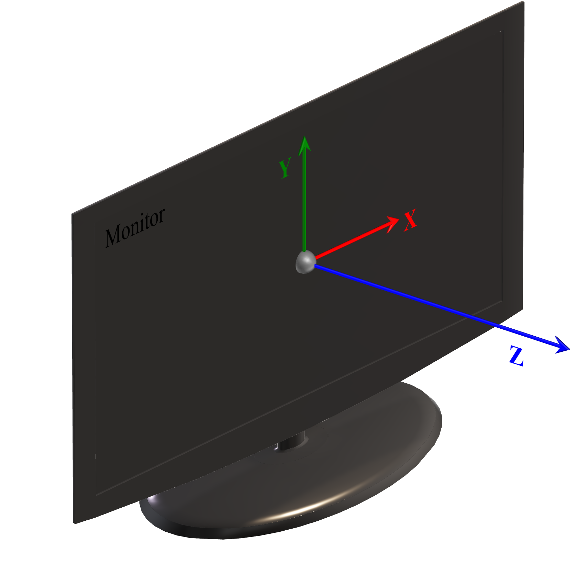
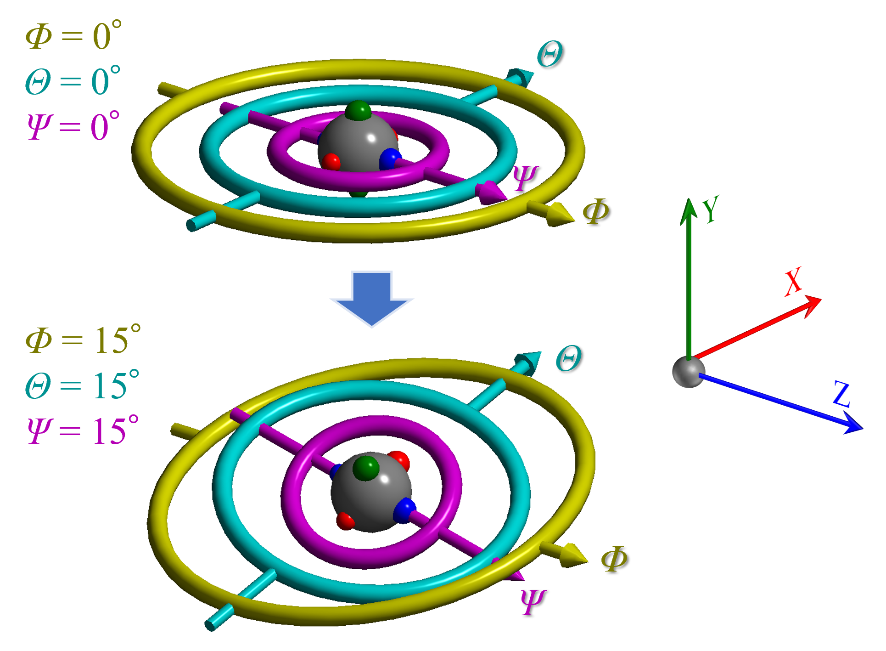

# 부록 A1.1. 기본 좌표계와 결정 방위

<!-- 260526Cl: 図(Coordinates1-3)に合わせ座標記号を数式(MathJax)化・用語色を図に一致 (.rp-*: docs/src/assets/stylesheets/extra.css)。 -->

이 페이지는 결정 회전이 관여하는 모든 곳(메인 창, 구조 뷰어, 스테레오넷, 회전 기하학, 회절 시뮬레이션)에서 사용되는 ReciPro의 **기본 (방위) 좌표계**를, 결정의 초기 방위와 오일러 각 회전이 어떻게 표현되는지와 함께 정의한다. **회절 시뮬레이터**에서 검출기를 배치하는 데 사용되는 별도의 좌표계는 [A1.2. 회절 시뮬레이션을 위한 좌표계](2-diffraction.md)에서 설명한다.

---

## 방위의 정의

ReciPro는 모니터에 고정된 **오른손 좌표계**를 사용한다:

| 축 | 방향 |
|------|-----------|
| $X$ | 모니터의 오른쪽 |
| $Y$ | 모니터의 위쪽 |
| $Z$ | 모니터에서 수직으로 나와 관찰자를 향하는 방향 |

{width=400px}

**빔 방향**은 시선 방향(모니터 안쪽을 들여다보는 방향), 즉 $-Z$ 축에 대응한다.

ReciPro의 대부분의 연산은 *방향*(3×3 회전 행렬로 표현됨)만 관여하며 명시적인 원점을 필요로 하지 않는다. 유일한 예외는 명시적인 원점을 필요로 하는 **회절 시뮬레이터** 기능이다 — [A1.2. 회절 시뮬레이션을 위한 좌표계](2-diffraction.md)를 참조하라.

## 초기 결정 방향

초기 방위(최초 실행 시 또는 **회전 초기화** 후)는 다음과 같이 정의된다:

1. $c$ 축은 $Z$ 축에 정렬된다.
2. $b$ 축은 $Y$$Z$ 평면 안에 놓이며, $Y$ 축에 가깝다.
3. $a$ 축은 이어서 $b$ 축과 $c$ 축에 의해 결정된다(오른손 법칙).

{width=300px}

같은 의미로:

- 모니터에서 밖으로 나오는 방향(관찰자를 향하는 방향)은 **[001]** 정대축이다.
- 모니터에서 오른쪽 방향은 **(100)** 평면의 법선이다.

> **참고:** $c$ 축(= [001])은 항상 $Z$ 와 일치하지만, 일부 결정계에서는 $a$ 축과 $b$ 축이 반드시 $X$ 와 $Y$ 에 일치하지는 **않는다**.

## 오일러 각

결정 방위는 세 개의 오일러 각 $\Phi$, $\theta$, $\Psi$ 로 표현되며, $Z$–$X$–$Z$ 순서로 적용된다($\Psi$, 그다음 $\theta$, 그다음 $\Phi$). 세 각이 모두 0일 때, 대응하는 회전축은 다음과 같다:

| 각 | 축 (모든 각 = 0일 때) | 순위 |
|-------|----------------------------|------|
| $\Phi$ | $Z$ | 1번째 (가장 높음) |
| $\theta$ | $X$ | 2번째 (중간) |
| $\Psi$ | $Z$ | 3번째 (가장 낮음) |

{width=400px}

세 각은 **계층**을 이룬다: $\Phi$ 가 가장 높은 회전이고, 그다음이 $\theta$, 그다음이 $\Psi$ 이다. 낮은 축의 방향은 높은 회전들의 상태에 따라 달라진다. 예를 들어 $\Phi$ = $\theta$ = $\Psi$ = 15° 일 때, $\Phi$ 축은 여전히 $Z$ 와 일치하지만, $\theta$ 축과 $\Psi$ 축은 일반적으로 $X$, $Y$, $Z$ 중 어느 것과도 일치하지 않는다.

> **회전 기하학** 창은 이 방위를 임의의, 실험에 특화된 오일러 각 규약으로 다시 표현할 수 있다(예: 실험실 고니오미터에 맞추기 위해). [4. 회전 기하학](../../4-rotation-geometry.md)을 참조하라.
