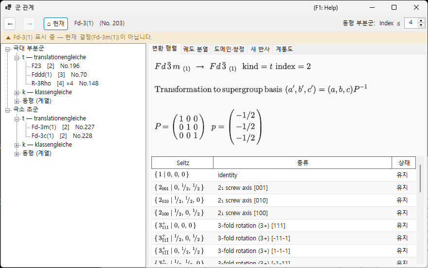
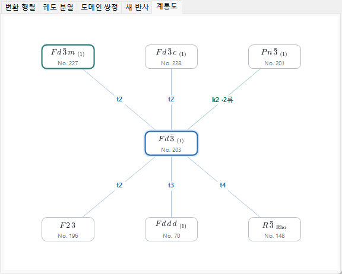
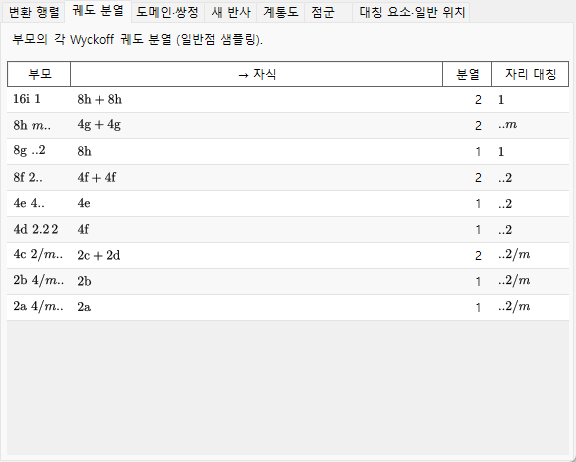
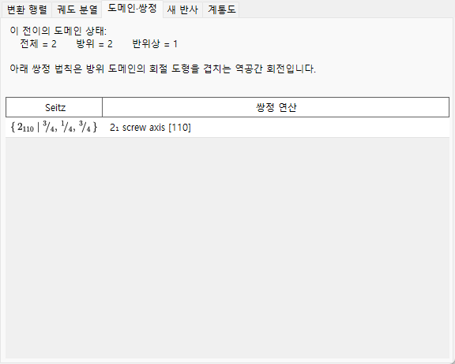

# A4.2. 군-부분군 관계

**군 관계...**(Group Relations...)는 230개 공간군 유형의 극대 부분군/극소 초군 관계를 열람하는 브라우저로, [대칭 정보](../../2-symmetry-information.md)의 **옵션** 패널에서 엽니다. 정적인 표와 달리 여기 표시되는 모든 관계는 현재 공간군 자신의 대칭 연산([A4.1](symbols-and-diagrams.md#대칭-연산-대칭-연산-탭) 참조)으로부터 실행 시점에 직접 계산되므로, *International Tables* Vol. A1의 전사(轉寫)로 그저 믿는 대신 연산 하나하나까지 교차 검증할 수 있습니다.

이 페이지는 먼저 브라우저가 쓰는 군론 어휘를 설명한 다음, 각 탭을 차례로 살펴봅니다.

---

## Hermann의 정리: *t*-, *k*-, 그리고 동형 부분군

부분군 $H<G$가 **극대(maximal)**라는 것은 $G$의 어떤 부분군도 $H$와 $G$ 사이에 엄격하게 놓이지 않는다는 뜻입니다. Carl Hermann의 정리(1929)에 따르면, 여기서 다루는 3차원 공간군에서는 공간군 $G$의 모든 극대 부분군이 다음 두 종류 중 하나입니다.

- **translationengleiche(*t*-) 부분군** — "병진이 같음": $H$는 $G$의 병진을 *모두* 유지하지만(같은 격자, 같은 단위 격자), 더 작은 점군을 갖습니다. 지수 $[G:H]$($G$에서 $H$의 잉여류 개수)는 점군 지수 $[P_G:P_H]$와 같습니다.
- **klassengleiche(*k*-) 부분군** — "류가 같음": $H$는 $G$와 *같은 기하학적 결정류*(점군 유형)를 유지하지만, $G$의 병진 중 부분 격자만 갖습니다 — 더 큰 관용 단위 격자, 그리고/또는 더 적은 중심화 벡터. 지수는 병진 격자 지수 $[T_G:T_H]$와 같습니다.

**동형 부분군(isomorphic subgroup)**은 $H$가 추가로 $G$ 자신과 *같은 공간군 유형*이기도 한(단지 단위 격자만 커진) *k*-부분군의 특별하고 중요한 경우입니다 — 이 관계는 한없이 반복되므로, 동형 부분군은 주어진 $G$에 대해 유한 개뿐인 *t*- 및 비동형 *k*-부분군과 달리 격자 크기로 지표가 붙는 무한 계열을 이룹니다. *극대* 동형 부분군의 지수는 항상 소수의 거듭제곱($p$이며, 3차원에서는 이따금 $p^2$이나 $p^3$)입니다. 어느 거듭제곱이 나타나는지는 유한한 몫 격자가 점군의 작용 아래 가군으로서 어떻게 분해되는지에 달려 있습니다. 또한 부분 격자로의 기저 변경은 한 축 방향으로 단위 격자를 균일하게 키우는 것에 그치지 않고, 진짜 기저 벡터 교체와 원점 이동을 동반할 수 있다는 점도 유의하십시오.

(극대이든 아니든) 모든 유한 지수 부분군 관계는 극대 단계들의 연쇄로 도달할 수 있으므로, 극대 부분군(그리고 반대 방향으로는 극소 초군)만 나열하면 유한 지수 부분군 관계의 전체 연결망을 기술하기에 충분합니다 — 바로 이것이 ITA Vol. A1도, 이 브라우저도 극대/극소 관계만 표로 만드는 이유입니다.

!!! note "종류는 둘뿐 — 동형은 제3의 종류가 아니라 하위 분류"
    마치 세 종류가 대등한 것처럼 "*t*-, *k*-, 동형 부분군"이라고 말하는 것이 흔한 약칭이고, 실제로 이 브라우저의 트리도 편의상 세 가지로 나뉘어 있습니다. 하지만 형식적으로 Hermann의 정리는 **2**분법(*t*냐 *k*냐)입니다. 동형 부분군은 그저 $G$ 자신의 공간군 유형을 재현하게 된 *k*-부분군일 뿐입니다.

### 지수는 잉여류의 개수

공간군은 (병진을 포함하므로) 무한군이어서, 여기서 "지수"는 항상 **$G$에서 $H$의 잉여류(coset) 개수**를 뜻하며, 위수의 비 $|G|/|H|$(둘 다 무한)를 뜻하지 않습니다 — 유한군에서는 두 개념이 일치하지만, 공간군에서는 잉여류를 세는 정의만이 의미를 갖습니다. 트리와 변환 행렬 탭은 이 지수를 예컨대 `t, index 2`나 `k, index 3`처럼 표시합니다.

### 켤레 부분군과 켤레류

하나의 추상적 부분군 관계가 $G$ 안에서 기하학적으로 서로 다른 여러 방식 — 유형이 아니라 방향이나 위치가 다른 형태, 예컨대 거울면의 거울상이라든가, 대칭적으로 등가이지만 다른 방향을 향한 나선축 — 으로 실현되는 일은 흔합니다. 그런 두 실현 $H$와 $H'$가 어떤 $g\in G$에 대해 $H' = gHg^{-1}$를 만족하면 둘은 **$G$ 안에서** 켤레입니다. 브라우저는 한 관계의 이러한 $G$-켤레 복사본을 모두 하나의 항목으로 묶고, 그 개수를 *켤레류*의 크기로 보고합니다. 이는 ITA 자신이 대신 쓰기도 하는, $G$의 유클리드 또는 아핀 정규화군 아래에서의 (더 성긴) 동치로 부분군을 묶는 분류보다 엄격히 더 세밀한 분류입니다. 그래서 같은 유형과 지수를 공유하는 부분군이라고 해서 자동으로 하나의 켤레류에 속하는 것은 아니며, 여러 류로 갈라질 수 있습니다.

---

## 브라우저 탐색

- **트리**(왼쪽 창)에는 **극대 부분군**과 **극소 초군**이라는 두 개의 뿌리가 있고, 각각 **`t — translationengleiche`** 가지, **`k — klassengleiche`** 가지, **`동형 (계열)`** 가지로 나뉩니다. 같은 자식 유형과 지수를 공유하는 비켤레 류들은 그대로 두면 라벨이 똑같아지므로, `· 클래스 n` 접미사로 구별합니다. 극대 부분군의 **동형** 가지에서는 $G$의 *아핀 정규화군* 아래에서 동치인 켤레류들이 추가로 하나의 궤도 행(*"… — m개 류 (normalizer 동치)"*)으로 묶입니다 — ITA Vol. A1의 IIc 항목과 같은 세분 수준입니다. 열거 상한은 도구 모음의 **동형 부분군:  index ≤** 스피너로 설정합니다(2~27, 기본값 4이며 더 높은 상한은 백그라운드에서 계산됩니다).
- **계통도** 탭은 단순화된 Bärnighausen 계통도풍의 골격을 그립니다: 가운데에 현재 군(강조 표시), 그 위에 극소 초군, 아래에 극대 부분군을 배치합니다 — ***t*-, *k*-, 동형 관계 모두** 각각이 하나의 "극대 한 단계"이기 때문입니다. 모든 변에는 종류와 지수 라벨(`t2`, `k3`, `i3`)이 붙고, *t*는 파란색, *k*는 청록색, 동형은 주황색으로 구분됩니다. 노드 기호는 나선축의 아래 첨자, 회전반전의 윗줄까지 갖춘 정식 결정학 기호로 조판됩니다. 같은 대상 유형·종류·지수를 공유하는 비켤레 류들은 하나의 노드로 병합되고 변 라벨에 류 수가 덧붙습니다(예: `k2 ·2류`) — 각 류를 개별적으로 살펴보는 곳은 여전히 트리입니다. 한 행에 창 너비보다 많은 관계가 있으면 노드가 한 단계 줄어들고, 그래도 남는 것은 파선 `+N` 노드로 모입니다(클릭 불가 — 전체 목록은 트리에서 확인하십시오). 동형 변이 표시되어 있을 때는 구석에 작은 `i: index ≤ 4만` 알림이 나타나고, *k*-초군 역탐색이 아직 구축 중일 때는 `k: 계산 중…`이 나타납니다. 두 번 클릭으로 부분군을 따라 내려가면, 거쳐 온 군들의 사슬(*선택한 가지*)이 현재 군 위에 보라색 세로 열로 그려집니다 — 자신이 밟아 온 전이 경로의 다층 Bärnighausen 계통도(예: $Pm\bar3m \rightarrow P4/mmm \rightarrow Pmmm \rightarrow \ldots$)이며, 각 변에는 그때 택한 관계가 라벨로 붙습니다. 위로 올라가거나 **뒤로**를 누르면 가지가 그에 맞춰 잘려 나가고, 조상이 셋을 넘는 사슬은 흐리게 표시된 `⋮ +N`으로 축약됩니다. 여기서 보여 주는 것은 군론적 골격뿐입니다 — 구조 관계라는 본래 의미의 완전한 Bärnighausen 계통도는 각 변에 단위 격자 변환, Wyckoff 분열, 원자 좌표 상관까지 싣지만, 그것들은 계통도 자체가 아니라 아래에 설명하는 다른 탭들에 들어 있습니다.
- **한 번 클릭**(트리 노드 또는 계통도 노드)은 관계를 선택하고 아래의 상세 탭을 채웁니다. **두 번 클릭**은 *이동*합니다: 브라우저 전체를 그 공간군을 뿌리로 다시 구성하므로, 군에서 부분군으로, 다시 그 부분군으로 한 걸음씩 걸어갈 수 있습니다.
- **뒤로 / 앞으로 / 현재**는 탐색 이력을 오갑니다. **현재**는 언제나 이 브라우저를 실제로 열었던 결정의 공간군으로 돌아갑니다.
- 상단의 **탐색 경로(breadcrumb)**에는 현재 표시 중인 공간군(`HM 기호 (No. n)`)이 표시됩니다. 그 아래의 **컨텍스트 배너**는 그것이 현재 결정과 일치하면 초록색("현재 결정의 공간군을 표시 중입니다.")이 되고, 다른 곳으로 이동해 있으면 호박색("… 표시 중 — 현재 결정(…)이 아닙니다.")이 됩니다 — 부분군을 열람해도 결정 자체는 바뀌지 *않는다*는 알림입니다.

---

## 변환 행렬 탭

부모 설정과 자식 설정 사이의 기저 변환과 원점 이동을 ITA 규약 — 새 기저 벡터는 $(\mathbf a',\mathbf b',\mathbf c')=(\mathbf a,\mathbf b,\mathbf c)\cdot P$, 한 점의 부모 설정 좌표는 $\mathbf x_{\text{parent}} = P\,\mathbf x_{\text{child}} + \mathbf p$ — 으로 보여 줍니다. $3\times3$ 행렬 $P$와 원점 이동 $\mathbf p$는 분수로 표시됩니다.

- **극대 부분군**에서 이 관계에 도달했다면 $P$와 $\mathbf p$가 그대로(부모 → 자식 방향) 표시됩니다.
- 반대로 **극소 초군**에서 도달했다면, 탭은 $P^{-1}$(및 그에 맞게 반전된 이동)을 *"초군 자체의 부분군 표에서 산출"*이라는 설명과 함께 표시합니다 — 브라우저는 관계를 언제나 더 큰 군의 관점에서 저장해 두고 필요할 때 뒤집으며, 두 개의 독립된 사본을 따로 관리하지 않습니다.
- **이 클래스의 켤레 부분군 수: $n$**은 위에서 설명한 켤레류의 크기를 보고합니다.
- 생성원 표는 모든 잉여류 대표원을 **유지**($H$에 여전히 존재) 또는 **소실**($G$에는 있으나 $H$에는 없음 — 바로 이 연산들이 대칭 깨짐의 장본인입니다)로 표시해 나열하며, 각 연산에는 [A4.1](symbols-and-diagrams.md#대칭-연산-대칭-연산-탭)에서 소개한 Seitz 기호와 기하학적 종류 설명이 붙습니다.
- 후보 관계의 대상 공간군 유형을 ReciPro의 카탈로그와 대조해 동정하지 못한 경우, 탭은 추측으로 채우는 대신 그 사실을 분명히 알리고 점군 기호만 표시합니다.

---

## 궤도 분열 탭

*부모* 군의 각 Wyckoff 위치가 대칭이 $H$로 낮아질 때 어떻게 분열하는지 보여 줍니다: 부모 위치 하나당 한 행으로, 부모의 다중도/문자/자리 대칭, 그 결과 생기는 자식의 다중도/문자(궤도가 둘 이상으로 갈라지면 `+`로 연결), 몇 조각으로 갈라졌는지, 그리고 서로 다른 자식 자리 대칭이 나열됩니다.

이는 **하나의 고정된 일반점(generic point)**을 두 군의 연산에 실제로 대입하고 그 결과 궤도를 비교해 계산합니다 — (WYCKSPLIT 같은 도구가 쓰는) 완전한 기호적 Wyckoff 분열 형식화가 아니라 수치적으로 *샘플링된* 분열이며, 바로 그런 이유에서 이 탭은 의도적으로 "Wyckoff 분열"이 아니라 "궤도 분열"이라 이름 붙였습니다 — 완전히 기호적인 처리라면 원리상 모든 특수 매개변수에서의 일치까지 추적할 수 있지만, 이 샘플링 방식은 하나의 일반점에서 보이는 분열만 보고하며, $x,y,z$의 특수한 값에서만 생기는 일치를 그 자체로는 짚어 내지 못합니다.

***k*- 또는 동형 관계**에서는 같은 샘플링 방식이 더 성긴 병진 격자에 적용됩니다: 탭은 격자 병진이 사라지면서 부모의 각 궤도가 어떻게 분열하는지 보여 주고, 자식의 다중도는 **확대된 부분군 셀 기준**으로 셉니다(따라서 지수 $n$의 격자 확대에서는 조각들의 다중도 합이 부모 다중도의 $n$배가 됩니다).

---

## 도메인·쌍정 탭

결정이 $G$에서 부분군 $H$로 변태할 때, $G$에서 $H$의 $[G:H]$개 잉여류 각각이 하나의 가능한 **도메인 상태**에 대응합니다: 기준 상태는 항등 잉여류이고, 나머지 각 잉여류는 — 변환 행렬 탭의 "소실" 연산 하나로 대표되어 — 그 연산에 의해 기준 상태와 연결되는 도메인 상태를 하나씩 더 만들어 냅니다.

특히 ***t*-부분군**에서는 병진 격자가 변하지 않으므로($T_G=T_H$), 군론적으로는 여기에 **반위상(병진) 도메인**이라는 것이 존재하지 않습니다 — 모든 도메인 상태는 단순한 이동이 아니라 반드시 진짜 점군 연산에 의해 기준 상태와 달라집니다. 그래서 이 탭은 항상 `반위상 = 1`, `방위 = 전체`라고 보고합니다. 즉 $[G:H]$개의 도메인 상태 전부가 **방위 도메인**입니다.

***k*- 또는 동형** 전이에서는 상황이 정확히 반대입니다: 점군이 변하지 않으므로 **방위 상태는 하나뿐**이고, 잃어버린 격자 병진이 **반위상(병진) 도메인**을 만듭니다 — 탭은 `방위 = 1`, `반위상 = 전체`라고 보고합니다. 잃어버린 각 병진은 순수 병진의 Seitz 기호로 나열되고, 부분군 셀 기준으로 표현한 해당 반위상 벡터가 함께 표시됩니다. 모든 반위상 도메인은 같은 방위를 공유하므로 기본 반사는 정확히 겹치며, 반위상 경계를 사이에 두고 위상차를 갖는 것은 초격자 반사(**새 반사** 탭 참조)뿐입니다.

한 쌍의 방위 도메인에 대한 **쌍정 법칙**은 소실된 연산의 행렬부 — 직접 격자 또는 역격자에 작용하는 회전이나 반사로 표현됩니다 — 로서, 한 도메인의 격자 방위를 다른 도메인의 방위로 옮깁니다. *t*-부분군 전이에서 이 연산은 구성상 *부모* 군 $G$의 격자 대칭 그 자체이므로, 저대칭 구조의 실제 계량이 그 격자 대칭을 여전히 갖고 있다면 쌍정 연산 후 두 도메인의 역격자는 정확히 일치하고 회절 패턴은 완전히 겹칩니다 — 이 탭이 기술하는 것은 이 이상화된 경우, 즉 *메로헤드럴(merohedral)* 쌍정입니다. 실제 전이에서는 저대칭상이 보통 작은 자발 변형을 일으켜 부모의 계량을 근사적으로만 유지하므로, 실제로는 겹침이 근사적인 데 그치는 일이 많습니다(*유사 메로헤드럴(pseudo-merohedral)* 쌍정). 이 탭이 보고하는 것은 군론적·정확 계량에서의 쌍정 법칙이지, 특정한 실제 결정이 그에 얼마나 가까운지에 대한 측정값이 아닙니다.

잉여류 목록이 비는 퇴화된 경우는 `(단일 도메인)`으로 보고됩니다(지수 1은 관계로 표시되지 않습니다).

---

## 새 반사 탭

*t*-부분군 전이에 대해, $G$에서는 계통적으로 소멸했지만 $H$에서는 대칭성상 허용되는 반사를 나열합니다 — 즉 부모의 반사 조건([조건](../../2-symmetry-information.md) 탭 참조)은 금지하지만 $H$의 조건은 금지하지 않는 반사입니다. 탐색 범위는 탭의 **탐색 범위** 스피너로 설정합니다: 기본값은 $|h|,|k|,|l|\le4$이며 2~8 사이에서 조정할 수 있습니다(상한을 키우면 행 수가 크게 늘 수 있습니다).

*t*-부분군은 단위 격자를 결코 키우지 않으므로 이들은 초구조/분수 지수 반사가 **아닙니다** — 부모 격자의 정수 $(h,k,l)$ 그대로이며, 그것들을 소멸시키던 글라이드 면이나 나선축이 더는 존재하지 않게 되어 비로소 *허용*되는 것뿐입니다. (부모 지수가 분수가 되는 진짜 초구조 반사는 단위 격자 자체가 커져야 가능하며, 그것은 *t*-부분군이 아니라 *k*-부분군에서 일어납니다.) 여기에 나타나는 반사는 대칭성상 *허용*될 뿐이므로, 실제로 관측되는지는 여전히 실제 저대칭 구조의 구조 인자에 달려 있습니다.

***k*- 또는 동형 관계**에서는 이 탭이 새 반사를 **확대된 부분군 셀로 지수화하여**(역시 탐색 범위 내에서) 나열하고, 마지막 열에서 각각을 분류합니다:

- **초격자 반사**는 부모 지수로 환산하면 *분수*가 되며, 괄호 안에 표시됩니다(예: `(1/2 0 1)`) — 순전히 단위 격자가 커졌기 때문에 나타나는 반사입니다;
- **해제된 반사**는 부모 격자에서도 정수 지수이지만 부모의 반사 조건에 의해 금지되어 있다가 부분군에서 그 조건이 풀린 것으로, 대신 해제된 부모 소멸 규칙이 표시됩니다(중심화 병진의 상실 — 예컨대 $I$ 심 부모가 $h+k+l$ 짝수 조건을 잃는 경우 — 도 여기에 포함됩니다).

부모와 자식 모두에서 허용되는 반사(기본 반사)는 나열하지 않습니다. 자식의 공간군 유형을 동정하지 못한 경우에는 자식의 반사 조건을 알 수 없으므로, 탭은 예측이 불가능하다고 알립니다.

---

## 현재 제한 사항

브라우저의 *t*- 및 *k*-부분군 엔진, *t*- 및 *k*-초군 역탐색, 그리고 동형(IIc) 분류는 완전히 구현되어 공간군 연산 표와 대조해 독립적으로 검증되었으며, **궤도 분열**, **도메인·쌍정**, **새 반사** 탭은 모든 종류의 관계에서 실제 데이터를 표시합니다. 남아 있는 제한은 말없이 감추는 대신 제한임을 밝혀 표시합니다.

- **동형 부분군은 스피너로 설정한 상한까지 열거됩니다(기본값 index ≤ 4, 최대 27).** 동형 계열은 더 높은 지수로 한없이 이어지므로, 해당 가지의 회색 알림은 목록이 완전한 척하는 대신 언제나 현재 상한을 명시합니다. 정규화군 궤도 묶기는 정규화군 생성원에 대한 유계 탐색에 의존합니다. 검증한 사례들에 대해서는 ITA A1과 대조해 확인되었지만, 모든 군에 대한 형식적 완전성 증명은 앞으로의 과제입니다 — 최악의 경우라도 한 궤도가 여러 행으로 갈라져 표시될 수 있을 뿐, 잘못 병합되는 일은 결코 없습니다.
- ***k*-초군**은 처음 사용할 때 백그라운드에서 계산됩니다(역탐색에는 같은 결정류에 속하는 모든 유형의 *k*-부분군 표가 필요합니다). 준비가 끝날 때까지 트리에는 잠시 회색 *"계산 중…"* 노드가(계통도에는 구석의 *"k: 계산 중…"* 알림이) 표시됩니다.

---

## 용어집

| 용어 | 의미 |
|---|---|
| 극대 부분군 / 극소 초군 | 그것과 $G$ 사이에 다른 부분군 관계가 엄격하게 끼어들지 않는 부분군(초군) |
| 지수 $[G:H]$ | $G$에서 $H$의 잉여류 개수 |
| *translationengleiche* (*t*-) | 병진 격자는 같고 점군이 더 작음; 지수 = 점군 지수 |
| *klassengleiche* (*k*-) | 점군 유형은 같고 병진의 부분 격자(더 큰 단위 격자)를 가짐; 지수 = 격자 지수 |
| 동형 부분군 | 추가로 $G$와 같은 공간군 유형이기도 한 *k*-부분군 |
| 켤레류($G$ 안에서) | 한 부분군 관계의 $G$-켤레($gHg^{-1}$) 실현들의 집합 |
| 방위 도메인 | 점군 연산에 의해 기준 상태와 연결되는 도메인 상태 |
| 반위상(병진) 도메인 | 잃어버린 병진만으로 기준 상태와 연결되는 도메인 상태(*k*- 전이에서만 가능, *t*-에서는 불가) |
| 쌍정 법칙 | 소실된 연산의 행렬부로, 한 방위 도메인의 격자를 다른 도메인의 격자로 옮김 |

---

## 함께 보기

- [2. 대칭 정보](../../2-symmetry-information.md) — 이 부록이 해설하는 GUI 안내서.
- [A4.1. 공간군 기호와 대칭 다이어그램](symbols-and-diagrams.md) — 변환 행렬 탭과 도메인·쌍정 탭 전반에서 쓰이는 Seitz 기호/기하학적 종류의 어휘.
- [부록 A4. 대칭과 공간군](index.md)
