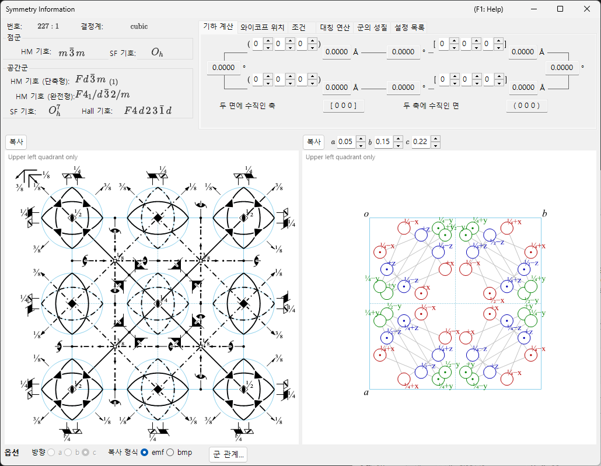

# 부록 A4. 대칭과 공간군

메인 창의 장 [2. 대칭 정보](../../2-symmetry-information.md)는 GUI 안내서입니다: 어떤 탭에 무엇이 표시되고, 어떤 버튼이 어떤 다이어그램을 복사하는지 알려 줍니다. 이 부록은 그 표와 그림 뒤에 있는 **결정학·군론적 배경**을 모읍니다 — Hermann–Mauguin 기호가 실제로 무엇을 담고 있는지, *International Tables for Crystallography*(ITA) Vol. A 양식의 대칭 요소/일반 위치 다이어그램을 어떻게 읽는지, 그리고 **군 관계...** 창의 초군/부분군 표와 용어(*translationengleiche*, *klassengleiche*, 켤레류, 도메인, 쌍정 법칙, …)가 무엇을 뜻하는지를 다룹니다.

두 개의 창을 다루며, 이론은 다음 순서로 읽는 것이 가장 좋습니다.

1. **[A4.1. 공간군 기호와 대칭 다이어그램](symbols-and-diagrams.md)** — Hermann–Mauguin·Schoenflies·Hall 기호, **군의 성질** 탭에 표시되는 군론적 분류(중심대칭, Sohncke, symmorphic, 극성, 산술 결정류, Patterson 대칭, …), **대칭 연산** 탭에 있는 각 대칭 연산의 좌표 트리플렛/Seitz 기호/기하학적 종류 표기, 그리고 [대칭 정보](../../2-symmetry-information.md) 창 하단의 대칭 요소·일반 위치 다이어그램의 그림 규약.
2. **[A4.2. 군-부분군 관계](group-subgroup-relations.md)** — *극대 부분군*/*극소 초군*이란 무엇인지, Hermann의 *t*-/*k*- 구분, 그리고 대칭 정보의 **옵션** 패널에서 여는 **군 관계...** 브라우저의 각 탭(계통도, 변환 행렬, 궤도 분열, 도메인·쌍정, 새 반사)을 읽는 법.

A4.1이 앞에 오는 것은 A4.2가 끊임없이 A4.1을 되짚어 참조하기 때문입니다: 모든 부분군/초군 관계 자체가 바로 그곳에서 소개한 것과 똑같은 Hermann–Mauguin 기호, Seitz 기호, 기하학적 종류 표현(*"3-fold rotation"*, *"c-glide plane"*, *"screw axis"*, …)으로 표시됩니다.

---

## 범위와 출처

ReciPro의 내장 데이터베이스는 230개 공간군 유형(수록된 530가지 설정/원점 선택 포함)을 *International Tables for Crystallography*의 **Volume A**(공간군 대칭)와 **Volume A1**(공간군의 극대 부분군)에 수록된 그대로 담고 있습니다. 이 부록이 설명하는 것은 그 데이터에 대한 ReciPro의 *표현 방식* — 표기법, 다이어그램, 열람 도구 — 이며, 독자가 격자·점군·대칭 연산이라는 개념에 이미 학부 수준으로 친숙하다고 가정합니다. 이 부록은 ITA 자체를 대신하지 못합니다. 수록 데이터의 권위 있는 전거는 여전히 ITA이며, 저작권상 ReciPro는 ITA의 표를 그대로 재현할 수 없습니다(주어진 공간군 유형의 대체 원점/설정에 대한 ReciPro 자체의 목록은 **설정 목록** 탭을 참조하십시오).

!!! note "군 관계...는 지금도 활발히 개발 중인 기능입니다"
    **군 관계...** 브라우저(A4.2)는 *translationengleiche*(t-)와 *klassengleiche*(k-, *동형(isomorphic)* 포함) 부분군·초군을 미리 만들어 둔 표가 아니라 공간군 자신의 대칭 연산으로부터 직접 계산합니다. 따라서 표시되는 모든 관계는 표에서 옮겨 적은 것이 아니라 독립적으로 검증된 것입니다. 남아 있는 한계 — 예컨대 동형 계열은 index ≤ 4까지만 열거 — 는 A4.2의 **현재 제한 사항**에 명시되어 있습니다.

---

## 함께 보기

- [2. 대칭 정보](../../2-symmetry-information.md) — 이 부록이 해설하는 GUI 안내서.
- [A4.1. 공간군 기호와 대칭 다이어그램](symbols-and-diagrams.md) · [A4.2. 군-부분군 관계](group-subgroup-relations.md)
- [부록 A1. 좌표계](../a1-coordinate-system/1-orientation.md)
- [부록 A2. 빔 상호작용 (고체물리학적 배경)](../a2-beam-interaction/index.md) — 공간군의 반사 조건(계통 소광)이 구조 인자로 흘러드는 곳.
