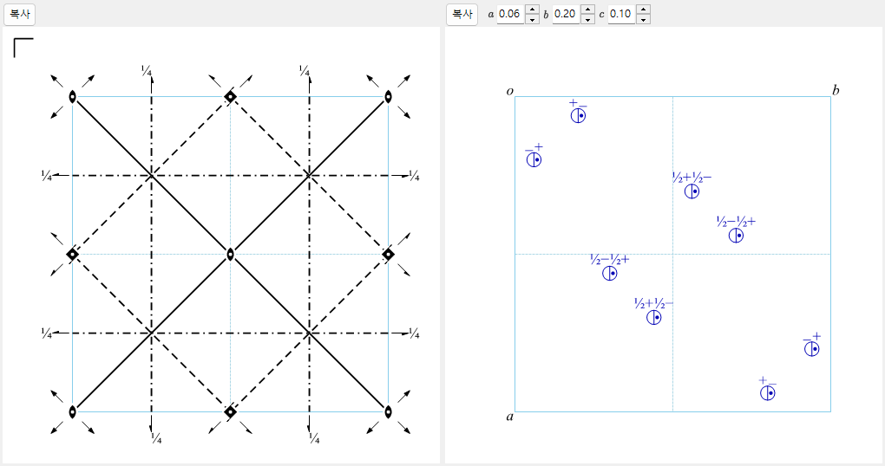

# A4.1. 공간군 기호와 대칭 다이어그램

이 페이지는 [대칭 정보](../../2-symmetry-information.md) 상단 절반에 표시되는 모든 것(공간군 정보 패널과 **대칭 연산**/**군의 성질**/**설정 목록** 탭)과 창 하단의 두 모식도를 설명합니다. 표기는 모두 *International Tables for Crystallography*(ITA) Vol. A를 따릅니다.

---

## Hermann–Mauguin (HM) 기호

Hermann–Mauguin 기호에는 두 층위가 있습니다: **점군 기호**(위쪽 상자, *점군*)는 결정의 거시적 대칭만을 기술하고, **공간군 기호**(아래쪽 상자, *공간군*)는 거기에 격자 중심화와 나선/글라이드 성분을 더합니다.

### 격자 문자

공간군 기호는 다음 일곱 가지 표준 격자 문자 중 하나로 시작합니다.

| 문자 | 의미 |
|---|---|
| `P` | 단순 격자 |
| `A`, `B`, `C` | 일면심(각각 *bc*, *ac*, *ab* 면의 중심화) |
| `I` | 체심 |
| `F` | 전면심 |
| `R` | 능면체(삼방정계 고유의 격자. 흔히 *육방 축*으로 기술되며, 이 경우 단위 격자에 격자점 3개가 포함됩니다) |

### 대칭 방향

격자 문자 다음에 오는 기호의 나머지 각 위치는 하나의 **대칭 방향** — 결정 안에서 회전/나선축이 놓이는 방향, 그리고/또는 거울면/글라이드 면이 그에 수직으로 놓이는 방향 — 을 나타냅니다. 이 위치들이 어떤 물리적 방향을 가리키며 어떤 순서로 오는지는 결정계에 따라 정해져 있습니다.

| 결정계 | 첫째 위치 | 둘째 위치 | 셋째 위치 |
|---|---|---|---|
| 삼사정계 | *(없음 — `1` 또는 `-1`만)* | | |
| 단사정계 | $[010]$ (유일축 $b$, ReciPro의 규약) | | |
| 사방정계 | $[100]$ | $[010]$ | $[001]$ |
| 정방정계 | $[001]$ | $[100],[010]$ | $[110],[1\bar 10]$ |
| 삼방정계 / 육방정계 | $[001]$ | $[100],[010],[\bar 1\bar 1 0]$ | $[1\bar 10],[120],[\bar 2\bar 1 0]$ |
| 입방정계 | $[100],[010],[001]$ | $[111]$ *(및 나머지 3개의 체대각선)* | $[1\bar 10],[110]$ *(및 나머지 4개의 면대각선)* |

하나의 위치는 다음 규칙에 따라 채워집니다.

- 숫자 하나 $n$ ($n=1,2,3,4,6$) : 그 방향을 따르는 $n$회 **회전**축.
- 나선축 $n_p$ (예: $2_1$, $4_2$, $6_3$) : $360°/n$의 회전에 축 방향으로 격자 반복의 $p/n$만큼의 병진을 *결합한 것*. 예컨대 $2_1$("2회 나선")은 $180°$ 회전 **및** 축 방향으로 단위 격자 모서리의 절반만큼의 이동을, $6_3$은 $60°$ 회전과 $c$ 방향으로 절반만큼의 이동을 뜻합니다.
- 회전 숫자 없이 문자 하나($m,a,b,c,n,d$) : 그 방향에 수직인 **거울면 또는 글라이드 면**(문자의 의미는 아래 다이어그램에서와 같습니다).
- $n/m$ 또는 $n_p/m$ : 회전/나선축 **과** 그에 수직인 거울면(두 요소는 같은 방향을 공유하며, 하나는 축을 따라, 하나는 축을 가로질러 놓입니다).
- $-n$ (예: $-1,-3,-4,-6$) : **회전반전**축($360°/n$만큼 회전한 뒤 축 위의 한 점을 통해 반전). $-1$ 단독은 순수한 반전 중심을 뜻합니다. "$-2$" 축이라는 것은 존재하지 않습니다 — 2회 회전반전은 거울면과 완전히 같으므로 항상 $m$으로 씁니다.

### 단축형과 완전형 기호

**단축형** HM 기호(보통 인용되는 것)는 이미 적힌 요소들로부터 함의되는 대칭 요소를 생략하고, **완전형** 기호는 모든 방향을 명시합니다. 예컨대 공간군 No. 62는 단축형으로 $Pnma$, 완전형으로 $P\,2_1/n\,2_1/m\,2_1/a$입니다 — 세 개의 $2_1$ 나선축은 세 개의 글라이드/거울면과 공간군의 점군 $mmm$으로부터 함의되므로 단축형에서는 생략됩니다. ReciPro의 *HM 기호 (단축형)*/*HM 기호 (완전형)* 필드가 둘 다 보여 주며, 대부분의 공간군에서는 둘이 일치합니다.

### Schoenflies (SF) 기호와 Hall 기호

**Schoenflies 기호**(예: $D_{2h}^{16}$)는 점군 유형($D_{2h}$)을 이름 짓고, 위 첨자는 그 점군 계열의 공간군 중 *몇 번째*인지를 단순히 열거할 뿐입니다 — HM 기호와 달리 위 첨자 자체에는 직접적인 기하학적 의미가 없어, 대응표를 찾아보아야 합니다. ReciPro는 점군과 공간군 모두에 대해 Schoenflies 기호를 표시합니다.

**Hall 기호**는 모호함 없는 컴퓨터 처리를 위해 설계된, 생성원 기반의 별도 표기법입니다: 생성 연산의 최소 집합을 명시적인 원점과 함께 나열하므로, 프로그램은 "이 HM 기호가 어떤 설정/원점 선택을 뜻하는가"라는 대응표를 찾아보지 않고도 정확한 좌표 집합을 재구성할 수 있습니다. Hall 기호는 주어진 연산 집합을 부호화하는 *유일한* 방법은 아니지만(생성원을 다르게 고르면 같은 군에 대해 서로 다른, 똑같이 유효한 Hall 문자열이 얻어집니다), 각각은 그 자체로 완전히 명시적이고 가역적입니다. ReciPro는 현재 설정에 대해 체계적으로 생성한 Hall 기호를 표시하며, **설정 목록** 탭(아래 참조)에는 현재 공간군 번호를 공유하는 수록된 모든 원점/설정 선택지가 각각의 HM 기호·Hall 기호와 함께 나열됩니다.

---

## 대칭 연산 (대칭 연산 탭)

**대칭 연산** 탭은 현재 설정에서 일반 위치의 모든 대칭 연산(격자 중심화 병진은 이미 전개된 상태)을 세 가지 병렬 표기로 나열합니다.

| 열 | 예 | 의미 |
|---|---|---|
| 좌표 | `-y, x-y, z+1/3` | 좌표 트리플렛 $(x,y,z)\mapsto(x',y',z')$, 즉 아핀 사상 $x'=Rx+t$를 대수적으로 풀어 쓴 것(ITA/CIF 규약). |
| Seitz | `3+ [111]` | 간결한 기호: 회전/나선의 위수와 회전 방향(`3+`), 축 방향(`[111]`), 그리고 병진이 있으면 그것(예: `2₁ [001] 0,0,1/2`). 순수한 거울면은 `m`, 항등은 `1`, 반전은 `-1`. |
| 종류 | `3-fold rotation (3+) [111]` | 연산의 알기 쉬운 분류: `Identity`(항등), `Inversion centre at …`(반전 중심), `n`회 회전, $n_p$ 나선축, 거울면 $m$, `a/b/c/n/d` 글라이드 면, 또는 $n$회 회전반전을, 각각 방향(반전 중심은 위치까지)과 함께 표시합니다. |

**복사 (CIF)** 버튼은 전체 연산 목록을 CIF `_space_group_symop_operation_xyz` 루프로 클립보드에 넣습니다. 여기서 도입한 어휘 — Seitz 기호와 기하학적 종류 — 는 [A4.2](group-subgroup-relations.md) 전반에 다시 등장하며, 그곳에서는 부분군 관계에서 유지/소실되는 각 생성원이 같은 방식으로 기술됩니다.

---

## 군론적 분류 (군의 성질 탭)

**군의 성질** 탭은 현재 공간군에 대한 일련의 표준 분류를 보고합니다. 그중 일부 — 중심대칭, Sohncke, 극성(그리고 이들에서 도출되는 아래의 물성 허용) — 는 각 연산의 **행렬부** $R$(회전 또는 반사를 나타내는 선형 부분)로부터 — 중심대칭의 경우 병진부까지 함께 — 직접 따라 나옵니다. 나머지 — symmorphic, 거울상 짝, 결정족/격자계/브라베 유형, 산술 결정류, Patterson 대칭 — 는 개별 연산이 아니라 공간군 *유형* 전체의 성질(IT 번호, 격자 유형, 라우에류)입니다. 어느 것도 계량(단위 격자의 모양)을 필요로 하지 않습니다 — 오직 공간군 유형의 추상적인 대칭 내용과 분류에만 의존합니다.

**중심대칭(Centrosymmetric)** — 연산 집합이 $\{-I \mid t\}$ 꼴의 연산(점 $t/2$를 지나는 반전으로, 원점일 필요는 없습니다)을 포함합니다. 아래의 Sohncke·극성 성질은 이것과 상호 배타적입니다: 반전 중심은 모든 방향을 뒤집으므로 중심대칭군은 결코 극성이 될 수 없고, $-I$의 행렬식은 $-1$이므로 중심대칭군은 결코 Sohncke 군이 될 수 없습니다.

**Sohncke (방향 보존) 군** — *모든* 연산의 행렬부가 $\det R=+1$을 만족합니다: 군은 고유 회전과 나선 회전만을 포함하고, 거울면·글라이드·반전·회전반전은 전혀 포함하지 않습니다. 230개 공간군 유형 중 65개가 Sohncke 군입니다. Sohncke 군이라는 것은, 구조가 그 거울상까지 함께 포함하지 않고도 일정한 손지기(handedness)를 지닌 대상(카이랄 분자, 단백질, 수정, …)과 양립하기 위한 대칭 조건입니다. 이는 진짜로 서로 구별되는 거울상 *쌍*을 이루는 공간군 유형의 한쪽 구성원인 것보다 넓은 개념입니다 — 바로 다음의 **거울상 짝**을 참조하십시오.

**거울상 짝(Enantiomorphic partner)** — 65개의 Sohncke 유형 가운데 11쌍(22개 유형)은 *오직* 방향을 뒤집는 변환에 의해서만 서로 연결되고, 어떤 고유(방향 보존) 변환으로도 연결되지 않습니다: 이들 공간군 중 하나에 있는 결정에 거울 반사를 가하면 그 쌍의 다른 쪽 구성원이 되며, 축을 어떻게 다시 이름 붙여도 결코 자기 자신으로 돌아오지 않습니다. 이 11쌍은 서로 반대 손지기의 나선축 위에 세워진 것들입니다:

$$P4_1 / P4_3,\ \ P4_122 / P4_322,\ \ P4_12_12 / P4_32_12,\ \ P3_1/P3_2,\ \ P3_112/P3_212,\ \ P3_121/P3_221,$$
$$P6_1/P6_5,\ \ P6_2/P6_4,\ \ P6_122/P6_522,\ \ P6_222/P6_422,\ \ P4_332/P4_132.$$

나머지 $65-22=43$개의 Sohncke 유형은 자기 자신의 거울상입니다(*공간군 유형으로서는* 비카이랄이지만, 그에 속하는 개개의 구조는 여전히 손지기를 갖습니다).

**Symmorphic** — 73개의 공간군 유형 중 하나로, 원점을 잘 고르면 (격자 병진을 법으로 하여) *모든* 잉여류 대표원이 고유(나선/글라이드) 병진 성분을 갖지 않도록 만들 수 있는 것 — 동치인 표현으로는, 단위 격자 안 어떤 점의 자리 대칭군이 점군 전체와 동형인 경우입니다. (물론 중심화 병진은 그대로 남습니다. "symmorphic"은 격자가 아니라 *점군* 연산의 비단순 병진 부분에 관한 진술입니다.) Symmorphic 공간군은 그 특정 원점에서 기술하는 한 나선축이나 글라이드 면 없이 점군과 격자만으로 언제나 생성할 수 있습니다 — 그리고 이것이 바로 ITA가 symmorphic 유형에 대해 실제로 수록하는 원점이므로, 그 표준 단축형/완전형 기호에는 이미 나선/글라이드 문자가 나타나지 않습니다. (같은 군의 연산들을 이동한 원점이나 중심화 병진만큼 옮긴 원점에서 다시 기술하면 개별 연산이 나선/글라이드 병진을 갖는 것처럼 보일 수 있지만, 그렇다고 그 유형의 symmorphic 분류가 바뀌지는 않습니다 — 분류가 묻는 것은 그런 병진이 없는 원점이 존재하는지 여부뿐이며, 이 73개 유형에서는 실제로 존재합니다.)

**극성(Polar)** — *모든* 연산의 행렬부에 대해 $Rv=v$로 불변으로 남는 방향이 있는지($\pm v$가 아닙니다: 진짜 극성 방향은 단지 뒤집히거나 2회축으로 남는 것이 아니라 정확히 보존되어야 합니다). 해당 조건은 다음과 같습니다: **없음**(그런 방향 없음) &nbsp;/&nbsp; 단일 축 $[uvw]$ &nbsp;/&nbsp; 평면 전체(그 안의 임의의 방향) &nbsp;/&nbsp; **모든** 방향(점군 $1$에서만). 극성축은 자발 전기 분극이 대칭성상 허용되는 방향입니다(아래 물성 표 참조).

**결정족, 격자계, 브라베 유형** — 결정계 위에 있는 표준 IUCr 분류 계층: 총 6개의 **결정족**, 7개의 **결정계**, 7개의 **격자계**, 14개의 **브라베 격자 유형**이 있습니다. 미묘한 점은 **육방 결정족**입니다: **결정계**로는 *삼방*과 *육방*으로 나뉘지만, **격자계**로는 그와 다르게 *육방*과 *능면체*로 나뉩니다 — 삼방정계 공간군은 격자가 $P$형이면 육방 격자계에, $R$ 중심화이면 능면체 격자계에 속하며, 이는 두 결정계 중 어디에 속하는지와 무관합니다.

**산술 결정류(Arithmetic crystal class)** — (경우에 따라 방향까지 구분한) 점군 기호와 브라베 격자 문자의 짝, 예: `4mmP`. 산술 결정류는 총 73개입니다. 일부 점군 기호($3m$ 점군이 육방 격자에 대해 놓일 수 있는 서로 비동치인 두 방식을 나타내는 `3m1`과 `31m`)는 이미 그 자체로 격자에 대한 방향을 담고 있으므로, 방향이 지정된 점군 기호와 격자 문자를 함께 적는 것만으로 그 류를 모호함 없이 지정할 수 있습니다.

**Patterson 대칭** — 격자 유형과 *라우에류*(공간군 자신의 점군에 $-1$을 더해 얻는 중심대칭 점군)의 조합으로, 나선/글라이드 정보는 모두 벗겨 냅니다. 예컨대 30개의 사방정계 $P$ 격자 공간군은 어느 것이 글라이드 면을 갖든 상관없이 모두 `Pmmm`이 됩니다. 이것이 (운동학적 근사에서) 회절 *강도* $|F|^2$로부터 계산되는 패터슨 함수의 대칭성입니다: $|F|^2$는 글라이드/나선 병진이 만들어 내는 위상 이동에 둔감하기 때문입니다(다만 그것이 일으키는 계통 소광이나 패터슨 지도의 Harker 피크를 통해 그 존재가 간접적으로 드러날 수는 있습니다). 동역학적 전자 회절에서는 이 운동학적 그림이 엄밀하게는 성립하지 않습니다 — [부록 A3](../a3-bloch-wave/index.md)을 참조하십시오.

### 물성의 대칭 허용

군의 성질 탭의 마지막 행들은 주어진 거시적 물성이 현재 점군에서 **대칭성상 허용되는지**를 보고합니다 — 이는 필요조건일 뿐, 실제 결정에서 그 효과가 크다거나 아예 존재한다는 보장이 아닙니다(Nye의 "Physical Properties of Crystals" 관례).

| 물성 | 대칭 조건 | 점군 |
|---|---|---|
| 초전성 / 강유전성 | 극성(1계 극성 벡터 — 자발 분극 — 이 허용됨) | 10개의 극성 점군 |
| 압전성 | 비중심대칭 **이면서** 점군 $\ne 432$ | 21개의 비중심대칭 점군 중 20개 |
| 제2고조파 발생(벌크 전기쌍극자 $\chi^{(2)}$) | 압전성과 같은 조건(3계 극성 텐서) | 같은 20개 점군 |
| 광학 활성(자연 선광성) | 고유 회전만 포함하는 11개 점군에 더해, 순수 Sohncke는 아니지만 선광성을 갖는 4개 점군 | $1,2,3,4,6,222,32,422,622,23,432$ 및 $m,mm2,\bar4,\bar42m$ — 총 15개 점군 |

$432$는 압전/SHG 응답이 *없는* 유일한 비중심대칭 점군입니다: 중심대칭이 아닌데도 (입방정계의 고유 회전 전부라는) 회전 대칭이 너무 높아 어떤 3계 극성 텐서 성분도 살아남지 못합니다.

!!! note "대칭성이 허용한다는 것이지, 반드시 관측된다는 뜻은 아닙니다"
    이 행들은 점군이 *허용*하는 바를 말할 뿐입니다. 실제 결정이 정말로 분극을 반전시키는지(진정한 강유전성), 실용적으로 쓸 만한 압전 또는 SHG 응답을 보이는지는 대칭성만으로는 정해지지 않는 화학과 구조의 세부 사항에 달려 있습니다.

### 설정 목록 탭

현재 공간군의 IT 번호를 공유하는 수록된 모든 원점/축 설정 선택지(예: $Fd\bar 3m$의 두 가지 원점 선택, 단사정계 군의 여러 단위 격자 선택)를 각각의 HM 기호·Hall 기호와 함께 나열하며, 현재 표시 중인 설정에 해당하는 행에 표시가 붙습니다. 이 탭은 대안을 열람하기 위한 것일 뿐입니다 — 행을 선택해도 결정은 변경되지 않습니다.

---

## 대칭 요소 다이어그램 {#symmetry-element-diagram}

왼쪽 다이어그램은 **방향**(`a`/`b`/`c`) 컨트롤로 선택한 축을 따라 투영한, 현재 설정의 ITA Vol. A 양식 대칭 모식도를 재현합니다.

**지면에 수직인 축**은 회전 위수를 모양으로 나타내는 채워진 점 기호로 그려지며, 나선축에는 작은 꼬리("핀")가 덧붙습니다(꼬리의 개수와 배치는 나선 피치 $p$뿐 아니라 그 손지기까지 담고 있어서, 예컨대 같은 위수의 반대 손지기 나선인 $3_1$과 $3_2$는 단순히 꼬리 수가 다른 것이 아니라 서로 거울상인 꼬리 패턴으로 그려집니다):

| 기호 | 요소 |
|---|---|
| 채워진 렌즈형(끝이 뾰족한 타원) | 2회 회전축 |
| 핀이 달린 렌즈형 | $2_1$ 나선축 |
| 채워진 삼각형 | 3회 회전축 |
| 꼬리가 달린 삼각형 | $3_1$ / $3_2$ 나선축 |
| 채워진 정사각형 | 4회 회전축 |
| 꼬리가 달린 정사각형 | $4_1$ / $4_2$ / $4_3$ 나선축 |
| 채워진 육각형 | 6회 회전축 |
| 꼬리가 달린 육각형 | $6_1 \ldots 6_5$ 나선축 |
| 작은 빈 원 | 반전 중심($-1$) |
| 빈/채움 복합 기호 | 회전반전축($-3,-4,-6$) |

지면에 비스듬하거나 지면 안에 놓인 축(입방정계의 $\langle 111\rangle$ 체대각선이나 $\langle 110\rangle$ 면대각선 같은 특수 방향에서만 나타납니다)은 같은 ITA 관례에 따라, 발치에 점 기호를 붙인 화살표로 그려집니다.

**면**은 글라이드 종류를 이름 짓는 선 스타일로 그려집니다 — 문자는 글라이드 벡터가 어느 격자 방향을 따르는지(또는 대각/4분의 1 격자인지)를 나타내고, 그 병진이 지면 *안*에 놓이는지 지면 *밖으로* 나가는지는 선택한 투영축에 따라 달라집니다:

| 선 스타일 | 면 |
|---|---|
| 실선 | 거울면 $m$ |
| 긴 파선 | 축 글라이드 $a$ 또는 $b$ |
| 점선 | 축 글라이드 $c$(병진이 지면 밖으로 나가는 흔한 경우) |
| 일점쇄선 | 대각 글라이드 $n$ |
| 화살표가 달린 일점쇄선 | 다이아몬드 글라이드 $d$(4분의 1 격자 병진; 중심 격자에서만 나타남) |
| 이중선 | "이중 글라이드" $e$ — 독립적인 두 글라이드 벡터가 같은 면 위에서 겹침(중심 격자에서만, 글라이드와 그 중심화 병진으로 옮겨진 짝이 같은 면을 지날 때 나타남) |

기호 옆의 분수 높이 라벨(예: `1/4`)은 그 요소가 높이 0의 평면 안에 놓여 있지 않을 때 투영축 방향의 좌표를 알려 줍니다.

!!! note "F 격자 입방정군: 옥탄트 하나만 그립니다"
    $F$ 중심화 입방정계 공간군에서 ReciPro는 단위 격자의 8분의 1에 해당하는 왼쪽 위 사분면만 그립니다(그렇지 않으면 다이어그램이 너무 빽빽해 읽을 수 없게 됩니다). 전체 단위 격자는 중심화 병진과, 이미 그려진 대칭 요소 자신에 의해 그것을 반복한 것입니다. 같은 대칭 요소는 [구조 뷰어](../../5-structure-viewer.md)의 3D 모델 위에 직접 겹쳐 표시할 수도 있습니다.

---

## 일반 위치 다이어그램

오른쪽 다이어그램은 일반 등가 위치 — 하나의 일반점 $(x,y,z)$가 공간군의 모든 연산 아래에서 이루는 궤도 — 를 역시 ITA 양식으로 그립니다.

- 각 **원**은 그 점의 대칭 등가 복사본 하나의 투영입니다.
- 원 안의 **쉼표**는 *제2종* 연산(거울, 글라이드, 반전, 회전반전)으로 생성된 복사본을 표시합니다 — 원래 점에 놓인 카이랄 시험 대상과 반대의 손지기를 가지며, ITA 자체에서 쓰이는 거울상 손·맨손 쌍과 정확히 같습니다.
- **분할 원**(반은 무지, 반은 쉼표)은 고유 연산 복사본과 비고유 연산 복사본이 같은 점에 투영되는 위치를 표시합니다.
- 원 옆의 높이 라벨(`+`, `−`, `½+`, …)은 그 복사본의 투영축 방향 좌표를 기준점에 대한 *상대값*으로 나타냅니다 — `+`는 "$z$에", `−`는 "$-z$에", `½+`는 "$z+\tfrac12$에" 있다는 뜻이며, 절대 높이가 아닙니다.
- (입방정계 공간군에서만) 체대각선 $\langle111\rangle$ 3회축으로 연결된 세 원을 가는 보조선이 잇습니다.
- 일반적으로 원 하나(또는 분할 원의 절반 하나)가 등가 위치 하나에 대응하므로, 원의 개수는 [와이코프 위치](../../2-symmetry-information.md) 탭에 표시되는 일반 위치의 **다중도**와 일치합니다 — 어느 쪽 다이어그램을 읽을 때든 손쉬운 검산이 됩니다. 선택한 투영축 때문에 같은 손지기의 복사본 여러 개가 정확히 겹치게 되면, 이들은 나란히 놓인 별도의 원이 아니라 (서로 다른 높이 라벨로만 구별되는 채) 한 자리에 포개져 그려지므로, 그때는 눈에 보이는 원의 개수가 다중도보다 적어질 수 있습니다.

**방향** 아래의 `numericBox` 필드에서는 시험점 $(x,y,z)$를 그 점군에 대한 공간군의 기본 위치에서 벗어나게 옮길 수 있습니다. 여러 원이 겹칠 뻔한 다이어그램을 정리하는 데 이따금 유용합니다.

---

## 함께 보기

- [2. 대칭 정보](../../2-symmetry-information.md) — 이 부록이 해설하는 GUI 안내서.
- [A4.2. 군-부분군 관계](group-subgroup-relations.md) — 여기서 도입한 Seitz 기호/기하학적 종류의 어휘를 다시 사용합니다.
- [부록 A4. 대칭과 공간군](index.md)
