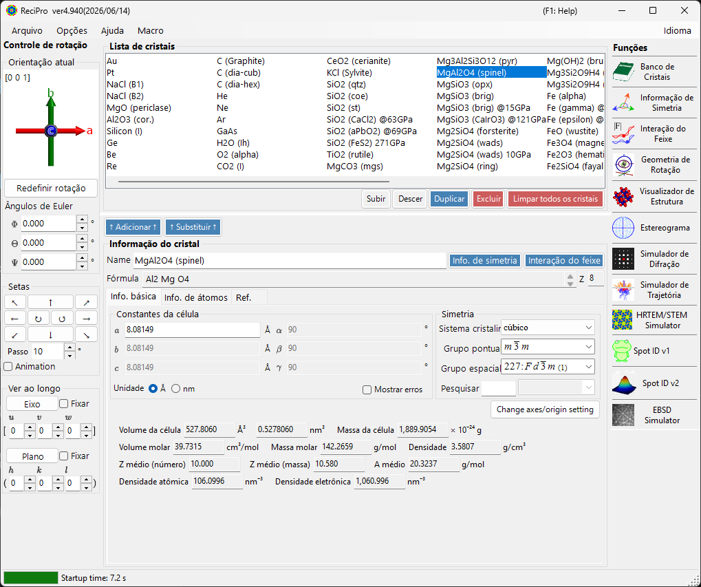
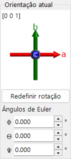
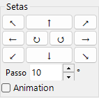
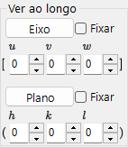
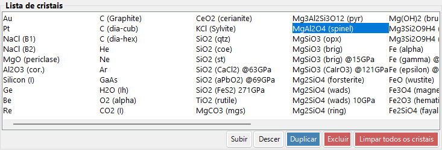
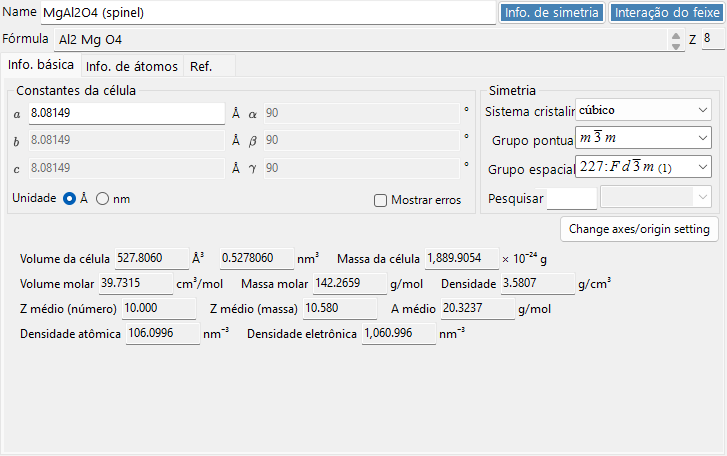
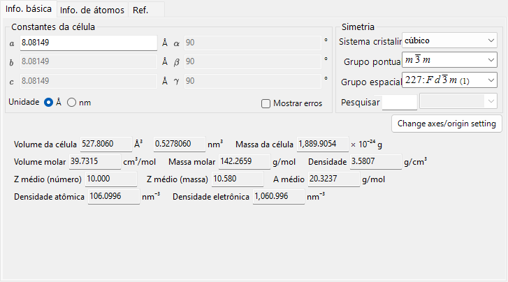
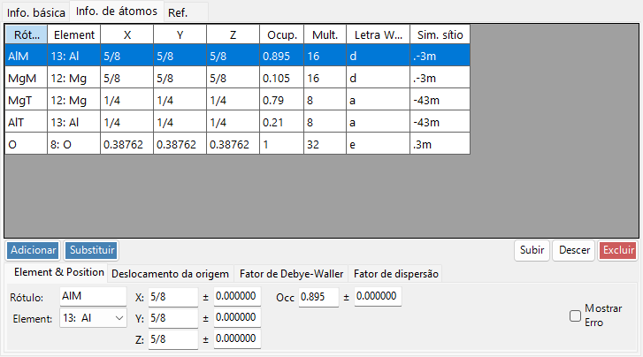
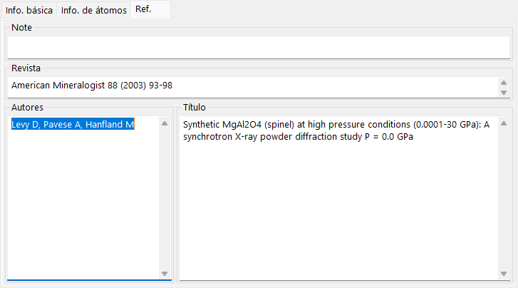
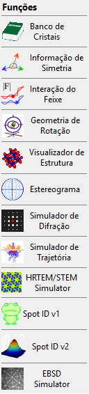

# Janela principal

Quando o ReciPro é iniciado, a janela principal aparece. A partir dessa janela você seleciona o cristal, controla sua rotação e invoca as diversas funções.

| Área | Localização | Descrição |
|------|----------|-------------|
| **Menu Arquivo** | Topo | Operações de arquivo, opções, ajuda |
| **Controle de rotação** | Esquerda | Visualizar/definir a orientação do cristal |
| **Lista de cristais** | Centro superior | Selecionar e gerenciar cristais |
| **Informação do cristal** | Centro inferior | Editar parâmetros de rede, simetria, átomos |
| **Funções** | Direita | Iniciar janelas de simulação/análise |

---

## Atalhos de teclado e mouse {#keyboard-mouse-shortcuts}

A janela principal instala vários atalhos **válidos para todo o aplicativo**. Eles continuam funcionando enquanto as janelas Visualizador de estrutura, Estereonete, Simulador de difração, Spot ID e Calculadora estão em foco.

| Atalho | Ação |
|----------|--------|
| <kbd>F1</kbd> | Abrir esta página do manual on-line |
| <kbd>CTRL</kbd>+<kbd>SHIFT</kbd>+<kbd>D</kbd> | Abrir / fechar o **Simulador de difração** |
| <kbd>CTRL</kbd>+<kbd>SHIFT</kbd>+<kbd>V</kbd> | Abrir / fechar o **Visualizador de estrutura** |
| <kbd>CTRL</kbd>+<kbd>SHIFT</kbd>+<kbd>S</kbd> | Abrir / fechar a **Estereonete** |
| <kbd>CTRL</kbd>+<kbd>SHIFT</kbd>+<kbd>T</kbd> | Abrir / fechar o **Spot ID** |
| <kbd>CTRL</kbd>+<kbd>SHIFT</kbd> + teclas de seta | Girar o cristal um passo nessa direção (mantenha duas setas pressionadas para uma diagonal) |
| Toque duplo em <kbd>CTRL</kbd> | Abrir / fechar a **Calculadora** |
| <kbd>CTRL</kbd>+<kbd>SHIFT</kbd>+<kbd>R</kbd> | Alternar o sinalizador **Reserved** do cristal selecionado |
| Manter <kbd>CTRL</kbd> pressionado enquanto o ReciPro inicia | Iniciar com o OpenGL desativado (recuperação para problemas gráficos) |
| Arrastar com o botão esquerdo o widget de orientação (canto inferior esquerdo, abaixo de *Current Direction*) | Girar o cristal |
| Clique duplo com o botão direito no widget de orientação | Copiar a imagem do widget para a área de transferência |
| Clique único em um botão de função | Abrir / fechar essa janela |
| Clique duplo em um botão de função | Forçar a janela a ficar visível e trazê-la para a frente |
| Clique direito em um cristal na lista | Menu de contexto (Renomear / Duplicar / Excluir / Exportar CIF…) |
| Clique duplo no rótulo **Current Index** | Mostrar / ocultar a caixa max-UVW |
| Soltar um arquivo sobre a janela | Carregar uma lista de cristais (`.xml`, `.cdb2`) ou um cristal (`.cif`, `.amc`) |

→ Consulte **[21. Atalhos de teclado e mouse](21-shortcuts.md)** para ver todas as janelas de relance.

---

## Fluxo de trabalho básico

Se você é novo no ReciPro, siga estes passos:

1. Selecione o cristal desejado na **Lista de cristais**. Para usar um arquivo CIF/AMC, arraste-o e solte-o na **Informação do cristal**.
2. Se você editar parâmetros de rede ou posições de átomos, pressione **Add** ou **Replace** para que as alterações sejam gravadas de volta na lista de cristais.
3. Defina a orientação do cristal no **Controle de rotação** usando um eixo de zona, um plano cristalino, ângulos de Euler ou arrastando com o mouse.
4. Abra a ferramenta desejada em **Funções**. As janelas de cálculo de difração, HRTEM/STEM, EBSD e outras usam o cristal e a orientação atualmente selecionados.

---

## Menu Arquivo

### File

| Item de menu | Descrição |
|-----------|-------------|
| Read crystal list (as new list) | Carregar um arquivo de lista de cristais (*.xml), substituindo a lista atual |
| Read crystal list (and add) | Anexar à lista atual |
| Read initial crystal list | Recarregar a lista de cristais padrão |
| Save crystal list | Salvar a lista de cristais atual |
| Export selected crystal to CIF | Salvar no formato CIF |
| Clear crystal list | Remover todos os cristais |
| Exit | Fechar o aplicativo |

### Option

| Item de menu | Descrição |
|-----------|-------------|
| Show Tooltips | Alternar a exibição das dicas de ferramenta |
| Use Miller-Bravais (hkil) index | Usar a notação de 4 índices para os sistemas trigonal/hexagonal em todo o aplicativo |
| Reset registry settings on exit (effective after restart) | Redefinir as configurações na próxima reinicialização |
| Disable Crystallography.Native library (requires restart) | Voltar ao código gerenciado caso a biblioteca nativa (C++) não consiga ser carregada |
| Disable all OpenGL rendering (requires restart) | Para GPUs mais antigas / área de trabalho remota |
| Disable OpenGL text rendering (requires restart) | Solução alternativa para problemas de renderização de texto em algumas GPUs |
| Use MKL Library | Usar o Intel MKL para as rotinas numéricas |
| Dark mode | Alternar entre os temas de cores claro e escuro |
| Powder diffraction function (under development) | Ativar a janela de difração policristalina (de pó) |
| Capture GUI Components… | Ferramenta de desenvolvedor para salvar capturas de tela da GUI |

### Help

| Item de menu | Descrição |
|-----------|-------------|
| Program updates | Verificar se há uma nova versão do ReciPro disponível e instalá-la |
| Hint | Exibir dicas de uso (obsoleto) |
| Version history | Abrir a caixa de diálogo do histórico de versões |
| License | Exibir a licença MIT |
| GitHub page | Abrir o repositório do ReciPro em um navegador |
| Report bugs, requests, or comments | Abrir a página de Issues do GitHub |
| Help (Web) | Abrir o manual on-line no GitHub Pages, na página correspondente ao idioma da interface. |

O idioma é alternado pelo menu **Language** separado (Inglês/Japonês, requer reinicialização).

### Language

Alternar o idioma da interface entre Inglês e Japonês. A alteração entra em vigor após reiniciar o ReciPro.

### Macro

Abre a janela [Macro](20-macro/index.md) para automatizar as operações do ReciPro com scripts em estilo Python. Para fluxos de trabalho repetidos, consulte as [funções integradas](20-macro/1-built-in-functions.md) e os [exemplos de macro](20-macro/2-examples.md).

---

## Controle da orientação do cristal

O estado de rotação do cristal é compartilhado pelo simulador de difração, o Visualizador de estrutura, a Estereonete, o simulador HRTEM/STEM, o simulador EBSD e outras janelas. Não é apenas uma configuração de visualização — ele define a direção do feixe incidente e a relação de coordenadas do cristal usada nas simulações. Um breve tutorial em vídeo está disponível na página [Como usar](appendix/a0-how-to-use.md).

### Orientação atual

Mostra a orientação do cristal. Arraste para girar. Eixos: vermelho = *a*, verde = *b*, azul = *c*.

### Redefinir rotação
Redefine para o estado inicial: eixo *c* perpendicular à tela, eixo *b* para cima.

### Eixo de zona
Exibe o eixo de zona mais próximo da normal da tela (por exemplo, *u*+*v*+*w* < 30).

### Ângulos de Euler (Z-X-Z)
Defina a orientação do cristal com ângulos de Euler **Z–X–Z**:

- \(\Phi\): rotação em torno do eixo Z
- \(\Theta\): rotação em torno do eixo X
- \(\Psi\): rotação em torno do eixo Z

As rotações são aplicadas na ordem \(\Psi \to \Theta \to \Phi\). Consulte [Geometria de rotação](4-rotation-geometry.md) e [Apêndice A1. Sistema de coordenadas](appendix/a1-coordinate-system/1-orientation.md) para mais detalhes.

### Setas

Gira pelo ângulo Step. Marque Animation para uma rotação contínua.

### Visualizar ao longo de

Alinha um eixo de zona [*uvw*] ou um plano cristalino (*hkl*) perpendicular à tela.

- **Fix**: quando marcado, o eixo de zona ou plano especificado é mantido espacialmente fixo durante as operações de rotação subsequentes.
- **Axis**: coloca o eixo de zona inserido \([uvw]\) perpendicular à tela. Se **Plane** também estiver definido, essa direção é apontada para cima na tela.
- **Plane**: coloca a normal do plano cristalino inserido \((hkl)\) perpendicular à tela. Se **Axis** também estiver definido, essa direção é apontada para cima na tela.

### Maneiras básicas de definir a orientação

| Método | Usar quando | Onde |
|--------|----------|-------|
| Arrastar com o mouse | Você quer girar livremente enquanto observa os eixos cristalinos. | Painel **Orientação atual** |
| Botões de seta | Você quer rotações pequenas e repetíveis. | Painel **Setas** |
| Eixo de zona | Você conhece a direção de observação, como \([001]\) ou \([110]\). | **Visualizar ao longo de** / entrada de eixo de zona |
| Normal do plano | Você quer um plano cristalino \((hkl)\) normal à tela. | **Visualizar ao longo de** / entrada de plano |
| Ângulos de Euler | Você precisa de uma orientação numérica reproduzível. | **Ângulos de Euler (Z-X-Z)** |

Consulte [Geometria de rotação](4-rotation-geometry.md) e [Apêndice A1. Sistemas de coordenadas](appendix/a1-coordinate-system/1-orientation.md) para as matrizes de rotação e as convenções de coordenadas.

---

## Lista de cristais

~80 cristais na instalação padrão. Selecione para ver os detalhes e definir para os cálculos. **Clique direito em um cristal** na Lista de cristais para um menu de contexto: *Rename*, *Export as CIF*, *Duplicate*, *Delete*.

| Botão | Ação |
|--------|--------|
| Up / Down | Reordenar |
| Duplicate | Copiar o cristal selecionado |
| Delete / All clear | Remover cristais |
| Add / Replace | Adicionar à lista ou substituir a entrada selecionada |

---

## Informação do cristal

Edite os parâmetros de rede, a simetria e os átomos; arraste e solte arquivos CIF/AMC para carregar uma estrutura. Este controle é compartilhado pelo ReciPro, PDIndexer e CSmanager, mas as abas e os recursos exibidos diferem conforme o aplicativo. O ReciPro exibe as abas Basic Info, Atom e Reference (as abas EOS, Elasticity e outras são destinadas aos outros aplicativos e não são exibidas no ReciPro).

> **Importante**: Pressione **Add** ou **Replace** para salvar as alterações.

A parte superior do painel sempre exibe **Name** (nome do cristal), **Formula** (fórmula química, calculada a partir da lista de átomos) e **Reset** (limpar todos os campos).

### Aba Basic Info

Parâmetros de rede, simetria e grandezas derivadas deles.

| Item | Descrição |
|------|------|
| Cell constants | Parâmetros de rede a, b, c (em Å = 10⁻¹⁰ m) e α, β, γ. A escolha de uma simetria os restringe automaticamente (por exemplo, a=b=c, α=β=γ=90° para cúbico). |
| Symmetry | Escolha o sistema cristalino, o grupo pontual e o grupo espacial. Digite na caixa **Search** para listar os candidatos correspondentes (diferencia maiúsculas de minúsculas). |
| Cell Volume / Cell Mass | Volume e massa da célula unitária. |
| Molar Volume / Molar Mass / Z / Density | Volume molar, massa molar, número de unidades de fórmula por célula unitária (Z) e densidade. Exibido **somente quando os átomos foram inseridos**. |
| Color of Profile | Cor usada ao traçar o perfil de difração deste cristal. |

### Aba Atom

Defina a espécie, a posição, o fator de temperatura e o fator de espalhamento de cada átomo. Edite a lista de átomos com **Add**, **Replace** (substituir a linha selecionada), **Up/Down** (reordenar) e **Delete**. Cada átomo possui:

| Item | Descrição |
|------|------|
| Label | Rótulo do átomo (qualquer identificador). |
| Element | Elemento (incluindo a valência iônica). |
| X, Y, Z | Coordenadas fracionárias (0–1). Frações como 1/2 ou 2/3 podem ser inseridas. |
| Occ | Ocupação (0–1). |

**Origin shift**: desloca a origem de todas as coordenadas atômicas. Use os botões predefinidos (**+** / **−**) para deslocamentos padrão, ou **Apply custom shift** para um valor arbitrário.

**Fator de Debye–Waller (fator de temperatura)**:

| Item | Descrição |
|------|------|
| Notation | Usar a notação U ou B. |
| Model | Isotrópico ou anisotrópico. |
| B##, U## | Para o caso anisotrópico, inserir cada componente (B11, …). |

**Scattering factor**: escolha o fator de espalhamento usado para cada átomo.

| Radiação | Fonte / configuração |
|-----------|------|
| X-ray | Fatores de espalhamento incluindo a valência iônica (International Tables for Crystallography, Vol. C). |
| Electron | Fatores de espalhamento de elétrons (Peng 1998, Acta Cryst. A54, 481–485). |
| Neutron | Comprimentos de espalhamento de nêutrons. Escolha **Natural isotope abundance** ou **Custom isotope abundance** (uma composição isotópica arbitrária). |

### Aba Reference

Registre a fonte da estrutura: **Note**, **Authors**, **Journal** e **Title**.

### Menu de contexto (clique direito)

Clique direito em uma área vazia do controle para estas ações principais:

| Item de menu | Ação |
|-----------|------|
| Beam Interaction | Abre a janela [Interação do feixe](3-beam-interaction.md). |
| Symmetry information | Abre a janela [Informação de simetria](2-symmetry-information.md). |
| Import from CIF, AMC | Carrega um cristal de um arquivo CIF / AMC. |
| Export to CIF | Exporta o cristal atual como CIF. |
| Revert cell constants | Restaura as constantes de célula para os valores carregados inicialmente. |
| Convert to P1 spacegroup | Expande a estrutura para o grupo espacial P1. |
| Convert to a superstructure | Converte em uma superestrutura com múltiplos inteiros de a, b, c (caixa de diálogo de tamanho). |
| Convert to an equivalent space group | Converte em um grupo espacial equivalente (uma configuração de eixos diferente). |

---

## Painel de funções {#functions}

A faixa vertical de botões à direita inicia as janelas de análise e simulação (consulte a tabela [Funções](#functions) abaixo).

| Botão | Descrição | Detalhes |
|--------|-------------|---------|
| Crystal Database | Pesquisar e importar cristais dos bancos de dados incluídos / on-line | [1. Banco de dados de cristais](1-crystal-database.md) |
| Symmetry Information | Informações de grupo espacial e diagramas de simetria do ITC Vol. A | [2. Informação de simetria](2-symmetry-information.md) |
| Beam Interaction | Interação feixe–cristal: reflexões, atenuação, fatores de espalhamento, fluorescência | [3. Interação do feixe](3-beam-interaction.md) |
| Rotation Geometry | Matriz de rotação 3D / ângulos do goniômetro | [4. Geometria de rotação](4-rotation-geometry.md) |
| Structure Viewer | Estrutura cristalina 3D | [5. Visualizador de estrutura](5-structure-viewer.md) |
| Stereonet | Projeção estereográfica | [6. Estereonete](6-stereonet.md) |
| Diffraction Simulator | Difração de raios X / elétrons de monocristal | [7. Simulador de difração](7-diffraction-simulator/index.md) |
| Trajectory Simulator | Simulação de Monte Carlo de trajetórias eletrônicas | [8. Trajetórias eletrônicas](8-electron-trajectory.md) |
| HRTEM/STEM Simulator | Simulação de imagem HRTEM / STEM | [9. Simulador HRTEM/STEM](9-hrtem-stem-simulator/index.md) |
| Spot ID v1 | Indexação de padrões SAED (antigo "TEM ID") | [10. Spot ID v1](10-spot-id.md) |
| Spot ID v2 | Detecção e indexação de pontos | [11. Spot ID v2](11-spot-id-v2.md) |
| EBSD Simulator | Simulação de padrões EBSD | [12. Simulação EBSD](12-ebsd-simulation.md) |
| Powder Diffraction | Difração policristalina (de pó) — ativar via **Option ▸ Powder diffraction function** | - |

---

## Veja também

- [Banco de dados de cristais](1-crystal-database.md)
- [Geometria de rotação](4-rotation-geometry.md)
- [Visualizador de estrutura](5-structure-viewer.md)
- [Simulador de difração](7-diffraction-simulator/index.md)
- [Atalhos de teclado e mouse](21-shortcuts.md)
- [Sistema de coordenadas básico e orientação do cristal](appendix/a1-coordinate-system/1-orientation.md)
