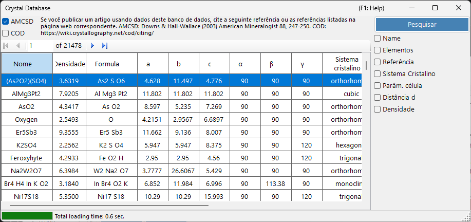
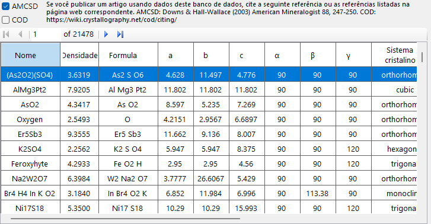
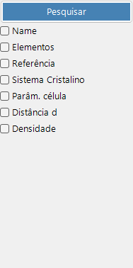

# Banco de dados de cristais

O **Banco de dados de cristais** oferece funções para pesquisar e importar estruturas cristalinas de duas fontes, selecionáveis com as caixas de seleção **AMCSD** e **COD**:

- **AMCSD** : o [American Mineralogist Crystal Structure Database](https://www.rruff.net/) incluído (mais de 20.000 estruturas).
- **COD** : o [Crystallography Open Database](https://www.crystallography.net/cod/). Como o arquivo é grande, ele não é incluído no instalador; o arquivo do banco de dados é baixado automaticamente na primeira utilização. Quando o arquivo é atualizado no servidor, você é solicitado a baixá-lo novamente.

Por favor, cite as seguintes referências ao utilizar esses bancos de dados.

Ao utilizar **AMCSD**:

> Downs, R.T. and Hall-Wallace, M. (2003) The American Mineralogist Crystal Structure Database. *American Mineralogist* **88**, 247-250.

Ao utilizar **COD**:

> Gražulis, S. et al. (2009) Crystallography Open Database – an open-access collection of crystal structures. *Journal of Applied Crystallography* **42**, 726-729.
>
> Gražulis, S. et al. (2012) Crystallography Open Database (COD): an open-access collection of crystal structures and platform for world-wide collaboration. *Nucleic Acids Research* **40**, D420-D427.

---

## Atalhos de teclado e mouse

Esta janela não possui combinações com teclas modificadoras; ela é operada por cliques comuns. As únicas entradas não óbvias são:

| Atalho | Ação |
|----------|--------|
| <kbd>F1</kbd> | Abrir esta página do manual online |
| <kbd>ENTER</kbd> em qualquer campo de pesquisa | Executar a pesquisa no banco de dados (equivale ao botão **Search**) |
| Clicar em uma linha da tabela de resultados | Carregar esse cristal na janela principal |
| Clicar em um elemento no pop-up **Periodic table** | Alternar seu filtro: *ignore* → *must include* → *must exclude* |

→ Consulte **[21. Atalhos de teclado e mouse](21-shortcuts.md)** para uma visão geral de cada janela.

---

## Tabela

Exibe os cristais que correspondem aos critérios de pesquisa. Selecione um cristal para transferi-lo para a Informação do cristal da janela principal. Pressione **Add** ou **Replace** para adicioná-lo à Lista de cristais.

---

## Opções de pesquisa

Insira abaixo os critérios de pesquisa e pressione o botão **Search** ou a tecla **Enter**.

| Critério | Descrição |
|-----------|-------------|
| **Name** | Nome do cristal |
| **Element** | Seletor da tabela periódica (pode/deve/não deve conter) |
| **Reference** | Título, periódico, autor |
| **Crystal system** | Selecionar o sistema cristalino |
| **Cell Param** | Constantes de rede e erro |
| **d-spacing** | Valores de d das reflexões mais intensas e erro |
| **Density** | Densidade e erro |

### Name

Correspondência de texto livre com o nome do cristal. Correspondências parciais são permitidas.

### Element

Pressione o botão **Periodic Table** para abrir o seletor de elementos. Cada botão de elemento alterna entre três estados:

- **May or may not include** (padrão — cinza)
- **Must include** (verde)
- **Must exclude** (vermelho)

Os três botões na parte superior da janela redefinem todos os elementos para um dos três estados com um único clique.

### Reference

Correspondência de texto livre com os metadados da publicação: título do artigo, nome do periódico e lista de autores.

### Crystal system

Restringe a pesquisa a um sistema cristalino específico (Cubic, Tetragonal, Orthorhombic, Hexagonal, Trigonal, Monoclinic, Triclinic).

### Pesquisa por parâmetros de célula

Insira as constantes de rede desejadas *a*, *b*, *c*, *α*, *β*, *γ* e os erros aceitáveis. Campos vazios são tratados como curingas.

### d-spacing

Insira o *d*-spacing da reflexão mais intensa (ou de várias reflexões intensas) e um erro aceitável. Útil quando, a partir de um experimento, somente as posições dos picos de difração são conhecidas.

### Density

Filtrar pela densidade de massa (g/cm³) dentro de uma faixa de erro aceitável.

---

## Veja também

- [Janela principal](0-main-window.md)
- [Informação de simetria](2-symmetry-information.md)
- [Interação do feixe](3-beam-interaction.md)
- [Visualizador de estrutura](5-structure-viewer.md)
