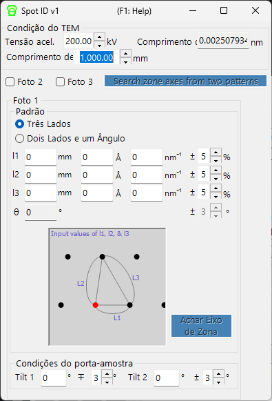

# Spot ID v1

**Spot ID v1** detecta, ajusta e indexa reflexões de difração a partir de imagens experimentais de difração de elétrons. Também oferece suporte à busca manual de eixo de zona a partir de uma geometria de reflexões inserida numericamente (o antigo **TEM ID**).

---

## Atalhos de teclado e mouse

O Spot ID v1 recebe a geometria das reflexões como **entrada numérica** (o antigo fluxo de trabalho *TEM ID*), e a detecção/ajuste das reflexões é controlado por botões; a imagem de difração é exibida apenas como referência e não responde a cliques (o zoom com o mouse e a seleção manual de reflexões pertencem ao [Spot ID v2](11-spot-id-v2.md)). O único atalho está na janela de resultados:

| Atalho | Ação |
|----------|--------|
| <kbd>F1</kbd> | Abrir esta página do manual online |
| Clique duplo em uma linha da lista de resultados | Selecionar esse cristal e girá-lo até o eixo de zona correspondente |

→ Consulte **[21. Atalhos de teclado e mouse](21-shortcuts.md)** para uma visão geral de todas as janelas.

---

## Área principal

Exibe a imagem de difração como referência. Carregue as imagens por arrastar e soltar ou pelo menu **File**.

### Ajustes de imagem

| Configuração | Descrição |
|---------|-------------|
| Min / Max | Faixa de brilho (também ajustável pela barra deslizante) |
| Gradient | Positivo ou Negativo |
| Scale | Linear ou Log |
| Colour | Escala de cinza ou Cold-Warm |
| Dust & Scratch | Remover pixels excepcionalmente claros/escuros (definir a faixa e o limiar) |
| Gaussian blur | Aplicar desfoque (faixa em pixels) |

---

## Optics

Insira a fonte incidente, energia/comprimento de onda, comprimento de câmera e tamanho do pixel do detector.

> Se um arquivo dm3/dm4 (Gatan Digital Micrograph) for carregado, esses valores são definidos automaticamente.

---

## Detecção e ajuste de reflexões

Pressione **Detect & fit spots** para detectar automaticamente as reflexões de difração e ajustá-las com uma função Pseudo-Voigt 2D. Os resultados aparecem na tabela.

### Opções de detecção

| Parâmetro | Descrição |
|-----------|-------------|
| Number | Número máximo de reflexões a detectar |
| Nearest neighbour | Distância mínima entre as reflexões detectadas |
| Fitting range | Raio (pixels) ao redor de cada reflexão para o ajuste |

### Controles da tabela

| Botão | Ação |
|--------|--------|
| Reset range | Redefinir a faixa de ajuste para todas as reflexões |
| Show label/symbol | Sobrepor rótulos/símbolos na imagem |
| Clear all spots | Remover todas as reflexões |
| Save / Copy | Exportar a tabela em formato separado por tabulações (Excel) |
| Re-fit all | Reajustar todas as reflexões |

### Janela de detalhes da reflexão

Marque a caixa para abrir uma janela de detalhes que mostra a reflexão selecionada (à esquerda) e os perfis em quatro direções (à direita). Azul = dados observados, vermelho = ajuste.

---

## Index

Pressione **Identify spots** para indexar as reflexões detectadas contra o cristal selecionado na Janela principal.

| Configuração | Descrição |
|---------|-------------|
| Acceptable error | Tolerância para a indexação |
| Single grain / Multi grains | Indexar como cristal único ou como vários grãos (definir a contagem máxima de grãos) |
| Show label/symbol | Sobrepor os rótulos indexados na imagem |
| Refine thickness and direction | Aplicar a teoria dinâmica (método de Bethe) para refinar a espessura da amostra e a orientação do cristal que melhor correspondem às intensidades detectadas |

---

## Busca de eixo de zona a partir da geometria das reflexões (antigo TEM ID)

Quando você não tem uma imagem para carregar, ainda é possível buscar eixos de zona candidatos inserindo manualmente a geometria de um padrão de difração de elétrons de área selecionada (SAED). Insira as condições de observação do TEM e a geometria das reflexões e, em seguida, pressione **Search zone axes** para encontrar orientações de cristal candidatas.

### TEM condition

Insira as condições de observação do TEM (tensão de aceleração, comprimento de câmera, etc.).

### Photo 1, 2, 3

Insira a geometria das reflexões de difração.

- Para inserir a distância entre reflexões no detector, use a caixa **mm**.
- Se você conhece o valor de *d*, insira-o nas unidades **Å** ou **nm⁻¹**.

**Three sides mode** : Insira os comprimentos dos três lados de um triângulo que tem o direct spot como um dos vértices.

**Two sides and an angle mode** : Insira os comprimentos de dois lados (incluindo o direct spot) e o ângulo entre eles.

---

## Veja também

- [Spot ID v2](11-spot-id-v2.md)
- [Simulador de difração](7-diffraction-simulator/index.md)
- [Janela principal](0-main-window.md)
- [Banco de dados de cristais](1-crystal-database.md)
- [Simulação EBSD](12-ebsd-simulation.md)
