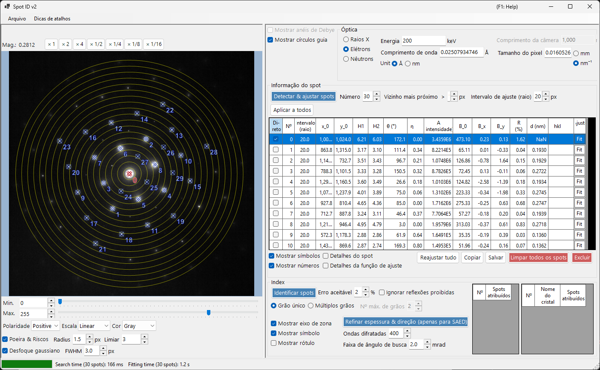
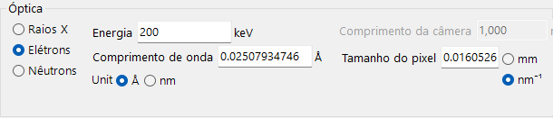
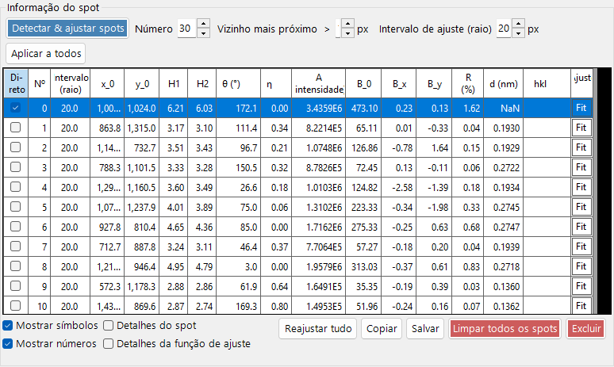
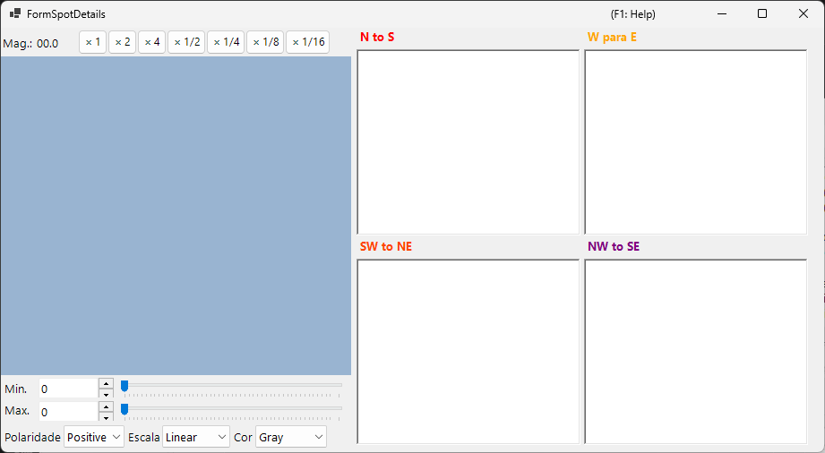
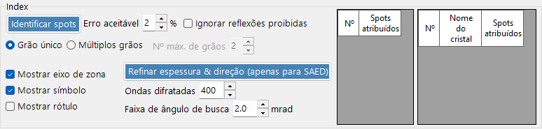

# Spot ID v2

**Spot ID v2** é a versão aprimorada do [Spot ID](10-spot-id.md), com detecção de spots, algoritmos de ajuste e um mecanismo de indexação mais poderosos.

---

## Atalhos de teclado e mouse

Você constrói a lista de spots diretamente sobre a imagem carregada. O painel de imagem usa a [navegação de visualização de imagem](21-shortcuts.md) padrão do ReciPro para deslocamento/zoom; a edição de spots acrescenta as combinações abaixo.

| Atalho | Ação |
|----------|--------|
| <kbd>F1</kbd> | Abrir esta página do manual on-line |
| Clique duplo esquerdo na imagem | Adicionar um spot nesse ponto (ajustado ao pico) |
| <kbd>CTRL</kbd> + clique duplo esquerdo | Adicionar um spot e marcá-lo como o feixe direto (000) |
| Clique esquerdo em um spot | Selecionar o spot mais próximo |
| <kbd>CTRL</kbd> + clique direito em um spot | Excluir o spot mais próximo |
| <kbd>CTRL</kbd> + teclas de seta | Deslocar o spot selecionado em um pixel |
| Arrastar com botão esquerdo / meio (área vazia) | Deslocar a imagem |
| Roda do mouse | Aproximar / afastar o zoom no cursor |
| Arrastar uma caixa com o botão direito | Aproximar o zoom na região selecionada |
| Clique duplo direito | Afastar o zoom |
| Clique duplo no cabeçalho da linha de um spot (tabela) | Aplicar zoom nesse spot (×2) |

Na janela principal, <kbd>CTRL</kbd>+<kbd>SHIFT</kbd>+<kbd>T</kbd> abre/fecha esta janela.

→ Consulte **[21. Atalhos de teclado e mouse](21-shortcuts.md)** para ver cada janela de relance.

---

## Menu Arquivo

Abrir / salvar uma imagem de difração. O mesmo carregamento por arrastar e soltar do [Spot ID v1](10-spot-id.md) é suportado, e os metadados Gatan DM3/DM4 (comprimento de câmera, comprimento de onda, tamanho do pixel) são respeitados automaticamente.

---

## Óptica

### Fonte incidente

Selecione o tipo de radiação (raios X / elétron / nêutron) e defina a energia ou o comprimento de onda.

### Comprimento de câmera / Tamanho do pixel

O comprimento de câmera (mm) e o tamanho do pixel do detector (mm ou nm⁻¹). Quando um arquivo Gatan DM é carregado, esses valores são preenchidos a partir do cabeçalho do arquivo.

---

## Informação do spot

- **Detect & Fit Spots**: Detecção automática de spots usando máximos locais e subtração de fundo.
- **Number**: O número máximo de spots a detectar.
- **Nearest neighbour**: A separação mínima (px) permitida entre spots detectados. Picos mais próximos do que isso são mesclados, evitando a detecção dupla do mesmo spot.
- **Fitting range (radius)**: O raio (px) da região circular usada para ajustar o pico de cada spot. Os pixels dentro deste círculo são ajustados com uma função pseudo-Voigt.
- **Apply to All**: Define o raio de ajuste de cada spot como o valor atual de **Fitting range (radius)**.
- **Delete spot / Clear spots**: Remover spots detectados individualmente ou todos.
- **Copy to clipboard**: Copiar as posições e intensidades dos spots para a área de transferência.
- **Details of the spot**: Quando marcado, abre uma janela mostrando informações detalhadas sobre o spot atualmente selecionado.

---

## Índice

- **Identify Spots**: Executa o algoritmo de indexação para encontrar o cristal e o eixo de zona que melhor correspondem.
- **Acceptable error**: Define o desvio aceitável no espaçamento d e no ângulo para uma correspondência.
- **Ignore prohibited reflections**: Quando marcado, as reflexões proibidas por eixos helicoidais e planos de deslizamento são tratadas como não necessariamente satisfeitas durante a busca pelo eixo de zona.
- **Single Grain / Multiple Grains**: Buscar uma única orientação (monocristal) ou várias orientações (uma região policristalina / de múltiplos grãos). Para múltiplos grãos, **Max. num. of grains** define o limite superior do número de grãos a buscar.
- **Results**: As melhores correspondências são exibidas com o nome do cristal, o eixo de zona [uvw] e os índices individuais dos spots (hkl).

---

## Melhorias em relação à v1

- Melhor tratamento de ruído na detecção de spots.
- Algoritmos de ajuste mais robustos com múltiplas formas de perfil.
- Indexação mais rápida com algoritmos de busca otimizados.
- Suporte para spots sobrepostos e reflexões satélite.

---

## Veja também

- [Spot ID v1](10-spot-id.md)
- [Simulador de difração](7-diffraction-simulator/index.md)
- [Janela principal](0-main-window.md)
- [Atalhos de teclado e mouse](21-shortcuts.md)
