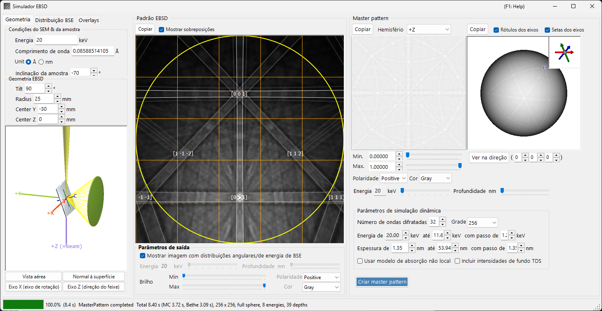
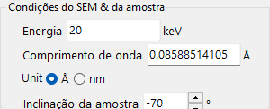
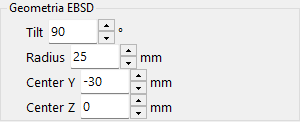
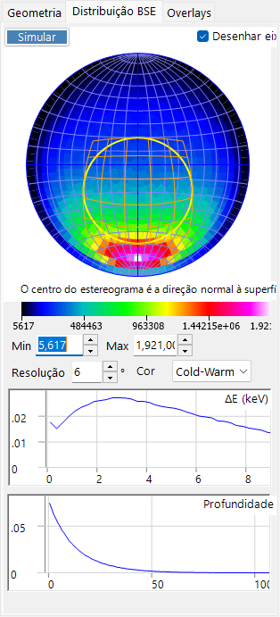
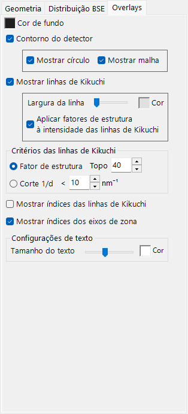
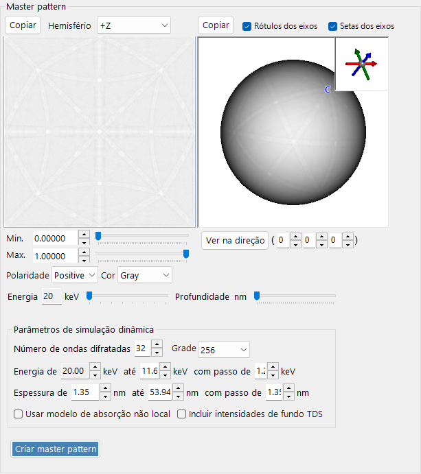
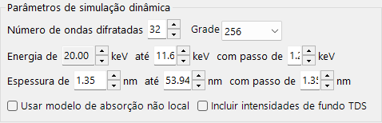
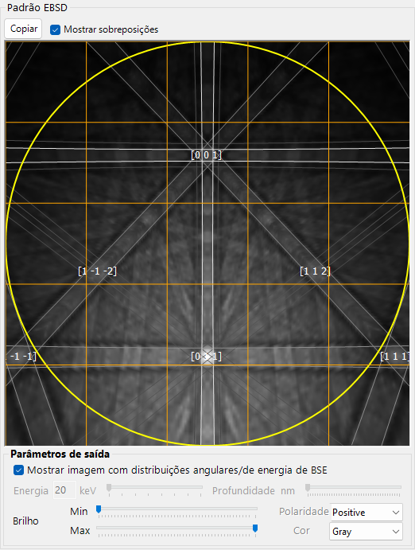

# Simulação EBSD

O **Simulador EBSD** simula os padrões de difração de elétrons retroespalhados (EBSD) — padrões de Kikuchi — obtidos em um microscópio eletrônico de varredura (MEV), usando cálculos da teoria dinâmica. Ele calcula a distribuição angular/de energia/de profundidade dos elétrons retroespalhados (BSE) por meio de uma simulação de Monte Carlo, constrói um **master pattern** dinâmico (de ondas de Bloch) do cristal e o projeta sobre o detector para a orientação atual do cristal.

A janela possui três colunas.

- **Esquerda** : condições da simulação. As abas selecionam **Geometry** (geometria da amostra/detector e uma vista 3D), **BSE Distribution** (distribuições dos elétrons retroespalhados) e **Overlays** (linhas de Kikuchi e outras anotações).
- **Centro** : o padrão EBSD (de Kikuchi) para a orientação atual do cristal.
- **Direita** : o master pattern independente da orientação (projeção 2D e esfera 3D).

---

## Atalhos de teclado e mouse

A vista central do padrão EBSD (de Kikuchi) e as vistas do master pattern do lado direito respondem a diferentes ações do mouse.

| Atalho | Ação |
|----------|--------|
| <kbd>F1</kbd> | Abrir esta página do manual on-line |
| Arrastar com o botão esquerdo o padrão perto do centro | Inclinar o cristal |
| Arrastar com o botão esquerdo a área externa do padrão | Girar o cristal |
| Clique duplo no padrão | Selecionar a subcélula do detector sob o cursor e mostrar suas estatísticas |
| Arrastar com o botão esquerdo uma vista 3D (geometria / esfera master) | Rotacionar |
| Arrastar com o botão direito, ou roda do mouse, em uma vista 3D | Zoom |
| <kbd>CTRL</kbd> + Clique duplo direito em uma vista 3D | Alternar ortográfica / perspectiva |
| Arrastar / roda do mouse no master pattern 2D | Deslocar / aplicar zoom à imagem |

As vistas 3D usam a [navegação de vista](21-shortcuts.md) padrão do ReciPro (deslocamento desativado).

→ Consulte **[21. Atalhos de teclado e mouse](21-shortcuts.md)** para uma visão geral de todas as janelas.

---

## Fluxo de trabalho

Pressionar **Build Master Pattern** executa as seguintes etapas em ordem.

1. **Simulação BSE de Monte Carlo** : usando a composição atual do cristal, a densidade, a tensão de aceleração e a inclinação da amostra, cerca de 2,5 milhões de elétrons são rastreados dentro da amostra (espalhamento elástico: seções de choque de Mott/NIST; espalhamento inelástico: modelo de resposta dielétrica). Isso fornece a distribuição conjunta de *profundidade de penetração × direção de saída × energia de saída* dos elétrons retroespalhados.
2. **Seleção automática de faixa** : a partir dessa distribuição, a faixa de energia (da energia incidente até cerca do 80º percentil da perda de energia) e a faixa de profundidade (até cerca do 99º percentil da profundidade de penetração) usadas no cálculo dinâmico são definidas automaticamente.
3. **Construção do master pattern** : para cada energia e profundidade, o problema da difração dinâmica (ondas de Bloch) é resolvido e integrado sobre a esfera de direções, ponderado pela distribuição de Monte Carlo, para fornecer a intensidade da difração retroespalhada em todas as direções. O resultado é armazenado em uma grade de área igual (Rosca–Lambert).
4. **Projeção sobre o detector, com ponderação** : para a orientação atual do cristal, a intensidade da direção subtendida por cada pixel do detector é consultada no master pattern e desenhada como o padrão de Kikuchi, opcionalmente ponderada pela distribuição angular/de energia dos BSE.

As faixas de energia e profundidade são definidas automaticamente nas etapas 1–2, mas podem ser ajustadas manualmente antes da construção.

---

## Configurações MEV-EBSD

### Condições do MEV e da amostra

- **Energy** : tensão de aceleração do feixe incidente (keV).
- **Wavelength** : comprimento de onda do elétron (Å), vinculado a Energy.
- **Sample tilt** : ângulo de inclinação da amostra (tipicamente 70°). A grande inclinação no EBSD aumenta o rendimento de elétrons retroespalhados.

### Geometria EBSD

- **Detector tilt** : inclinação do detector (tela de fósforo).
- **Detector radius** : raio do detector (mm); define o campo de visão angular do padrão desenhado.
- **Detector center** : posição (Y, Z) do centro do detector em relação ao ponto de impacto do feixe (mm).

A geometria pode ser inspecionada na vista 3D na aba **Geometry**.

A placa cinza é a amostra, o cilindro/cone verde é o detector e o **+Z (=beam)** roxo é o feixe incidente. Os eixos cristalinos **a / b / c** (fixos à amostra) também são mostrados. Os botões **Bird's-Eye View**, **Surface Normal**, **X Axis (Rotation Axis)** e **Z Axis (Beam Direction)** alinham a vista a direções padrão. Consulte o [Apêndice A1. Sistemas de coordenadas](appendix/a1-coordinate-system/2-diffraction.md) para as definições dos sistemas de coordenadas.

---

## Distribuição BSE

A aba **BSE Distribution** mostra as distribuições de Monte Carlo dos elétrons retroespalhados. Use **Simulate** para recalculá-las.

- **Stereonet** : distribuição angular (histograma das direções de saída) dos elétrons retroespalhados. O centro é a direção da normal à superfície, e o contorno amarelo/laranja marca a região subtendida pelo detector. **Draw axes** sobrepõe os eixos cristalinos, e a escala de cores (Min/Max, resolução, cor) é ajustável.
- **ΔE (keV)** : distribuição da perda de energia dos elétrons retroespalhados.
- **Depth (nm)** : distribuição da profundidade final de saída dos elétrons retroespalhados.

Essas distribuições são calculadas pelo mesmo mecanismo de Monte Carlo das [Trajetórias eletrônicas](8-electron-trajectory.md) e são usadas para ponderar o master pattern.

---

## Overlays

A aba **Overlays** configura as anotações desenhadas sobre o padrão EBSD.

- **Background color** : cor de fundo.
- **Detector outline** : o contorno do detector. **Show circle** (perímetro) / **Show mesh** (grade).
- **Show Kikuchi lines** : desenhar linhas de Kikuchi. **Line Width** / **Color** e **Apply structure factors to Kikuchi line intensity**.
- **Show Kikuchi line indices** : mostrar os índices das linhas de Kikuchi (bandas).
- **Show zone axis indices** : mostrar os índices dos eixos de zona.
- **Kikuchi line criteria** : quais linhas de Kikuchi desenhar: **Structure factor** (as *N* maiores por fator de estrutura) ou **1/d Cutoff** (aquelas com 1/d abaixo de um limiar).
- **Text settings** : **Text Size** / **Color** dos rótulos de índice.

---

## Master pattern

O master pattern é a intensidade da difração retroespalhada em todas as direções, calculada antecipadamente pela teoria dinâmica com **Build Master Pattern**.

- **Vista 2D** (esquerda) : projeção de área igual de um hemisfério. **Hemisphere** seleciona o hemisfério projetado (+Z / −Z).
- **Vista 3D** (direita) : uma esfera com a intensidade mapeada sobre ela. Pode ser rotacionada com o mouse, e um quadro no canto superior direito mostra os eixos cristalinos sincronizados (a/b/c). **Axis Labels** / **Axis Arrows** alternam os rótulos/setas, e **View Along** olha ao longo de um eixo de zona escolhido [u v w].
- **Min / Max, Polarity, Color** : faixa de intensidade exibida, polaridade e escala de cores.
- Controles deslizantes **Energy / Depth** : selecionam a fatia de energia/profundidade a ser exibida.
- Qualquer das vistas pode ser enviada para a área de transferência com **Copy**.

### Parâmetros da simulação dinâmica

- **Number of diffracted waves** : número de feixes difratados (ondas) incluídos no cálculo de ondas de Bloch. Mais ondas são mais precisas, mas mais lentas.
- **Grid** : resolução da grade do master pattern (padrão 256).
- **Energy from … to … with step of …** : faixa de energia e passo integrados (keV); definidos automaticamente a partir do resultado de Monte Carlo.
- **Thickness from … to … with step of …** : faixa de profundidade e passo integrados (nm); também definidos automaticamente.
- **Use non-local absorption model** : usar a forma de absorção não local.
- **Include TDS background intensities** : incluir o fundo do espalhamento térmico difuso (TDS).

---

## Padrão EBSD

O painel central mostra o padrão EBSD (de bandas de Kikuchi) para a orientação atual do cristal.

- **Show Dynamical EBSD Pattern (Master Pattern Required)** : projeta o master pattern construído sobre o detector.
- **Show overlays** : desenha os overlays (abaixo), como linhas de Kikuchi e índices.
- **Output parameters**
  - **Show image with BSE angular/energy distributions** : quando marcado, o padrão é composto por ponderação com a distribuição BSE (energia, profundidade, direção) em vez de uma única fatia.
  - **Energy / Depth** : quando a opção acima está desligada, seleciona a fatia de energia/profundidade a ser exibida.
  - **Brightness (Min/Max), Polarity, Color** : faixa de brilho, polaridade e escala de cores.
- **Copy** : copia o padrão para a área de transferência.

---

## Veja também

- [Trajetórias eletrônicas](8-electron-trajectory.md) — simulação de Monte Carlo de trajetórias eletrônicas / BSE usada para a ponderação angular/de energia/de profundidade.
- [Simulador de difração](7-diffraction-simulator/index.md) — difração eletrônica dinâmica (de ondas de Bloch).
- [Apêndice A1. Sistemas de coordenadas](appendix/a1-coordinate-system/2-diffraction.md) — definições dos sistemas de coordenadas da amostra/detector.
