# Simulação EBSD

O **Simulador EBSD** simula os padrões de difração de elétrons retroespalhados (EBSD) — padrões de Kikuchi — obtidos em um microscópio eletrônico de varredura (MEV), usando cálculos da teoria dinâmica. Ele calcula a distribuição angular/de energia/de profundidade dos elétrons retroespalhados (BSE) por meio de uma simulação de Monte Carlo, constrói um **master pattern** dinâmico (de ondas de Bloch) do cristal e o projeta sobre o detector para a orientação atual do cristal. Também é possível carregar uma imagem EBSD experimental e **indexá-la**: a orientação que melhor a explica é procurada automaticamente ([Imagem experimental](#imagem-experimental)).

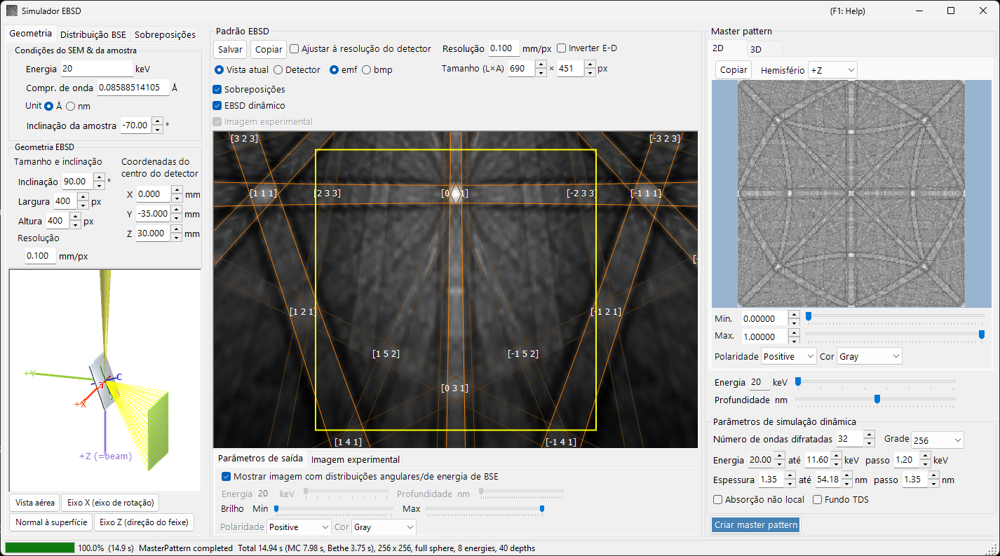

A janela possui três colunas.

- **Esquerda** : condições da simulação. As abas selecionam **Geometria** (geometria da amostra/detector e uma vista 3D), **Distribuição BSE** (distribuições dos elétrons retroespalhados) e **Sobreposições** (linhas de Kikuchi e outras anotações).
- **Centro** : o padrão EBSD (de Kikuchi) para a orientação atual do cristal. Abaixo dele, as abas selecionam **Parâmetros de saída** e **Imagem experimental**.
- **Direita** : o master pattern independente da orientação, nas abas **2D** e **3D**.

A barra de status na parte inferior mostra o andamento do cálculo em execução e um resumo do seu resultado.

---

## Atalhos de teclado e mouse

A vista central do padrão EBSD (de Kikuchi) e as vistas do master pattern do lado direito respondem a diferentes ações do mouse.

| Atalho | Ação |
|----------|--------|
| <kbd>F1</kbd> | Abrir esta página do manual on-line |
| Arrastar com o botão esquerdo o padrão perto do centro | Inclinar o cristal |
| Arrastar com o botão esquerdo a área externa do padrão | Girar o cristal |
| Clique duplo no padrão | Selecionar a subcélula do detector sob o cursor e mostrar suas estatísticas |
| Soltar um arquivo de imagem sobre a janela | Carregá-lo como imagem EBSD experimental |
| Arrastar com o botão esquerdo uma vista 3D (geometria / esfera master) | Rotacionar |
| Arrastar com o botão direito, ou roda do mouse, em uma vista 3D | Zoom |
| <kbd>CTRL</kbd> + Clique duplo direito em uma vista 3D | Alternar ortográfica / perspectiva |
| Arrastar / roda do mouse no master pattern 2D | Deslocar / aplicar zoom à imagem |

As vistas 3D usam a [navegação de vista](21-shortcuts.md) padrão do ReciPro (deslocamento desativado).

→ Consulte **[21. Atalhos de teclado e mouse](21-shortcuts.md)** para uma visão geral de todas as janelas.

---

## Fluxo de trabalho

Pressionar **Criar master pattern** executa as seguintes etapas em ordem.

1. **Simulação BSE de Monte Carlo** : usando a composição atual do cristal, a densidade, a tensão de aceleração e a inclinação da amostra, cerca de 2,5 milhões de elétrons são rastreados dentro da amostra (espalhamento elástico: seções de choque de Mott/NIST; espalhamento inelástico: modelo de resposta dielétrica). Isso fornece a distribuição conjunta de *profundidade de penetração × direção de saída × energia de saída* dos elétrons retroespalhados.
2. **Seleção automática de faixa** : a partir dessa distribuição, a faixa de energia (da energia incidente até cerca do 80º percentil da perda de energia) e a faixa de profundidade (até cerca do 99º percentil da profundidade de penetração) usadas no cálculo dinâmico são definidas automaticamente.
3. **Construção do master pattern** : para cada energia e profundidade, o problema da difração dinâmica (ondas de Bloch) é resolvido e integrado sobre a esfera de direções, ponderado pela distribuição de Monte Carlo, para fornecer a intensidade da difração retroespalhada em todas as direções. O resultado é armazenado em uma grade de área igual (Roşca–Lambert).
4. **Projeção sobre o detector, com ponderação** : para a orientação atual do cristal, a intensidade da direção subtendida por cada pixel do detector é consultada no master pattern e desenhada como o padrão de Kikuchi, opcionalmente ponderada pela distribuição angular/de energia dos BSE.

As faixas de energia e profundidade são definidas automaticamente nas etapas 1–2, mas podem ser ajustadas manualmente antes da construção.

---

## Geometria

### Condições do SEM & da amostra

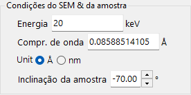

- **Energy** : tensão de aceleração do feixe incidente (keV).
- **Wavelength** : comprimento de onda do elétron, vinculado a Energy. **Unit** seleciona Å ou nm.
- **Sample tilt** : ângulo de inclinação da amostra (tipicamente −70°). A grande inclinação no EBSD aumenta o rendimento de elétrons retroespalhados.

### Geometria EBSD

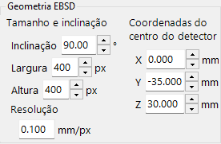

O detector (tela de fósforo) é um retângulo definido por uma contagem de pixels e um tamanho de pixel.

- **Tamanho e inclinação** : **Tilt** é a inclinação do plano do detector (°); **Width** e **Height** são o número de pixels do detector.
- **Resolução** : o tamanho físico de um pixel do detector (mm/px). O tamanho físico do detector é, portanto, Width × Resolução por Height × Resolução.
- **Coordenadas do centro do detector** : posição **X**, **Y**, **Z** do centro do detector em relação ao ponto de impacto do feixe (mm). Y e Z, junto com a inclinação, determinam o comprimento de câmara; X é o deslocamento esquerda-direita.

Ao carregar uma imagem experimental, **Width** e **Height** passam a ser o tamanho da imagem, de modo que um pixel do detector corresponda a um pixel da imagem (a **Resolução** não é alterada).

A geometria pode ser inspecionada na vista 3D na aba **Geometria**.

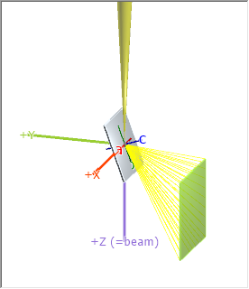

A placa cinza é a amostra, a placa retangular verde é o detector e o **+Z (=beam)** roxo é o feixe incidente. Os eixos cristalinos **a / b / c** (fixos à amostra) também são mostrados. Os botões **Vista aérea**, **Normal à superfície**, **Eixo X (eixo de rotação)** e **Eixo Z (direção do feixe)** alinham a vista a direções padrão. Consulte o [Apêndice A1. Sistemas de coordenadas](appendix/a1-coordinate-system/2-diffraction.md) para as definições dos sistemas de coordenadas.

---

## Distribuição BSE

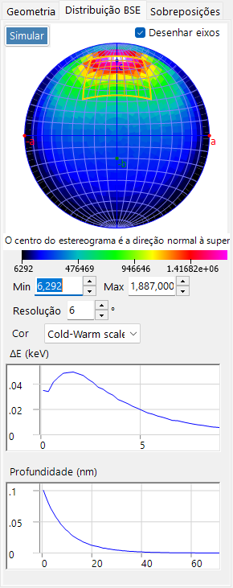

A aba **Distribuição BSE** mostra as distribuições de Monte Carlo dos elétrons retroespalhados. Use **Simular** para recalculá-las.

- **Stereonet** : distribuição angular (histograma das direções de saída) dos elétrons retroespalhados. O centro é a direção da normal à superfície, e o contorno amarelo marca a região retangular subtendida pelo detector. **Desenhar eixos** sobrepõe os eixos cristalinos, e a escala de cores (**Min** / **Max**, **Resolution**, **Cor**) é ajustável.
- **ΔE (keV)** : distribuição da perda de energia dos elétrons retroespalhados.
- **Profundidade (nm)** : distribuição da profundidade em que os elétrons retroespalhados detectados sofreram seu último evento de espalhamento inelástico — a mesma definição de profundidade que pondera o master pattern.

Essas distribuições são calculadas pelo mesmo mecanismo de Monte Carlo das [Trajetórias eletrônicas](8-electron-trajectory.md) e são usadas para ponderar o master pattern.

---

## Sobreposições

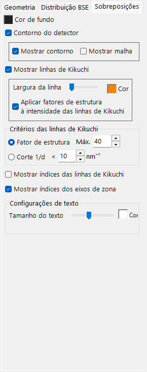

A aba **Sobreposições** configura as anotações desenhadas sobre o padrão EBSD.

- **Background color** : cor de fundo.
- **Contorno do detector** : o contorno do detector. **Mostrar contorno** (o retângulo amarelo na borda do detector) / **Mostrar malha** (grade de divisão).
- **Mostrar linhas de Kikuchi** : desenhar linhas de Kikuchi. **Largura da linha** / **Cor** e **Aplicar fatores de estrutura à intensidade das linhas de Kikuchi** (cada linha se funde ao fundo em proporção ao seu fator de estrutura).
- **Critérios das linhas de Kikuchi** : quais linhas de Kikuchi desenhar: **Fator de estrutura** (as **Top** *N* por fator de estrutura) ou **Corte 1/d** (aquelas com 1/d abaixo de um limiar, nm⁻¹).
- **Mostrar índices das linhas de Kikuchi** : mostrar os índices das linhas de Kikuchi (bandas).
- **Mostrar índices dos eixos de zona** : mostrar os índices dos eixos de zona.
- **Configurações de texto** : **Tamanho do texto** / **Cor** dos rótulos de índice.

---

## Master pattern

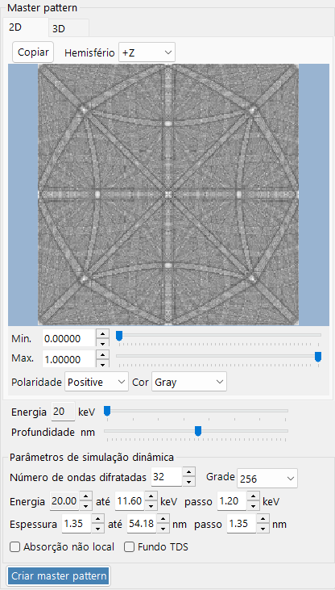

O master pattern é a intensidade da difração retroespalhada em todas as direções, calculada antecipadamente pela teoria dinâmica com **Criar master pattern** (**Parar** interrompe o cálculo em execução).

- Aba **2D** : projeção de área igual (de Lambert) de um hemisfério. **Hemisfério** seleciona o hemisfério projetado (+Z / −Z).
- Aba **3D** : uma esfera com a intensidade mapeada sobre ela. Pode ser rotacionada com o mouse, e um quadro no canto superior esquerdo mostra os eixos cristalinos sincronizados (a/b/c). **Rótulos dos eixos** / **Setas dos eixos** alternam os rótulos/setas, e **Ver na direção** olha ao longo do eixo de zona [u v w] informado ao lado.
- Controles deslizantes **Energy / Depth** : selecionam a fatia de energia/profundidade da pré-visualização.
- Qualquer das vistas pode ser enviada para a área de transferência com **Copiar**.
- **Salvar vídeo** (aba **3D**) : salva um vídeo (MP4) do master pattern esférico em rotação. A direção de rotação, a velocidade, a duração, os fps e a qualidade são definidos na mesma caixa de diálogo "Movie setting" do [Visualizador de estrutura](5-structure-viewer.md). Apenas esta vista 3D gira; a orientação do cristal (os ângulos de Euler da janela principal) não é alterada.

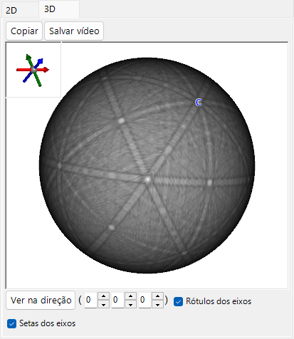

### Parâmetros de simulação dinâmica

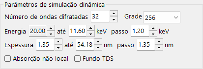

- **Number of diffracted waves** : número de feixes difratados (ondas) incluídos no cálculo de ondas de Bloch. Mais ondas são mais precisas, mas mais lentas.
- **Grade** : resolução da grade do master pattern (pixels por lado, 64–8192; padrão 256). 4096 e 8192 exigem uma quantidade enorme de memória para os dados intermediários (com as 16 energias × 40 profundidades padrão, cerca de 344 GB em 4096 e 1374 GB em 8192; já cerca de 86 GB em 2048), de modo que o número de passos de energia e profundidade precisa ser reduzido drasticamente para que se tornem utilizáveis. Se a memória se esgotar, o cálculo termina com "MasterPattern failed" (o ReciPro continua em execução).
- **Energy from … to … with step of …** : faixa de energia e passo integrados (keV); definidos automaticamente a partir do resultado de Monte Carlo.
- **Thickness from … to … with step of …** : faixa de profundidade e passo integrados (nm); também definidos automaticamente.
- **Absorção não local** : usar a forma de absorção não local.
- **Fonte não local** : substitui a fonte de retroespalhamento localizada nos sítios atômicos pela forma não local do potencial absortivo (U'_back integrado sobre o hemisfério posterior). Ambas usam a mesma seção de choque física: é uma troca de modelo, não um fundo aditivo.
- **Profundidade da fonte (MC)** : qual evento Monte Carlo define a profundidade da fonte coerente de retroespalhamento usada na ponderação (energia × profundidade): o último evento inelástico (padrão), o último evento de transporte de qualquer tipo ou a última decoerência. Neste último caso um evento reinicia a fonte só se for localizado o bastante para deixar na amostra a informação de qual átomo espalhou: os elásticos com a probabilidade térmico-difusa 1 − exp(−2B s²) do fator de Debye–Waller (o espalhamento de Bragg coerente não), os inelásticos sempre para excitações de caroço ou alta perda e, para excitações de valência, só com a fração cuja transferência de momento excede o corte plasmônico q_c = ω_p/v_F (plasmons e pares elétron–buraco deslocalizados preservam o estado de Bloch). Fontes mais rasas carregam menos modulação de Kikuchi, então a última opção define o fundo difuso só pelo transporte, sem parâmetro livre. Mudar apenas reagrupa os elétrons salvos, sem repetir o Monte Carlo.
- **Camada amorfa superficial** : espessura (nm) de uma camada superficial não cristalina (óxido nativo, contaminação, dano de polimento ou de desbaste iônico). Elétrons cuja fonte coerente de retroespalhamento está dentro da camada não carregam modulação de Kikuchi e são somados como contribuição uniforme média em direção, com a mesma intensidade por elétron; fontes abaixo da camada são medidas a partir da superfície do cristal. O transporte é calculado com a composição e densidade do cristal, adequado para poucos nm. 0 desativa; mudar apenas reagrupa os elétrons salvos, sem repetir o Monte Carlo.
- **Ponderar pela resposta do fósforo** (ativo por padrão, E_dead = 2 keV) : pondera cada elétron Monte Carlo pelo rendimento luminoso de uma tela de fósforo, φ(E) = max(0, E − E_dead), em vez de contar cada elétron uma vez. Elétrons de maior energia saem da amostra inclinada mais para a frente, de modo que a ponderação reduz o gradiente de intensidade de cima para baixo do padrão (para Si a 20 kV de cerca de 2,5 para 1,7 ao longo do detector) e enfraquece ligeiramente os eixos de zona. Aplica-se ao binning no plano do detector e à distribuição de energia por bin; a alteração re-agrupa os elétrons guardados sem repetir o Monte Carlo. Desligue para um detector direto que conta elétrons. E_dead é a energia da camada morta (limiar) do fósforo; valores típicos 0–3 keV para uma tela P43 com revestimento de alumínio.
- **Reinjetar fluxo absorvido como fundo** (desligado por padrão) : no cálculo por ondas de Bloch, os elétrons retirados do canal coerente pela absorção (espalhamento térmico difuso) desaparecem, embora fisicamente ainda cheguem ao detector sem modulação de Kikuchi. Esta opção os devolve como fundo difuso D(t) = Σσ_n ∫(1 − N(z))dz (N(z) = densidade da onda coerente média na célula), conservando o fluxo. As intensidades absolutas aumentam (a 20 kV, cerca de 10 % para Si e 25 % para Fe₃O₄); o brilho relativo dos eixos de zona muda pouco e depende do cristal, porque o fluxo reinjetado continua pertencendo à mesma direção de saída. Sem efeito se os parâmetros de deslocamento atômico forem zero (sem absorção); atribua B a esses cristais.

---

## Padrão EBSD

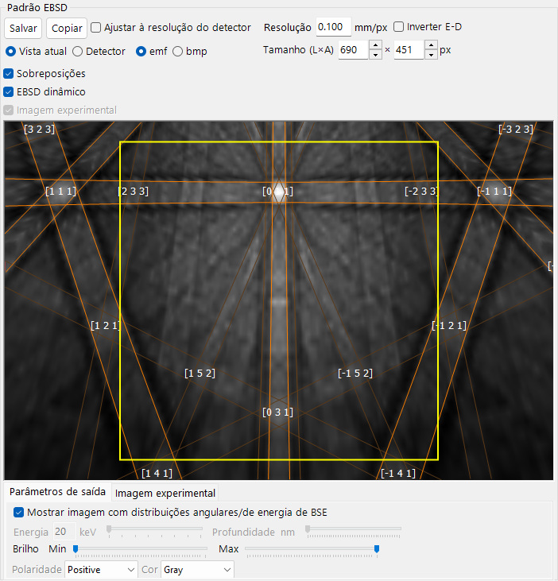

O painel central mostra o padrão EBSD (de bandas de Kikuchi) para a orientação atual do cristal. A barra acima do padrão controla o que é desenhado e como é copiado.

- **EBSD dinâmico** : projeta o master pattern construído sobre o detector; desmarcado, resta apenas o fundo.
- **Sobreposições** : desenha as linhas de Kikuchi, os índices e o contorno do detector configurados na aba **Sobreposições**.
- **Imagem experimental** : sobrepõe a imagem experimental carregada (veja abaixo).
- **Inverter E-D** : espelha o padrão e todas as suas sobreposições da esquerda para a direita. Desmarcado (padrão) é a vista do detector em direção à amostra, isto é, o padrão como uma câmera EBSD o registra; marque-o apenas se a sua imagem experimental tiver a quiralidade oposta.
- **Resolution** (mm/px) e **Size (W×H)** (px) : resolução e tamanho da vista exibida.
- **Salvar** : salva o padrão em um arquivo, usando a faixa e a resolução selecionadas ao lado. O formato (PNG / TIFF / EMF) é escolhido na caixa de diálogo de salvamento.
  - **Pattern values (\*.csv)** grava, em vez de uma imagem, as intensidades brutas na grade de pixels do detector.
  - Um TIFF é gravado em escala de cinza de 16 bits (sem quantização para 256 níveis) quando a faixa é **Detector**, **EBSD dinâmico** está exibido e **Imagem experimental** não. Nesse caso as **Sobreposições** são omitidas independentemente da caixa de seleção, e os valores de pixel são o padrão mapeado linearmente do seu próprio mínimo–máximo para 0–65535 (o mínimo e o máximo usados são informados na barra de status; use a exportação csv quando precisar de valores absolutos).
- **Copiar** : copia o padrão para a área de transferência, usando a faixa e o formato selecionados ao lado.
  - **Vista atual** copia a área exibida no momento (com o deslocamento e o zoom atuais); **Detector** copia apenas a área do detector, caso em que o contorno amarelo é omitido para que a imagem termine exatamente na borda do detector.
  - **emf** copia um Enhanced Metafile, mantendo as linhas de Kikuchi e os rótulos de índice como vetores; **bmp** rasteriza tudo.
  - **Ajustar à resolução do detector** copia com um pixel de imagem por pixel do detector (o lado maior é limitado a 4096 px). Desmarcado, é usada a resolução da tela.

### Parâmetros de saída

- **Mostrar imagem com distribuições angulares/de energia de BSE** : quando marcado, o padrão é composto por ponderação com a distribuição BSE (energia, profundidade, direção) em vez de uma única fatia.
- **Energy / Depth** : quando a opção acima está desligada, seleciona a fatia de energia/profundidade a ser exibida.
- **Brilho** (**Min** / **Max**), **Polaridade**, **Cor** : faixa de brilho, polaridade e escala de cores.
- **Aplanar o fundo** (**FWHM**, px; desligado por padrão, 100 px) : subtrai do padrão simulado uma cópia desfocada com uma gaussiana, removendo a distribuição de brilho de variação lenta para comparar bandas e eixos de zona com um padrão experimental corrigido de fundo. A largura a meia altura é dada em pixels do detector e não depende do zoom. Afeta a imagem exibida e a exportação PNG/TIFF; a exportação CSV mantém os valores brutos.

### Imagem experimental

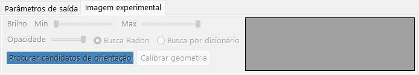

Solte um arquivo de imagem EBSD (TIFF, PNG, BMP ou JPEG; TIFF de 16 bits é lido em profundidade total) em qualquer ponto da janela para carregá-lo como padrão experimental. Ele é desenhado sobre a área do detector — acima do padrão simulado e abaixo das sobreposições de linhas de Kikuchi —, de modo que a simulação possa ser comparada diretamente com a medida. O carregamento também define **Width** e **Height** do detector com o tamanho da imagem.

- **Brilho** (**Min** / **Max**) : pontos de preto e de branco da imagem sobreposta, como fração da sua própria faixa de intensidade (controles logarítmicos). Atuam somente sobre a imagem experimental, não sobre o padrão simulado.
- **Opacidade** : opacidade da imagem sobreposta, de 0 (invisível) a 100 % (opaca). Reduza-a para ver o padrão simulado por baixo.

A orientação que explica a imagem é então procurada por um de dois mecanismos.

- **Busca Radon** : compara modelos cinemáticos de bandas de Kikuchi com o mapa de Radon (detecção de retas) da imagem experimental. Funciona sem master pattern; havendo um, os candidatos são reordenados por uma ZNCC robusta (correlação cruzada normalizada de média zero) com o padrão simulado.
- **Busca por dicionário** : gera, a partir do master pattern dinâmico, padrões de dicionário para todas as orientações e compara todos eles por ZNCC robusta. Requer o master pattern e leva alguns segundos, mas é mais confiável que a busca Radon.

**Procurar candidatos de orientação** executa o mecanismo selecionado e lista até 10 candidatos, do melhor para o pior; havendo um master pattern, o melhor candidato é refinado até ±0,25°. As colunas são:

| Coluna | Significado |
|--------|-------------|
| **#** | Posição (0 = melhor) |
| **Score** | Valor *z* da evidência de bandas de Radon |
| **Bands** | Bandas correspondidas / bandas previstas no campo de visão |
| **ZNCC** | Correlação com o padrão simulado |
| **Strong bands (hkl)** | Índices das bandas correspondidas (apenas busca Radon) |

**Clicar em uma linha aplica essa orientação a todo o programa**: o padrão simulado é redesenhado sobre o experimental e a orientação do cristal de todas as outras janelas o acompanha.

**Calibrar geometria** refina a geometria do detector — centro do padrão (PC) e distância do detector (DD) — alternadamente com a orientação, maximizando a ZNCC entre os padrões simulado e experimental. Requer o master pattern, mantém a inclinação do detector fixa e grava o resultado de volta nos campos **Coordenadas do centro do detector** X/Y/Z. Como a varredura do feixe de um MEV desloca o centro do padrão apenas uma fração de milímetro, normalmente basta uma calibração no início do experimento para toda uma série de imagens.

---

## Veja também

- [Trajetórias eletrônicas](8-electron-trajectory.md) — simulação de Monte Carlo de trajetórias eletrônicas / BSE usada para a ponderação angular/de energia/de profundidade.
- [Simulador de difração](7-diffraction-simulator/index.md) — difração eletrônica dinâmica (de ondas de Bloch).
- [Apêndice A1. Sistemas de coordenadas](appendix/a1-coordinate-system/2-diffraction.md) — definições dos sistemas de coordenadas da amostra/detector.
