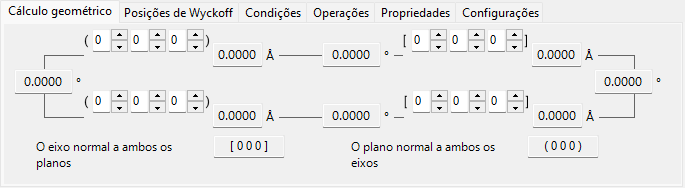
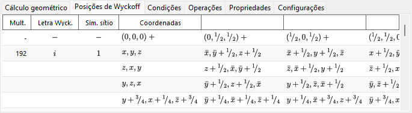
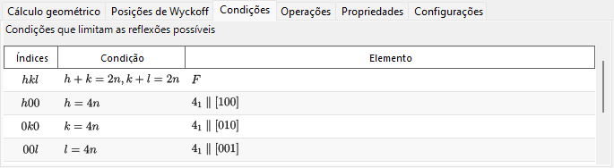
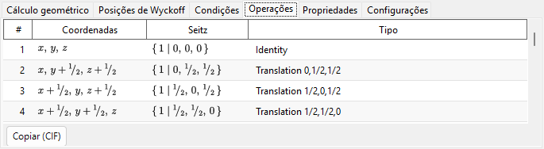
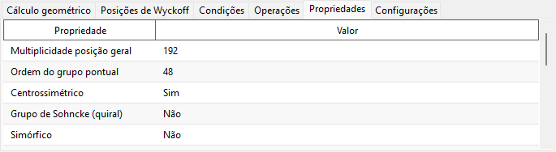
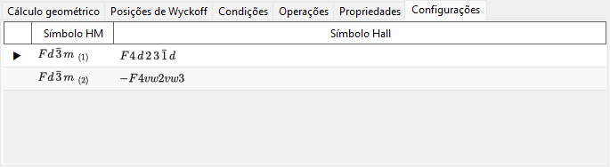

# Informação de simetria

A **Informação de simetria** exibe informações detalhadas sobre a simetria de grupo espacial do cristal selecionado e, além disso, renderiza diagramas esquemáticos dos elementos de simetria e das posições gerais no estilo das *International Tables for Crystallography* Vol. A.

A janela é dividida em uma área de identidade do grupo espacial (canto superior esquerdo), uma área de cálculo/tabelas com abas (canto superior direito) e dois diagramas esquemáticos (parte inferior).

!!! tip "Teoria da simetria (Apêndice A4)"
    O que um símbolo de Hermann–Mauguin/Hall/Schoenflies realmente codifica, as classificações de teoria de grupos da aba **Propriedades** (centrossimétrico, Sohncke, simórfico, polar, …), o significado dos diagramas de elementos de simetria/posições gerais abaixo e as relações grupo–subgrupo mostradas por **Relações de grupo...** são todos explicados no **[Apêndice A4. Simetria e grupos espaciais](appendix/a4-symmetry-space-groups/index.md)**.

---

## Atalhos de teclado e mouse

Esta janela não possui combinações especiais de teclas ou mouse. <kbd>F1</kbd> abre esta página do manual, e os dois botões **Copiar** colocam o diagrama dos elementos de simetria e o diagrama das posições gerais na área de transferência (como **emf** vetorial ou **bmp** rasterizado, escolhido com **Formato de cópia**).

→ Consulte **[21. Atalhos de teclado e mouse](21-shortcuts.md)** para ver todas as janelas de uma só vez.

---

## Identidade do grupo espacial

O painel superior esquerdo lista, para o grupo espacial atual:

- **Número** (1–230) e o índice da configuração (*setting*)
- **Sistema cristalino**
- **Grupo pontual** : símbolos de Hermann–Mauguin (HM) e de Schoenflies (SF)
- **Grupo espacial** : símbolo HM curto, símbolo HM completo, símbolo SF e **símbolo Hall**

---

## Cálculo geométrico

Insira dois planos cristalinos \((h_1, k_1, l_1)\), \((h_2, k_2, l_2)\) ou dois índices de direção \([u_1, v_1, w_1]\), \([u_2, v_2, w_2]\) para obter:

- a distância interplanar de cada plano / o comprimento de cada eixo,
- o ângulo entre os dois planos (ou os dois eixos),
- **o índice de direção normal a ambos os planos** e **o índice de plano normal a ambos os eixos**.

Esses cálculos respeitam a métrica da célula unitária atual.

---

## Posições de Wyckoff

Lista cada posição de Wyckoff com sua multiplicidade, sua letra de Wyckoff, sua simetria de sítio e a indicação de se é uma posição geral ou especial. Para redes centradas, os vetores de translação da rede são mostrados na linha de cabeçalho.

---

## Condições

As condições de reflexão decorrentes da centragem da rede e dos operadores de simetria de deslizamento/parafuso.

---

## Operações

Lista cada operação de simetria da posição geral (com as translações de centragem da rede já expandidas) como um tripleto de coordenadas, um símbolo de Seitz e um tipo geométrico em linguagem simples (p. ex. *"3-fold rotation"*, *"c-glide plane"*, *"screw axis"*). **Copiar (CIF)** copia a lista completa para a área de transferência como um loop CIF `_space_group_symop_operation_xyz`.

→ Veja o **[Apêndice A4.1](appendix/a4-symmetry-space-groups/symbols-and-diagrams.md#operações-de-simetria-aba-operações)** para saber como ler essas três notações.

---

## Propriedades

Informa as classificações de teoria de grupos do grupo espacial atual (multiplicidade da posição geral, ordem do grupo pontual, centrossimétrico, Sohncke, simórfico, direção polar, par enantiomorfo, família cristalina/sistema reticular/tipo de Bravais, classe cristalina aritmética, simetria de Patterson) e quais propriedades físicas macroscópicas (piroelétrico/ferroelétrico, piezoelétrico, geração de segundo harmónico, atividade óptica) são permitidas por essa simetria.

→ Veja o **[Apêndice A4.1](appendix/a4-symmetry-space-groups/symbols-and-diagrams.md#classificação-segundo-a-teoria-de-grupos-aba-propriedades)** para o significado de cada termo.

---

## Configurações

Lista, para referência, todas as escolhas tabuladas de origem/configuração de eixos que compartilham o número IT do grupo espacial atual, cada uma com seus símbolos HM e Hall; a configuração exibida no momento é marcada. Selecionar uma linha não altera o cristal.

---

## Diagramas dos elementos de simetria e das posições gerais

Os dois painéis na parte inferior reproduzem os diagramas esquemáticos de simetria do grupo espacial na notação das *International Tables for Crystallography* Vol. A.

- **Elementos de simetria (à esquerda)**: eixos de rotação/parafuso, planos de espelho/deslizamento e centros de inversão/pontos de rotoinversão são desenhados com os símbolos gráficos convencionais.
  - Para a rede \(F\) do sistema cúbico, apenas um oitavo da célula unitária (somente o quadrante superior esquerdo) é mostrado.
  - Esses elementos de simetria também podem ser desenhados diretamente sobre o modelo 3D no [Visualizador de estrutura](5-structure-viewer.md).
- **Posições gerais (à direita)**: as posições gerais equivalentes são plotadas como círculos (uma vírgula denota uma imagem espelhada), anotadas com suas coordenadas fracionárias.
  - Apenas para o sistema cúbico, linhas auxiliares conectam os três círculos relacionados por um eixo de rotação de ordem três.

Controles abaixo dos diagramas:

- **Direção** (`a` / `b` / `c`) : escolha o eixo cristalino ao longo do qual projetar.
- **Copiar** : copia cada diagrama para a área de transferência no formato selecionado com **Formato de cópia** (**emf** vetorial / **bmp** rasterizado); o emf pode ser desagrupado e editado no PowerPoint.
- **Relações de grupo...** abre um navegador das relações de subgrupos maximais/supergrupos minimais do grupo espacial atual. Veja o [Apêndice A4.2](appendix/a4-symmetry-space-groups/group-subgroup-relations.md) para saber como lê-lo.

---

## Veja também

- [Banco de dados de cristais](1-crystal-database.md)
- [Visualizador de estrutura](5-structure-viewer.md)
- [Estereonete](6-stereonet.md)
- [Geometria de rotação](4-rotation-geometry.md)
- [Janela principal](0-main-window.md)
- [Apêndice A4. Simetria e grupos espaciais](appendix/a4-symmetry-space-groups/index.md) — os fundamentos cristalográficos e de teoria de grupos por trás de cada aba e diagrama desta página.
