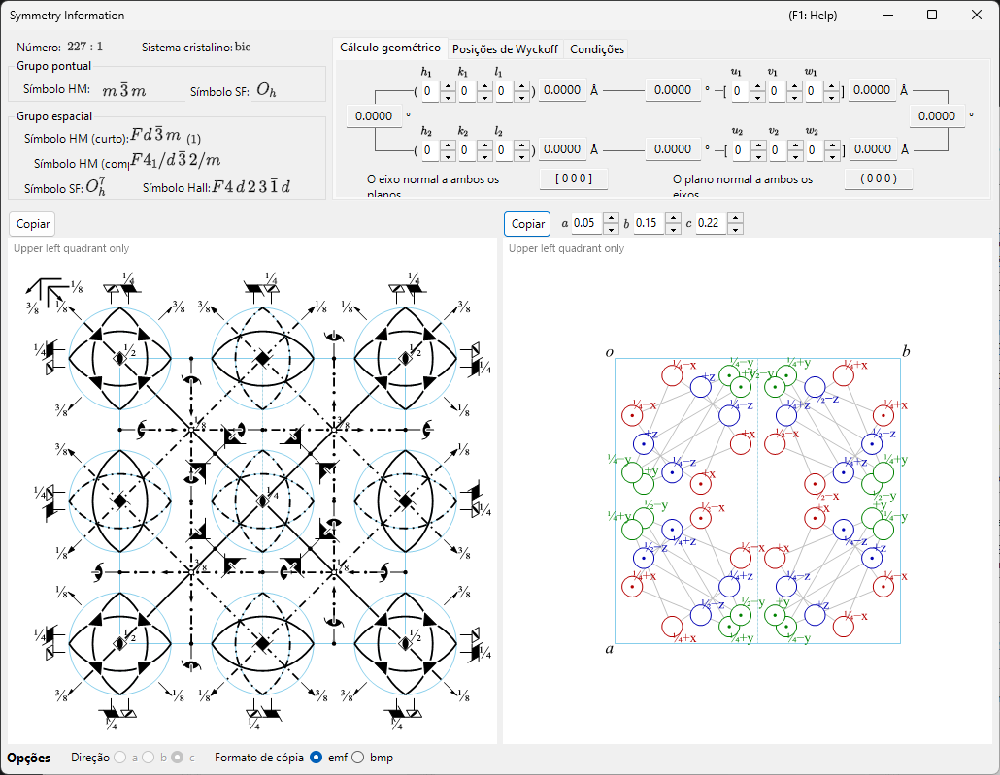
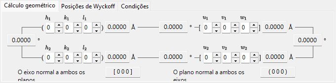
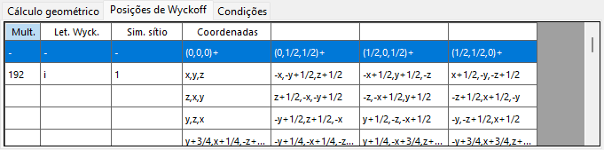
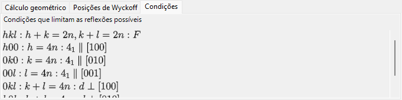

# Informação de simetria

**Informação de simetria** exibe informações detalhadas sobre a simetria do grupo espacial do cristal selecionado e, além disso, renderiza diagramas esquemáticos dos elementos de simetria e das posições gerais no estilo das *International Tables for Crystallography* Vol. A.

A janela é dividida em uma área de identidade do grupo espacial (canto superior esquerdo), uma área de cálculo/tabelas com abas (canto superior direito) e dois diagramas esquemáticos (abaixo).

---

## Atalhos de teclado e mouse

Esta janela não possui combinações especiais de teclas ou mouse. <kbd>F1</kbd> abre esta página do manual, e os dois botões **Copy** colocam o diagrama dos elementos de simetria e o diagrama das posições gerais na área de transferência (como bitmap ou como EMF vetorial quando **EMF** está marcado).

→ Consulte **[21. Atalhos de teclado e mouse](21-shortcuts.md)** para ver todas as janelas de uma só vez.

---

## Identidade do grupo espacial

O painel superior esquerdo lista, para o grupo espacial atual:

- **Number** (1–230) e o índice de setting
- **Crystal System**
- **Point Group** : símbolos de Hermann–Mauguin (HM) e de Schoenflies (SF)
- **Space Group** : símbolo curto HM, símbolo completo HM, símbolo SF e **Hall symbol**

---

## Cálculo geométrico

Insira dois planos cristalinos \((h_1, k_1, l_1)\), \((h_2, k_2, l_2)\) ou dois índices de direção \([u_1, v_1, w_1]\), \([u_2, v_2, w_2]\) para obter:

- a distância interplanar de cada plano / o comprimento de cada eixo,
- o ângulo entre os dois planos (ou os dois eixos),
- **o índice de direção normal a ambos os planos** e **o índice de plano normal a ambos os eixos**.

Esses cálculos respeitam a métrica da célula unitária atual.

---

## Posições de Wyckoff

Lista cada posição de Wyckoff com sua multiplicidade, sua letra de Wyckoff, sua simetria de sítio e a indicação de se é uma posição geral ou especial. Para redes centradas, os vetores de translação da rede são mostrados na linha de cabeçalho.

---

## Condições

As condições de reflexão decorrentes da centragem da rede e dos operadores de simetria de deslizamento/parafuso.

---

## Diagramas dos elementos de simetria e das posições gerais

Os dois painéis na parte inferior reproduzem os diagramas esquemáticos de simetria do grupo espacial na notação das *International Tables for Crystallography* Vol. A.

- **Elementos de simetria (à esquerda)**: eixos de rotação/parafuso, planos de espelho/deslizamento e centros de inversão/pontos de rotoinversão são desenhados com os símbolos gráficos convencionais.
  - Para a rede \(F\) do sistema cúbico, apenas um oitavo da célula unitária (somente o quadrante superior esquerdo) é mostrado.
  - Esses elementos de simetria também podem ser desenhados diretamente sobre o modelo 3D no [Visualizador de estrutura](5-structure-viewer.md).
- **Posições gerais (à direita)**: as posições gerais equivalentes são plotadas como círculos (uma vírgula denota uma imagem espelhada), anotadas com suas coordenadas fracionárias.
  - Apenas para o sistema cúbico, linhas auxiliares conectam os três círculos relacionados por um eixo de rotação de ordem três.

Controles abaixo dos diagramas:

- **Direction** (`a` / `b` / `c`) : escolha o eixo cristalino ao longo do qual projetar.
- **Copy** cada diagrama para a área de transferência como imagem vetorial (**EMF**) ou imagem rasterizada (**BMP**); o EMF pode ser desagrupado e editado no PowerPoint.

---

## Veja também

- [Banco de dados de cristais](1-crystal-database.md)
- [Visualizador de estrutura](5-structure-viewer.md)
- [Estereonete](6-stereonet.md)
- [Geometria de rotação](4-rotation-geometry.md)
- [Janela principal](0-main-window.md)
