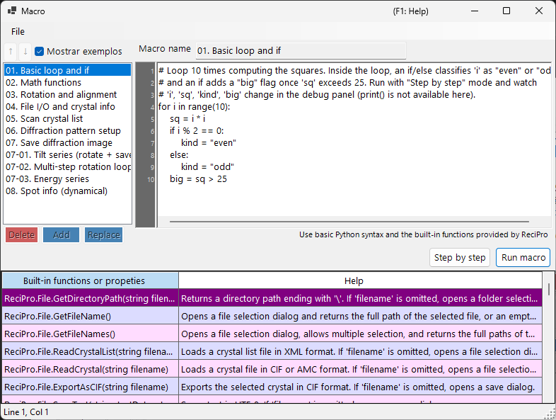

# Macro

O ReciPro inclui um sistema de macros baseado em **IronPython** para automatizar operações com cristais, simulações de difração e simulações de imagem por meio de scripts.



Na captura de tela acima, **Show samples** está ativado, exibindo as macros de exemplo integradas. A lista de macros fica à esquerda, o editor de código à direita e uma tabela de ajuda das funções integradas na parte inferior.

---

## Atalhos de teclado e mouse

| Atalho | Ação |
|----------|--------|
| <kbd>F1</kbd> | Abrir esta página do manual on-line |
| <kbd>CTRL</kbd>+<kbd>S</kbd> | Salvar o texto do editor de volta na entrada selecionada da lista de macros |
| <kbd>F10</kbd> | Avançar um passo (durante a execução passo a passo) |
| Clique duplo em uma linha da lista de ajuda de funções | Inserir a assinatura dessa função na posição do cursor |
| Arrastar um arquivo `.mcr` para a janela | Carregá-lo no editor |

**Run**, **Step** e **Stop** são botões (sem atalho de teclado).

→ Veja **[21. Atalhos de teclado e mouse](../21-shortcuts.md)** para todas as janelas em um relance.

---

## Visão geral

As macros são escritas com sintaxe Python. Usando as classes e funções integradas do ReciPro, você pode realizar programaticamente as mesmas operações disponíveis pela GUI.

- **Linguagem**: Python 3 (IronPython 3.4)
- **Armazenamento**: Binário compactado no Registro do Windows (persiste entre sessões)
- **Acesso**: Clique no botão Macro na janela principal para abrir o editor de macros

---

## Janela do editor

O editor de macros tem quatro áreas principais:

| Área | Finalidade |
|------|---------|
| **Lista de macros** (esquerda) | Macros armazenadas. `Add` acrescenta uma nova macro, `Replace` sobrescreve a selecionada, `Delete` a remove. Up/Down reordenam. |
| **Campo de nome** (topo) | Identificador da macro em edição. |
| **Área de código** (direita) | Editor de código Python com calha de números de linha, recuo automático e popup de ajuda de sintaxe. |
| **Tabela de funções integradas** (parte inferior) | Lista das funções/propriedades integradas fornecidas pelo ReciPro, cada uma com uma descrição de Ajuda. Uma referência durante a escrita do código. |
| **Barra de status** (na base) | Mostra a posição atual do cursor como `Line N, Col M`. |
| **Painel de depuração** (visível durante a execução em Step) | Lista as variáveis locais na linha atual. |

A barra de título mostra **`Macro*`** (com asterisco) enquanto houver edições não salvas, e volta a **`Macro`** após Add / Replace / <kbd>CTRL</kbd>+<kbd>S</kbd>.

### Macros de exemplo

Ativar **Show samples** (canto superior esquerdo) substitui temporariamente sua lista de macros pelas macros de exemplo integradas (laços e condicionais básicos, funções matemáticas, rotação/alinhamento, varredura da lista de cristais, simulação de difração/imagem, séries de inclinação/energia, informações de reflexão e muito mais). Os exemplos são somente leitura e são exibidos no idioma atual da interface; use-os para aprender ou como ponto de partida para copiar. Ao desativar, suas próprias macros são restauradas.

---

## Recursos de edição

- **Recuo automático**: Quando você pressiona <kbd>ENTER</kbd>, a próxima linha herda os espaços iniciais da linha atual. Se a linha terminar com `:` (após `def`/`if`/`for`/etc.), um nível extra de recuo (4 espaços) é adicionado automaticamente.
- **Backspace inteligente**: Dentro dos espaços iniciais, <kbd>BACKSPACE</kbd> remove um nível de recuo completo (4 espaços) em vez de um único caractere.
- **<kbd>TAB</kbd> / <kbd>SHIFT</kbd>+<kbd>TAB</kbd>**:
  - Sem seleção: inserir / remover um nível de recuo na posição do cursor.
  - Seleção de várias linhas: recuar / reduzir o recuo de todas as linhas selecionadas de uma vez.
- **Autocompletar**: Conforme você digita, um popup lista os nomes de funções correspondentes e as palavras-chave da linguagem. As setas navegam, <kbd>ENTER</kbd> ou <kbd>TAB</kbd> aceita, <kbd>ESC</kbd> cancela.
- **Ajuda em dica de ferramenta**: Ao passar o cursor sobre uma entrada selecionada do autocompletar, sua documentação é exibida.

### Atalhos de teclado

| Atalho | Ação |
|----------|--------|
| <kbd>CTRL</kbd>+<kbd>S</kbd> | Salvar o código atual na entrada de macro selecionada (no local) |
| <kbd>F10</kbd> | Avançar para a próxima linha (durante a execução em Step) |
| <kbd>ENTER</kbd> | Inserir nova linha com recuo automático |
| <kbd>TAB</kbd> / <kbd>SHIFT</kbd>+<kbd>TAB</kbd> | Recuar / reduzir recuo |
| <kbd>BACKSPACE</kbd> | Excluir um nível de recuo se estiver dentro dos espaços iniciais |
| <kbd>CTRL</kbd>+<kbd>↑</kbd> / <kbd>CTRL</kbd>+<kbd>↓</kbd> | N/A — use os botões Up/Down para reordenar as macros |

---

## Executando macros

Dois modos de execução:

- **Run macro**: Executa o código até o fim. Os erros abrem uma caixa de diálogo mostrando o traceback do Python e destacam a linha problemática no editor.
- **Step by step**: Pausa antes de cada linha. O painel de depuração mostra as variáveis locais. Use <kbd>F10</kbd> (ou o botão **Next step (F10)**) para avançar, ou **Stop** para abortar.

**Stop** funciona apenas no modo Step (a execução padrão de Run macro não pode ser interrompida porque o IronPython não respeita `CancellationToken` e tudo é executado na thread da interface).

---

## Suporte à linguagem Python

Este ambiente de macros é o **IronPython 3.4**. Nem todos os recursos do Python fazem sentido aqui.

### Pré-importado

- **`math`** é importado na inicialização. Use `math.sqrt(x)`, `math.sin(x)`, `math.pi`, `math.radians(deg)`, etc. diretamente.

### Utilizável

- Controle de fluxo: `if`/`elif`/`else`, `for`, `while`, `def`, `class`, `return`, `try`/`except`/`finally`, `pass`, `break`, `continue`, `lambda`
- Literais: `True`, `False`, `None`
- Funções integradas: `len`, `range`, `abs`, `min`, `max`, `sum`, `sorted`, `enumerate`, `zip`, `int`, `float`, `str`, `list`, `dict`, `tuple`, `type`, `isinstance`
- Módulos da biblioteca padrão que são Python puro: `random`, `datetime`, `time`, `re`, `json`, `itertools`, `functools`, `collections`

Esses fundamentos estão pré-registrados no popup de autocompletar, de modo que você pode descobri-los digitando as primeiras letras.

### NÃO utilizável

- **`print()`** : não há janela de console; a saída não vai a lugar nenhum. Use **Step by step** e observe o painel de depuração para inspecionar valores.
- **`input()`** : sem stdin.
- **E/S de arquivo** (`open`, `with open`) : não destinada a macros. Use os auxiliares `ReciPro.File.*` em vez disso.
- **Pacotes com extensões em C**: `numpy`, `scipy`, `pandas`, `matplotlib` — não compatíveis com o IronPython.

---

## Acesso à API

A API de macros do ReciPro é exposta sob o nome de nível superior **`ReciPro`**. Cada classe integrada é um campo de `ReciPro`:

```python
ReciPro.File.*         # File I/O helpers
ReciPro.Crystal.*      # Currently selected crystal
ReciPro.CrystalList.*  # Manage the crystal list
ReciPro.Dir.*          # Crystal orientation (Euler, zone-axis, rotation)
ReciPro.DifSim.*       # Diffraction simulator
ReciPro.HRTEM.*        # HRTEM simulation
ReciPro.STEM.*         # STEM simulation
ReciPro.Potential.*    # Potential simulation
ReciPro.Sleep(ms)      # Pause execution (milliseconds)
```

O popup de autocompletar sempre mostra a forma completa `ReciPro.Class.Member` e a insere literalmente, de modo que você raramente precisa digitar o prefixo manualmente.

Veja [20.1. Funções integradas](1-built-in-functions.md) para a referência completa da API.

---

## Mensagens de erro

Quando uma macro falha, uma caixa de diálogo mostra o traceback do Python no formato padrão:

```
Traceback (most recent call last):
  File "<string>", line 5, in <module>
NameError: name 'abc' is not defined
```

O editor seleciona automaticamente a linha relatada no traceback (o quadro mais interno), de modo que você pode corrigir o problema imediatamente. Os erros de sintaxe também são relatados com números de linha, antes de a execução começar.

---

## Veja também

- [20.1. Funções integradas](1-built-in-functions.md)
- [20.2. Exemplos](2-examples.md)
