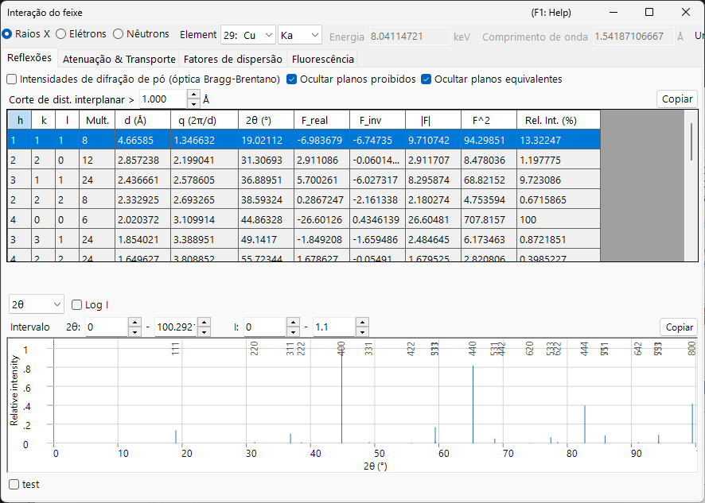
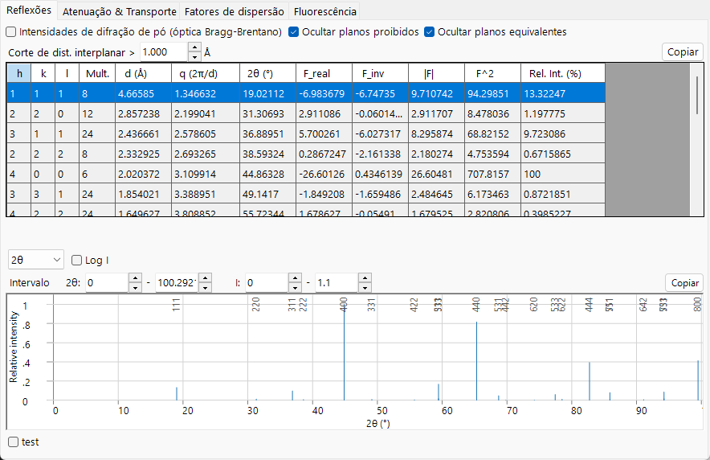
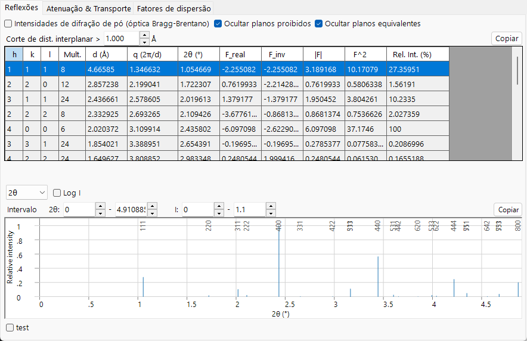
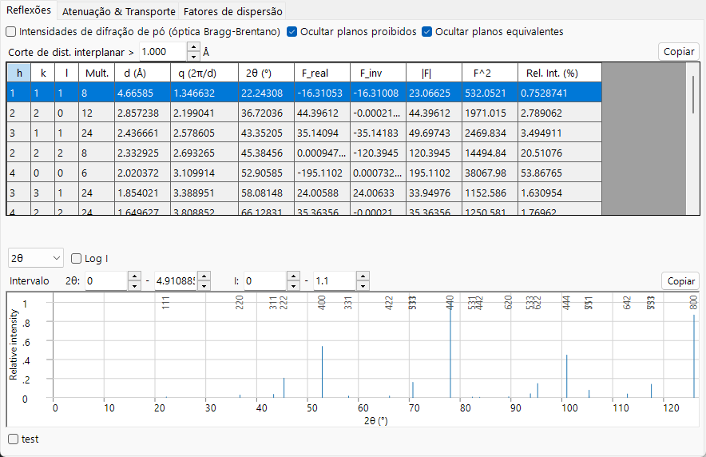
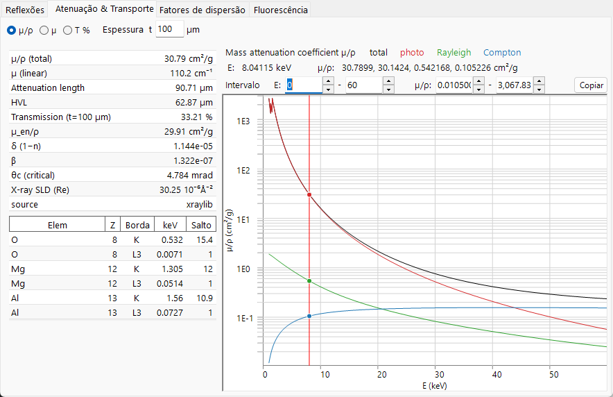
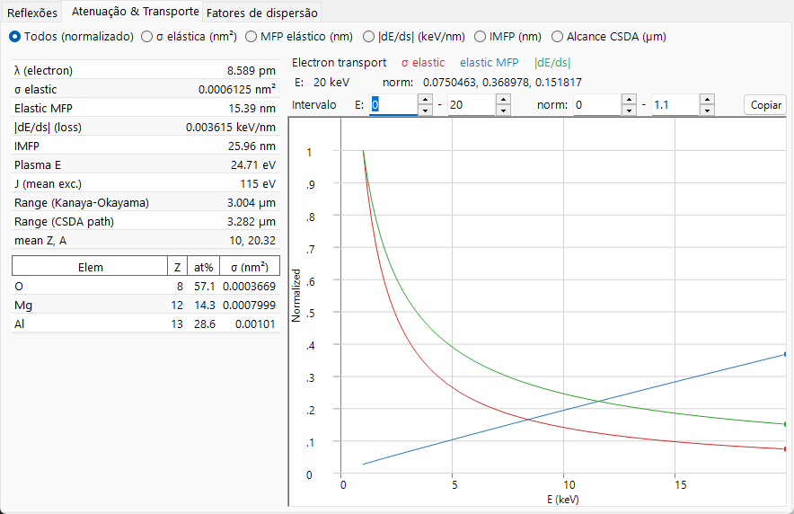
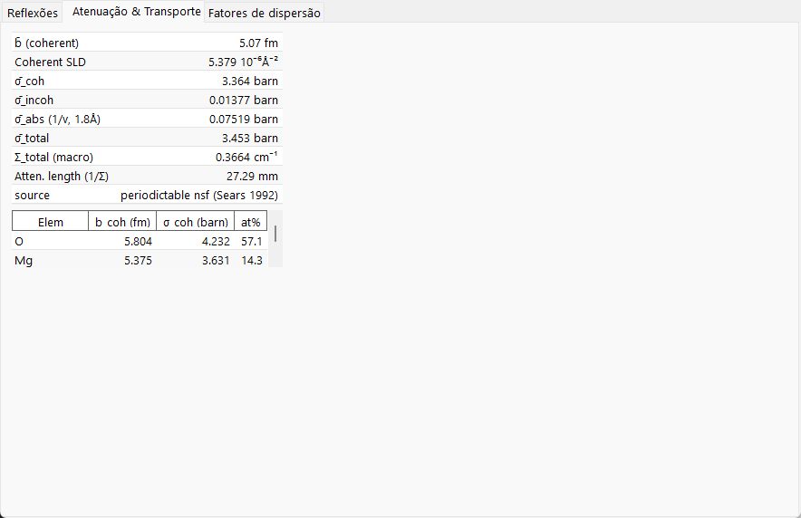
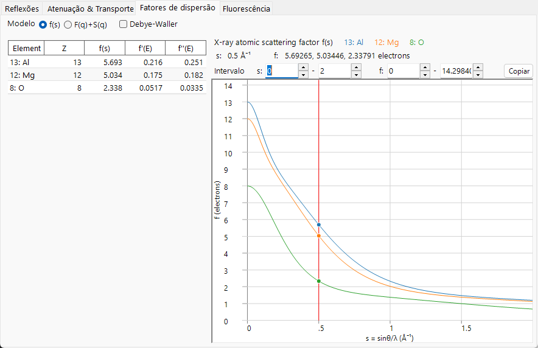
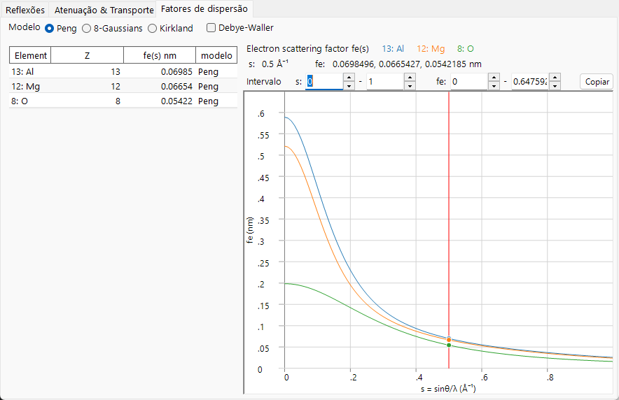
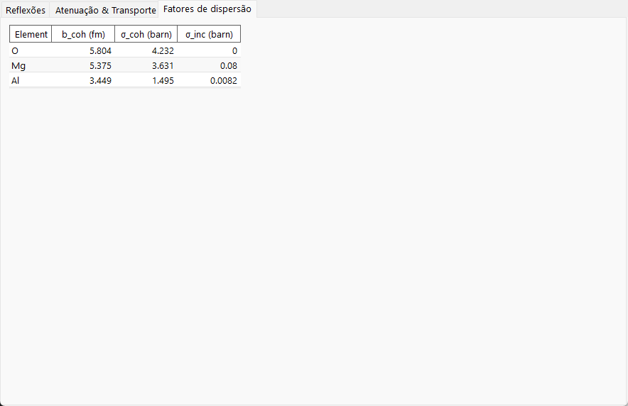

# Interação do feixe

A **Interação do feixe** descreve como o cristal selecionado interage com um feixe incidente de **raios X, elétrons ou nêutrons**. Para uma radiação escolhida, ela calcula as reflexões permitidas e seus fatores de estrutura, a atenuação e o transporte do feixe através do material, os fatores de espalhamento atômico de cada elemento e (para raios X) as linhas de fluorescência características. Alternar o tipo de radiação no topo recalcula tudo, de modo que o mesmo cristal pode ser comparado entre técnicas de difração e de espectroscopia.

O feixe incidente é selecionado na faixa no topo da janela; as quatro abas abaixo — **Reflections**, **Attenuations & Transport**, **Scattering factors** e **Fluorescence** — mostram os diferentes aspectos da interação. Cada seção de aba abaixo mostra a aba sob os feixes **X-ray / Electron / Neutron** (use as abas em cada figura); o conteúdo muda acentuadamente com o feixe.

!!! tip "Fundamentos de física do estado sólido (Apêndice A2)"
    O espalhamento e a física do estado sólido por trás dessas quatro abas — fatores de espalhamento atômico, o fator de estrutura, a atenuação e o transporte do feixe e a fluorescência — são explicados no **[Apêndice A2. Interação do feixe (fundamentos de física do estado sólido)](appendix/a2-beam-interaction/index.md)**.

!!! note "Dados de raios X e a biblioteca xraylib incluída"
    Muitas das grandezas de raios X (dispersão anômala $f'/f''$, a separação de espalhamento $F(q)+S(q)$, a decomposição em foto / Rayleigh / Compton da atenuação de massa, os saltos das bordas de absorção e os rendimentos de fluorescência) são avaliadas com a biblioteca **[xraylib](https://github.com/tschoonj/xraylib)** incluída. Se o xraylib não estiver disponível, o ReciPro recorre às suas tabelas internas (atenuação apenas por fotoabsorção, apenas energias de linhas características) e as células afetadas mostram **N/A**. A linha **source** de cada tabela informa qual conjunto de dados foi utilizado.

---

## Atalhos de teclado e mouse

Esta janela não possui combinações de teclas especiais. <kbd>F1</kbd> abre esta página do manual. Na aba **Scattering factors**, a linha vertical do cursor pode ser **arrastada** para ler o fator de espalhamento de cada elemento naquela posição, e cada aba tem um botão **Copy** que exporta sua tabela como texto colável em planilhas.

→ Consulte **[21. Atalhos de teclado e mouse](21-shortcuts.md)** para ver cada janela de relance.

---

## Feixe e comprimento de onda {#reflections-tab}

A faixa superior é um **Wave Length Control** compartilhado com os outros simuladores.

- **X-ray / Electron / Neutron** : os fatores de espalhamento atômico e a física da interação diferem conforme o tipo de feixe incidente, por isso são alternados aqui.
- Para **X-ray**, escolher o **Element** (material do anodo) e a linha característica (Kα, etc.) define automaticamente o comprimento de onda desse raio X característico.
- **Energy (keV)** e **Wavelength (Å)** estão vinculados; definir um atualiza o outro, e ambos determinam o 2θ usado na tabela **Reflections**.
- **Unit (Å / nm)** alterna a unidade de comprimento usada para o espaçamento d e grandezas semelhantes.

O feixe escolhido também decide quais abas e curvas são significativas:

| Feixe | Reflections | Attenuations & Transport | Scattering factors | Fluorescence |
|------|------|------|------|------|
| **X-ray** | fatores de estrutura incl. dispersão anômala | µ/ρ, µ, transmissão + bordas de absorção (vs energia) | $f(s)$ ou $F(q)+S(q)$ | linhas características + traços EDX |
| **Electron** | fatores de estrutura de elétrons | σ, MFP, \|dE/ds\|, IMFP, alcance (vs energia) | Peng / Kirkland / 8-Gaussians | — (oculto) |
| **Neutron** | fatores de estrutura nucleares | comprimentos de espalhamento e seções de choque (sem curva de energia) | comprimentos de espalhamento (sem dependência de *s*) | — (oculto) |

A aba **Fluorescence** existe apenas para raios X e desaparece para feixes de elétrons e de nêutrons. Para nêutrons, os gráficos dependentes da energia em **Attenuations & Transport** e **Scattering factors** são substituídos por tabelas de elementos, pois o comprimento de espalhamento nuclear não depende do ângulo de espalhamento nem da energia.

---

## Aba Reflections

Lista os planos cristalinos permitidos (reflexões) do cristal e o **fator de estrutura** e a intensidade de difração de cada um. Para raios X, o fator de estrutura agora inclui os termos de **dispersão anômala** $f'/f''$ na energia atual, de modo que `F_inv` (a parte imaginária) é geralmente não nulo próximo a uma borda de absorção. O layout é o mesmo para cada feixe; apenas os valores do fator de estrutura e o 2θ de cada reflexão mudam.

=== "X-ray"
    

=== "Electron"
    

=== "Neutron"
    

**Options**

- **Powder Diffraction Intensities (Bragg-Brentano Optics)** : calcula a intensidade relativa como intensidade de difração de pó (Bragg–Brentano), incluindo a multiplicidade e o fator de Lorentz–polarização. Quando desativado, exibe a intensidade do fator de estrutura. Ativá-lo também força *Hide equivalent planes* e *Hide prohibited planes*.
- **Hide equivalent planes** : agrupa planos cristalograficamente equivalentes em uma única entrada.
- **Hide prohibited planes** : exclui planos cuja intensidade é zero pelas regras de extinção.
- **d-Spacing Cutoff >** : exclui reflexões com um espaçamento d menor que este valor (a unidade de comprimento segue a seleção em **Unit**).

Cada linha é uma reflexão (ou um grupo de planos simetricamente equivalentes):

| Coluna | Significado |
|------|------|
| **h, k, l** | índices de Miller |
| **Multi.** | multiplicidade (número de planos simetricamente equivalentes) |
| **d (Å)** | espaçamento interplanar |
| **q (2π/d)** | módulo do vetor de espalhamento |
| **2θ (°)** | ângulo de difração para o comprimento de onda selecionado |
| **F_real** | parte real do fator de estrutura |
| **F_inv** | parte imaginária do fator de estrutura (não nula com dispersão anômala de raios X) |
| **\|F\|** | amplitude do fator de estrutura ($= \sqrt{F_\text{real}^2 + F_\text{inv}^2}$) |
| **F^2** | intensidade do fator de estrutura ($\lvert F\rvert^2$) |
| **Rel. Int. (%)** | intensidade relativa, com a reflexão mais forte definida como 100 |

**Gráfico de picos de difração.** Abaixo da tabela, as mesmas reflexões são desenhadas como um padrão de traços, com os picos mais fortes rotulados pelo seu *hkl*.

- O seletor do eixo horizontal escolhe entre **2θ** (ângulo de espalhamento em graus), **d** (espaçamento dos planos reticulares) e **Q** ($= 4\pi\sin\theta/\lambda$, o vetor de espalhamento / transferência de momento). As três opções descrevem as mesmas reflexões; apenas a escala horizontal muda.
- **Log I** alterna o eixo de intensidade entre linear e logarítmico. As intensidades de difração abrangem muitas ordens de grandeza, portanto uma escala logarítmica estica a parte inferior para revelar os picos fracos que uma escala linear achata contra a linha de base.
- As caixas **Range** definem o intervalo horizontal e de intensidade exibidos.

---

## Aba Attenuations & Transport

Quão profundamente o feixe penetra no material e como ele perde energia. O conteúdo depende do feixe.

=== "X-ray"
    

=== "Electron"
    

=== "Neutron"
    

### X-ray

Os botões de opção escolhem o coeficiente plotado em função da energia do fóton (1–60 keV, eixo logarítmico):

- **µ/ρ** — o coeficiente de atenuação de **massa** (cm²/g): quão fortemente o material remove raios X por grama, independentemente de quão densamente está empacotado (este é o valor encontrado em tabelas de referência). O gráfico mostra o **total** junto com seus componentes **photo**, **Rayleigh** e **Compton**.
- **µ** — o coeficiente de atenuação **linear** $\mu = (\mu/\rho)\cdot\rho$ (cm⁻¹): a atenuação por centímetro do material real em sua densidade real. A intensidade transmitida segue $I = I_0\,e^{-\mu t}$, e $1/\mu$ é a distância ao longo da qual a intensidade cai para cerca de 37 % (1/e).
- **T %** — a **transmissão** $T = e^{-\mu t}$ em porcentagem para a espessura da amostra **t** definida na caixa **Thickness t** (µm). 100 % = transparente, 0 % = totalmente bloqueado; use isto para julgar uma espessura de amostra sensata na energia atual.

As linhas verticais marcam a energia atual e as **bordas de absorção** de cada elemento. A tabela escalar à esquerda lista, na energia atual: **µ/ρ (total)**, **µ (linear)**, **Attenuation length** ($1/\mu$), **HVL** (camada semirredutora, $\ln 2/\mu$), **Transmission** na espessura *t*, **µ_en/ρ** (coeficiente de absorção de energia de massa), os decrementos do índice de refração de raios X **δ** e **β** ($n = 1-\delta+i\beta$), o ângulo **θc (critical)** para reflexão externa total e a **X-ray SLD** real (densidade de comprimento de espalhamento). A tabela inferior lista as energias das **bordas** de absorção **K** e **L3** e suas razões **Jump** para cada elemento.

### Electron

O seletor de grandeza escolhe o que é plotado em função da energia do feixe (1–30 keV):

- **All (normalized)** — sobrepõe as três curvas abaixo, cada uma reescalonada ao seu próprio máximo para que as formas possam ser comparadas em um único gráfico (leia os valores absolutos na tabela).
- **σ elastic (nm²)** — seção de choque de espalhamento elástico: quão provável é que um único átomo desvie o elétron.
- **Elastic MFP (nm)** — livre caminho médio: a distância média que o elétron percorre entre eventos de espalhamento elástico.
- **|dE/ds| (keV/nm)** — módulo do poder de freamento: a energia que o elétron perde por nanômetro percorrido.
- **IMFP (nm)** — livre caminho médio inelástico: a distância média entre colisões com perda de energia.
- **Range CSDA (µm)** — o comprimento total do trajeto que o elétron percorre antes de parar.

A tabela escalar lista o **wavelength** do elétron, **σ elastic**, **Elastic MFP**, **|dE/ds|**, **IMFP**, a **Plasma E** e a energia média de excitação **J**, dois **ranges** de elétrons (a estimativa de penetração de Kanaya–Okayama e o comprimento de trajeto integrado CSDA) e o **Z, A** médio. A tabela por elemento fornece a fração atômica e a seção de choque elástica σ de cada elemento. As seções de choque elásticas usam os dados **NIST Mott** (50 eV–36 keV) e recorrem ao **screened Rutherford** acima de 36 keV.

### Neutron {#scattering-factors-tab}

A interação de nêutrons é definida por seções de choque nucleares em vez de uma curva dependente da energia, portanto esta aba mostra apenas tabelas. A tabela escalar lista o comprimento de espalhamento coerente médio **b̄**, a **Coherent SLD**, as seções de choque médias coerente / incoerente / de absorção / total (**σ̄_coh**, **σ̄_incoh**, **σ̄_abs**, **σ̄_total**), a seção de choque total macroscópica **Σ_total** e o **attenuation length** correspondente. A seção de choque de absorção é avaliada com a lei 1/v no comprimento de onda atual; nuclídeos para os quais isto é inválido (Cd, Sm, Eu, Gd como absorvedores ressonantes) são sinalizados. A tabela por elemento lista **b_coh**, **σ_coh** e a fração atômica.

---

## Aba Scattering factors {#fluorescence-tab}

O fator de espalhamento atômico de cada elemento constituinte, plotado em função de $s = \sin\theta/\lambda$ (Å⁻¹). Cada elemento é desenhado em sua própria cor, e a **linha vertical do cursor** pode ser arrastada para ler o fator de espalhamento de cada elemento naquela posição na tabela à esquerda.

=== "X-ray"
    

=== "Electron"
    

=== "Neutron"
    

- **X-ray** oferece dois modos de **Model**: **f(s)** plota o fator de espalhamento atômico de raios X convencional (em unidades de elétron); **F(q)+S(q)** plota o fator de forma **coerente** de Rayleigh $F(q)$ junto com a função de espalhamento **incoerente** de Compton $S(q)$ (do xraylib). A tabela também lista os termos de dispersão anômala **f'(E)** e **f''(E)** na energia atual.
- **Electron** oferece três parametrizações do fator de espalhamento de elétrons: **Peng**, **Kirkland** e **8-Gaussians**. A tabela mostra $f_e(s)$ (nm) e qual **model** o produziu.
- Os comprimentos de espalhamento de **Neutron** não dependem de $s$, portanto nenhuma curva é desenhada; a tabela lista o comprimento de espalhamento coerente **b_coh** de cada elemento e suas seções de choque coerente / incoerente.
- **Debye-Waller** multiplica cada fator pelo amortecimento térmico $e^{-B s^2}$ usando o parâmetro de deslocamento isotrópico de cada átomo.

---

## Aba Fluorescence

Para um feixe de raios X, a emissão de **fluorescência** característica da amostra. (Esta aba fica oculta para feixes de elétrons e de nêutrons.)

O gráfico **EDX emission lines** desenha as linhas características (Kα1, Kα2, Kβ1, Lα1, Lα2, Lβ1) de cada elemento como traços em suas energias de fóton, com a altura proporcional à fração atômica × taxa radiativa × rendimento de fluorescência (uma prévia qualitativa no estilo EDX; a seção de choque de excitação e a eficiência do detector não são modeladas). A tabela inferior lista, por linha, o elemento, o nome da linha, a energia **E keV**, a intensidade relativa **Rel.I** e o rendimento de fluorescência **ω**. A tabela escalar reporta o rendimento da camada K **ω_K** de cada elemento e a **strongest line** no espectro.

---

## Copiar para a área de transferência

Cada aba tem um botão **Copy** que copia sua tabela para a área de transferência como texto que pode ser colado em uma planilha como o Excel.

---

## Veja também

- [Banco de dados de cristais](1-crystal-database.md) — definição do cristal cuja interação é calculada.
- [Simulador de difração](7-diffraction-simulator/index.md) — simulação de padrões de difração usando os fatores de estrutura.
- [Apêndice A2. Interação do feixe (fundamentos de física do estado sólido)](appendix/a2-beam-interaction/index.md) — o espalhamento e a física do estado sólido por trás de cada aba.
