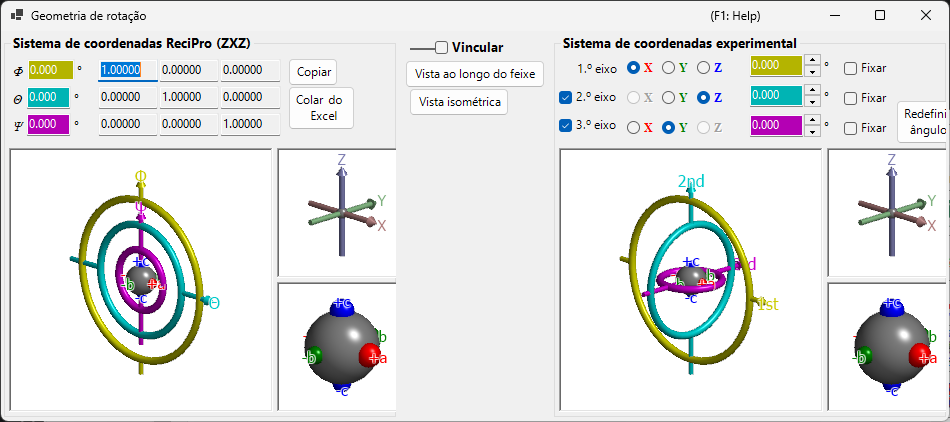

# Geometria de rotação

Esta janela representa o estado de rotação de um cristal como uma matriz 3×3 e converte entre diferentes sistemas de coordenadas eulerianos.

O ReciPro usa três ângulos de Euler — **Ψ**, **θ** e **Φ** — aplicados na ordem **Z–X–Z**. No entanto, essa convenção não corresponde necessariamente aos eixos do goniômetro do seu instrumento real. A janela **Geometria de rotação** permite converter os ângulos de Euler do ReciPro para um sistema de coordenadas definido arbitrariamente, apoiando o ajuste do goniômetro no laboratório.

---

## Atalhos de teclado e mouse

Todas as seis visualizações 3D (os painéis do ReciPro e do goniômetro experimental / eixos / objetos) estão **vinculadas** — girar qualquer uma gira todas as seis em conjunto. Elas compartilham a [navegação de visualização OpenGL](21-shortcuts.md) padrão do ReciPro.

| Atalho | Ação |
|----------|--------|
| <kbd>F1</kbd> | Abrir esta página do manual on-line |
| Arrastar com o botão esquerdo em uma visualização | Girar o modelo (todas as seis visualizações giram juntas) |
| Roda do mouse, ou arrastar com o botão direito para cima/baixo | Zoom (as visualizações grandes do goniômetro) |
| Arrastar com o botão do meio | Deslocar (as visualizações grandes do goniômetro) |
| <kbd>CTRL</kbd> + arrastar com o botão direito para cima/baixo | Alterar a distância da câmera (apenas no modo de perspectiva) |
| <kbd>CTRL</kbd> + clique duplo com o botão direito | Alternar entre projeção ortográfica e em perspectiva |

As pequenas visualizações *Axes* e *Objects* têm zoom e deslocamento desativados. Não há atalhos de teclado além de <kbd>F1</kbd>.

---

## Sistema de coordenadas do ReciPro (ZXZ)

A metade superior da janela mostra o estado de rotação no "sistema de coordenadas do ReciPro".

- Os valores **Φ, θ, Ψ** são sincronizados com os ângulos de Euler definidos na Janela principal.
- **Rotation matrix** exibe a matriz 3×3 correspondente ao estado de rotação atual.

### Φ, θ, Ψ (ângulos de Euler Z–X–Z)

A orientação do cristal é parametrizada por três rotações aplicadas nesta ordem:

1. **Φ** — primeira rotação em torno do eixo **Z**.
2. **θ** — rotação em torno do eixo **X** do referencial girado uma vez.
3. **Ψ** — segunda rotação em torno do eixo **Z** do referencial girado duas vezes.

Cada caixa numérica é editável; alterar um valor aqui atualiza a Janela principal e cada simulador vinculado.

### Rotation matrix

A matriz 3 × 3 produzida a partir dos valores atuais (Φ, θ, Ψ). Use **Copy to Excel** / **Paste from Excel** para transferir a matriz de ida e volta por meio de uma planilha.

### Janelas OpenGL

A visualização 3D mostra a rotação atual usando três toros coloridos (rosquinhas):

| Cor | Ângulo de Euler | Nível do goniômetro |
|--------|------------|-----------------|
| **Amarelo** | Φ | 1º eixo (superior) |
| **Azul claro** | θ | 2º eixo (intermediário) |
| **Rosa** | Ψ | 3º eixo (inferior) |

As setas **vermelha**, **verde** e **azul** representam os eixos X, Y, Z em coordenadas cartesianas do espaço real. Estes *não* são os mesmos que os eixos cristalinos mostrados na Janela principal.

A esfera cinza no centro representa a amostra; as esferas vermelha/verde/azul mostram como o objeto foi girado a partir de sua orientação inicial (quando Φ = θ = Ψ = 0, elas se alinham com +X, +Y, +Z respectivamente).

> **Nota**: Arrastar na janela OpenGL altera apenas a *direção de projeção* desta visualização, não a orientação do cristal em si. Para girar o cristal, use a Janela principal.

### Botões

| Botão | Ação |
|--------|--------|
| Copy to Excel | Copiar a matriz de rotação 3×3 em formato separado por tabulações |
| Paste from Excel | Definir a matriz de rotação a partir da área de transferência (3×3 separada por tabulações) |
| View along beam | Igualar à projeção da Janela principal (eixo Z perpendicular à tela) |
| Isometric | Mudar para projeção isométrica |

---

## Sistema de coordenadas experimental

A metade inferior define os ângulos de Euler em um conjunto arbitrário de eixos de rotação e lê/define o estado do goniômetro. Isso é chamado de **Sistema de coordenadas experimental**.

### 1º, 2º, 3º eixos

Selecione os eixos de rotação do goniômetro entre **±X**, **±Y** e **±Z** para cada nível (superior, intermediário, inferior). Os gráficos são atualizados de acordo.

Os ângulos de Euler de cada eixo são exibidos nas caixas de texto coloridas correspondentes (amarela, azul claro, rosa). Você também pode inserir os valores diretamente.

---

## Link

Quando **Link** está marcado, o sistema de coordenadas do ReciPro e o sistema de coordenadas experimental ficam acoplados: seus ângulos de Euler são ajustados de modo que a orientação do objeto permaneça consistente entre os dois sistemas.

### Exemplo de fluxo de trabalho

1. No laboratório, ajuste um goniômetro de modo que o eixo *a* de um cristal fique alinhado com a direção de incidência dos raios X e o eixo *b* fique horizontal.
2. Insira os ângulos de Euler do goniômetro de laboratório no sistema de coordenadas experimental.
3. Na Janela principal, gire o cristal de modo que o eixo *a* aponte para a normal da tela e o eixo *b* fique horizontal.
4. Marque **Link** — agora, sempre que você apontar o cristal para uma orientação diferente na Janela principal, os ângulos de goniômetro necessários são exibidos automaticamente.

---

## Veja também

- [Janela principal](0-main-window.md)
- [Estereonete](6-stereonet.md)
- [Sistema de coordenadas básico e orientação do cristal](appendix/a1-coordinate-system/1-orientation.md)
- [Atalhos de teclado e mouse](21-shortcuts.md)
