# Visualizador de estrutura

O **Visualizador de estrutura** desenha a estrutura do cristal selecionado como uma imagem tridimensional usando OpenGL.

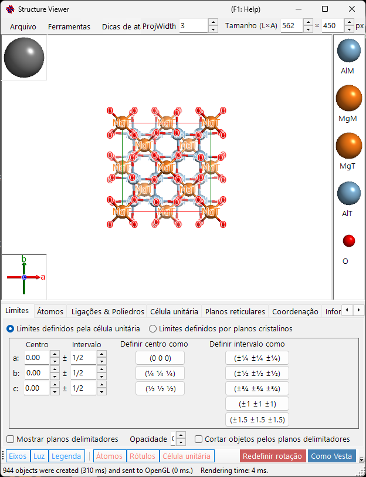

---

## Atalhos de teclado e mouse

A janela possui uma grande visualização 3D, além de dois pequenos gizmos — a caixa de **eixos do cristal** (canto inferior esquerdo) e a caixa de **direção da luz** (canto superior esquerdo) — e cada uma responde de forma diferente a um arraste com o botão esquerdo. A visualização principal usa a [navegação de visualização OpenGL](21-shortcuts.md) padrão do ReciPro.

| Atalho | Ação |
|----------|--------|
| <kbd>F1</kbd> | Abrir esta página do manual on-line |
| <kbd>CTRL</kbd>+<kbd>SHIFT</kbd>+<kbd>C</kbd> | Copiar a imagem renderizada para a área de transferência |
| Arraste com o botão esquerdo na visualização principal | Girar o modelo |
| Clique duplo com o botão esquerdo em um átomo | Mostrar suas coordenadas, distâncias aos vizinhos mais próximos e ângulos de ligação |
| Arraste com o botão direito para cima/baixo ou roda do mouse | Zoom |
| Arraste com o botão do meio | Deslocar |
| <kbd>CTRL</kbd> + arraste com o botão direito para cima/baixo | Alterar a distância da câmera (somente no modo de perspectiva) |
| <kbd>CTRL</kbd> + clique duplo com o botão direito | Alternar entre projeção ortográfica e perspectiva |
| Arraste com o botão esquerdo no gizmo de **eixos do cristal** | Girar o modelo (sem giro no plano) |
| Arraste com o botão esquerdo no gizmo de **luz** | Alterar a direção da iluminação |

Os atalhos <kbd>CTRL</kbd>+<kbd>SHIFT</kbd> de toda a aplicação, descritos na [janela principal](0-main-window.md#keyboard-mouse-shortcuts), também funcionam enquanto esta janela está em foco.

→ Consulte **[21. Atalhos de teclado e mouse](21-shortcuts.md)** para uma visão geral de todas as janelas.

---

## Área principal

Estrutura cristalina 3D com fonte de luz, eixos do cristal e legenda de átomos.
> A caixa **Size (W×H)** no canto superior direito da janela define o tamanho em pixels usado ao salvar ou copiar a imagem renderizada.
> A caixa **ProjWidth** ao lado dela mostra a largura da visualização projetada em nm. Edite o valor para aplicar zoom numericamente — ele permanece sincronizado com o zoom por arraste com o botão direito / roda do mouse na visualização.

---

## Barra de menu

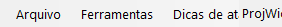

### Menu Arquivo

Salvar imagem, copiar para a área de transferência (Ctrl+Shift+C), salvar filme (MP4).

**Salvar filme** abre o diálogo de configuração de filme mostrado abaixo. Um filme pode girar a visualização, transladar o centro de projeção ou fazer ambos ao mesmo tempo — marque **Rotation** e/ou **Translation**:

- **Rotation**: gira a visualização a **Speed** (°/s; valores negativos invertem o sentido) em torno do eixo escolhido abaixo — **Projeção atual** (direção de inclinação escolhida com os botões de seta), um **Índice de direção** [uvw] ou a normal de um **Plano reticular** (hkl).
- **Translation**: move o centro de projeção ao longo do índice de direção [uvw] a **Speed** (períodos de rede por segundo). Esta opção aparece somente quando o diálogo é aberto a partir do Visualizador de estrutura e, enquanto estiver ativada, **Índice de direção** é o único modo de direção.

Defina a duração do filme (**Duration**), a taxa de quadros (**FPS**, 1–120) e a qualidade do codificador (**Quality**, 1–100; valores maiores usam uma taxa de bits mais alta e geram um arquivo maior), escolha o codec (**H264** / **H265**) e pressione **OK** para gerar um arquivo MP4. **Include final frame** acrescenta um quadro extra em t = Duration para que o filme termine exatamente na orientação/posição final. (A lista de velocidade de codificação apenas rotula a exibição de progresso e não afeta mais a codificação em si.)

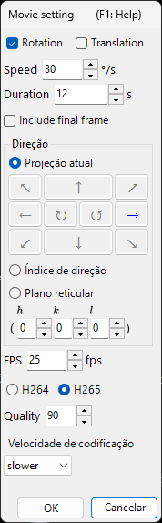

### Menu Ferramentas

---

## Menu de abas

### Limites definidos pela célula

Especifica o intervalo de desenho do cristal. Há dois modos, alternados com os botões de opção na parte superior.

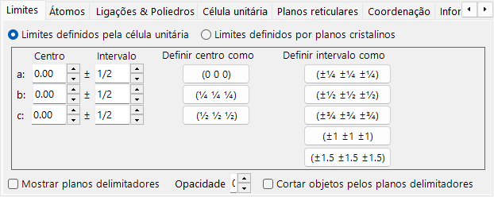

Neste modo, os eixos *a*, *b*, *c* da célula unitária são a unidade do intervalo de desenho.

- **Center**: coordenada fracionária central do volume de desenho.
- **Range**: limite superior/inferior para cada um dos eixos *a*, *b*, *c*.
- **Botões de predefinição** à direita fornecem valores usados com frequência (por exemplo, célula 1×1×1, célula 2×2×2).

### Limites definidos por planos cristalinos

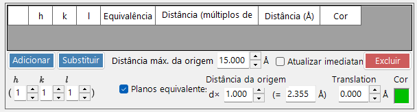

Neste modo, a área de desenho é delimitada por um conjunto de planos cristalinos. Se os planos não definirem uma região espacialmente fechada, o ReciPro retorna automaticamente a um limite de uma célula unitária.

#### Lista de limites

Todos os planos limitantes registrados para o cristal atual. Use **Add / Replace / Delete** para manipular a lista; a caixa de seleção mais à esquerda desativa temporariamente um plano sem excluí-lo.

> Para salvar as alterações permanentemente, você também deve pressionar **Add** ou **Replace** na **Janela principal**. Caso contrário, as alterações serão perdidas na próxima vez que você alterar a seleção na lista principal de cristais.

#### Índices H k l

Define o plano limitante por seu índice de Miller. A caixa de seleção inclui planos cristalograficamente equivalentes gerados a partir do (*hkl*) selecionado.

#### Distância da origem

A distância do centro do cristal ao plano limitante. A unidade pode ser selecionada entre **d** e **Å**. Com **d**, a distância é o valor de entrada multiplicado pela distância interplanar (*d*-spacing) do (*hkl*) selecionado. Com **Å**, o valor é a distância absoluta. A alteração de um atualiza o outro automaticamente.

#### Mostrar planos limitantes / Opacidade

Mostra ou oculta os próprios planos limitantes. Quando exibidos, **Opacity** define a transparência (0 = transparente, 1 = opaco).

#### Recortar objetos pelos planos limitantes

Se marcado, somente a região interna definida pelos limites é renderizada; átomos, ligações e poliedros que cruzam os limites são recortados.

#### Ocultar átomos

Se marcado, todos os átomos, ligações e poliedros são ocultados — útil quando apenas a célula ou os planos reticulares precisam ser visualizados.

### Átomos

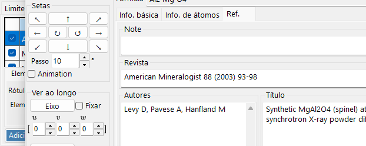

Coordenadas, elemento, ocupação, raio, cor, material. **Apply to same elements**.

#### Lista de átomos

A lista de átomos no cristal. Use **Add / Replace / Delete** para manipular a lista; a caixa de seleção mais à esquerda oculta temporariamente um átomo.

> Para salvar as alterações permanentemente, clique também em **Add** ou **Replace** na **Janela principal**.

#### Elemento e posição

- **Label**: rótulo de texto livre para o átomo (usado em legendas e tooltips).
- **Element**: elemento químico / estado de ionização.
- **X, Y, Z**: coordenadas fracionárias. Números reais entre 0 e 1, ou frações como `1/2` ou `2/3`.
- **Occ**: ocupação, um número real entre 0 e 1.

#### Deslocamento de origem

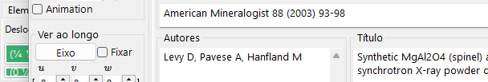

Desloca cada átomo pelo mesmo deslocamento fracionário. Pressione um botão de predefinição (por exemplo, para alternar entre as escolhas de origem 1 / 2 do mesmo grupo espacial) ou insira um (Δx, Δy, Δz) personalizado e pressione **Apply custom shift**.

#### Aparência

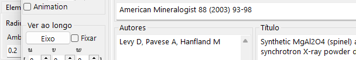

Raio, cor e material por átomo.

- **Radius**: raio atômico desenhado.
- **Atom color**: cor da superfície.
- **Material**: propriedades de textura / material usadas pelo shader OpenGL.
- **Apply to same elements**: aplica o raio e a cor atuais a todos os átomos da mesma espécie de elemento.

### Ligações e poliedros

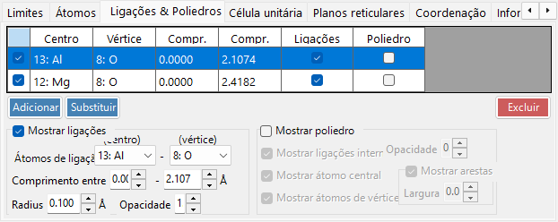

Limiares de comprimento de ligação, exibição de poliedros, arestas.

#### Lista de ligações

Todas as regras de ligação/poliedro registradas para o cristal. Use **Add / Replace / Delete**; a caixa de seleção mais à esquerda desativa temporariamente uma entrada. Assim como em átomos e limites, é necessário usar **Add** / **Replace** na **Janela principal** para tornar a alteração permanente.

#### Propriedade da ligação

- **Bonding Atom (center)**: espécie de elemento usada como átomo central da ligação / do poliedro.
- **Bonding Atom (vertex)**: espécie de elemento usada como vértice (a outra extremidade).
- **Length between … and …**: limiares de distância inferior e superior. Pares de átomos fora desse intervalo não são desenhados.
- **Bond Radius**: espessura desenhada da ligação (raio do cilindro).
- **Alpha**: transparência da ligação (0 = transparente, 1 = opaco).

#### Propriedade do poliedro

- **Show Polyhedron**: quando marcado, o poliedro definido pela ligação atual é desenhado (somente se o conjunto centro/vértice for geometricamente válido).
- **Inner Bonds**: mostra/oculta as ligações dentro do poliedro.
- **Center Atom**: mostra/oculta o átomo central.
- **Vertex Atoms**: mostra/oculta os átomos dos vértices.
- **Color** / **Alpha**: cor da face e transparência.
- **Mostrar arestas**: desenha as arestas que conectam os vértices.
- **Edge Color** / **Width**: cor e largura de linha das arestas.

### Célula unitária

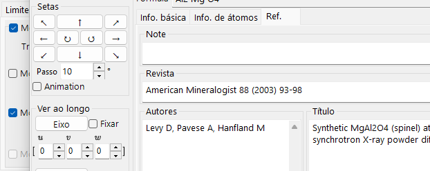

Translação, planos da célula, arestas.

#### Translação

Todo grupo espacial tem uma origem padrão. Para mover o centro da célula unitária desenhada para longe dessa origem, defina a translação ao longo de *a*, *b*, *c*.

#### Mostrar plano da célula

Define se as seis faces que delimitam a célula unitária são desenhadas. Quando ativado, você pode definir a cor da face e a transparência.

#### Mostrar arestas

Define se as arestas da célula unitária são desenhadas. A cor das arestas é configurável.

### Planos reticulares

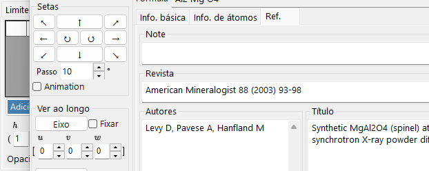

Especificação do índice de Miller com equivalentes cristalográficos.

#### Índices H k l

Especifica o plano reticular por seu índice de Miller. A caixa de seleção inclui opcionalmente planos cristalograficamente equivalentes gerados a partir de (*hkl*).

#### Translação

Translada o plano reticular desenhado por um múltiplo inteiro de sua distância interplanar (*d*-spacing) — útil para visualizar planos sucessivos da mesma família.

### Coordenação

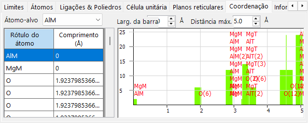

Tabela e gráfico de coordenação em torno do átomo-alvo.

#### Tabela (lado esquerdo)

Lista quais átomos cercam o átomo-alvo selecionado e a que distância. O átomo-alvo é selecionado no menu suspenso acima da tabela.

#### Gráfico (lado direito)

Histograma da contagem de vizinhos em função da distância, derivado dos mesmos dados da tabela. Ajuste **Bar Width** até que as barras separem nitidamente as camadas de coordenação — isso fornece uma estimativa visual do número de coordenação.

### Informação

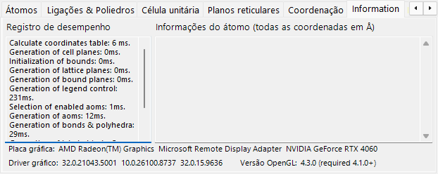

Registro de renderização (tempo de quadro, informações da GPU) e informações básicas sobre o átomo selecionado. Em construção — os campos podem crescer com o tempo.

### Projeção

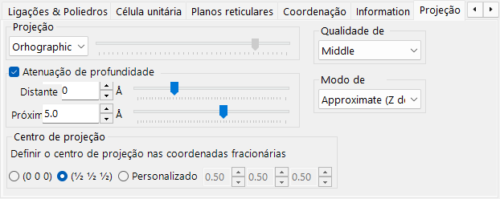

Modo de projeção (ortográfica/perspectiva), atenuação por profundidade, qualidade de renderização, modo de transparência.

#### Projeção

- **Orthographic**: projeção paralela perfeita (ponto de vista no infinito).
- **Perspective**: projeção em perspectiva a partir da distância do ponto de vista definida pelo controle deslizante.

#### Atenuação por profundidade

Esmaece objetos distantes na direção da profundidade. Objetos mais distantes que **Far** ficam totalmente transparentes; objetos mais próximos que **Near** ficam totalmente opacos; objetos intermediários são interpolados linearmente.

#### Centro de projeção

Define o centro da projeção nas coordenadas especificadas. Ative **Personalizado** para inserir coordenadas arbitrárias. Cada coordenada é reduzida ao intervalo de −0.5 a +0.5 (um período de rede). Um filme de **Translation** (veja o [Menu Arquivo](#menu-arquivo)) controla esses valores automaticamente.

#### Qualidade de renderização

Qualidade de desenho (subdivisão da malha, antisserrilhamento). Maior qualidade é mais lenta — escolha a configuração que corresponda à sua GPU.

#### Modo de transparência

Algoritmo usado para átomos e poliedros translúcidos.

- **Approximate**: rápido, mas pode ser impreciso quando muitos objetos translúcidos se sobrepõem.
- **Perfect**: transparência independente da ordem — precisa, mas muito lenta, exigindo na prática uma GPU dedicada.

### Elementos de simetria

A aba **Symmetry Elements** desenha os operadores de simetria do grupo espacial diretamente sobre o modelo 3D (alternar com o botão **Symmetry Elements** da barra de ferramentas). Cada classe de elemento pode ser mostrada/ocultada de forma independente:

- **Eixos de rotação** e **eixos helicoidais**
- **Planos de espelho** e **planos de deslizamento**
- **Centros de inversão** e **eixos de rotoinversão**

Para cada classe, você pode ajustar o tamanho do símbolo, a largura da linha e a cor.

### Diversos

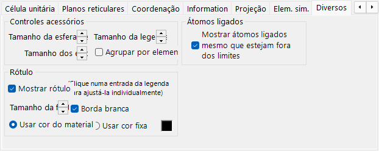

- **Accessory controls**: define os tamanhos de exibição (esfera de luz, eixos, legenda). **Group by element** alterna a exibição da legenda.
- **Bonded atoms**: **Show bonded atoms even if they are outside the boundaries** continua desenhando átomos que estão ligados a átomos dentro do intervalo de desenho, mesmo quando ficam fora dele.
- **Label**: define o tamanho da fonte, a cor e outras propriedades dos rótulos dos átomos.

---

## Barra de ferramentas

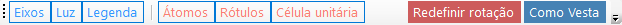

| Botão | Descrição |
|--------|-------------|
| Axes | Mostrar orientação dos eixos (tamanho = constante de rede) |
| Light | Definir direção da luz |
| Legend | Legenda de átomos |
| Atoms | Alternar objetos de átomos |
| Labels | Alternar rótulos de átomos |
| Unit Cell | Alternar arestas da célula unitária |
| Sym. Elems. | Alternar a sobreposição de elementos de simetria (veja acima) |
| Reset Rotation | Retornar à orientação inicial |
| Like Vesta | Aparência no estilo Vesta |

---

## Veja também

- [Janela principal](0-main-window.md)
- [Banco de dados de cristais](1-crystal-database.md)
- [Informação de simetria](2-symmetry-information.md)
- [Simulador de difração](7-diffraction-simulator/index.md)
- [Atalhos de teclado e mouse](21-shortcuts.md)
