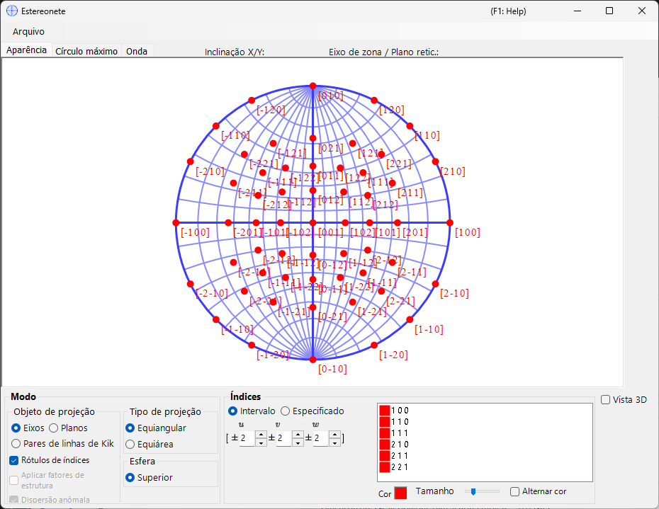
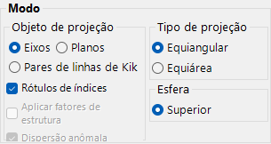
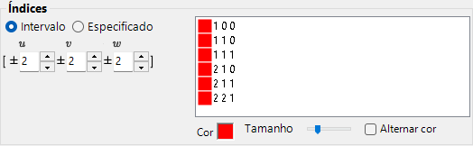
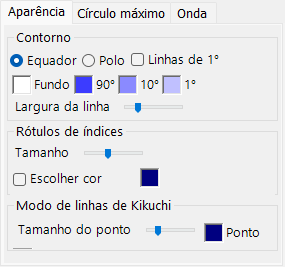
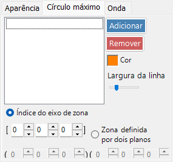
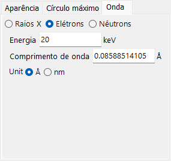

# Estereonete

A **Estereonete** exibe direções de planos e eixos cristalinos usando a projeção estereográfica.

---

## Atalhos de teclado e mouse

A estereonete em si é uma projeção 2-D; uma esfera 3-D opcional pode ser exibida com **3D display**.

| Atalho | Ação |
|----------|--------|
| <kbd>F1</kbd> | Abrir esta página do manual on-line |
| Arrastar com o botão esquerdo perto do centro | Inclinar o cristal |
| Arrastar com o botão esquerdo na área externa | Girar o cristal em torno do eixo de visualização |
| Clique duplo esquerdo | Alternar entre a projeção **Plane** e **Axis** |
| Clique direito | Diminuir o zoom |
| Arrastar com o botão direito uma caixa | Aumentar o zoom na região selecionada |
| Arrastar com o botão do meio | Deslocar |
| Mover o mouse (sem botão) | Ler o (hkl)/[uvw] sob o cursor — útil para indexar um reflexo medido |

Arrastar na rede gira o **cristal**; o estado de rotação é compartilhado entre todas as janelas.

A renderização 3-D usa a [navegação de visualização OpenGL](21-shortcuts.md) padrão do ReciPro (arrastar com o botão esquerdo para girar, arrastar com o botão direito / roda para zoom, <kbd>CTRL</kbd> + clique duplo direito alterna a projeção) e gira apenas a visualização 3-D, não o cristal em si.

Os atalhos <kbd>CTRL</kbd>+<kbd>SHIFT</kbd> de toda a aplicação, da [janela principal](0-main-window.md#keyboard-mouse-shortcuts), também funcionam enquanto esta janela está em foco.

→ Consulte **[21. Atalhos de teclado e mouse](21-shortcuts.md)** para uma visão geral de cada janela.

---

## Área principal

A projeção em estereonete dos planos cristalinos, índices de direção e linhas de Kikuchi do cristal selecionado é exibida.

---

## Menu Arquivo

Salvar ou copiar em formato raster ou vetorial. O formato vetorial permite editar fonte/espessura de linha no PowerPoint ou em outros editores vetoriais.

---

## Mode

### Alvo da projeção

Selecione o que projetar na rede.

- **Axes** — projeta os índices de direção \([uvw]\).
- **Planes** — projeta as normais dos planos cristalinos \((hkl)\).
- **Kikuchi line pairs** — projeta pares de linhas de Kikuchi.

### Método de projeção

| Método | Descrição |
|--------|-------------|
| **Wulff** (ângulo igual / estereográfica) | Preserva a relação angular entre os elementos projetados, mas não o ângulo sólido. Usado pelos cristalógrafos clássicos ao ler ângulos entre eixos ou entre planos. |
| **Schmidt** (área igual / Lambert) | Preserva o ângulo sólido (a área) de cada região, mas distorce os ângulos. Preferido para figuras de polo estatísticas, em que a densidade relativa importa. |

### Hemisfério

Escolha o hemisfério **Upper** ou **Lower** como fonte da projeção — alterna se a face visível da esfera é a mais próxima ou a mais distante do observador.

### Opções de exibição

- Mostrar rótulos de índice.
- Quando **Planes** ou **Kikuchi line pairs** está selecionado, pondera cada ponto ou linha pelo fator de estrutura \(|F_{hkl}|\) (defina a fonte de onda e o comprimento de onda na [aba Wave](#wave)).

> Para cristais trigonais/hexagonais, a notação de Miller–Bravais (4 índices) pode ser ativada em **Option ▸ Use Miller-Bravais (hkil) index** na janela principal.

---

## Indices

Define quais planos cristalinos / eixos são desenhados.

### Modo de intervalo

Especifique um intervalo de índices \([uvw]\) ou \((hkl)\). O ReciPro enumera cada índice dentro dos limites e projeta cada um deles.

### Modo especificado

Especifica eixos ou planos individuais. Digite um índice, pressione **Add** para registrá-lo ou **Remove** para excluí-lo. Quando **include equivalent indices** está marcado, todos os índices cristalograficamente equivalentes também são desenhados.

### Colour / Size

Defina a **colour** e o **size** dos pontos plotados. Marque **Change colour automatically** para codificar por cor cada conjunto de eixos/planos equivalentes de forma diferente — útil para distinguir famílias em um gráfico de múltiplos índices.

---

## 3D Options

Controla a sobreposição da rede 3D (esfera) — opacidade da esfera, indicadores de eixo etc.

---

## Menu de abas

### Appearance

#### Outline

Como o contorno da estereonete é desenhado — o círculo delimitador e a grade opcional de círculos máximos de latitude/longitude. Escolha **Equator** ou **Pole**, alterne **1° Lines** e o preenchimento de **Background**, defina as cores da grade **90° / 10° / 1°** e ajuste a **Line width** com a barra de controle.

#### Index labels

- **Size** — tamanho dos rótulos de índice.
- **Specify color** — usa uma única cor fixa para todos os rótulos de índice em vez da cor por ponto, útil quando os pontos são codificados por cor, mas você deseja todos os rótulos em uma única cor para facilitar a leitura.
- **Delimiter** — caractere colocado entre os índices em cada rótulo: **None** (por exemplo, 100), **Space** (1 0 0) ou **Comma** (1,0,0).

#### Kikuchi line mode

- **Point size** — tamanho dos pontos plotados.
- **Point** / **Label** — cores dos pontos e de seus rótulos.

### Great and Small Circle

Desenhe círculos máximos e círculos menores. Especifique-os pelo **zone-axis index** \([uvw]\) (o círculo máximo formado pela zona desse eixo) ou por **two crystal-plane indices** que compartilham o eixo de zona. A espessura de linha dos círculos também é configurável pela barra de controle.

### Wave {#wave}

Disponível apenas quando **Planes** ou **Kikuchi line pairs** está selecionado como alvo da projeção. Define a fonte de onda (X-ray / electron / neutron) e o comprimento de onda ou a energia necessários para calcular os fatores de estrutura do cristal usados na opção de **ponderação por fator de estrutura** em [Mode](#mode).

---

## Veja também

- [Janela principal](0-main-window.md)
- [Geometria de rotação](4-rotation-geometry.md)
- [Visualizador de estrutura](5-structure-viewer.md)
- [Simulador de difração](7-diffraction-simulator/index.md)
- [Sistema de coordenadas básico e orientação do cristal](appendix/a1-coordinate-system/1-orientation.md)
