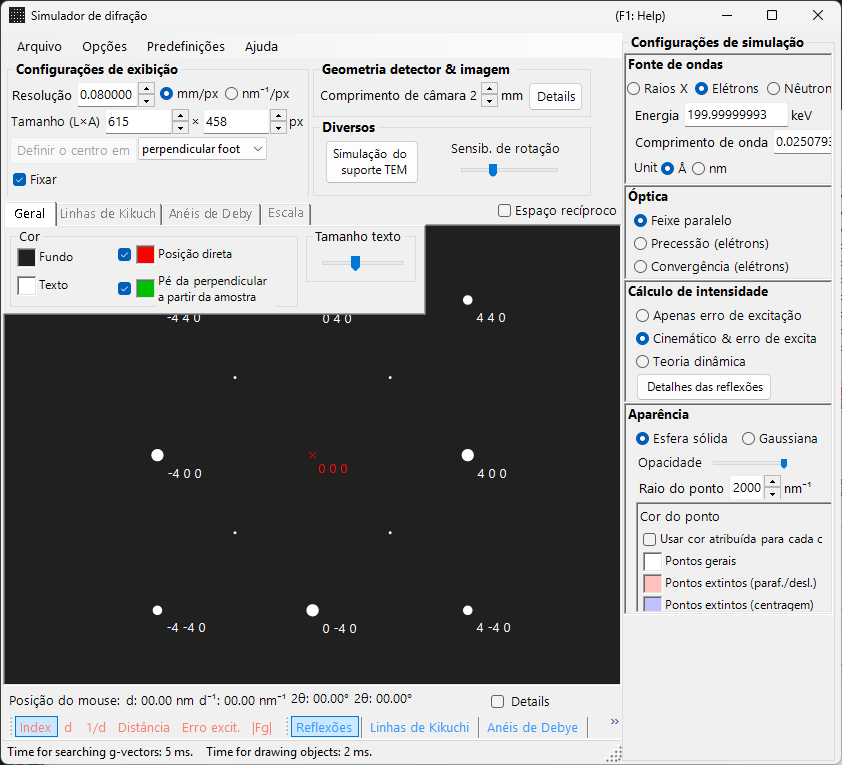
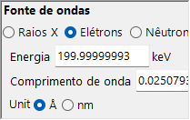
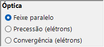
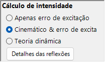
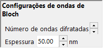
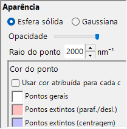

# Simulação SAED (Selected Area Electron Diffraction)

A simulação **SAED (Selected Area Electron Diffraction)** calcula padrões de difração eletrônica de monocristal produzidos por um feixe de elétrons paralelo. Este é o modo padrão do [simulador de difração](index.md).

> Esta página lista todas as configurações que aparecem no painel **Spot property**, à direita, quando você escolhe **Wave Length = Electron** e **Incident beam mode = Parallel**. Para operações de toda a janela, como desenhar e salvar, consulte a [página de visão geral](index.md).

Condições de GUI: Wave Length = Electron, Incident beam mode = Parallel, Intensity calculation = Only excitation error / Kinematical / Dynamical.

---

## Visão geral

Simula o padrão de difração produzido quando um feixe de elétrons paralelo atravessa uma amostra fina. As posições dos spots são fixadas pela relação geométrica entre a esfera de Ewald e os pontos da rede recíproca, e o brilho de cada spot é calculado de acordo com o modo de cálculo de intensidade selecionado.

---

## Wave Length

Defina a fonte de radiação como **Electron**. Insira a energia (keV) ou o comprimento de onda (nm) e o comprimento de onda corrigido relativisticamente é calculado. Para fontes de raios X e nêutrons, consulte [Simulação de difração de raios X](4-x-ray-neutron-diffraction.md).

---

## Incident beam mode

Defina a geometria do feixe incidente como **Parallel**. Esta é a geometria de onda plana padrão usada para SAED e difração de raios X.

> **Note**: Para elétrons você pode escolher **Parallel / Precession (electron = PED) / Convergence (CBED)**. A escolha de **Precession** resulta em uma [simulação PED](2-ped-simulation.md), e a escolha de **Convergence** resulta em uma [simulação CBED](3-cbed-simulation.md); em ambos os casos o cálculo de intensidade muda automaticamente para Dynamical.

---

## Intensity calculation

Seleciona como as intensidades dos spots são calculadas.

### Somente erro de excitação

A intensidade é determinada exclusivamente pela distância geométrica entre a esfera de Ewald e o ponto da rede recíproca (o erro de excitação $s_g$). Quanto menor $\lvert s_g \rvert$, maior a intensidade; ela atinge seu máximo no valor definido por **Radius** e cai a zero quando $\lvert s_g \rvert$ excede o Radius. Como o fator de estrutura do cristal é ignorado, este é o modo mais rápido e adequado para verificar as posições dos spots de difração.

### Cinemática

Além do erro de excitação, o fator de estrutura cinemático $\lvert F_{hkl} \rvert^2$ é incorporado à intensidade. As regras de extinção são corretamente refletidas, tornando este modo adequado para amostras finas ou difração fraca.

### Dinâmica (método de ondas de Bloch, somente elétron)

Um cálculo dinâmico rigoroso pelo método de ondas de Bloch (método de Bethe). Ele reproduz o espalhamento múltiplo e a variação da intensidade dependente da espessura, e é necessário para amostras espessas ou difração forte. Disponível apenas quando Electron está selecionado. Para a teoria, consulte [Apêndice A3. Método de ondas de Bloch](../appendix/a3-bloch-wave/calculation.md).

> **Note**: Quando **Dynamical** está selecionado, um painel **Bloch wave settings** aparece abaixo.

---

## Bloch wave settings (teoria dinâmica)

Ativo apenas quando **Intensity calculation = Dynamical**.

| Parâmetro | Descrição |
|-----------|-------------|
| **Number of diffracted waves** | Número de ondas de Bloch incluídas no problema de autovalores. Valores maiores fornecem intensidades mais precisas, mas aumentam o tempo de cálculo com $O(N^3)$ |
| **Thickness** | Espessura da amostra (nm) usada no cálculo dinâmico |

---

## Spot appearance

Controla como cada spot de difração é renderizado.

- **Solid sphere / Gaussian** : o modelo geométrico do ponto da rede recíproca. **Solid sphere** desenha a seção transversal (um círculo) entre uma esfera de raio $R$ e a esfera de Ewald, com a área do círculo correspondendo à intensidade de difração; **Gaussian** desenha a seção transversal (uma gaussiana 2-D) de uma gaussiana 3-D com $\sigma = R$, cuja integral corresponde à intensidade de difração.
- **Opacity** : transparência do spot (0 = transparente, 1 = opaco).
- **Radius (R)** : raio virtual do ponto da rede recíproca. O tamanho do spot é fixado pela combinação do modo **Appearance** e do **Intensity calculation** (por exemplo, Solid sphere + Dynamical fornece um raio proporcional a $I_\text{dyn}^{1/2}$).
- **Brightness** : ativo apenas no modo **Gaussian**. Intensidade integrada da gaussiana renderizada.
- **Color scale** : **Gray scale** ou **Cold-warm**.
- **Log scale** : exibe as intensidades em escala logarítmica. Útil para padrões com grande contraste de intensidade.
- **Spot color** : cor do spot usada quando a escala de cores não está em uso.
- **Use crystal color** : quando marcado, os spots são desenhados na cor atribuída a cada cristal.

---

## Spot labels

Os rótulos sobrepostos aos spots são selecionados na [barra de ferramentas](index.md#toolbar).

| Rótulo | Conteúdo |
|-------|---------|
| **Index** | índices de Miller $(hkl)$ |
| **d** | distância interplanar $d$ |
| **Distance** | distância de spot a spot no detector |
| **Excit. Err.** | erro de excitação $s_g$ |
| **\|Fg\|** | valor absoluto do fator de estrutura $\lvert F_{hkl} \rvert$ |

---

## Operações compartilhadas

Informações do detector, espelhamento, exibição do espaço recíproco, linhas de Kikuchi, anéis de Debye, linhas de escala, configurações de cor, salvamento e similares são comuns a todos os modos. Consulte a [página de visão geral](index.md). Os detalhes por reflexão obtidos do cálculo dinâmico podem ser examinados em [informação dos spots de difração](index.md#diffraction-spot-information).

---

## Veja também

- [Simulador de difração (visão geral)](index.md)
- [Cálculo SAED com feixe paralelo](../appendix/a3-bloch-wave/calculation.md#parallel-beam-saed)
- [Simulação de difração de raios X](4-x-ray-neutron-diffraction.md)
- [Simulação de difração eletrônica por precessão (PED)](2-ped-simulation.md)
- [Definição do sistema de coordenadas](../appendix/a1-coordinate-system/1-orientation.md)
