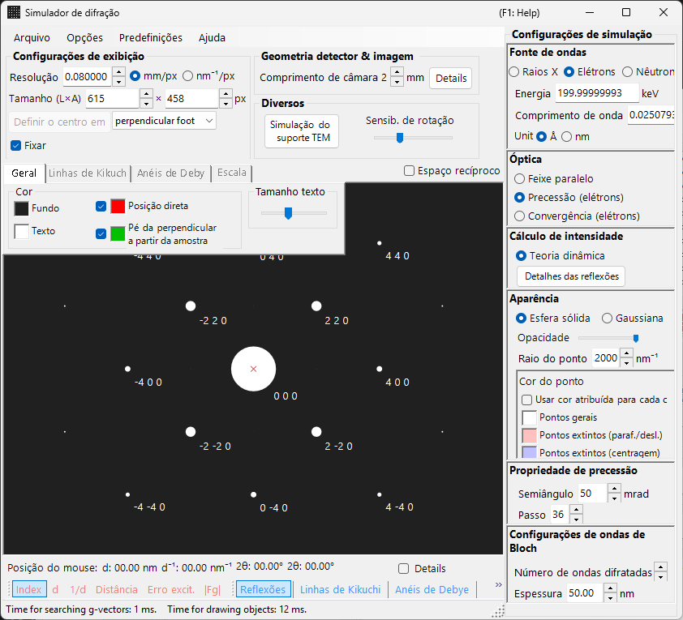
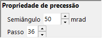

# Simulação de Difração Eletrônica por Precessão (PED)

A simulação de **PED (Precession Electron Diffraction)** calcula padrões de difração de elétrons obtidos pela precessão do feixe incidente em um cone ao redor do eixo óptico.

> Esta página lista todas as configurações que aparecem no lado direito quando você seleciona **Wave = Electron beam, Incident beam = Precession (electron), Intensity = Dynamical (automatic)**. Observe que **selecionar Precession (electron) para o feixe incidente alterna automaticamente o cálculo de intensidade para Dynamical**. Para operações que abrangem toda a janela, como desenho e salvamento, consulte a [página de visão geral](index.md).

Condições da GUI: **Wave = Electron beam, Incident beam = Precession (electron), Intensity = Dynamical (automatic)**

---

## Visão geral

Na PED, o feixe de elétrons é colocado em precessão em um cone ao redor do eixo óptico, e os padrões de difração obtidos para cada direção do feixe sobre o cone de precessão são integrados. Em comparação com a SAED convencional, isso oferece as seguintes vantagens:

- Os efeitos dinâmicos são eliminados por média, produzindo dados de intensidade próximos às razões de intensidade cinemática
- As reflexões de zonas de Laue de ordem superior (HOLZ) são observadas com mais clareza
- Podem ser obtidos dados de intensidade adequados para análise de estrutura

---

## Configuração do comprimento de onda

Como a PED é difração de elétrons, selecione **Electron beam** como fonte. Inserir a energia do elétron (keV) ou o comprimento de onda (nm) calcula o comprimento de onda corrigido relativisticamente.

---

## Feixe incidente

Para a geometria do feixe incidente, selecione **Precession (electron)** (disponível apenas quando o feixe de elétrons está selecionado).

> **Nota** : Selecionar **Precession (electron)** **alterna automaticamente o cálculo de intensidade para Dynamical**, e o painel de configurações do método de ondas de Bloch e o painel de configurações da precessão aparecem. **Only excitation error** / **Kinematical** não podem mais ser selecionados.

---

## Configurações de precessão

Defina a forma e a amostragem do cone de precessão.

| Parâmetro | Descrição | Recomendado |
|-----------|-------------|-------------|
| **Semi-angle** | Semiângulo de abertura do cone de precessão (mrad) | 10–40 mrad |
| **Step** | Número de direções de feixe paralelo amostradas sobre o cone de precessão. Valores maiores produzem uma integração mais suave, mas aumentam o tempo de cálculo linearmente | 36–72 |

---

## Cálculo de intensidade e configurações de ondas de Bloch

No momento em que **Precession (electron)** é selecionado, **Intensity = Dynamical (automatic)** fica fixado. Para o feixe paralelo em cada direção de precessão, a intensidade de difração é calculada pelo método de ondas de Bloch (cálculo dinâmico), e a integração sobre todas as direções produz o padrão PED.

| Parâmetro | Descrição | Recomendado |
|-----------|-------------|-------------|
| **No. of diffracted waves** | Número de ondas de Bloch incluídas no problema de autovalores. Valores maiores produzem intensidades mais precisas, mas o tempo de cálculo cresce como $O(N^3)$ | 50–200 |
| **Thickness** | Espessura da amostra usada no cálculo dinâmico (nm) | — |

O custo computacional é aproximadamente "número de passos × cálculo de ondas de Bloch por direção". Para detalhes do cálculo dinâmico, consulte [Cálculo dinâmico (método de ondas de Bloch)](../appendix/a3-bloch-wave/calculation.md).

---

## Aparência dos pontos

Controla como cada ponto de difração é desenhado.

- **Solid sphere / Gaussian** : Modelo geométrico dos pontos da rede recíproca. **Solid sphere** desenha a seção transversal de uma esfera de raio $R$ com a esfera de Ewald, e **Gaussian** desenha a seção transversal (uma gaussiana 2D) de uma gaussiana 3D com $\sigma = R$ com a esfera de Ewald.
- **Opacity** : Transparência do ponto (0 = transparente, 1 = opaco).
- **Radius (R)** : Raio dos pontos da rede recíproca. Para intensidades dinâmicas, a integral gaussiana $=$ Brightness $\times I_\text{dyn}$, e a Solid sphere usa o raio $R \times I_\text{dyn}^{1/2}$ (de modo que a área é proporcional à intensidade dinâmica).
- **Brightness** : Disponível apenas no modo **Gaussian**. Intensidade integrada da gaussiana desenhada.
- **Colour scale** : Mapa de cores **Gray scale** ou **Cold-warm**.
- **Log scale** : Exibe a intensidade em escala logarítmica.
- **Spot colour** : Cor do ponto usada quando nenhuma escala de cores é aplicada.
- **Use crystal colour** : Desenha os pontos na cor atribuída a cada cristal.

---

## Comparação com SAED

| Característica | SAED | PED |
|---------|------|-----|
| Feixe | Paralelo, fixo | Em precessão (varredura cônica) |
| Efeitos dinâmicos | Grandes | Eliminados por média, menores |
| Reflexões HOLZ | Fracas | Aparecem fortemente |
| Confiabilidade da intensidade | Pode ser insuficiente para análise de estrutura | Adequada para análise de estrutura |
| Tempo de cálculo | Curto | Longo |

---

## Veja também

- [Simulador de difração (visão geral)](index.md)
- [Simulação de difração de raios X](4-x-ray-neutron-diffraction.md)
- [Simulação SAED](1-saed-simulation.md)
- [Cálculo dinâmico (método de ondas de Bloch)](../appendix/a3-bloch-wave/calculation.md)
