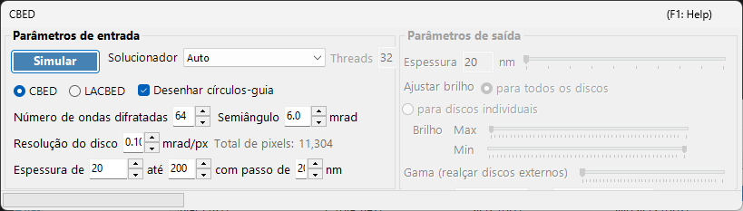
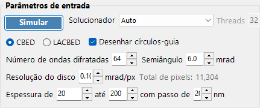
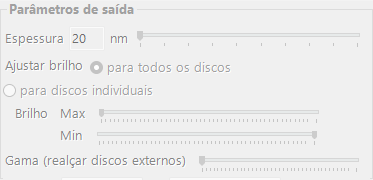

# Simulação CBED

A **simulação CBED (Convergent-Beam Electron Diffraction)** calcula e exibe padrões de difração com feixe convergente usando o método de ondas de Bloch (Bethe). Os padrões CBED mostram discos de difração em vez de pontos e contêm informações ricas sobre a simetria, a espessura e a estrutura do cristal.

> Esta página lista todas as configurações da janela dedicada que se abre quando você seleciona **Wavelength = Electron** e **Incident beam = Convergence (CBED, electron only)** no [Simulador de difração](index.md). Ao alternar o feixe incidente para convergência, **Intensity calculation** é automaticamente definido como **Dynamical**, e esta janela de configurações CBED se abre. Para desenhar e salvar padrões de difração, bem como para outras operações comuns ao simulador de difração, consulte a [página de visão geral](index.md).

Condições de GUI: Wave Length = Electron · Incident beam = Convergence (CBED, electron only) · Intensity calculation = Dynamical (automático)

---

## Parâmetros de entrada

| Parâmetro | Descrição | Padrão / Típico |
|-----------|-------------|-------------------|
| **Mode** | **CBED**: padrão padrão de feixe convergente em que cada disco corresponde a uma reflexão, com o disco transmitido (000) no centro. **LACBED** (Large-Angle CBED): padrão de feixe convergente de grande ângulo em que os discos de diferentes reflexões se sobrepõem. Útil para observar as linhas de zona de Laue de ordem superior (HOLZ) e a simetria | CBED |
| **Convergence semi-angle (mrad)** | Semiângulo do cone do feixe convergente. Determina o tamanho de cada disco de difração (o diâmetro do disco no espaço recíproco corresponde a $2\alpha$) | 5–30 mrad |
| **Disk resolution (mrad/px)** | Resolução angular dentro de cada disco. Valores menores fornecem maior resolução, mas o número de direções do feixe (pixels) calculadas cresce com o quadrado, de modo que o tempo de cálculo também aumenta quadraticamente. A contagem total de pixels resultante (= número total de direções do feixe) é mostrada à direita | — |
| **No. of Bloch waves** | Número máximo de feixes incluídos no cálculo de ondas de Bloch em cada direção do feixe incidente. Mais feixes fornecem maior precisão, mas o custo do problema de autovalores cresce com $O(N^3)$ | 100–500 |
| **Thickness range** | Valores inicial, final e de passo da espessura da amostra (nm). Várias espessuras são calculadas em conjunto e alternadas com o controle deslizante de espessura no lado de saída | — |
| **Solver** | Mecanismo de cálculo para o problema de autovalores. **Auto**: seleciona automaticamente o melhor solver. **Eigenproblem (MKL)**: baseado em Intel MKL (o mais rápido). **Eigenproblem (Eigen)**: biblioteca Eigen C++. **Managed**: .NET gerenciado puro (o mais lento, mas sempre disponível) | Auto |
| **Thread count** | Número de threads paralelas para o cálculo | — |
| **Draw disk outlines** | Quando marcado, desenha um círculo indicando o limite de cada disco de difração | — |

---

## Run / Stop

- **Start** : inicia a simulação CBED com os parâmetros de entrada atuais.
- **Stop** : cancela o cálculo em execução.

---

## Parâmetros de saída

Assim que o cálculo é concluído, os parâmetros de saída ficam disponíveis. Todos eles alteram apenas a exibição, sem recalcular.

| Parâmetro | Descrição |
|-----------|-------------|
| **Sample thickness** | Seleciona a espessura da amostra a ser exibida, dentro do intervalo de espessura dos parâmetros de entrada, usando um controle deslizante |
| **Brightness adjustment** | **Common to all disks**: usa uma escala de brilho comum a todos os discos para exibir o padrão CBED completo. **Per disk**: exibe um único disco selecionado em resolução total, normalizado dentro desse disco |
| **Brightness (Max / Min)** | Limites superior e inferior da intensidade exibida. Ajuste quando você quiser enfatizar características fracas |
| **γ (emphasis of outer disks)** | Correção gama. Usada para tornar os discos externos escuros de grande ângulo mais fáceis de ver em relação ao disco transmitido central |
| **Scale** | Seleciona a gradação de intensidade entre **Positive** / **Negative** (preto-branco invertido) |
| **Color** | Mapa de cores usado para a exibição. Escolha entre **Gray** e outros |

---

## Fundamento físico

No CBED, o feixe incidente é considerado um cone de ondas planas com direções diferentes. Para cada direção (cada ponto dentro da abertura de convergência = uma onda plana incidente parcial), o método de ondas de Bloch resolve a equação de Schrödinger dos elétrons no interior do cristal, e os resultados são reorganizados como discos de difração. As linhas HOLZ (zona de Laue de ordem superior) aparecem como linhas finas escuras/claras dentro dos discos, originadas de reflexões em zonas de Laue superiores. Elas são sensíveis ao parâmetro de rede ao longo do eixo $c$ e são úteis para a análise estrutural tridimensional.

Para os detalhes teóricos, consulte [Cálculo CBED](../appendix/a3-bloch-wave/cbed.md).

---

## Veja também

- [Simulador de difração (visão geral)](index.md)
- [Simulação SAED](1-saed-simulation.md)
- [Simulação PED](2-ped-simulation.md)
- [Cálculo CBED](../appendix/a3-bloch-wave/cbed.md)
