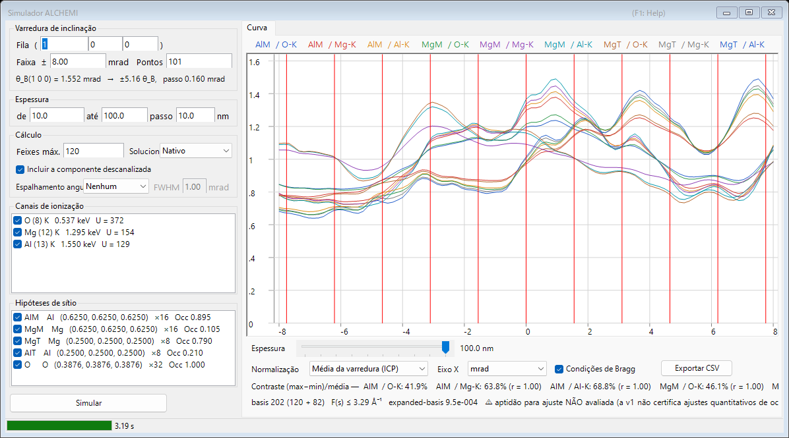

# Simulação ALCHEMI

**ALCHEMI (Atom Location by CHannelling-Enhanced MIcroanalysis)** determina **qual sítio um dopante ocupa** medindo os rendimentos de raios X característicos enquanto o cristal é inclinado ao longo de uma fila sistemática, e lendo a dependência com a orientação. O simulador ALCHEMI do ReciPro calcula, no sentido direto, a **curva de rocking (rendimento de ionização em função da orientação)** a partir de uma estrutura cristalina e de um conjunto de hipóteses de sítio.

> **Esta é uma função Preview.** A v1 executa **apenas cálculo direto unidimensional**; o ajuste a dados experimentais e o mapa 2D (2D-HARECXS) não estão implementados (essas abas estão ocultas). **Até onde os autores sabem, não existe outro simulador direto de ALCHEMI publicamente disponível.** Como não há implementação com que confrontar, leia [Âmbito e limitações conhecidas](#âmbito-e-limitações-conhecidas) antes de usar os resultados quantitativamente.

Abra-o pelo menu **Opções** do [Simulador de difração](index.md) → **Simulador ALCHEMI...**

Condições da GUI: Wave Length = Electron (o cristal, a tensão de aceleração e a orientação vêm do simulador de difração principal)



A janela tem **as definições à esquerda** (varredura, espessura, cálculo, canais de ionização, hipóteses de sítio) e **o resultado à direita** (aba Curva).

---

## O que é calculado

Para cada orientação incidente, o campo de onda dentro do cristal é resolvido pelo método das ondas de Bloch e, para cada par sítio $s$ / canal de ionização $c$, o rendimento de ionização é integrado analiticamente até a espessura $t$.

$$
Y_\text{dyn} = \mathrm{Re} \sum_{jj'} \alpha_j^{*}\,\bigl(C^{\dagger} \mu_{s,c} C\bigr)_{jj'}\, \alpha_{j'}\, F_{jj'}(t),
\qquad F_{jj'}(t) = \frac{e^{\lambda t} - 1}{\lambda}
$$

A matriz de ionização $\mu$ depende apenas da diferença de duas reflexões, $G = \mathbf{g}_h - \mathbf{g}_g$.

$$
\mu_{hg} = \sum_a \mathrm{Occ}_a\, e^{-M_a(G)}\, \sigma_c\, F_c(|G|/2)\, e^{-2\pi i\,G \cdot \mathbf{r}_a}
$$

- $\sigma_c$ : seção de choque total de ionização, modelo **Bote–Salvat**
- $F_c(s)$ : fator de forma de ionização normalizado, tabelas **DHFS** geradas internamente (a mesma base de dados de [Interação do feixe](../3-beam-interaction.md) e [STEM-EDX](../9-hrtem-stem-simulator/2-stem-simulation.md))
- $e^{-M_a(G)}$ : fator de Debye-Waller (ADPs anisotrópicos são suportados)

Corresponde à **aproximação de fator de forma local** do ICSC (Oxley & Allen 2003). A MDFF de dois momentos não é usada.

### Componente descanalizada

Os elétrons removidos do campo de Bloch coerente pela absorção térmica difusa percorrem a espessura restante como elétrons de direção aleatória e também ionizam ali.

$$
Y_\text{dech} = \frac{\mu_{00}}{V_c}\,\bigl(t - L_\text{coh}(t)\bigr),
\qquad L_\text{coh}(t) = \int_0^t \sum_g |\psi_g(z)|^2\,dz
$$

Desmarcar **Incluir a componente descanalizada** na caixa **Cálculo** elimina esse termo. Em espessuras típicas ele responde por dezenas de por cento do rendimento total, de modo que omiti-lo faz o contraste de sítio parecer mais forte do que é.

### Grandeza de saída

A grandeza primária é o **número de lacunas de camada interna geradas por elétron incidente**. **A conversão em fótons de raios X (rendimento de fluorescência e ramificação de linhas), a autoabsorção de raios X na amostra e a eficiência e o ângulo sólido do detector NÃO são aplicados.**

---

## Painel esquerdo: definições

### Varredura de inclinação

| Item | Descrição | Padrão |
|------|-----------|--------|
| **Fila ( h k l )** | A fila sistemática a percorrer, dada em índices de reflexão. O eixo de inclinação é tomado perpendicular tanto ao feixe quanto a este $\mathbf{g}$, de modo que a varredura atravessa as condições de Bragg dessa fila | (1 0 0) |
| **Faixa ±** | Semilargura da varredura de inclinação (mrad). Acima de cerca de 10 mrad uma base união fixa deixa de ser garantida, e acima de 30 mrad está fora da garantia da v1 | 8 mrad |
| **Pontos** | Número de pontos da varredura (3–1001) | 101 |

A linha abaixo mostra o ângulo de Bragg $\theta_B$ da fila escolhida, a quantos $\theta_B$ corresponde a largura da varredura e o passo de inclinação — assim se vê até onde a varredura realmente chega antes de executá-la.

### Espessura

Informe início, fim e passo (nm). **Todas as espessuras são calculadas juntas em uma única execução**, e o resultado é alternado com o controle deslizante sob a curva.

O contraste de sítio muda fortemente — e pode até inverter de sinal — entre amostras finas e espessas, portanto verifique várias espessuras antes de concluir. É por isso que o seletor de espessura fica logo abaixo da curva.

### Cálculo

| Item | Descrição | Padrão |
|------|-----------|--------|
| **Feixes máx.** | Limite superior do número de ondas de Bloch por orientação (1–1600). A união sobre toda a varredura é maior | 120 |
| **Solucionador** | Motor de cálculo do problema de autovalores: **Nativo** (Eigen C++) ou **Gerido** (.NET). Onde o solucionador nativo não está disponível, a escolha fica fixada em Gerido | Nativo |
| **Incluir a componente descanalizada** | Se soma $Y_\text{dech}$ acima | ligado |
| **Espalhamento angular** | Convolui a curva com o espalhamento angular do feixe incidente: **Nenhum** ou **Gaussian** com uma largura a meia altura em mrad. É um pós-processamento no eixo das orientações, aplicado **antes** da normalização de exibição | Nenhum |

**O teto de 1600 feixes é a contraparte da faixa tabelada $s \le 16\ \text{Å}^{-1}$ do fator de forma de ionização.** Na prática, mesmo 1600 feixes exigem apenas cerca de 10,5 Å⁻¹, de modo que a faixa tabelada nunca é esgotada enquanto o teto for respeitado. O valor efetivamente alcançado é informado na linha de [diagnóstico da base](#diagnóstico-da-base) sob o gráfico.

### Canais de ionização

Lista de elemento e camada a ionizar. Cada linha é lida como `elemento (Z) camada   energia da borda   U = sobretensão`, com uma etiqueta entre parênteses onde é preciso cautela.

- Canais que **não podem ser excitados** (a energia incidente está abaixo da borda de absorção) ou que ficam **fora da faixa tabelada** são listados com o motivo e não podem ser marcados
- Canais cuja sobretensão $U = E_0/E_\text{borda}$ é inferior a 1,2 recebem um aviso, pois ali a seção de choque é menos confiável

### Hipóteses de sítio

Lista dos sítios atômicos cujo rendimento é calculado separadamente, exibidos como `rótulo elemento (x, y, z) ×multiplicidade Occ ocupação`.

⚠ **No quadro do traçador, um canal pode ser emparelhado com qualquer sítio.** Emparelhar o canal de ionização de um dopante com a geometria de um sítio hospedeiro (posição, ADP, ocupação) é o uso pretendido; restringir o emparelhamento a elementos coincidentes seria errado. **Todas as combinações** dos canais e sítios marcados são calculadas.

### Simular / Parar

**Simular** inicia a varredura. O progresso é informado na barra de estado em cinco etapas (resolvendo dados de ionização → construindo a base união → construindo as matrizes de ionização → resolvendo orientações → verificando a base ampliada), e **Parar** aborta a qualquer momento.

---

## Painel direito: aba Curva

Ao terminar o cálculo, é desenhada uma curva por par sítio × canal. A legenda é `rótulo do sítio / canal`.

| Item | Descrição |
|------|-----------|
| **Espessura** | Seleciona a espessura exibida com um controle deslizante (nada é recalculado) |
| **Normalização** | **Média da varredura (ICP)** = dividir pela média sobre toda a varredura (a grandeza normalmente usada em ALCHEMI) / **Máximo = 1** / **Bruto (por elétron)** |
| **Eixo X** | Alterna entre **mrad** e **θ_B** (em unidades do ângulo de Bragg da fila percorrida) |
| **Condições de Bragg** | Desenha linhas verticais em $\theta = n\,\theta_B$ |
| **Exportar CSV** | Escreve as curvas brutas de cada orientação, espessura, sítio e canal em um arquivo CSV ([abaixo](#exportação-csv)) |

⚠ **A normalização é apenas uma transformação de exibição.** A grandeza armazenada é sempre o número de lacunas geradas por elétron incidente, e **Máximo = 1 é somente para exibição** — não deve ser usado como referência de ICP.

### Contraste e correlação

A primeira linha sob a curva informa, por série, o **contraste** $(\max-\min)/\text{média}$ e o **coeficiente de correlação** $r$ em relação à primeira série. É um resumo para julgar de relance qual sítio está atuando: duas séries com $r$ próximo de $+1$ têm a mesma dependência com a orientação, ou seja, esses dados não conseguem separar esses sítios.

### Diagnóstico da base

A segunda linha informa o estado da base.

```text
basis 347 (184 + 163)   F(s) ≤ 6.20 Å⁻¹   expanded-basis 6.7e-3   ⚠ aptidão para ajuste NÃO avaliada   ⚠ Experimental: verificado quantitativamente apenas para beta-AlCo [001] a 250 keV
```

- **basis N (apenas centro + acrescentados pela união)** : tamanho da união verdadeira das reflexões sobre todas as orientações da varredura
- **F(s) ≤ … Å⁻¹** : o maior argumento de fator de forma que a base realmente exigiu
- **expanded-basis** : diferença relativa máxima quando o centro e as duas extremidades da varredura são resolvidos novamente com uma base 1,25×. É um **substituto para o erro de convergência**
- **aptidão para ajuste** : a v1 informa sempre **NÃO avaliada**. O diagnóstico tem três defeitos conhecidos — o denominador é o
  máximo sobre todo o tensor, o numerador é o rendimento absoluto, e ele passa trivialmente quando a base 1,25× não cresce de
  fato — de modo que certificar um resultado como «apto» erraria na direção perigosa
- **Experimental** : toda execução leva esta etiqueta junto com a faixa verificada, pois apenas β-AlCo foi conferido quantitativamente

⚠ **A v1 não certifica ajustes quantitativos de ocupação.** O valor bruto do diagnóstico continua visível e quanto menor melhor, mas trate-o como uma indicação, não como uma marca de aprovação. Note também que ele é definido sobre o **rendimento absoluto**, portanto é conservador quando se olha apenas o ICP (que divide pela média da varredura).

Nas situações a seguir são acrescentados mais avisos.

- **Tensão de aceleração abaixo de 80 kV** : nessa tensão a tabela de fatores de forma não garante $s$ até $16\ \text{Å}^{-1}$. O cálculo em si continua correto enquanto o $s$ exigido pela base permanecer dentro da faixa certificada, portanto isso é um **aviso, não uma recusa**
- **Truncamento do fator de forma** : onde $F(s)$ além da faixa certificada foi truncado a zero, **o limite de erro resultante $|F| \le \varepsilon$ é mostrado numericamente**. Nada é extrapolado em silêncio

---

## Exportação CSV {#exportação-csv}

**Exportar CSV** escreve uma tabela em formato longo precedida por um cabeçalho no formato `# key: value` (abreviado abaixo). O cabeçalho é escrito de modo que o próprio arquivo declare as condições necessárias para reproduzi-lo.

```text
# generator: ReciPro ALCHEMI, ver 4.947 (2026-08-09)
# model: LocalFormFactor (local form-factor approximation; NOT the two-momentum MDFF)
# quantity: IonizationVacanciesGenerated (PerIncidentElectron)
# crystal: MgAl2O4 (spinel) / F d -3 m
# cell_nm: a 0.808000 b 0.808000 c 0.808000 alpha 90.0000 beta 90.0000 gamma 90.0000 deg
# accelerating_voltage_kV: 200.000
# scan_row_hkl: 1 0 0
# theta_B_mrad: 1.552030
# thicknesses_nm: 10.0000 20.0000 ... 100.0000
# angular_spread: Gaussian1D FWHM 1.0000 mrad (kernel renormalized at the scan ends)
# processing_order: forward yield -> angular spread convolution -> (display normalization, NOT applied to these columns)
# basis: 202 beams (120 centre-only + 82 added by the union), hash 1F3A...
# expanded_basis_max_rel_diff: 9.500e-004
# fit_eligibility: NotEvaluated (v1 does not certify quantitative occupancy fits; raw diagnostic AcceptedForFit=True at tolerance 3e-3)
# occupancy_coupling: Tracer (dilute limit; site responses may be combined linearly). VCA is not implemented
# verification: Experimental. Quantitatively verified only for beta-AlCo [001] at 250 keV (Al-K / Co-K / Co-L). ...
# not_modelled: X-ray self-absorption, detector efficiency and solid angle, fluorescence yield and line branching, background, specimen thickness distribution, specimen bending
# channel[Al-K]: edge 1.5596 keV, sigma 1.95e-007 nm2, sigma_source ... , F(s)_source ... (tabulated to s = 16.0 A^-1), not truncated
# site[AlM]: atom indices 0, occupancy from the crystal
# conventions: tilt is the signed rotation about the axis perpendicular to both the beam and g(scan_row_hkl), positive toward +g; angles in mrad; lengths in nm; ...
tilt_mrad,thickness_nm,site,channel,dynamic,dechannelled,total,dynamic_conv,dechannelled_conv,total_conv
```

`dynamic` / `dechannelled` / `total` são armazenados separadamente, de modo que **a contribuição da componente descanalizada pode ser avaliada posteriormente**. As colunas `*_conv` aparecem somente com o espalhamento angular ativado e contêm as curvas convoluídas: o arquivo carrega assim tanto o resultado bruto reprodutível quanto o de comparação com um experimento. Os valores são brutos (por elétron incidente) e não passam pela normalização de exibição; o separador decimal é sempre um ponto.

---

## Âmbito e limitações conhecidas

«Pode ser calculado» e «foi verificado quantitativamente» são coisas diferentes. Esta seção trata do segundo.

### Faixa verificada quantitativamente

**β-AlCo [001] a 250 keV, canais Al-K / Co-K / Co-L** — e nada mais. Comparado com um cálculo multislice + fônons congelados (py_multislice), cuja formulação dinâmica é completamente independente:

- **Sítio Al (coluna leve)** : resíduo RMS em relação à modulação ICP ≤3,2 % em todas as espessuras, ≤0,6 % para $t \ge 10$ nm
- **Sítio Co (coluna pesada)** : ≤3 % para $t \le 4$ nm, mas **6–17 % para $t \gtrsim 10$ nm**

Qualquer outro sistema, elemento, camada ou tensão é «calculável», mas não «verificado quantitativamente».

### Erro sistemático conhecido: o termo descanalizado não tem correlação de sítio

O termo descanalizado da v1 é uma constante independente da orientação, de modo que seu único efeito sobre o ICP é puxá-lo para 1. Na realidade, parte dos elétrons espalhados termicamente volta a canalizar nas colunas e, por serem espalhadores fortes, retorna **preferencialmente às colunas pesadas**. Na comparação acima, a magnitude efetiva dessa contribuição estava **subestimada em 10–19 pontos nas colunas pesadas**.

→ **Para sítios leves ou fracamente espalhadores, ou para $t \lesssim 5$ nm, a concordância com uma implementação independente é de 1–3 %. Para colunas pesadas com $t \gtrsim 10$ nm há um erro sistemático de 6–17 % da modulação ICP.** Um modelo de reinjeção com correlação de sítio fica adiado para a v1.1 ou posterior.

### Não incluído no modelo direto

**Uma convolução com o alargamento angular, sozinha, não reproduzirá um experimento.** Nada do seguinte está incluído.

- **Distribuição de espessura** e **flexão** da amostra
- **Autoabsorção** de raios X
- **Eficiência e ângulo sólido do detector**
- **Fundo** (bremsstrahlung, linhas sobrepostas)

O **espalhamento angular do feixe incidente** (semiângulo de convergência, deriva) *é* modelado — veja **Espalhamento angular** na caixa Cálculo — mas convoluir com ele não substitui nenhum dos pontos acima.

### Premissas do modelo

- **Somente aproximação de traçador** : a superposição linear das respostas de sítio só vale no limite diluído em que o dopante não perturba o campo de onda elástico. A VCA a concentração finita está fora do escopo da v1
- **Aproximação de fator de forma local** : $\mu$ é função apenas de $G = \mathbf{g}_h - \mathbf{g}_g$, e não da MDFF de dois momentos (Modelo A de OAR 1999). A aproximação falha para camadas K de elementos leves e bordas de baixa energia
- **Lacunas, não fótons de raios X** : o rendimento de fluorescência e a ramificação de linhas não são aplicados
- **O limite inferior da tensão de aceleração é 80 kV** : é a menor tensão em que $s = 16\ \text{Å}^{-1}$ pode ser garantido, não um limiar de recusa

---

## Veja também

- [Simulador de difração (visão geral)](index.md)
- [Simulação CBED](3-cbed-simulation.md)
- [Cálculo dinâmico (núcleo comum)](../appendix/a3-bloch-wave/calculation.md)
- [Simulação STEM](../9-hrtem-stem-simulator/2-stem-simulation.md) — STEM-EDX, que usa a mesma base de dados de ionização
- [Interação do feixe](../3-beam-interaction.md) — dados de seções de choque e bordas de absorção
