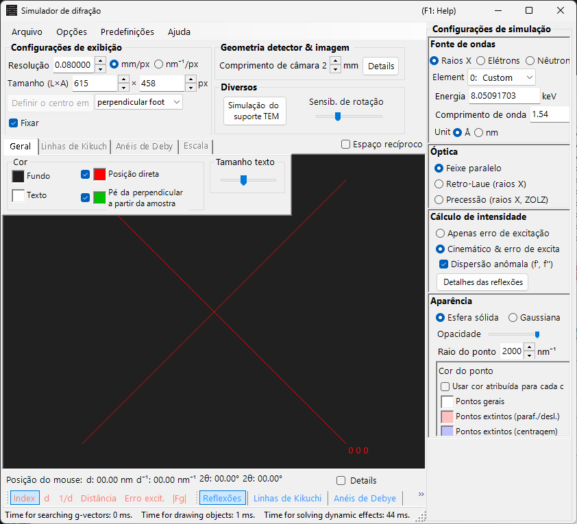
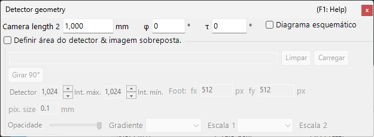

# Simulação de difração de raios X / nêutrons

A **simulação de difração de raios X / nêutrons** calcula padrões de difração de monocristal para raios X e nêutrons. É um dos principais modos do [simulador de difração](index.md).

> Esta página lista todas as configurações que aparecem no lado direito quando você seleciona **Wave Length = X-ray** (ou neutron). Para operações que afetam toda a janela, como desenhar e salvar, consulte a [página de visão geral](index.md).

Condições da GUI: Wave Length = X-ray / Neutron · Incident beam = Parallel / Precession (X-ray) / Back-Laue · Intensity calculation = Only excitation error / Kinematical

---

## Visão geral

Os raios X têm um comprimento de onda maior que os elétrons (Cu Kα: 0.15406 nm = 1.5406 Å), de modo que a esfera de Ewald é mais fortemente curvada. Como resultado, menos pontos da rede recíproca satisfazem a condição de difração simultaneamente do que no caso dos elétrons. Como o poder de espalhamento atômico é pequeno e o espalhamento múltiplo é fraco, a teoria cinemática da difração fornece precisão suficiente para as intensidades (o cálculo dinâmico é suportado apenas para elétrons).

---

## Wave Length

Selecione **X-ray** como fonte de radiação. Os raios X podem ser especificados de duas maneiras: raios X característicos e radiação síncrotron.

### Raios X característicos

A escolha de um **elemento** e de uma **transição** fixa o comprimento de onda dos raios X característicos. A transição é especificada na notação de Siegbahn (Kα₁ / Kα₂ / Kβ, etc.). Comprimentos de onda Kα₁ de elementos representativos:

| Elemento | Linha | Comprimento de onda (Å) | Energia (keV) |
|---------|------|-----------------|--------------|
| Cu | Kα₁ | 1.5406 | 8.048 |
| Mo | Kα₁ | 0.7107 | 17.479 |
| Co | Kα₁ | 1.7890 | 6.930 |
| Cr | Kα₁ | 2.2910 | 5.415 |

### Radiação síncrotron

Defina **Element** como **0: Custom** e insira diretamente a energia (keV) ou o comprimento de onda (Å). Qualquer comprimento de onda pode ser usado.

---

## Modo do feixe incidente

Seleciona a geometria do feixe incidente. Três modos estão disponíveis para raios X.

### Parallel

A onda plana padrão. Um feixe incidente paralelo, usado para SAED e difração de raios X de monocristal.

### Precession (X-ray) — câmera de precessão

Simula uma câmera de precessão de raios X. Trata-se de uma fotografia de precessão que captura uma única camada da rede recíproca.

### Back-Laue (Laue de retrorreflexão)

Simula um padrão de Laue de retrorreflexão com raios X brancos (policromáticos). Nessa geometria de retrorreflexão, o detector é colocado do lado da fonte e **Monochrome** é desativado. A geometria de reflexão é dada por **Tau / Phi** em **Detector geometry** (consulte [Detector geometry](index.md#detector-geometry)).

> **Nota**: As opções do feixe incidente acompanham o comprimento de onda. **Precession (electron)** e **Convergence (CBED)** aparecem somente quando a radiação de elétrons está selecionada, enquanto as opções **Precession (X-ray)** e **Back-Laue** acima aparecem somente quando a radiação de raios X está selecionada. Para nêutrons, apenas **Parallel** está disponível. Dependendo do estado no momento da captura, a captura de tela pode não mostrar as opções específicas de raios X.

---

## Cálculo da intensidade

Seleciona o método usado para calcular as intensidades dos spots. Dois modos estão disponíveis para raios X.

### Only excitation error

A intensidade é determinada exclusivamente pela distância geométrica entre a esfera de Ewald e o ponto da rede recíproca (o erro de excitação $s_g$). Um $\lvert s_g \rvert$ menor resulta em maior intensidade, com pico no valor definido por **Radius**, caindo a zero quando $\lvert s_g \rvert$ excede o Radius. O fator de estrutura é ignorado.

### Kinematical & excitation error

Além do erro de excitação, o fator de estrutura cinemático $\lvert F_{hkl} \rvert^2$ é incorporado à intensidade. As regras de extinção são estritamente obedecidas. Os fatores de Lorentz e de polarização não são incluídos (esta é uma simulação do padrão geométrico).

> **Nota**: A **teoria dinâmica** está desabilitada para raios X (disponível somente quando a radiação de elétrons está selecionada).

---

## Aparência dos spots

Controla como cada spot de difração é renderizado.

- **Solid sphere / Gaussian** : modelo geométrico do ponto da rede recíproca. **Solid sphere** usa a seção transversal entre uma esfera de raio *R* e a esfera de Ewald (a área do círculo corresponde à intensidade de difração); **Gaussian** usa a seção transversal entre uma gaussiana 3D com σ = *R* e a esfera de Ewald (a integral da gaussiana 2D corresponde à intensidade de difração).
- **Opacity** : transparência do spot (0 = transparente, 1 = opaco).
- **Radius (R)** : raio do ponto da rede recíproca. O tamanho do spot renderizado é determinado pela combinação de **Appearance** e **Intensity calculation**.
- **Brightness** : ativo apenas no modo **Gaussian**. Define a intensidade integrada da gaussiana renderizada.
- **Color scale** : escolha entre os mapas de cores **Gray scale** e **Cold-warm**.
- **Log scale** : exibe as intensidades em escala logarítmica.
- **Spot color** : cor padrão do spot quando a escala de cores não se aplica.
- **Use crystal color** : quando marcado, desenha os spots na cor atribuída a cada cristal.

---

## Anéis de Debye (policristalino)

Os anéis de Debye de uma amostra policristalina podem ser exibidos. Ative **Debye rings** na barra de ferramentas (consulte [Barra de ferramentas](index.md#toolbar)).

- **Ignore diffraction intensity** : desenha todos os anéis com a mesma cor e intensidade (usado para uma comparação puramente geométrica que ignora o fator de estrutura).
- **Show index label** : exibe o índice (*hkl*) próximo a cada anel.

As configurações detalhadas estão na aba Debye rings do [menu de abas](index.md#drawing-overlay-tabs).

---

## Difração de nêutrons

Selecionar **Neutron** no controle Wave Length calcula um padrão de difração de nêutrons. Insira a energia (meV) ou o comprimento de onda (nm). O feixe incidente só pode ser **Parallel**. O cálculo da intensidade pode ser **Only excitation error** ou **Kinematical** (Dynamical não está disponível). A intensidade cinemática usa o comprimento de espalhamento de nêutrons em vez do fator de espalhamento atômico.

---

## Diferenças entre difração de raios X e de elétrons

| Característica | Difração de raios X | Difração de elétrons |
|---------|-------------------|----------------------|
| Comprimento de onda | Longo (0.5–2.5 Å) | Curto (0.02–0.04 Å) |
| Curvatura da esfera de Ewald | Grande | Pequena (quase plana) |
| Reflexões simultâneas | Poucas | Muitas |
| Fator de espalhamento | Fator de espalhamento atômico $f(s)$ | Fator de espalhamento eletrônico $f_e(s)$ |
| Efeitos dinâmicos | Geralmente pequenos | Grandes |
| Regras de extinção | Estritamente obedecidas | Podem ser violadas pelo espalhamento múltiplo |

---

## Operações comuns

Para operações que afetam toda a janela, como comprimento de câmera, geometria do detector, salvamento de padrões e configurações de cor, consulte a [página de visão geral](index.md). A geometria detalhada do detector é configurada na janela de geometria mostrada abaixo.

---

## Veja também

- [Simulador de difração (visão geral)](index.md)
- [Simulação SAED](1-saed-simulation.md)
- [Simulação de difração de elétrons por precessão (PED)](2-ped-simulation.md)
- [Simulação de difração de elétrons por feixe convergente (CBED)](3-cbed-simulation.md)
- [Sistema de coordenadas — orientação do cristal](../appendix/a1-coordinate-system/1-orientation.md)
