# Crystal Diffraction (Simulador de difração)

**Crystal Diffraction (Simulador de difração)** simula padrões de difração de raios X, de nêutrons e de elétrons de monocristal.

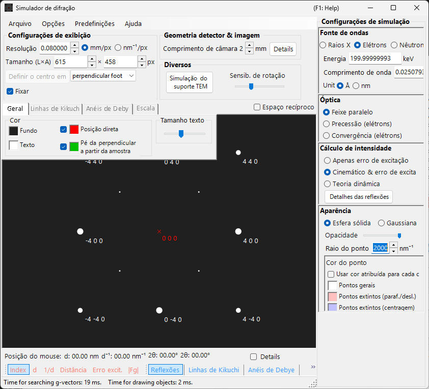

A janela tem uma área de desenho do padrão de difração à **esquerda** e, à **direita**, os painéis de configuração das propriedades dos reflexos (comprimento de onda, feixe incidente, cálculo de intensidade, aparência, etc.). A combinação de comprimento de onda e feixe incidente determina o modo de aquisição (difração de raios X, SAED, PED, CBED), e os painéis à direita são reconfigurados de acordo.

---

## Como esta página e as páginas de modo dividem o trabalho

- **Esta página (hub)**: reúne as operações comuns a todos os modos (atalhos, menus, barra de ferramentas, informações de tela/detector, abas de overlay, informações dos reflexos, geometria do detector, compressão dinâmica).
- **Cada página de modo**: cobre **todas as configurações que aparecem à direita** quando esse modo é selecionado (comprimento de onda, feixe incidente, cálculo de intensidade, aparência, configurações de ondas de Bloch, configurações de precessão, etc.), de modo que cada página seja autossuficiente (há alguma sobreposição entre os modos).

| Modo | Conteúdo | Página |
|------|----------|------|
| **Difração de raios X (e de nêutrons)** | Padrão de difração de raios X / nêutrons de monocristal (paralelo, raios X em precessão, Back Laue) | [Simulação de difração de raios X](4-x-ray-neutron-diffraction.md) |
| **SAED** | Difração de elétrons com feixe paralelo (selected-area electron diffraction) | [Simulação SAED](1-saed-simulation.md) |
| **PED** | Difração de elétrons em precessão | [Simulação PED](2-ped-simulation.md) |
| **CBED** | Difração de elétrons com feixe convergente | [Simulação CBED](3-cbed-simulation.md) |

---

## Referência rápida de modos

Localize a página de que precisa a partir da combinação de **comprimento de onda (fonte)** e **feixe incidente**.

| Comprimento de onda | Feixe incidente | Modo | Página |
|------------|--------------------|------|------|
| Elétron | Paralelo | SAED | [Simulação SAED](1-saed-simulation.md) |
| Elétron | Precessão (elétron = PED) | PED | [Simulação PED](2-ped-simulation.md) |
| Elétron | Convergência (CBED) | CBED | [Simulação CBED](3-cbed-simulation.md) |
| Raios X | Paralelo | Difração de raios X | [Simulação de difração de raios X](4-x-ray-neutron-diffraction.md) |
| Raios X | Precessão (raios X) | Raios X em precessão (câmera de precessão) | [Simulação de difração de raios X](4-x-ray-neutron-diffraction.md) |
| Raios X | Back Laue | Laue de retroreflexão | [Simulação de difração de raios X](4-x-ray-neutron-diffraction.md) |
| Nêutron | Paralelo | Difração de nêutrons | [seção de nêutrons da Simulação de difração de raios X](4-x-ray-neutron-diffraction.md) |

> **Note**: As opções de feixe incidente mudam com o comprimento de onda. Para elétrons: **Parallel, Precession (electron = PED), Convergence (CBED)**; para raios X: **Parallel, Precession (X-ray), Back Laue**; para nêutrons: apenas **Parallel**. Selecionar **Precession (electron = PED)** ou **Convergence (CBED)** alterna automaticamente o cálculo de intensidade para **Dynamical**.

---

## Atalhos de teclado e mouse

Estes se aplicam à janela do padrão de difração compartilhada pelas simulações de raios X, SAED e PED. Arrastar sobre o padrão gira o **cristal**. Aqui **não há zoom pela roda do mouse** — use o zoom com clique direito / arrastar com o botão direito.

| Atalho | Ação |
|----------|--------|
| <kbd>F1</kbd> | Abrir esta página do manual online |
| Arrastar com o botão esquerdo perto do centro | Inclinar o cristal |
| Arrastar com o botão esquerdo na área externa | Girar o cristal em torno do eixo do feixe |
| Clique duplo esquerdo em um reflexo | Mostrar detalhes do reflexo (índice, *d*, fator de estrutura, erro de excitação) |
| Arrastar com o botão do meio | Deslocar o padrão |
| <kbd>CTRL</kbd> + Arrastar com o botão do meio | Mover o centro do detector (quando a área do detector está sendo exibida) |
| Clique direito | Reduzir o zoom |
| Arrastar com o botão direito um retângulo | Ampliar o zoom na região selecionada |
| Clique duplo direito na barra de status | Copiar um resumo em texto das configurações atuais |
| Clique duplo direito em um botão de camada ativo (Spots / Kikuchi / Debye / Scale) | Piscar essa camada ligando e desligando |

As janelas auxiliares abertas a partir daqui adicionam mais alguns:

| Atalho | Ação |
|----------|--------|
| Clique duplo esquerdo na estereonete — **TEM holder** | Ajustar a inclinação do suporte para esse ponto |
| Teclas de seta — **TEM holder** | Avançar a inclinação do suporte passo a passo (marque **Arrow keys** primeiro) |
| Soltar um arquivo `.prm` ou uma imagem — **Detector geometry** | Carregar geometria do detector / imagem de overlay |
| Soltar um perfil `.txt` — **Dynamic compression** | Carregar um perfil de pressão/tempo (arraste a linha vermelha no gráfico para percorrê-lo) |

Os atalhos <kbd>CTRL</kbd>+<kbd>SHIFT</kbd> de toda a aplicação, da janela principal, também funcionam enquanto esta janela está em foco (consulte [janela principal](../0-main-window.md)).

→ Consulte **[21. Atalhos de teclado e mouse](../21-shortcuts.md)** para todas as janelas de uma só vez.

---

## Rotas rápidas por objetivo

| Objetivo | Começar por | Referência |
|------|------------|-----------|
| Produzir difração de elétrons com feixe paralelo (SAED) | Definir **Incident beam** como **Parallel** e **Wavelength** como elétron | [Simulação SAED](1-saed-simulation.md), [cálculo de SAED com feixe paralelo](../appendix/a3-bloch-wave/calculation.md) |
| Produzir difração de raios X de monocristal | Alternar **Wavelength** para raios X / Síncrotron | [Simulação de difração de raios X](4-x-ray-neutron-diffraction.md) |
| Produzir difração de elétrons em precessão (PED) | Definir **Incident beam** como **Precession (electron)** e, em seguida, definir o semiângulo e o passo | [Simulação PED](2-ped-simulation.md) |
| Produzir difração de elétrons com feixe convergente (CBED) | Definir **Incident beam** como **Convergence (CBED, electron only)** e definir as condições na janela CBED | [Simulação CBED](3-cbed-simulation.md), [cálculo CBED](../appendix/a3-bloch-wave/cbed.md) |
| Inspecionar a lista de reflexos do cálculo dinâmico | Selecionar **Dynamical** e abrir **Spot Details** ou **Details** | [Cálculo dinâmico (núcleo compartilhado)](../appendix/a3-bloch-wave/calculation.md) |
| Comparar a geometria do detector com uma imagem experimental | Abrir as configurações de geometria do detector em **Details** e usar a imagem de overlay | [Sistema de coordenadas do detector](../appendix/a1-coordinate-system/2-diffraction.md) |

---

## Área principal

O padrão de difração é simulado no centro da tela.

### Operação do mouse

Consulte "Atalhos de teclado e mouse" no topo desta página.

### Posição do mouse

As informações correspondentes à posição do cursor (cursor *q*, *d*, 2θ, azimute, etc.) são exibidas na linha de status acima do padrão. Marcar **Details** adiciona informações mais detalhadas (o (*hkl*) do reflexo mais próximo, erro de excitação, fator de estrutura, etc.).

---

## Menu File

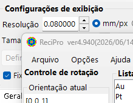

| Item de menu | Descrição |
|-----------|-------------|
| **Save** | Salvar o padrão de difração exibido em um arquivo. |
| **Save detector area** | Salvar apenas o recorte da área do detector. |
| **Copy** | Copiar a imagem exibida para a área de transferência. |
| **Copy detector area** | Copiar apenas o recorte da área do detector. |

### Preset {#toolbar}

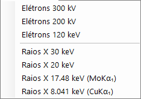

Salvar e recuperar uma configuração completa do simulador — comprimento de onda, geometria do detector, configurações das abas, propriedades dos reflexos, etc. — como um preset. Útil para alternar rapidamente entre instrumentos / modos de aquisição.

---

## Barra de ferramentas

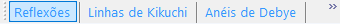

| Botão | Descrição |
|--------|-------------|
| Spots | Mostrar / ocultar a camada de reflexos de difração |
| Kikuchi | Mostrar / ocultar a camada de linhas de Kikuchi |
| Debye | Mostrar / ocultar a camada de anéis de Debye |
| Scale | Mostrar / ocultar a camada de linhas de escala |
| Index / d / 1/d / Distance / 2θ / χ / Excitation error / Structure factor | Escolha do rótulo anexado a cada reflexo |

---

## Informações de tela e detector

### Tela

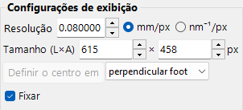

| Item | Descrição |
|------|-------------|
| **Resolution** | O tamanho de um pixel (mm). Não precisa corresponder ao tamanho real do pixel do detector; é tratado como uma escala de exibição e atualizado automaticamente quando você aplica zoom com o mouse. |
| **Size (W×H)** | Largura e altura em pixels da área de desenho. Dependendo da resolução do seu monitor, valores muito grandes podem não ser ajustáveis. |
| **Set centre / Fix centre** | Definir o centro do padrão em qualquer pixel da área de desenho e, se necessário, fixá-lo. Quando fixado, o centro não pode ser movido pelo deslocamento com o mouse. |
| **Horizontal flip / Vertical flip / Negative image** | Espelhamentos geométricos (horizontal / vertical) e inversão de contraste do padrão exibido. Use-os para corresponder à orientação ou ao contraste de uma imagem experimental. |
| **Reciprocal space** | Sobrepõe a esfera de Ewald e os vetores da rede recíproca sobre o padrão, visualizando quais reflexos estão excitados. |

### Detector (comprimento de câmera)

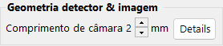

- **Camera length** : Distância da amostra ao detector (mm).
- **Details** : Abre a janela de configurações de geometria do detector (consulte [Geometria do detector](#detector-geometry) abaixo).

### Misc

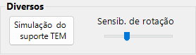

- **Rotation sensitivity** : Quantidade de rotação do cristal por pixel de arrasto do mouse.
- **TEM holder simulation** : Abre a janela de simulação vinculada ao suporte (veja abaixo).

---

## Simulação do suporte TEM {#drawing-overlay-tabs}

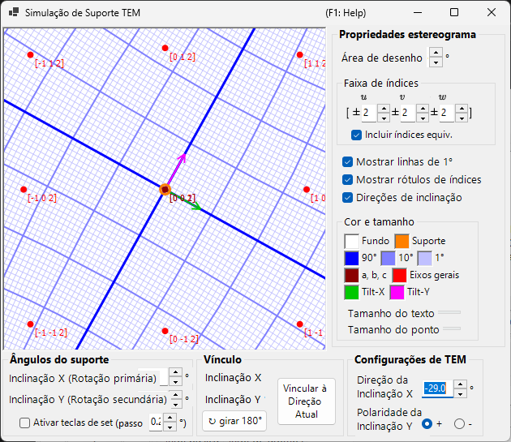

Abre uma janela que vincula o padrão de difração a um **TEM holder** de dupla inclinação (ou de rotação). Definir os ângulos de inclinação do suporte atualiza o padrão e a orientação do cristal, e as orientações alcançáveis podem ser exibidas em uma estereonete (adicionado na v4.914). Um clique duplo esquerdo na estereonete ajusta a inclinação do suporte para esse ponto, e marcar **Arrow keys** permite que as teclas de seta avancem a inclinação passo a passo.

---

## Abas de overlay de desenho

### General

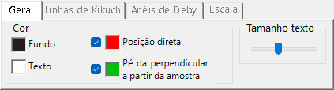

Define as cores dos reflexos, rótulos, linhas de Kikuchi, anéis de Debye e outros overlays. As configurações feitas aqui se aplicam a todos os modos de renderização.

### Linhas de Kikuchi

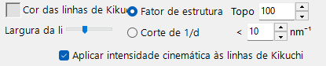

Ativa quando as linhas de Kikuchi estão habilitadas na barra de ferramentas.

- **Reflection selection** : Escolhe quais reflexos geram as linhas de Kikuchi. Ou **structure factor** (os *N* reflexos principais por $\lvert F_{hkl}\rvert$) ou **1/d cutoff** (todos os reflexos cujo 1/d está abaixo do limiar (nm⁻¹)).
- **Line appearance** : Define a largura da linha, a cor das linhas de Kikuchi e **Draw with kinematical intensity** (escala o escurecimento da linha pela intensidade cinemática do reflexo).
- **Threshold** : Um parâmetro legado. Executa o cálculo das linhas de Kikuchi apenas para reflexos com *d* maior que o valor especificado (mantido por compatibilidade).

### Anéis de Debye

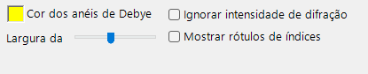

Ativa quando os anéis de Debye estão habilitados na barra de ferramentas.

- **Ignore diffraction intensity** : Se marcado, todos os anéis de Debye são desenhados com a mesma cor e intensidade (ignorando o fator de estrutura do cristal). Use-o para uma comparação puramente geométrica.
- **Show index label** : Se marcado, o (*hkl*) aparece próximo de cada anel.

### Scale

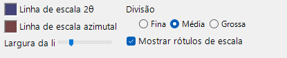

Ativa quando as linhas de escala estão habilitadas na barra de ferramentas.

- **2θ / Azimuth scale lines** : **2θ** representa ângulo de espalhamento constante (círculos concêntricos), **Azimuth** representa ângulo de azimute constante (linhas radiais a partir do centro). As cores são configuráveis de forma independente.
- **Line width** : Espessura das linhas de escala.
- **Division** : Intervalo angular entre linhas de escala adjacentes.
- **Show scale labels** : Se rótulos numéricos devem ser desenhados nas linhas de escala.

### Misc {#diffraction-spot-information}

Configurações diversas, como a sensibilidade de rotação do mouse.

- **Mouse sensitivity** : Quantidade de rotação do cristal por pixel de arrasto do mouse.

---

## Informações dos reflexos de difração

Lista os detalhes por reflexo calculados pelo método de ondas de Bloch (cálculo Dynamical). Abra-o com o botão **Spot Details** (painel de cálculo de intensidade) ou a caixa de seleção **Details**.

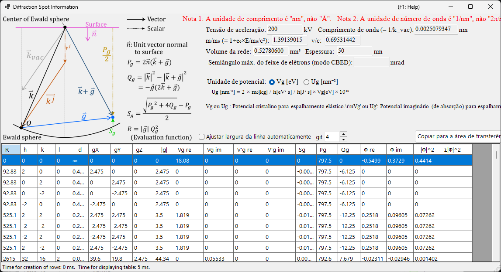

### Esquema e definições

O esquema (canto superior esquerdo) mostra os vetores na esfera de Ewald e define as grandezas usadas na tabela ($\hat{\mathbf{n}}$ é o vetor unitário normal à superfície da amostra, $\mathbf{k}$ é o vetor de onda incidente, $\mathbf{g}$ é o vetor da rede recíproca).

- $P_g = 2\,\hat{\mathbf{n}} \cdot (\mathbf{k} + \mathbf{g})$
- $Q_g = |\mathbf{k}|^2 - |\mathbf{k} + \mathbf{g}|^2 = -\mathbf{g} \cdot (2\mathbf{k} + \mathbf{g})$
- **Erro de excitação:** $S_g = \dfrac{\sqrt{P_g^2 + 4 Q_g} - P_g}{2}$
- **Função de avaliação:** $R = |\mathbf{g}|\, Q_g^2$ — ordena os reflexos de acordo com a intensidade com que são excitados (menor = mais próximo da esfera de Ewald = excitado mais fortemente; o feixe transmitido $g=0$ tem $R=0$ e vem primeiro). A tabela é ordenada por $R$ crescente.

### Colunas da tabela

| Coluna | Significado |
|--------|---------|
| **R** | função de avaliação $R = \lvert\mathbf{g}\rvert\, Q_g^2$ (acima; usada para selecionar / ordenar reflexos) |
| **h, k, (i,) l** | índices de Miller (*i* é o índice hexagonal redundante, mostrado apenas para cristais hexagonais) |
| **d** | distância interplanar (nm) |
| **gX, gY, gZ** | componentes do vetor da rede recíproca *g* (1/nm) |
| **\|g\|** | magnitude de *g* (1/nm) |
| **Vg re / Vg im** | coeficiente de Fourier do potencial do cristal para espalhamento elástico, $V_g$ (real / imaginário) |
| **V'g re / V'g im** | potencial imaginário (de absorção) para espalhamento térmico difuso (TDS), $V'_g$ (real / imaginário) |
| **Sg** | erro de excitação $S_g$ (acima; 1/nm) |
| **Pg** | grandeza auxiliar $P_g = 2\,\hat{\mathbf{n}}\cdot(\mathbf{k}+\mathbf{g})$ (acima) |
| **Qg** | grandeza auxiliar $Q_g = -\mathbf{g}\cdot(2\mathbf{k}+\mathbf{g})$ (acima) |
| **Φ re / Φ im** | amplitude complexa $\Phi$ da onda difratada dinâmica na superfície de saída (real / imaginário) |
| **\|Φ\|^2** | intensidade difratada $\lvert\Phi\rvert^2$ desse reflexo |
| **Σ\|Φ\|^2** | soma cumulativa de $\lvert\Phi\rvert^2$ (total sobre os reflexos; útil como verificação de conservação de intensidade) |

### Unidades de potencial e outros controles

- **Unit of potential** : Alterna o potencial exibido entre **Vg [eV]** (potencial eletrostático, eV) e **Ug [nm⁻²]** (a grandeza escalonada $U_g = (2 m_0/h^2)\, V_g$ que entra nas equações de ondas de Bloch). Os cabeçalhos das colunas mudam de acordo entre *Vg / V'g* e *Ug / U'g*.
- Acima da tabela são exibidos a tensão de aceleração, o comprimento de onda ($\lambda = 1/k_\text{vac}$), a razão de massa relativística $m/m_0$, a razão de velocidade $v/c$, o volume da rede, a espessura da amostra e (no modo CBED) o semiângulo máximo do feixe de elétrons.
- **Note 1:** a unidade de comprimento é **nm**, não Å. **Note 2:** a unidade de número de onda é **1/nm**, não 2π/nm.
- **Effective digit** : número de algarismos significativos mostrados na tabela. **Auto resize row width** : ajustar automaticamente as larguras das colunas. **Copy to clipboard** : exporta a tabela como texto que pode ser colado em uma planilha. (Este formulário é exibido em inglês mesmo em uma interface em japonês.)

---

## Geometria do detector {#detector-geometry}

Uma janela para a configuração detalhada da geometria do detector (comprimento de câmera, inclinação, rotação) e a sobreposição de uma imagem experimental. Abra-a a partir de **Details** no painel **Detector geometry**.

### Configurações de geometria do detector

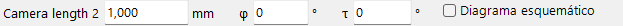

Especifique a geometria de reflexão, como o comprimento de câmera e a inclinação do detector (**Tau / Phi**). Para Back Laue (Laue de retroreflexão), defina aqui a geometria que posiciona o detector no lado da fonte.

### Área do detector e imagem sobreposta

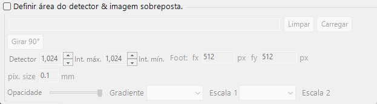

Especifique a área ativa do detector e solte uma imagem experimental para sobrepô-la. Use isto para sobrepor o padrão simulado e uma imagem experimental e ajustar finamente a geometria do detector.

Consulte também [Sistema de coordenadas do detector](../appendix/a1-coordinate-system/2-diffraction.md) para as definições do sistema de coordenadas.

---

## Compressão dinâmica

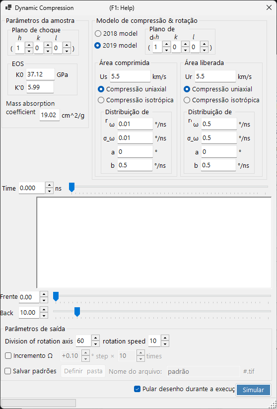

Uma janela para percorrer o perfil de pressão/tempo de um experimento de alta pressão (compressão dinâmica). Solte um perfil de pressão/tempo `.txt` nesta janela para carregá-lo e, em seguida, arraste a linha vermelha no gráfico para varrer continuamente o tempo (a pressão), refletindo o estado correspondente no padrão de difração.

---

## Tópicos relacionados

- [Simulação de difração de raios X](4-x-ray-neutron-diffraction.md)
- [Simulação SAED](1-saed-simulation.md)
- [Simulação PED](2-ped-simulation.md)
- [Simulação CBED](3-cbed-simulation.md)
- [Cálculo dinâmico (núcleo compartilhado)](../appendix/a3-bloch-wave/calculation.md)
- [Sistema de coordenadas do detector](../appendix/a1-coordinate-system/2-diffraction.md)
