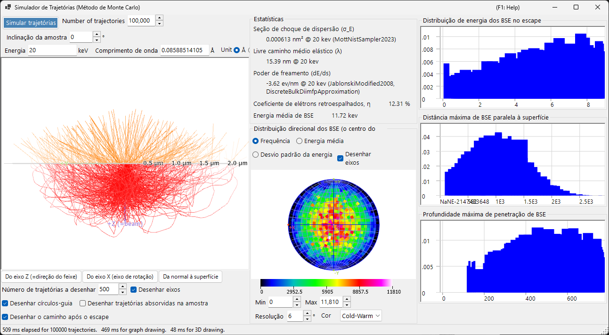
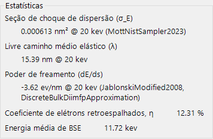
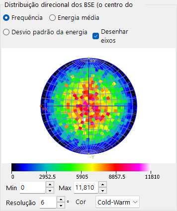
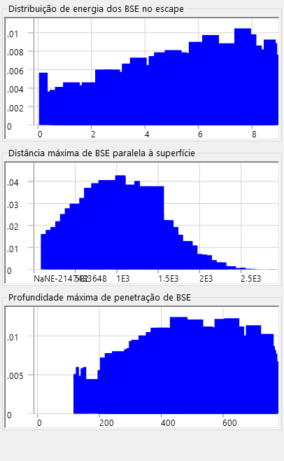

# Trajetórias eletrônicas

O **Simulador de trajetórias** calcula as trajetórias dos elétrons dentro de uma amostra pelo **método de Monte Carlo**: os elétrons incidentes sofrem espalhamento elástico e inelástico, e as distribuições resultantes dos elétrons retroespalhados (direção, energia, profundidade de penetração) são acumuladas. Essas distribuições também fornecem a ponderação angular/de energia/de profundidade usada pela [12. Simulação EBSD](12-ebsd-simulation.md).

---

## Atalhos de teclado e mouse

As trajetórias são exibidas em uma vista 3-D OpenGL. Ela usa a [navegação de vista](21-shortcuts.md) padrão do ReciPro, mas **o deslocamento está desativado** — use os botões de predefinição de vista para saltar para as orientações padrão.

| Atalho | Ação |
|----------|--------|
| <kbd>F1</kbd> | Abrir esta página do manual on-line |
| Arrastar com o botão esquerdo | Girar o modelo |
| Arrastar com o botão direito para cima/baixo, ou roda do mouse | Zoom |
| <kbd>CTRL</kbd> + clique duplo com o botão direito | Alternar entre projeção ortográfica / perspectiva |

→ Consulte **[21. Atalhos de teclado e mouse](21-shortcuts.md)** para uma visão geral de todas as janelas.

---

## Condições de cálculo

Energia do feixe, número de elétrons incidentes, amostra/material e outros parâmetros de Monte Carlo (veja a captura de tela geral acima).

### Energia do feixe

Tensão de aceleração do feixe de elétrons incidente (keV). Define a energia cinética usada tanto para os modelos de espalhamento elástico (Mott) quanto inelástico (resposta dielétrica).

### Número de elétrons incidentes

Quantos elétrons simular. Mais elétrons reduzem o ruído estatístico, mas aumentam o tempo de execução linearmente.

### Amostra / material

Composição e densidade da amostra. Por padrão, usa o cristal atualmente selecionado na janela principal, mas pode ser substituído para estudos apenas de trajetórias.

### Inclinação da amostra

Ângulo de inclinação da amostra. Usado quando os dados de trajetória alimentam o [simulador EBSD](12-ebsd-simulation.md) (tipicamente 70° para EBSD).

### Modelo de seção de choque

O modelo de seção de choque de espalhamento elástico (Mott / Bethe / NIST). Modelos diferentes equilibram velocidade e precisão em ângulos de inclinação grandes ou próximo de bordas de absorção.

---

## Opções da estereonete

Opções de exibição para a distribuição angular desenhada na projeção estereográfica (veja a captura de tela geral acima).

### Método de projeção

Projeção de **Wulff** (de ângulo igual) ou de **Schmidt** (de área igual). Schmidt costuma ser preferida ao ler a densidade estatística.

### Hemisfério

Plota o hemisfério superior (retroespalhado) ou inferior (transmitido).

### Resolução / Escala de cores

Largura de classe do histograma angular e o mapa de cores usado para a exibição de densidade.

---

## Estatísticas

Resumo da execução.

- **Rendimento de retroespalhamento** — fração dos elétrons incidentes que saem pela superfície de entrada.
- **Livre caminho médio** — distância média entre eventos de espalhamento.
- **Profundidade média de penetração** — profundidade máxima média alcançada por um elétron antes de sair ou ser absorvido.
- **Tempo decorrido / Taxa de processamento** — custo de execução em tempo real.

---

## Distribuição de direção dos BSE

Distribuição angular dos elétrons retroespalhados (o centro da estereonete corresponde à direção normal à superfície). O contorno amarelo/laranja (quando presente) marca a região subtendida pelo detector EBSD.

---

## Perfis

Perfis de profundidade e de energia dos elétrons simulados.

### Perfil de profundidade

Histograma da profundidade final de saída (nm) dos elétrons retroespalhados. Usado pelo simulador EBSD para ponderar a integração em profundidade do master pattern.

### Perfil de energia

Histograma da perda de energia ΔE (keV) dos elétrons retroespalhados. Usado pelo simulador EBSD para ponderar a integração em energia.

---

## Veja também

- [Simulação EBSD](12-ebsd-simulation.md)
- [Cálculo EBSD](appendix/a3-bloch-wave/ebsd.md)
- [Difração dinâmica (onda de Bloch)](appendix/a3-bloch-wave/index.md)
- [Simulador HRTEM/STEM](9-hrtem-stem-simulator/index.md)
- [Simulador de difração](7-diffraction-simulator/index.md)
