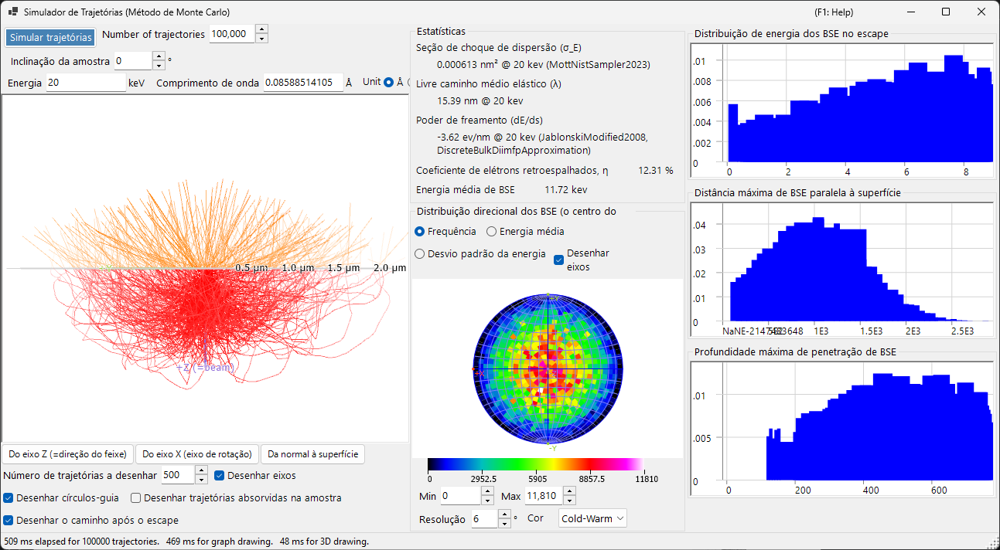
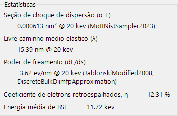
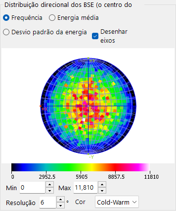
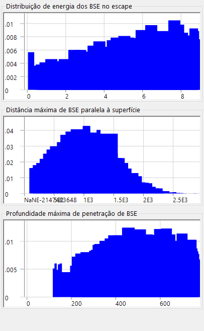

# Trajetórias eletrônicas

O **Simulador de Trajetórias (Método de Monte Carlo)** calcula as trajetórias dos elétrons dentro de uma amostra pelo **método de Monte Carlo**: os elétrons incidentes sofrem espalhamento elástico e inelástico, e as distribuições resultantes dos elétrons retroespalhados (BSE) — direção, energia no escape, profundidade de penetração e espalhamento lateral — são acumuladas. Essas distribuições também fornecem a ponderação angular/de energia/de profundidade usada pela [12. Simulação EBSD](12-ebsd-simulation.md).

A janela tem três colunas: a **vista 3D das trajetórias** à esquerda, as **Estatísticas** e a estereonete da **Distribuição direcional dos BSE** no centro, e três **histogramas** à direita. A composição e a densidade da amostra vêm do cristal selecionado na janela principal; aqui só se definem a energia do feixe, a inclinação da amostra e o número de trajetórias.

---

## Atalhos de teclado e mouse

As trajetórias são exibidas em uma vista 3D OpenGL. Ela usa a [navegação de vista](21-shortcuts.md) padrão do ReciPro, mas **o deslocamento está desativado** — use os botões de predefinição de vista para saltar para as orientações padrão.

| Atalho | Ação |
|----------|--------|
| <kbd>F1</kbd> | Abrir esta página do manual on-line |
| Arrastar com o botão esquerdo | Girar o modelo |
| Arrastar com o botão direito para cima/baixo, ou roda do mouse | Zoom |
| <kbd>CTRL</kbd> + clique duplo com o botão direito | Alternar entre projeção ortográfica / perspectiva |

→ Consulte **[21. Atalhos de teclado e mouse](21-shortcuts.md)** para uma visão geral de todas as janelas.

---

## Condições de cálculo

Os controles na parte superior da janela definem a execução:

- **Simular trajetórias** : inicia a execução de Monte Carlo. A barra de status na parte inferior informa separadamente o tempo decorrido do cálculo das trajetórias, do desenho dos gráficos e da renderização 3D.
- **Number of trajectories** : quantos elétrons incidentes rastrear. Mais elétrons reduzem o ruído estatístico de todas as distribuições abaixo, com um tempo de execução que cresce linearmente.
- **Inclinação da amostra** (°) : inclinação da superfície da amostra em torno do eixo *X*. Deixe em 0 para incidência normal; use **−70°** para reproduzir a geometria do [simulador EBSD](12-ebsd-simulation.md), em que a grande inclinação aumenta o rendimento de retroespalhamento.
- **Energy** (keV) / **Wavelength** / **Unit** : a tensão de aceleração do feixe incidente e o comprimento de onda do elétron, com correção relativística, vinculado a ela. A energia define a energia cinética usada tanto pelo modelo elástico (NIST Mott) quanto pelo inelástico (poder de freamento / IMFP).

Os próprios modelos de espalhamento não podem ser escolhidos pelo usuário: as seções de choque elásticas vêm da tabela NIST Mott incluída (com recurso ao Rutherford blindado fora de seu intervalo), e o poder de freamento da forma modificada de Jablonski (2008). O modelo efetivamente usado é indicado ao lado de cada valor em **Estatísticas**. Consulte [Atenuação e transporte](appendix/a2-beam-interaction/attenuation-transport.md) para saber o que são esses modelos.

### Vista 3D das trajetórias

As trajetórias vermelhas são elétrons absorvidos na amostra; as laranja são as que escapam como elétrons retroespalhados. Os círculos-guia concêntricos são rotulados em nm (ou µm), e **+X**, **+Y**, **+Z (=beam)** marcam os eixos.

- **Do eixo Z (=direção do feixe)** / **Do eixo X (eixo de rotação)** / **Da normal à superfície** : alinham a vista com as direções padrão.
- **Número de trajetórias a desenhar** : quantas das trajetórias calculadas renderizar (desenhar todas as 100 000 seria ilegível e lento).
- **Desenhar eixos** / **Desenhar círculos-guia** : as setas dos eixos e a escala de distância.
- **Desenhar trajetórias absorvidas na amostra** : inclui os elétrons que nunca escapam.
- **Desenhar o caminho após o escape** : continua desenhando o caminho de um elétron retroespalhado depois que ele deixou a superfície.

---

## Estatísticas

Valores para a energia do feixe atual, com o modelo que produziu cada um indicado entre colchetes.

- **Seção de choque de dispersão (σ_E)** (nm²) — seção de choque elástica total por átomo.
- **Livre caminho médio elástico (λ)** (nm) — distância média entre eventos de espalhamento elástico.
- **Poder de freamento (dE/ds)** (eV/nm, negativo) — energia perdida por unidade de comprimento de trajetória.
- **Coeficiente de elétrons retroespalhados, η** (%) — a fração dos elétrons incidentes que saem novamente pela superfície de entrada. É a grandeza na qual se baseia o contraste das imagens BSE.
- **Energia média de BSE** (keV) — energia média dos elétrons retroespalhados no momento em que escapam.

---

## Distribuição direcional dos BSE

Distribuição angular dos elétrons retroespalhados, desenhada em uma estereonete cujo centro é a direção normal à superfície.

- **Frequência** / **Energia média** / **Desvio padrão da energia** : a grandeza mapeada em cor — quantos elétrons saem em cada direção, sua energia média ou a dispersão dessa energia.
- **Desenhar eixos** : sobrepõe as direções +X / ±Y / ±Z.
- **Min** / **Max**, **Resolution**, **Color** : os limites da escala de cores, o tamanho da classe angular do histograma e o mapa de cores.

---

## Histogramas

Três distribuições dos elétrons retroespalhados, todas normalizadas para área unitária.

### Distribuição de energia dos BSE no escape

Histograma da **energia que os elétrons retroespalhados ainda carregam ao deixar a amostra** (keV) — não da sua perda de energia. O simulador EBSD a usa para ponderar a integração em energia do master pattern.

### Distância máxima de BSE paralela à superfície

Histograma de quanto cada elétron retroespalhado percorreu **lateralmente** (paralelamente à superfície, nm) antes de escapar. É o tamanho lateral do volume de interação e, portanto, o limite intrínseco de resolução espacial de uma medição BSE ou EBSD.

### Profundidade máxima de penetração de BSE

Histograma da maior profundidade **perpendicular à superfície** (nm) que cada elétron retroespalhado alcançou antes de escapar. O simulador EBSD a usa para ponderar a integração em profundidade do master pattern.

---

## Veja também

- [Simulação EBSD](12-ebsd-simulation.md)
- [Cálculo EBSD](appendix/a3-bloch-wave/ebsd.md)
- [Atenuação e transporte](appendix/a2-beam-interaction/attenuation-transport.md) — as seções de choque elásticas, o poder de freamento e os alcances usados aqui.
- [Difração dinâmica (onda de Bloch)](appendix/a3-bloch-wave/index.md)
- [Simulador HRTEM/STEM](9-hrtem-stem-simulator/index.md)
- [Simulador de difração](7-diffraction-simulator/index.md)
