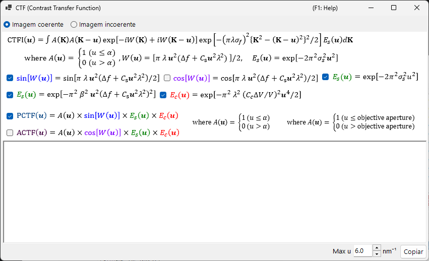
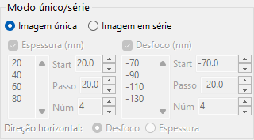

# Simulação HRTEM

Simula imagens de franjas de rede de TEM de alta resolução. O modo principal do [Simulador HRTEM/STEM](index.md).

---

## Fluxo de cálculo

1. **Método de ondas de Bloch**: calcula a propagação da onda eletrônica através do potencial do cristal; obtém a amplitude e a fase da onda de saída
2. **Função da lente**: aplica as aberrações da lente objetiva (aberração esférica $C_s$, desfocagem $\Delta f$)
3. **Coerência parcial**: leva em conta o tamanho finito da fonte (coerência espacial) e a dispersão de energia (coerência temporal)
4. **Formação da imagem**: calcula a intensidade $|\psi(\mathbf{r})|^2$

---

## Parâmetros da amostra

| Parâmetro | Descrição |
|-----------|-------------|
| **Thickness** | Espessura da amostra (nm). As imagens HRTEM dependem fortemente da espessura |

---

## Parâmetros ópticos

### Condições do TEM

| Parâmetro | Descrição |
|-----------|-------------|
| **Acc. Vol.** | Tensão de aceleração (kV). O comprimento de onda corrigido relativisticamente é exibido ao lado |
| **Defocus** | Valor de desfocagem (nm). A desfocagem de Scherzer é exibida como referência |

### Parâmetros intrínsecos

| Parâmetro | Descrição | Típico |
|-----------|-------------|---------|
| **Cs** | Aberração esférica (mm) | 0.5–1.0 (convencional); < 0.01 (corrigido por Cs) |
| **Cc** | Aberração cromática (mm) | 1.0–2.0 |
| **β** | Semiângulo de iluminação (mrad) | 0.1–1.0 |
| **ΔE** | Largura 1/*e* da dispersão de energia (eV) | 0.5–2.0 |

---

## Função de Transferência de Contraste de Fase (PCTF)

Exibida na aba da função da lente:

- $\sin\chi(u)$: função de transferência de contraste de fase ($\chi(u)$ é a função de aberração da lente)
- $E_\text{s}(u)$: envelope de coerência espacial
- $E_\text{c}(u)$: envelope de coerência temporal

Desfocagem de Scherzer: $\Delta f = -\sqrt{\tfrac{4}{3}\,C_s \lambda}\ (\approx -1.155\,\sqrt{C_s \lambda})$, a condição que produz uma banda PCTF negativa larga (contraste escuro = posições atômicas). O ReciPro usa este valor original de Scherzer — derivado ao fixar o mínimo da fase de aberração $\chi$ em $-2\pi/3$ — e o valor exibido na GUI segue esta fórmula; algumas referências usam, em vez disso, o valor *Scherzer estendido* $-1.2\sqrt{C_s\lambda}$.

---

## Abertura objetiva

Define o tamanho da abertura (mrad) e a posição. **Open aperture** a remove. O número de ondas de Bloch consideradas depende das condições da abertura.

---

## Modelos de coerência parcial

| Modelo | Descrição |
|-------|-------------|
| **Quasi-coherent (linear image)** | Rápido. Válido sob a aproximação de fase fraca |
| **TCC (Transmission Cross Coefficient)** | Mais preciso; tempo de cálculo maior |

---

## Modos de simulação

| Modo | Descrição |
|------|-------------|
| **Single image** | Uma imagem na espessura e desfocagem atuais |
| **Serial image** | Matriz de imagens sobre faixas de espessura × desfocagem (Start / Step / Num) |

---

## Ajuste da imagem

| Configuração | Descrição |
|---------|-------------|
| **Min / Max** | Faixa de exibição (controles deslizantes de ajuste da imagem) |
| **Colour** | Tons de cinza ou Cold-Warm |
| **Gaussian blur (FWHM)** | Aplica um filtro gaussiano |
| **Unit cell** | Sobrepõe uma grade de célula unitária |
| **Scale** | Exibe uma barra de escala |

---

## Veja também

- [Simulador HRTEM/STEM (visão geral)](index.md)
- [Simulação STEM](2-stem-simulation.md)
- [Simulação de potencial](3-potential-simulation.md)
- [Apêndice A3.2 — Formação da imagem HRTEM](../appendix/a3-bloch-wave/hrtem.md)
